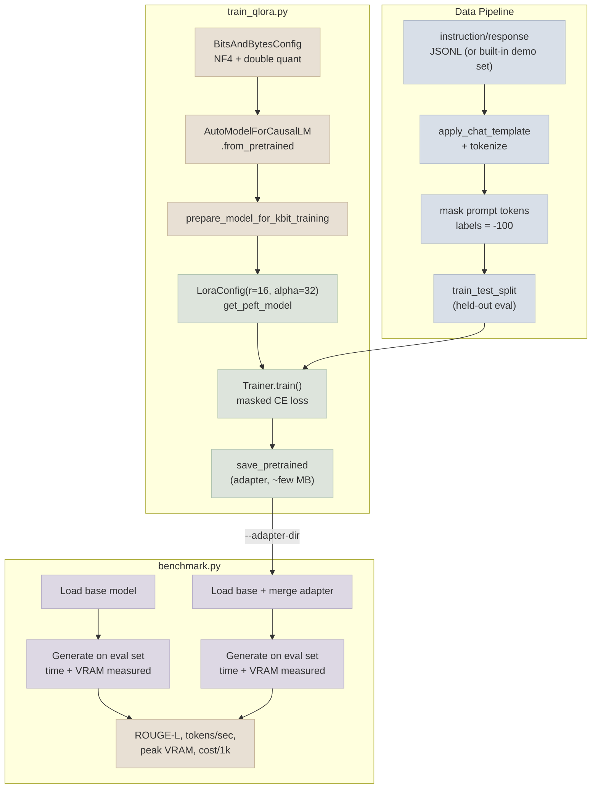

# QLoRA Fine-Tune

A small ~1.5B parameter open instruction model, fine-tuned with QLoRA on a compact instruction dataset, then benchmarked base-vs-tuned on quality, throughput, and memory - the hands-on counterpart to the [Notes](../../Notes) files. Every concept (4-bit quantized loading, LoRA config, masked instruction-tuning loss, a measured base-vs-tuned comparison table) appears here as real, runnable code.

## Architecture



## What This Demonstrates

1. **4-bit NF4 quantized loading** - `BitsAndBytesConfig(load_in_4bit=True, bnb_4bit_quant_type="nf4", bnb_4bit_use_double_quant=True)` loads the base model at roughly a quarter of its BF16 memory footprint (see [LoRA & QLoRA Hands-On](../../Notes/02-LoRA-and-QLoRA-Hands-On.mdx))
2. **A real `peft` LoRA config** - `LoraConfig(r=16, lora_alpha=32, target_modules=["q_proj","k_proj","v_proj","o_proj"])` attached via `get_peft_model`, training well under 1% of total parameters
3. **Prompt/completion masking** - every training example is tokenized with `labels` set to `-100` at every prompt-token position, so loss is computed only on the model's own completion (see [Instruction Data & Training Runs](../../Notes/03-Instruction-Data-and-Training-Runs.mdx))
4. **A held-out eval split** - `train_test_split()` carves off eval examples before training ever sees the data, never touched by the training run
5. **Adapter merging** - `PeftModel.from_pretrained(...).merge_and_unload()` folds the trained adapter into a standalone dense model for benchmarking and deployment
6. **A measured (not estimated) base-vs-tuned comparison** - `benchmark.py` runs identical eval prompts through both models and reports ROUGE-L (quality proxy), tokens/sec (with a warm-up pass excluded), peak VRAM (`torch.cuda.max_memory_allocated()`), and an illustrative cost-per-1k-requests figure (see [Benchmarking Base vs Tuned](../../Notes/04-Benchmarking-Base-vs-Tuned.mdx))

## Files

| File | Purpose |
|---|---|
| `train_qlora.py` | Loads the base model in 4-bit, attaches a LoRA adapter, formats/masks an instruction dataset, trains via `transformers.Trainer`, saves the adapter |
| `benchmark.py` | Loads base vs adapter-merged model, runs the same eval prompts through both, prints a comparison table |
| `requirements.txt` | `torch`, `transformers`, `peft`, `bitsandbytes`, `datasets`, `accelerate`, `evaluate`, `rouge-score`, `matplotlib` |

## Running

```bash
pip install -r requirements.txt

# Train (uses a small built-in demo dataset if --data-file is omitted)
python train_qlora.py --epochs 3 --output-dir ./qlora-adapter

# Or point at your own instruction data (JSONL with "instruction"/"response" fields)
python train_qlora.py --data-file my_instructions.jsonl --output-dir ./qlora-adapter

# Benchmark the tuned adapter against the untouched base model
python benchmark.py --adapter-dir ./qlora-adapter
```

`bitsandbytes` 4-bit quantization requires a CUDA GPU - this script is not runnable on CPU-only machines. The default base model (`Qwen/Qwen2.5-1.5B-Instruct`) fits comfortably within a single free-tier T4 GPU (16 GB) in 4-bit.

Expected output at the end of a benchmark run:

```
====================================================================
Metric                              Base             Tuned
====================================================================
ROUGE-L (quality proxy)            0.2841            0.5127
Tokens/sec                          38.42             37.95
Avg latency (sec/req)                2.104             2.132
Peak VRAM (GB)                       3.21              3.24
Est. cost / 1k requests            $0.0179           $0.0182
====================================================================
```

The tuned model's higher ROUGE-L against held-out reference responses, at essentially the same latency/VRAM/cost as the base model, is the expected signature of a successful LoRA/QLoRA fine-tune - see [Benchmarking Base vs Tuned](../../Notes/04-Benchmarking-Base-vs-Tuned.mdx) for how to read this table and when a result like this should (or shouldn't) justify shipping the fine-tune.
