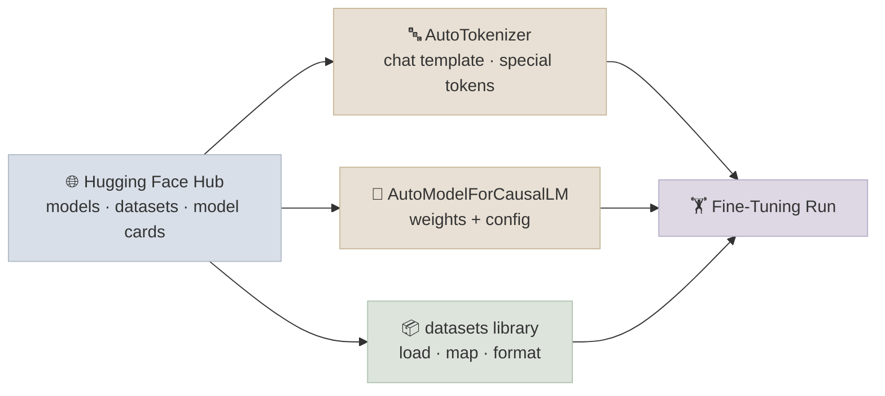

# HuggingFace Ecosystem

## The One-Line Definition

The Hugging Face ecosystem is the standard toolchain for loading pretrained models, tokenizing text consistently with how a model was trained, and preparing datasets for fine-tuning - `transformers` for models/tokenizers, `datasets` for data, and the Hub for sharing and discovering both.

<div class="audience-biz" markdown="1">

Think of Hugging Face as the app store and toolkit for open AI models. Instead of every team building their own way to download a model, prepare it to run, and load training data, everyone uses the same few tools. That means a fine-tuning recipe that works for one open model usually works for hundreds of others with almost no changes.

</div>

<div class="audience-tech" markdown="1">

Three libraries do almost all the work: `transformers` (model + tokenizer classes, a unified `from_pretrained`/`save_pretrained` API across architectures), `datasets` (memory-mapped, Arrow-backed loading and transformation of large text datasets), and `huggingface_hub` (the client for the model/dataset registry). Everything in this module's Code Lab is built on top of these three.

</div>



---

## AutoModel and AutoTokenizer

<div class="audience-biz" markdown="1">

Every model on the Hub, no matter who trained it or which architecture it uses internally, can be loaded with the exact same two lines of code. You just give it the model's name, and the library figures out the rest - which architecture class to instantiate, which tokenizer to pair it with, and how to download and cache the weights.

</div>

<div class="audience-tech" markdown="1">

`AutoModelForCausalLM.from_pretrained(name)` and `AutoTokenizer.from_pretrained(name)` inspect the repo's `config.json` to resolve the correct concrete class (e.g. `LlamaForCausalLM`, `Qwen2ForCausalLM`) without you naming it explicitly. This is what makes swapping base models in a fine-tuning script a one-line change in most cases - the training code stays architecture-agnostic as long as it only calls the `Auto*` interface.

</div>

### Code

```python
from transformers import AutoModelForCausalLM, AutoTokenizer

model_name = "Qwen/Qwen2.5-1.5B-Instruct"

tokenizer = AutoTokenizer.from_pretrained(model_name)
model = AutoModelForCausalLM.from_pretrained(model_name, dtype="auto")

print(type(model).__name__)      # e.g. Qwen2ForCausalLM
print(model.config.num_hidden_layers, model.config.hidden_size)
```

**The config object** (`model.config`, a `PretrainedConfig` subclass) holds every architectural hyperparameter - layer count, hidden size, number of attention heads, vocab size, RoPE settings. It is saved alongside the weights as `config.json` and is what `Auto*` reads to pick the right model class. You rarely edit it directly, but reading it is a common debugging step (e.g. confirming `max_position_embeddings` before trying a long-context fine-tune).

---

## Tokenization

<div class="audience-biz" markdown="1">

A tokenizer's job is to turn text into numbers the model understands, and back again. It needs to do this in *exactly* the way the model was trained - a mismatched tokenizer produces garbage output even if the model weights are perfect. Tokenizers also handle bookkeeping details like marking where a message starts and ends, and padding shorter messages so a batch of different-length inputs can be processed together.

</div>

<div class="audience-tech" markdown="1">

Loading the tokenizer via `AutoTokenizer.from_pretrained` guarantees the vocabulary, merge rules (BPE), and special token IDs match the checkpoint. Mismatching a tokenizer and model (e.g. reusing a Llama tokenizer with a Qwen checkpoint) silently produces wrong token IDs - no error, just degraded or incoherent generations.

</div>

### Special Tokens

| Token | Purpose |
|---|---|
| `bos_token` | Marks the beginning of a sequence |
| `eos_token` | Marks the end of a sequence - generation stops here |
| `pad_token` | Fills shorter sequences to a common batch length; many base models have none set by default |
| `unk_token` | Placeholder for out-of-vocabulary input (rare with modern subword tokenizers) |

**Common gotcha:** many base (non-chat) models ship without a `pad_token`. The standard fix is:

```python
if tokenizer.pad_token is None:
    tokenizer.pad_token = tokenizer.eos_token
```

This is safe for causal LM fine-tuning because padded positions are excluded from the loss via the attention mask - the model never actually "learns" from the pad token.

### Chat Templates

Instruction/chat models define a **chat template** - a Jinja2 string stored in the tokenizer config that maps a list of role-tagged messages to the exact string format the model was trained on (system/user/assistant markers, turn separators).

```python
messages = [
    {"role": "system", "content": "You are a concise coding assistant."},
    {"role": "user", "content": "Write a Python function to reverse a string."},
]

prompt = tokenizer.apply_chat_template(
    messages, tokenize=False, add_generation_prompt=True
)
print(prompt)
# <|im_start|>system\nYou are a concise coding assistant.<|im_end|>\n
# <|im_start|>user\n...<|im_end|>\n<|im_start|>assistant\n
```

**Why this matters for fine-tuning:** if your instruction dataset is formatted with the wrong template (or no template at all), the model sees training examples that don't match the format it will be prompted with at inference time - a common, hard-to-debug cause of a fine-tune that "doesn't seem to follow instructions" despite training loss looking fine.

### Padding and Truncation

| Setting | What it does | When to use |
|---|---|---|
| `padding="max_length"` | Pads every sequence to a fixed length | Static-shape batching (e.g. TPU) |
| `padding="longest"` / `True` | Pads to the longest sequence in the batch | Standard, most memory-efficient for variable-length data |
| `truncation=True` | Cuts sequences longer than `max_length` | Prevents OOM on outlier long examples |
| `padding_side` | `"right"` (default) or `"left"` | Causal LM generation needs `padding_side="left"` so the model's next-token prediction lines up at the end of the batch |

---

## The `datasets` Library

<div class="audience-biz" markdown="1">

The `datasets` library is how you load and prepare training data at scale without running out of memory. Even a dataset too large to fit in RAM can be streamed and transformed efficiently, because the library only loads the pieces it needs at any given moment.

</div>

<div class="audience-tech" markdown="1">

`datasets` stores data in Apache Arrow format on disk and memory-maps it, so operations like `.map()` don't require the full dataset to live in RAM. `.map()` with `batched=True` applies a function across the dataset in vectorized batches - this is the standard way to tokenize an entire instruction dataset in one pass.

</div>

### Code

```python
from datasets import load_dataset

# Load a dataset from the Hub (streaming avoids downloading the full split up front)
raw_ds = load_dataset("tatsu-lab/alpaca", split="train")

def format_example(example):
    """Turn an (instruction, input, output) record into a chat-formatted training string."""
    messages = [
        {"role": "user", "content": example["instruction"] + ("\n\n" + example["input"] if example["input"] else "")},
        {"role": "assistant", "content": example["output"]},
    ]
    example["text"] = tokenizer.apply_chat_template(messages, tokenize=False)
    return example

formatted_ds = raw_ds.map(format_example, batched=False)
formatted_ds = formatted_ds.train_test_split(test_size=0.05, seed=42)

print(formatted_ds)
print(formatted_ds["train"][0]["text"])
```

**Common `datasets` operations:**

| Method | Purpose |
|---|---|
| `load_dataset(name, split=...)` | Load from the Hub, a local file (`json`, `csv`, `parquet`), or a Python dict |
| `.map(fn, batched=True)` | Apply a transformation across every example (tokenization, formatting) |
| `.filter(fn)` | Drop examples that fail a predicate (e.g. too-long sequences) |
| `.train_test_split(test_size=...)` | Carve out a held-out eval split - see [Benchmarking Base vs Tuned](04-Benchmarking-Base-vs-Tuned.mdx) |
| `.shuffle(seed=...)` | Randomize order before training |

---

## The Hub

<div class="audience-biz" markdown="1">

The Hub is where models and datasets live - like GitHub, but for model weights and training data instead of code. Model pages ("model cards") tell you what a model is good at, what license governs its use, and how to load it. Some models are "gated," meaning you have to request access and agree to usage terms before you can download the weights - common for the largest or most capable open releases.

</div>

<div class="audience-tech" markdown="1">

The Hub is a Git-backed registry (`huggingface_hub` wraps the API). `from_pretrained(name)` resolves `name` to a Hub repo, downloads and caches files locally (`~/.cache/huggingface`), and reuses the cache on subsequent loads. Gated repos require an authenticated `huggingface-cli login` (or `HF_TOKEN` env var) and prior acceptance of the repo's license on the website before `from_pretrained` will succeed.

</div>

### Model Cards and Licences

Before choosing a base model for fine-tuning, the model card (the repo's `README.md`) is the first thing to check:

| Check | Why it matters |
|---|---|
| License (Apache 2.0, MIT, Llama Community License, gated/research-only, etc.) | Determines whether you can fine-tune and redistribute/commercially use the result |
| Intended use / out-of-scope use | Some model cards explicitly restrict certain use cases |
| Training data summary | Informs what the model already knows vs what your fine-tune needs to add |
| Context length, tokenizer, chat template | Determines compatibility with your data pipeline |

### Pushing Your Own Model

After fine-tuning (see [LoRA & QLoRA Hands-On](02-LoRA-and-QLoRA-Hands-On.mdx)), adapters or merged models can be pushed back to the Hub for sharing or deployment:

```python
model.push_to_hub("your-username/qwen2.5-1.5b-instruct-lora-support-bot")
tokenizer.push_to_hub("your-username/qwen2.5-1.5b-instruct-lora-support-bot")
```

This uploads the current `state_dict` (or, for a `PeftModel`, just the small adapter weights - see the next Notes file) plus `config.json`, creating a new Hub repo with model-card scaffolding you can then edit.

---

## Study Notes

**Must-know for interviews:**
- `AutoModelForCausalLM`/`AutoTokenizer` resolve the correct architecture-specific class from `config.json` - training code stays model-agnostic
- Tokenizer and model must come from the same checkpoint - mismatches fail silently, not with an error
- Many base models lack a `pad_token` by default - the standard fix is `tokenizer.pad_token = tokenizer.eos_token`
- Chat templates (`apply_chat_template`) must match what the base model was instruction-tuned with, or fine-tuning data won't match inference-time formatting
- `padding_side="left"` is required for causal LM batched generation, not training
- `datasets.map(batched=True)` is the standard way to tokenize/format an entire dataset in one vectorized pass
- Gated Hub repos require prior license acceptance + an authenticated token before `from_pretrained` succeeds

**Quick recall Q&A:**
- *Why does a mismatched tokenizer/model pairing not throw an error?* Because tokenization always succeeds - it just maps text to some valid token IDs. The model then computes on IDs that don't mean what it was trained to expect, producing degraded output with no exception raised.
- *What happens if you skip `apply_chat_template` and just concatenate strings yourself for an instruction model?* You risk a format mismatch vs the model's actual instruction-tuning format (missing turn markers, wrong special tokens) - the model may still generate something, but instruction-following quality degrades.
- *Why is `datasets` Arrow-backed instead of just loading a Python list/dict?* Arrow's memory-mapped columnar format lets `datasets` operate on data larger than RAM without loading it all at once, and vectorizes `.map()` transformations efficiently.
