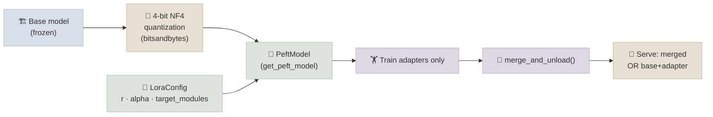

# LoRA and QLoRA Hands-On

## The One-Line Definition

LoRA and QLoRA are the hands-on tools that make parameter-efficient fine-tuning practical - `peft` gives you a `LoraConfig` you attach to any base model, and `bitsandbytes` lets that base model live in 4-bit memory while training happens in a small set of full-precision adapter weights.

<div class="audience-biz" markdown="1">

This page picks up where the theory left off. If you already know *why* LoRA and QLoRA work (the low-rank math, the VRAM savings), this is about actually setting the dials: which rank to pick, which layers to attach adapters to, and how to decide whether to bake your fine-tune permanently into the model or keep it as a swappable add-on.

</div>

<div class="audience-tech" markdown="1">

This is the practitioner layer on top of [01-LLM-Models: Fine-Tuning](../../01-LLM-Models/Notes/07-Fine-Tuning.mdx)'s LoRA math and [08-GPU-and-Hardware](../../01-LLM-Models/Notes/08-GPU-and-Hardware.mdx)'s VRAM/quantization formulas - neither is re-derived here. This page is `LoraConfig` field-by-field, `BitsAndBytesConfig` field-by-field, and the merge-vs-serve production decision.

</div>

> **Prerequisite math:** ΔW ≈ B·A (rank decomposition), the frozen-base-model VRAM savings, and NF4 quantization bin placement are covered in depth in [Fine-Tuning](../../01-LLM-Models/Notes/07-Fine-Tuning.mdx) and [GPU & Hardware](../../01-LLM-Models/Notes/08-GPU-and-Hardware.mdx). Read those first if the terms above are unfamiliar - this page assumes them.



---

## Setting Up a LoRA Config

<div class="audience-biz" markdown="1">

Configuring LoRA means choosing four things: how much capacity to give the adapter (rank), how strongly it influences the model's output (alpha), how much to regularize it against overfitting (dropout), and which parts of the model it's allowed to modify (target modules). Get these roughly right and the defaults used across the community work for the vast majority of fine-tuning tasks.

</div>

<div class="audience-tech" markdown="1">

`peft.LoraConfig` is the object that captures every LoRA hyperparameter. `get_peft_model(base_model, lora_config)` wraps the base model, freezes its parameters, and injects trainable low-rank adapter pairs into the named `target_modules`.

</div>

### Code

```python
from peft import LoraConfig, get_peft_model, TaskType

lora_config = LoraConfig(
    r=16,                                            # rank - trainable capacity
    lora_alpha=32,                                   # scaling: effective update = (alpha/r) * B*A
    lora_dropout=0.05,                                # dropout on the LoRA path only
    target_modules=["q_proj", "k_proj", "v_proj", "o_proj"],
    bias="none",                                      # don't train bias terms
    task_type=TaskType.CAUSAL_LM,
)

model = get_peft_model(base_model, lora_config)
model.print_trainable_parameters()
# trainable params: 4,718,592 || all params: 1,547,382,784 || trainable%: 0.3049
```

### Field-by-Field Guide

| Field | What it controls | Practical guidance |
|---|---|---|
| `r` (rank) | Size of the low-rank bottleneck; trainable parameter count scales linearly with `r` | 8-16 for small/simple tasks (style, format, narrow domain), 32-64 for broader behavior changes; going past 64 rarely helps and starts approaching full fine-tune cost |
| `lora_alpha` | Scaling factor on the adapter output: `output = base + (alpha/r) * B·A` | Common convention: `alpha = 2 * r` (or `alpha = r`); higher alpha = adapter has more influence relative to the frozen base |
| `lora_dropout` | Dropout applied only on the LoRA path during training | `0.05-0.1` typical; helps on small datasets, can be `0` for large datasets |
| `target_modules` | Which weight matrices get an adapter attached | Attention projections (`q_proj`, `v_proj`, sometimes `k_proj`/`o_proj`) are the standard minimum; adding FFN modules (`gate_proj`, `up_proj`, `down_proj`) increases capacity and cost |
| `bias` | Whether bias terms are also trained | `"none"` is standard - biases contribute little and training them adds bookkeeping for merge/save |
| `task_type` | Tells `peft` which model head shape to expect | `TaskType.CAUSAL_LM` for any decoder-only text generation fine-tune |

**Finding `target_modules` for an unfamiliar architecture:**

```python
for name, module in base_model.named_modules():
    if "proj" in name:
        print(name)
# ... model.layers.0.self_attn.q_proj
# ... model.layers.0.self_attn.k_proj
# ... model.layers.0.self_attn.v_proj
# ... model.layers.0.self_attn.o_proj
# ... model.layers.0.mlp.gate_proj  ...
```

`peft` also ships built-in module-name mappings for most popular architectures, so `target_modules="all-linear"` (peft >= 0.7) works as a shortcut in many cases.

---

## QLoRA Setup in Practice

<div class="audience-biz" markdown="1">

QLoRA is what makes fine-tuning larger open models possible on a single consumer or free-tier GPU. The base model's weights are compressed to 4-bit precision while sitting in memory, but the small adapter you're actually training stays at full precision - so you get almost all of the quality of a full-precision fine-tune while using a fraction of the memory.

</div>

<div class="audience-tech" markdown="1">

`BitsAndBytesConfig` controls the 4-bit quantization of the frozen base weights at load time. Combined with `LoraConfig`, this is the complete QLoRA recipe: NF4 base + BF16 adapters + double quantization for the quantization constants themselves.

</div>

### Code

```python
import torch
from transformers import AutoModelForCausalLM, BitsAndBytesConfig
from peft import prepare_model_for_kbit_training

bnb_config = BitsAndBytesConfig(
    load_in_4bit=True,
    bnb_4bit_quant_type="nf4",                # NormalFloat4 - matched to LLM weight distribution
    bnb_4bit_compute_dtype=torch.bfloat16,     # matmuls upcast to BF16 for compute
    bnb_4bit_use_double_quant=True,            # quantize the quantization constants too
)

base_model = AutoModelForCausalLM.from_pretrained(
    "Qwen/Qwen2.5-1.5B-Instruct",
    quantization_config=bnb_config,
    device_map="auto",
)

# Required before attaching LoRA to a k-bit (4-bit/8-bit) quantized model:
# casts norm layers to fp32, enables gradient checkpointing-safe input grads
base_model = prepare_model_for_kbit_training(base_model)

model = get_peft_model(base_model, lora_config)
```

**Why `prepare_model_for_kbit_training` is required:** quantized weights are frozen and non-differentiable in their stored form. This helper (1) casts LayerNorm/RMSNorm to FP32 for numerical stability, (2) enables input gradients on the embedding layer so gradient checkpointing works correctly, and (3) disables use-cache during training. Skipping it is a common source of a QLoRA run that silently fails to learn.

### `BitsAndBytesConfig` Field-by-Field

| Field | Purpose |
|---|---|
| `load_in_4bit` | Loads weights as 4-bit on the fly during `from_pretrained` |
| `bnb_4bit_quant_type` | `"nf4"` (recommended, matched to weight distribution) vs `"fp4"` (uniform 4-bit) |
| `bnb_4bit_compute_dtype` | Precision used for the actual matmuls - `bfloat16` standard on Ampere+ GPUs |
| `bnb_4bit_use_double_quant` | Quantizes the per-block quantization constants themselves - extra ~0.4 bits/param saved |

---

## Merging Adapters vs Serving Separately

<div class="audience-biz" markdown="1">

Once training is done, you have two options for using the result. You can permanently bake the fine-tuned behavior into a single model file - simplest to deploy, but you lose the ability to easily turn it off or swap in a different fine-tune. Or you can keep the small adapter separate from the base model and combine them at load time - this lets one base model serve many different fine-tuned "personalities" without duplicating the (much larger) base weights.

</div>

<div class="audience-tech" markdown="1">

`merge_and_unload()` folds the adapter's low-rank update directly into the base weight matrices (`W_merged = W_0 + (alpha/r)*B*A`), producing an ordinary dense model with no `peft`-specific structure or extra inference latency. Keeping the adapter unmerged means loading the base once and hot-swapping which adapter is active - the standard approach for multi-tenant fine-tune serving.

</div>

### Code

```python
# Option A: merge into a standalone model (simplest to deploy, no PEFT dependency at inference)
merged_model = model.merge_and_unload()
merged_model.save_pretrained("./qwen2.5-1.5b-support-bot-merged")
tokenizer.save_pretrained("./qwen2.5-1.5b-support-bot-merged")

# Option B: keep the adapter separate (smallest artifact, swappable at inference)
model.save_pretrained("./qwen2.5-1.5b-support-bot-lora")  # a few MB, not the full base model

# ... later, at inference time ...
from peft import PeftModel
base = AutoModelForCausalLM.from_pretrained("Qwen/Qwen2.5-1.5B-Instruct", dtype="auto")
inference_model = PeftModel.from_pretrained(base, "./qwen2.5-1.5b-support-bot-lora")
```

### Merge vs Serve Comparison

| | Merged | Adapter-Only (`PeftModel`) |
|---|---|---|
| Artifact size | Full model size (e.g. ~3 GB for a 1.5B model in BF16) | Just the adapter (typically 5-50 MB) |
| Inference latency | No overhead - ordinary dense model | Tiny overhead from the extra low-rank matmul (usually negligible) |
| Multi-tenant serving | One deployment per fine-tune | One base model, many adapters loaded/swapped per request |
| Quantized base compatibility | Merging a QLoRA adapter into a 4-bit base is lossy - typically requires dequantizing to a higher precision first, then merging | Works directly - the adapter stays separate from the quantized base |
| Best for | Single-purpose production deployment, edge/offline deployment | Multiple fine-tuned variants sharing one base, frequent adapter swapping (A/B tests, per-customer tuning) |

**Interview Q:** *Can you merge a QLoRA adapter straight back into the 4-bit quantized base?*
Not cleanly - the base weights are stored in a lossy quantized format, so merging directly would compound quantization error into the merge. The standard path is to load the base in full precision (BF16/FP16), attach and merge the adapter there, then optionally re-quantize the merged result for serving.

---

## Study Notes

**Must-know for interviews:**
- `LoraConfig(r, lora_alpha, lora_dropout, target_modules, task_type)` is the full surface area for configuring LoRA via `peft`
- Rank `r` trades capacity for parameter count; `alpha` scales adapter influence; common convention is `alpha = 2r`
- `target_modules` minimally covers attention projections (`q_proj`, `v_proj`); adding FFN modules increases capacity and training cost
- QLoRA additionally requires `BitsAndBytesConfig(load_in_4bit=True, bnb_4bit_quant_type="nf4", ...)` at model load time, plus `prepare_model_for_kbit_training()` before attaching LoRA
- `merge_and_unload()` produces a standalone dense model with zero adapter overhead; unmerged `PeftModel` keeps the adapter swappable and tiny
- Merging a QLoRA adapter into its 4-bit base directly is lossy - dequantize to full precision first if you need a merged artifact

**Quick recall Q&A:**
- *Why does `prepare_model_for_kbit_training` matter for QLoRA?* It stabilizes numerics (FP32 norms) and enables gradient flow through frozen quantized layers - without it, QLoRA training can silently fail to converge.
- *When would you choose adapter-only serving over merging?* When you need to serve multiple fine-tuned variants from one base model (multi-tenant, A/B testing, per-customer tuning) without duplicating the much larger base weights per variant.
- *What's the tradeoff of a higher LoRA rank?* More trainable capacity and potentially better task quality, at the cost of more trainable parameters, more VRAM, and higher overfitting risk on small datasets.
