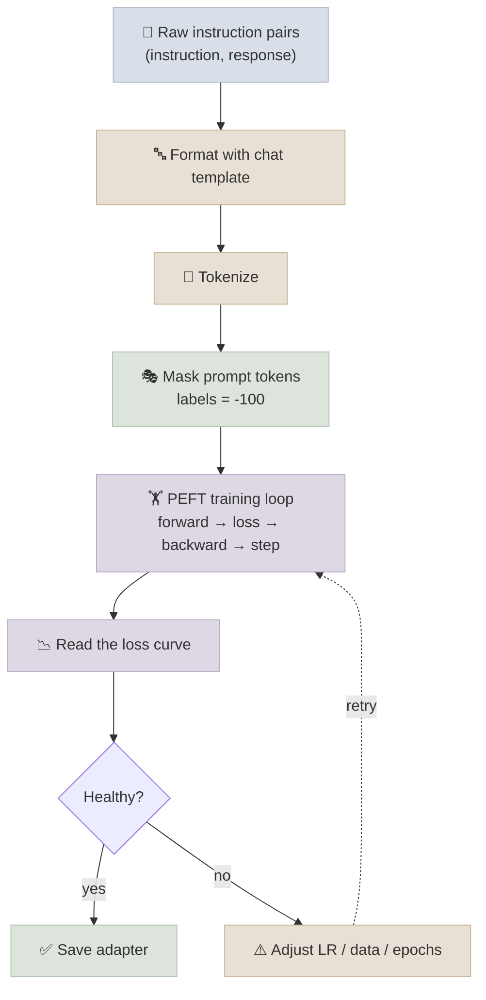

# Instruction Data and Training Runs

## The One-Line Definition

Running a real fine-tune means formatting instruction data consistently, masking the loss so the model only learns from completions, and watching the loss curve closely enough to catch overfitting or a bad learning rate before the run finishes.

<div class="audience-biz" markdown="1">

This is the "actually pressing go" part of fine-tuning. It covers how training examples get built from raw instruction/response pairs, why the model is only graded on the part it's supposed to generate (not the question it was asked), and how to read the graph that training produces to tell whether it's actually working.

</div>

<div class="audience-tech" markdown="1">

This page assumes the SFT loss-masking concept from [01-LLM-Models: Fine-Tuning](../../01-LLM-Models/Notes/07-Fine-Tuning.mdx) and extends [PyTorch Fundamentals: Training Loop From Scratch](../../11-Prog-Langs/PyTorch/Notes/03-Training-Loop-From-Scratch.mdx)'s raw training loop with the two things unique to instruction fine-tuning: label masking and a `peft`-wrapped model's forward/backward pass.

</div>



---

## Formatting Instruction Data

<div class="audience-biz" markdown="1">

Training examples need a consistent shape: a prompt (what the user asked) and a completion (what the model should learn to say back). Getting this formatting right - and matching it to how the model will actually be prompted later - is one of the most common places a fine-tune quietly goes wrong.

</div>

<div class="audience-tech" markdown="1">

The standard shape is a chat-templated string with a known split point between prompt tokens and completion tokens, so the completion span can be masked out of the loss. This section builds directly on [HuggingFace Ecosystem](01-HuggingFace-Ecosystem.mdx)'s `apply_chat_template` coverage.

</div>

### Code

```python
def build_example(tokenizer, instruction: str, response: str, max_length: int = 1024):
    """Tokenize an (instruction, response) pair with the prompt span masked out of the loss."""
    prompt_messages = [{"role": "user", "content": instruction}]
    prompt_text = tokenizer.apply_chat_template(
        prompt_messages, tokenize=False, add_generation_prompt=True
    )
    full_text = prompt_text + response + tokenizer.eos_token

    prompt_ids = tokenizer(prompt_text, add_special_tokens=False)["input_ids"]
    full = tokenizer(
        full_text, truncation=True, max_length=max_length, add_special_tokens=False
    )

    labels = full["input_ids"].copy()
    prompt_len = min(len(prompt_ids), len(labels))
    labels[:prompt_len] = [-100] * prompt_len   # -100 = ignored by CrossEntropyLoss

    full["labels"] = labels
    return full
```

`-100` is PyTorch's `CrossEntropyLoss` default `ignore_index` - any label position set to `-100` contributes zero gradient. This is the tokenized-data equivalent of the loss-mask diagram in [Fine-Tuning](../../01-LLM-Models/Notes/07-Fine-Tuning.mdx#supervised-fine-tuning-sft): everything before the completion is masked, everything in the completion (plus the trailing EOS) is graded.

---

## Prompt/Completion Masking in the Training Loop

<div class="audience-biz" markdown="1">

Once every example has its "don't grade this part" positions marked, the training loop itself barely changes from an ordinary PyTorch loop - the masking has already done its job during data preparation.

</div>

<div class="audience-tech" markdown="1">

With `labels` already containing `-100` at masked positions, `model(**batch)` (a `peft`-wrapped `AutoModelForCausalLM`) computes the masked cross-entropy loss internally when `labels` is passed - no separate masking step is needed inside the loop itself.

</div>

### A Hand-Written PEFT Training Loop

```python
import torch
from torch.utils.data import DataLoader
from transformers import default_data_collator

def train(model, train_dataset, tokenizer, epochs=3, lr=2e-4, batch_size=4, device="cuda"):
    loader = DataLoader(
        train_dataset, batch_size=batch_size, shuffle=True,
        collate_fn=default_data_collator,
    )
    optimizer = torch.optim.AdamW(
        [p for p in model.parameters() if p.requires_grad], lr=lr
    )
    model.train()

    for epoch in range(epochs):
        running_loss, steps = 0.0, 0
        for batch in loader:
            batch = {k: v.to(device) for k, v in batch.items()}

            optimizer.zero_grad()
            outputs = model(**batch)          # labels already masked with -100
            loss = outputs.loss               # masked cross-entropy, computed internally
            loss.backward()
            torch.nn.utils.clip_grad_norm_(
                [p for p in model.parameters() if p.requires_grad], max_norm=1.0
            )
            optimizer.step()

            running_loss += loss.item()
            steps += 1
            if steps % 10 == 0:
                print(f"epoch {epoch+1} step {steps} loss={loss.item():.4f}")

        print(f"epoch {epoch+1} avg_loss={running_loss/steps:.4f}")

    return model
```

This is the same five-step loop from [Training Loop From Scratch](../../11-Prog-Langs/PyTorch/Notes/03-Training-Loop-From-Scratch.mdx) with two PEFT-specific changes: the optimizer only receives `requires_grad=True` parameters (the tiny LoRA adapter, not the frozen base), and gradient clipping is added because instruction-tuning losses can spike on outlier examples early in training. In practice, `transformers.Trainer` or `trl.SFTTrainer` wrap this exact loop with logging, checkpointing, and scheduler support built in - see `train_qlora.py` in the [Code Lab](../CodeLabs/01-QLoRA-Fine-Tune.mdx) for the `Trainer`-based version used in this module's runnable script.

---

## Reading a Loss Curve

<div class="audience-biz" markdown="1">

The training loss graph is the single most useful diagnostic during a fine-tune. A healthy run shows loss dropping steadily and then leveling off. Anything else - loss going back up, loss stuck flat, loss dropping to near-zero suspiciously fast - is a signal something needs to change before you trust the result.

</div>

<div class="audience-tech" markdown="1">

Because instruction datasets for fine-tuning are typically small (hundreds to tens of thousands of examples, vs pretraining's web-scale corpora), overfitting signatures show up fast and clearly - often within the first 1-2 epochs. Watching train loss alone is not sufficient; a held-out validation split (see [Benchmarking Base vs Tuned](04-Benchmarking-Base-vs-Tuned.mdx)) is required to catch overfitting the training loss curve alone will miss.

</div>

### Loss Curve Patterns

| Pattern | Likely cause | Fix |
|---|---|---|
| Loss decreases smoothly, then plateaus | Healthy - normal convergence | None needed; consider stopping at the plateau |
| Loss drops to near-zero within the first epoch | Learning rate too high, or dataset too small/repetitive - the model is memorizing | Lower LR (try 5-10x smaller), add more diverse examples, reduce epochs |
| Loss oscillates wildly, doesn't trend down | Learning rate too high, or batch size too small for the LR chosen | Lower LR, increase effective batch size via `gradient_accumulation_steps` |
| Loss decreases then starts rising again | Overfitting - the model has started memorizing training examples at the expense of generalization | Fewer epochs, early stopping on validation loss, more data, higher LoRA dropout |
| Loss barely moves from the starting value | Learning rate too low, or LoRA rank too small for the task's complexity | Raise LR, raise `r`, verify gradients are actually flowing (check `requires_grad` on adapter params) |
| Loss looks fine but validation loss rises early | Classic overfitting invisible from train loss alone | Track validation loss every N steps, not just train loss |

**Interview Q:** *Training loss looks great (steadily decreasing, ends near zero) but the fine-tuned model performs worse than the base model on held-out prompts. What happened?*
The model likely overfit to the training set's exact phrasing rather than learning the general task/style - train loss alone doesn't detect this because it's measured on data the model has now memorized. This is why a held-out eval set with task-level metrics (not just loss) is mandatory - see [Benchmarking Base vs Tuned](04-Benchmarking-Base-vs-Tuned.mdx).

### Minimal Loss Logging

```python
import matplotlib.pyplot as plt

def plot_loss_curve(train_losses, val_losses, save_path="loss_curve.png"):
    plt.figure(figsize=(8, 5))
    plt.plot(train_losses, label="train")
    if val_losses:
        plt.plot(val_losses, label="val")
    plt.xlabel("step")
    plt.ylabel("loss")
    plt.legend()
    plt.title("Fine-Tuning Loss Curve")
    plt.savefig(save_path)
    print(f"Saved loss curve to {save_path}")
```

---

## Study Notes

**Must-know for interviews:**
- Instruction examples are tokenized as prompt + completion, with `labels` set to `-100` at every prompt-token position so `CrossEntropyLoss` ignores them
- `-100` is PyTorch's `CrossEntropyLoss` default `ignore_index` - this is the exact mechanism behind the loss-masking concept from [Fine-Tuning](../../01-LLM-Models/Notes/07-Fine-Tuning.mdx)
- A PEFT training loop is the same 5-step loop as full fine-tuning, except the optimizer only tracks `requires_grad=True` (adapter) parameters
- Loss dropping to near-zero fast usually means learning rate too high or dataset too small/repetitive - not a good sign
- Train loss decreasing while validation loss rises is the classic overfitting signature - only catchable with a held-out split
- Gradient clipping (`clip_grad_norm_`) is common in instruction-tuning loops to control loss spikes from outlier examples

**Quick recall Q&A:**
- *What does setting a label to `-100` actually do mechanically?* `CrossEntropyLoss`'s default `ignore_index=-100` skips that position entirely when computing the loss and gradient - it contributes exactly zero to backpropagation.
- *Why mask the prompt tokens instead of just weighting them lower?* Full masking (zero gradient) rather than down-weighting keeps the objective purely "generate a good completion given this prompt" - down-weighting would still push the model toward memorizing prompt phrasing to some degree.
- *You see loss oscillating without trending down - what are the two most likely first things to try?* Lower the learning rate, and/or increase effective batch size via `gradient_accumulation_steps` - both stabilize the gradient signal per update.
- *Why is overfitting harder to spot in fine-tuning than in typical ML training?* Instruction datasets are often small (hundreds-to-thousands of examples) so the model can start memorizing within a single epoch - overfitting can happen much faster than on large pretraining-scale corpora.
