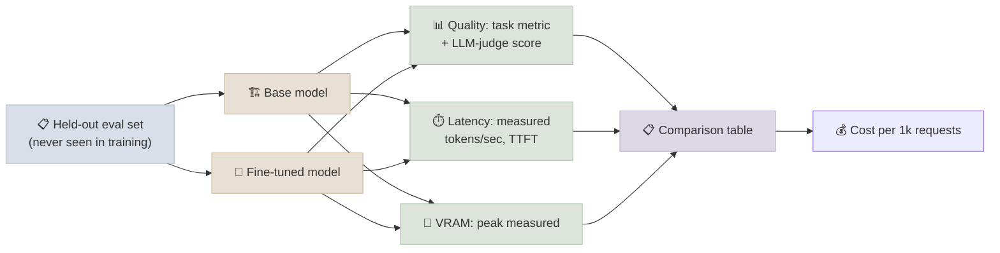

# Benchmarking Base vs Tuned

## The One-Line Definition

A fine-tune is only proven to have worked once you've measured the tuned model against the base model on a held-out eval set, across quality, latency, and cost - not just eyeballed a few sample outputs.

<div class="audience-biz" markdown="1">

This is the "did it actually help, and was it worth it" step. It's tempting to skip straight from "training finished" to "ship it," but the only way to know a fine-tune improved things - and by how much, at what cost - is to run a fair, structured comparison against the model you started with.

</div>

<div class="audience-tech" markdown="1">

This page defines the benchmark methodology that `benchmark.py` in this module's [Code Lab](../CodeLabs/01-QLoRA-Fine-Tune.mdx) implements: a held-out eval set, a quality proxy, measured (not estimated) latency, and measured VRAM - directly answering the "prove it worked" question that motivated this module.

</div>



---

## Building a Held-Out Eval Set Before Training

<div class="audience-biz" markdown="1">

The eval set has to be set aside *before* training starts, and the model must never see it during training. Otherwise you're grading the model on questions it already knows the answers to - which tells you nothing about whether it will perform well on new requests once deployed.

</div>

<div class="audience-tech" markdown="1">

This is a strict train/eval split, carved out with `datasets`' `.train_test_split()` (or an equivalent manual split) before any tokenization or training touches the data - the same discipline as any supervised ML train/test split, just easy to skip under time pressure during a fine-tuning project.

</div>

### Code

```python
from datasets import load_dataset

full_ds = load_dataset("json", data_files="support_tickets.jsonl", split="train")

split = full_ds.train_test_split(test_size=0.1, seed=42)
train_ds, eval_ds = split["train"], split["test"]

# Persist the eval set separately so it can never accidentally leak into a later training run
eval_ds.to_json("eval_holdout.jsonl")
print(f"train: {len(train_ds)} examples | eval (held out): {len(eval_ds)} examples")
```

**Eval set design checklist:**
- At least 30-50 examples for a directional signal; 100+ for a stable, low-noise score
- Covers the same distribution of tasks/formats as production traffic, not just the "easy" cases
- Includes a few known-hard or edge-case examples deliberately, not just random samples
- Never touched by any training run, hyperparameter search, or prompt iteration for this project

---

## Quality Delta: Task Metric + LLM-as-Judge

<div class="audience-biz" markdown="1">

There are two complementary ways to score quality. Task-specific metrics check something concrete and automatic - like whether an extracted field is exactly right. LLM-as-judge scoring uses a separate, stronger model to grade fuzzier things like helpfulness, tone, and correctness, the way a human reviewer would, but at scale.

</div>

<div class="audience-tech" markdown="1">

Neither metric alone is sufficient: task metrics (exact match, ROUGE, F1) are objective but brittle to surface-level phrasing differences; LLM-judge scores capture semantic quality but introduce their own bias and variance. Reporting both, on the same eval set, gives a triangulated quality signal - directly extending the evaluation table already introduced in [Fine-Tuning](../../01-LLM-Models/Notes/07-Fine-Tuning.mdx#fine-tuning-evaluation).

</div>

### Code

```python
import evaluate

rouge = evaluate.load("rouge")

def score_task_metric(predictions: list[str], references: list[str]) -> dict:
    return rouge.compute(predictions=predictions, references=references)

def llm_judge_score(question: str, response: str, judge_model, judge_tokenizer) -> int:
    """Ask a judge model to score a response 1-5 against the question. Returns an int score."""
    judge_prompt = (
        f"Question: {question}\nResponse: {response}\n\n"
        "Score this response's helpfulness and correctness from 1 (poor) to 5 (excellent). "
        "Reply with only the number."
    )
    inputs = judge_tokenizer(judge_prompt, return_tensors="pt").to(judge_model.device)
    output = judge_model.generate(**inputs, max_new_tokens=5)
    text = judge_tokenizer.decode(output[0][inputs["input_ids"].shape[1]:], skip_special_tokens=True)
    digits = "".join(c for c in text if c.isdigit())
    return int(digits[0]) if digits else 0
```

| Signal | Measures | Caveat |
|---|---|---|
| Task metric (ROUGE/F1/exact-match) | Surface-level correctness against a reference answer | Penalizes correct-but-differently-phrased answers |
| LLM-as-judge score | Holistic quality (helpfulness, tone, correctness) | Judge model has its own biases and cost; use a fixed judge + fixed prompt for reproducibility |

---

## Latency and Tokens-per-Second: Measured, Not Estimated

<div class="audience-biz" markdown="1">

Speed claims about a model are only trustworthy if they come from an actual timed run on the eval prompts - not a rough guess based on model size. The same base model can run at very different speeds depending on quantization, batch size, and hardware, so the only reliable number is one you measured yourself, on your own setup.

</div>

<div class="audience-tech" markdown="1">

Wall-clock timing around `model.generate()` calls, with an explicit warm-up pass excluded from the measurement (the first call pays CUDA kernel compilation/caching cost that later calls don't) and `torch.cuda.synchronize()` before timestamps, since CUDA calls are asynchronous by default.

</div>

### Code

```python
import time
import torch

def measure_latency(model, tokenizer, prompts: list[str], max_new_tokens=128, warmup=2):
    device = next(model.parameters()).device

    # Warm-up: excluded from the measurement, absorbs one-time CUDA kernel compilation cost
    for prompt in prompts[:warmup]:
        inputs = tokenizer(prompt, return_tensors="pt").to(device)
        model.generate(**inputs, max_new_tokens=max_new_tokens)

    total_tokens, total_time = 0, 0.0
    for prompt in prompts:
        inputs = tokenizer(prompt, return_tensors="pt").to(device)
        if torch.cuda.is_available():
            torch.cuda.synchronize()
        start = time.perf_counter()
        output = model.generate(**inputs, max_new_tokens=max_new_tokens)
        if torch.cuda.is_available():
            torch.cuda.synchronize()
        elapsed = time.perf_counter() - start

        new_tokens = output.shape[1] - inputs["input_ids"].shape[1]
        total_tokens += new_tokens
        total_time += elapsed

    return {
        "tokens_per_sec": total_tokens / total_time,
        "avg_latency_sec": total_time / len(prompts),
    }
```

**Why the warm-up pass matters:** the first `generate()` call on a freshly loaded model pays for CUDA graph/kernel compilation and memory allocator warm-up - including it in the average would understate steady-state throughput, sometimes by a large margin on the very first call.

---

## VRAM and Cost-per-1k-Requests

<div class="audience-biz" markdown="1">

The final piece is cost. A fine-tuned model that's slightly better but needs twice the memory and is half as fast might not be worth deploying - or it might be exactly the right tradeoff if the quality gain matters enough. Putting quality, speed, memory, and a rough cost-per-1000-requests number side by side is what turns "the fine-tune worked" into an actual deployment decision.

</div>

<div class="audience-tech" markdown="1">

Peak VRAM is read directly from `torch.cuda.max_memory_allocated()` around the benchmark run (reset via `torch.cuda.reset_peak_memory_stats()` beforehand) rather than estimated from parameter count - actual peak includes activations and the KV cache, not just weights. Cost-per-1k-requests is derived from measured tokens/sec and a GPU's hourly rental price, giving a comparable dollar figure across base, tuned, and prompted-only approaches.

</div>

### Code

```python
import torch

def measure_peak_vram_gb() -> float:
    torch.cuda.reset_peak_memory_stats()
    # ... run inference here ...
    return torch.cuda.max_memory_allocated() / 1e9

def cost_per_1k_requests(tokens_per_sec: float, avg_output_tokens: int, gpu_hourly_rate: float) -> float:
    """Rough cost estimate: how many GPU-seconds does 1,000 requests' worth of generation take."""
    seconds_per_request = avg_output_tokens / tokens_per_sec
    total_seconds = seconds_per_request * 1000
    total_hours = total_seconds / 3600
    return total_hours * gpu_hourly_rate
```

### Base vs Tuned vs Prompted-Only Comparison Table

| Dimension | Base model (zero-shot) | Prompted-only (few-shot) | Fine-tuned (LoRA/QLoRA) |
|---|---|---|---|
| Task quality | Baseline, often inconsistent format | Better, but prompt-length-dependent and can still drift | Highest consistency for the target task/format |
| Input tokens per request | Lowest | High (few-shot examples repeated every call) | Low (same as base - no examples needed in-prompt) |
| Latency | Fastest (shortest input) | Slower (longer input from few-shot examples) | Comparable to base (input stays short) |
| VRAM | Base model footprint | Same as base (prompting doesn't change model size) | Base + tiny adapter (LoRA) or same as base if merged |
| Cost per 1k requests | Lowest | Higher (more input tokens billed/computed per call) | Low, offset by one-time training cost |
| Best when | Task is simple, prompting alone hits quality bar | Quality bar needs examples but volume is low | High request volume, consistent format/style required, few-shot cost adds up |

---

## When Fine-Tuning Is the Wrong Answer

<div class="audience-biz" markdown="1">

Fine-tuning isn't always the right move, even when it technically works. If the benchmark shows the fine-tuned model barely beats a well-written prompt, or if the real problem is that the model doesn't know some fact (rather than doesn't know the right *style*), fine-tuning is solving the wrong problem - and prompting or retrieval usually gets there faster and cheaper.

</div>

<div class="audience-tech" markdown="1">

This is the practical decision gate on top of [Fine-Tuning](../../01-LLM-Models/Notes/07-Fine-Tuning.mdx)'s "prompt → RAG → fine-tune" ordering: the benchmark data from this page is what should actually trigger (or block) a production fine-tuning decision, not intuition.

</div>

| Signal from the benchmark | Interpretation | Better fix |
|---|---|---|
| Fine-tuned quality delta over few-shot prompting is small (within noise) | Prompting already captures the behavior you're trying to teach | Skip fine-tuning, ship the prompt - much lower ongoing maintenance cost |
| Fine-tuned model still gets facts wrong that a good prompt with context gets right | The gap is missing knowledge, not missing style/format | Use RAG to inject the missing facts at inference time - fine-tuning does not reliably add durable factual knowledge |
| Quality is good but only on eval-set-like inputs, degrades on novel phrasing | Overfit to the training distribution (see [Instruction Data & Training Runs](03-Instruction-Data-and-Training-Runs.mdx)) | More diverse training data, not more epochs |
| The task changes frequently (prompts/policies updated weekly) | A fine-tune goes stale immediately, requiring constant re-training | Keep it as a prompt or a RAG-retrieved policy document instead |
| Request volume is low | The training cost + operational overhead of maintaining a fine-tuned model rarely pays back at low volume | Few-shot prompting is usually cheaper end-to-end at low volume, even with higher per-request token cost |

---

## Study Notes

**Must-know for interviews:**
- The eval set must be carved out *before* training and never touched by it - a strict train/eval split, not an afterthought
- Report both a task metric (ROUGE/F1/exact-match) and an LLM-as-judge score - neither alone is a reliable quality signal
- Latency must be measured with a warm-up pass excluded and `torch.cuda.synchronize()` around timestamps - CUDA calls are async by default
- Peak VRAM should be read via `torch.cuda.max_memory_allocated()`, not estimated from parameter count alone - activations and KV cache matter too
- Cost-per-1k-requests ties quality, latency, and VRAM into one comparable number across base/prompted/tuned approaches
- Fine-tuning is the wrong tool when the quality gap vs prompting is small, when the real gap is missing facts (use RAG instead), or when the task changes too frequently to justify re-training

**Quick recall Q&A:**
- *Why exclude the first `generate()` call from a latency benchmark?* It pays one-time CUDA kernel compilation/caching cost that doesn't recur on subsequent calls - including it understates steady-state throughput.
- *Why measure peak VRAM instead of computing it from parameter count?* Actual peak usage includes activations, the KV cache, and allocator overhead, not just static weight storage - a parameter-count estimate is systematically too low.
- *A fine-tune scores well on the eval set but users report worse real-world behavior - what's the most likely explanation?* The eval set doesn't represent production traffic distribution closely enough (too narrow, too similar to training examples) - it needs broader, more representative examples.
- *Give one clear signal that RAG, not fine-tuning, is the right fix.* The model's errors are factual (wrong or outdated information) rather than stylistic/format errors - fine-tuning changes behavior and format reliably but does not reliably and durably inject new factual knowledge.
