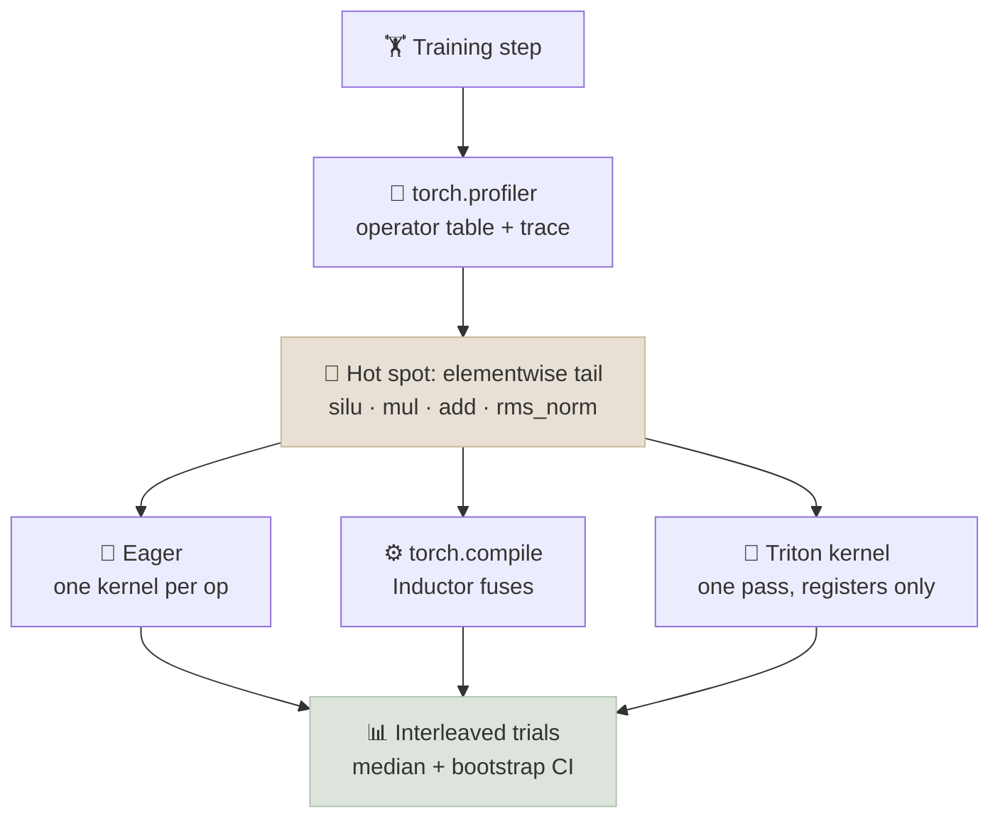

# Code Lab 01 - Profile and Fuse

Profile one training step of a small GPT to see where the time goes, then take the memory-bound elementwise tail of a SwiGLU feed-forward block - `rms_norm(silu(gate) * up + residual) * weight` - and make it faster without changing the math: first with `torch.compile`, then with a hand-written Triton kernel. Every speedup is reported as a median with a bootstrap 95% confidence interval, because single timing runs lie.

← **Back to Overview:** [Pretraining at Scale](../INDEX.mdx) · **Concepts:** [CUDA Concepts & GPU Profiling](../Notes/08-CUDA-Concepts-and-GPU-Profiling.mdx) · [Accelerators & Interconnects](../Notes/07-Accelerators-and-Interconnects.mdx)

```objectives
time: 2 hours (plus GPU time for the Triton part)
outcomes:
  - Profile a training step with torch.profiler and read the operator table and the Perfetto timeline
  - Estimate the minimum memory traffic of an elementwise chain and explain why fusing it helps
  - Fuse the chain with torch.compile and with a Triton kernel, checking numerical agreement with the eager version
  - Benchmark correctly - warm-up, synchronization, interleaved trials - and report speedups with bootstrap confidence intervals
prerequisites:
  - "[CUDA Concepts & GPU Profiling](../Notes/08-CUDA-Concepts-and-GPU-Profiling.mdx)"
  - "[GPT From Scratch](../../06-PyTorch/CodeLabs/02-GPT-From-Scratch.mdx) - the model structure"
```

---

## What's In This Lab

| Property | Detail |
|---|---|
| Part A | `torch.profiler` over 4 training steps of a 4-layer, d=256 GPT (RMSNorm, SDPA attention, SwiGLU FFN, AdamW); operator table plus `trace.json` for Perfetto |
| Part B | The fused tail on an 8192 x 4096 tensor: eager vs `torch.compile` vs Triton (CUDA only); max-difference check; 30 interleaved trials; bootstrap CI of the speedup |
| Devices | CUDA (BF16, all three variants) or CPU (FP32, eager and `torch.compile`) |
| Verified | The **CPU path** ran end to end on an Apple M4 laptop with PyTorch 2.14.1 in about 10 seconds (output below). The **Triton/CUDA path was not run** for this course - no GPU was available - so treat its numbers as yours to produce |
| Files | `01-Profile-and-Fuse/{profile_and_fuse.py, requirements.txt}` |



---

## Run It

```bash
cd src/content/07-Pretraining/CodeLabs/01-Profile-and-Fuse
python -m venv .venv && source .venv/bin/activate
pip install -r requirements.txt
python profile_and_fuse.py                     # cuda if available, else cpu
python profile_and_fuse.py --skip-profile --rows 16384 --cols 8192   # bigger tensor, Part B only
```

Verified CPU output (Apple M4, PyTorch 2.14.1, abbreviated):

```
=== Part A: top operators over 4 training steps (cpu) ===
                     Name    Self CPU %   Self CPU    # of Calls
                 aten::mm        52.54%   210.746ms          204
                aten::mul         7.28%    29.201ms          408
 aten::_scaled_dot_product_flash_atten...  7.06%   28.330ms   16
 aten::_log_softmax_backward_data  4.12%   16.515ms            4
       aten::_log_softmax         4.10%    16.448ms            4
      aten::silu_backward         2.36%     9.457ms           16
               aten::silu         2.29%     9.196ms           16
Self CPU time total: 401.088ms

                 eager: max |diff| vs eager = 0.00e+00
         torch.compile: max |diff| vs eager = 3.81e-06

=== Part B: fused tail, 8192 x 4096 float32 on cpu, 30 trials ===
minimum traffic if fused: 3 inputs + 1 output = 537 MB
                 eager: median  26.307 ms
         torch.compile: median  12.294 ms   speedup vs eager 2.14x  (95% CI 2.11-2.16)
```

On a CUDA GPU the script adds a `triton (hand-written)` row. Expect both fused variants to beat eager by a wider margin than on CPU, because GPU elementwise kernels are more purely bandwidth-bound and each eager launch also costs a few microseconds.

---

## Walkthrough - What to Look At

1. **The operator table (Part A).** Matrix multiplies (`aten::mm`) dominate, as they should in a healthy step - but `mul`, `silu`, softmax and their backward passes together take a large share for almost no FLOPs. Those are memory-bound, and they are the fusion opportunity. On CUDA, sort by CUDA time and look at the number of calls: hundreds of tiny kernels per step is the launch-overhead signature.
2. **Open `trace.json` in Perfetto.** On a GPU, look for gaps between kernels (CPU-bound or synchronizing) and for long runs of short kernels (unfused elementwise work).
3. **The traffic estimate.** The tail must read three tensors and write one: 537 MB for 8192 x 4096 FP32. Eager also writes and re-reads each intermediate (`silu(gate)`, the product, `h`, `h²`...), several times that traffic. The fused versions approach the minimum.
4. **Correctness first.** Every variant is compared with eager before timing. `torch.compile` differs by about 4e-6 - reordered floating-point arithmetic, not a bug. A fused kernel that is fast and wrong is worthless; always check.
5. **The Triton kernel** (`make_triton_tail`) runs one program per row, because the RMS needs a reduction over the whole row. Everything between the loads and the store happens in registers - that is the fusion. It computes in FP32 internally even for BF16 inputs, which is why its output can match eager closely.
6. **The benchmark design.** Warm-up runs exclude compilation; `time_once` uses CUDA events and synchronizes on GPU; variants are **interleaved** trial by trial so thermal or background drift affects all of them equally; the CI comes from resampling trials. A speedup whose CI includes 1.0 is not a speedup.

---

## Check Yourself

```quiz
- q: "In Part A, matrix multiplies take about half the CPU time, yet the lab targets the elementwise tail. Why?"
  options:
    - "Matmuls can't be optimized"
    - "The elementwise ops are memory-bound and do almost no math, so fusing them removes HBM round trips and launches without touching the efficient compute-bound part"
    - "The tail is the largest operator"
    - "torch.compile only works on elementwise ops"
  answer: 2
  explain: "Matmuls already run near the hardware's compute limits. The elementwise chain spends its time moving memory, and fusion cuts that traffic several-fold."
- q: "Why does the benchmark interleave the variants trial by trial rather than running all eager trials, then all compiled trials?"
  answer: "Machine conditions drift - CPU frequency, thermals, background load, GPU clocks. Interleaving exposes every variant to the same conditions, so differences reflect the code rather than when it happened to run."
- q: "torch.compile's output differs from eager by 3.8e-6. Is that a bug?"
  options:
    - "Yes - fused code must be bit-identical"
    - "No - fusion reorders floating-point operations, so tiny differences at the level of FP32 rounding are expected"
    - "Yes - it means the compiler skipped an operation"
    - "No - torch.compile always computes in FP64"
  answer: 2
  explain: "Floating-point addition isn't associative; a different reduction order changes the last bits. Check that errors are at rounding level for the dtype, not that they are zero."
- q: "Why does the Triton kernel use one program per row instead of splitting each row into many blocks?"
  answer: "RMSNorm needs the mean of squares over the entire row before any output can be written. With the row in one program, the reduction happens in registers in one pass; splitting the row would need a second pass or cross-program communication."
```

## Exercises

```exercise
- title: Measure the fusion gain at different sizes
  task: |
    Run Part B at `--rows 1024`, `8192` and `32768` (cols 4096). How does the torch.compile speedup change with size on your hardware, and why?
  solution: |
    At small sizes, fixed overheads - kernel launches on GPU, Python dispatch and thread start-up on CPU - are a large part of the time, and fusion's main benefit is fewer launches. At large sizes the work is dominated by memory traffic, and the speedup approaches the ratio of eager traffic to fused traffic. Plot speedup with its CI against size; if a small-size CI includes 1.0, report "no measurable gain" for that size rather than a number.
- title: Fuse the backward pass
  task: |
    The profile shows `silu_backward` and `mul` in the backward pass too. Wrap the tail in a small `nn.Module`, run forward and backward under `torch.compile`, and compare step time with eager. What does the compiler do with the backward?
  solution: |
    `torch.compile` traces the backward through AOTAutograd and fuses it as well, so the backward of the tail (the gradients through RMSNorm, the residual add and silu * up) also becomes a few fused kernels. Measure forward plus backward with the same interleaved, bootstrapped method. For a hand-written Triton version you would need a second kernel for the backward and a `torch.autograd.Function` wrapping both - which is exactly the work the compiler saves you.
```

## References

- PyTorch, [torch.profiler](https://docs.pytorch.org/docs/stable/profiler.html) (2026)
- Ansel et al., [PyTorch 2: Faster Machine Learning Through Dynamic Python Bytecode Transformation and Graph Compilation](https://doi.org/10.1145/3620665.3640366) (ASPLOS 2024)
- Tillet, Kung and Cox, [Triton: An Intermediate Language and Compiler for Tiled Neural Network Computations](https://doi.org/10.1145/3315508.3329973) (MAPL 2019); [Triton fused-softmax tutorial](https://triton-lang.org/main/getting-started/tutorials/02-fused-softmax.html)
- Shazeer, [GLU Variants Improve Transformer](https://arxiv.org/abs/2002.05202) (2020) - SwiGLU
- Zhang and Sennrich, [Root Mean Square Layer Normalization](https://arxiv.org/abs/1910.07467) (2019)

*Last reviewed: 2026-10*
