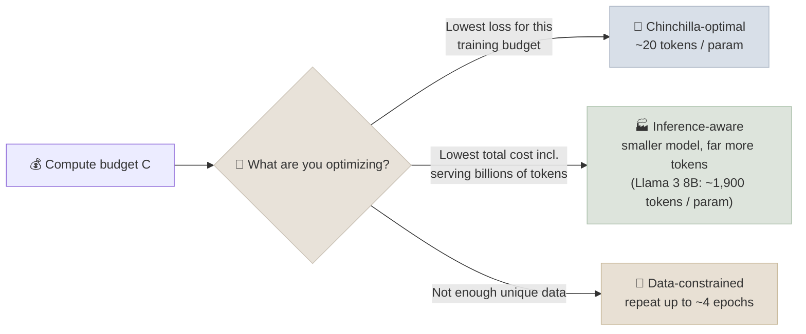

# Scaling Laws and Compute Budgets

Scaling laws are the planning tool of pretraining: fit how loss falls with model size, data and compute on small runs, then extrapolate to decide how big a model to train and on how many tokens. This note covers the original laws, why every current model deliberately violates "Chinchilla-optimal", and the newer laws for repeated data, inference cost and test-time compute.

```objectives
time: 50 min
outcomes:
  - Estimate training compute with C ≈ 6ND and convert it to GPU-hours and cost
  - Explain the difference between the Kaplan (2020) and Chinchilla (2022) conclusions, and compute a Chinchilla-optimal model and token count
  - Explain why production models are trained far beyond Chinchilla-optimal (inference-aware scaling)
  - Reason about data-constrained training (repeated epochs) and about test-time compute as a second scaling axis
prerequisites:
  - "[Training & Pretraining](01-Training-and-Pretraining.mdx)"
  - "[GPU & Hardware](02-GPU-and-Hardware.mdx) - FLOPs and utilization"
```

## Counting Compute

For a dense transformer with N parameters trained on D tokens:

```
Training compute   C ≈ 6 · N · D   FLOPs
                       2ND for the forward pass + 4ND for the backward pass
Inference compute  ≈ 2 · N FLOPs per generated token (plus attention over the context)
```

For a mixture-of-experts model, use the **active** parameters for N. Attention's cost over long sequences is extra and becomes significant when the sequence length approaches ~6-10 × d_model.

**Worked example:** Llama 3 405B trained on ~15.6T tokens → `6 × 405e9 × 15.6e12 ≈ 3.8 × 10²⁵ FLOPs`, matching the figure Meta reported.

**From FLOPs to GPU-hours:**

```
GPU-hours = C / (peak FLOP/s per GPU × MFU × 3600)
e.g. C = 1e24, H100 BF16 dense peak ≈ 989 TFLOP/s, MFU 40%
     → 1e24 / (989e12 × 0.40 × 3600) ≈ 700,000 GPU-hours ≈ $1.8M at $2.50/GPU-hour
     → about 7 days on 4,096 GPUs
```

---

## Kaplan (2020) vs Chinchilla (2022)

Both papers fit loss as a power law in parameters N and tokens D, then ask: for a fixed compute budget C, how should you split it between a bigger model and more data?

| | Kaplan et al. (OpenAI, 2020) | Hoffmann et al. "Chinchilla" (DeepMind, 2022) |
|---|---|---|
| Conclusion | Grow parameters faster than data (N ∝ C^0.73) | Grow both equally (N ∝ C^0.5, D ∝ C^0.5) |
| Rule of thumb | Large models, relatively few tokens | **~20 training tokens per parameter** |
| Consequence | GPT-3: 175B params on 300B tokens (~1.7 tokens/param) | Chinchilla 70B on 1.4T tokens beat Gopher 280B on the same compute |
| Why they differ | Learning-rate schedule not tuned to each run length; smaller models; embedding params counted differently | Schedules matched to token counts; larger range of runs |

Chinchilla's parametric fit (its "Approach 3"):

```
L(N, D) = E + A / N^α + B / D^β
        = 1.69 + 406.4 / N^0.34 + 410.7 / D^0.28

E   = irreducible loss (entropy of text)
A/N^α = loss from finite model capacity
B/D^β = loss from finite data
```

**Compute-optimal sizing for a budget C** (with D ≈ 20N and C = 6ND): `N ≈ sqrt(C / 120)`. For C = 10²⁴ FLOPs that gives N ≈ 91B parameters and D ≈ 1.8T tokens.



---

## Why Every Production Model "Overtrains"

Chinchilla minimizes **training** cost for a given loss. But a deployed model is trained once and then serves many trillions of tokens, and serving cost scales with N. Sardana et al. (2023) added inference to the objective: if you expect heavy use, the cost-optimal model is **smaller and trained on much more data** than Chinchilla prescribes.

That is exactly what production models do:

| Model | Params | Training tokens | Tokens per parameter |
|-------|--------|-----------------|----------------------|
| Chinchilla (2022) | 70B | 1.4T | 20 |
| Llama 2 7B (2023) | 7B | 2T | ~290 |
| Llama 3 8B (2024) | 8B | ~15T | ~1,900 |
| Qwen3 small dense models (2025) | 0.6B-32B | ~36T | Thousands |

Loss keeps falling well past 20 tokens/parameter - just more slowly. Plugging into the Chinchilla fit: an 8B model on 15T tokens reaches a predicted loss close to a compute-optimal 91B model's, at a fraction of the serving cost.

---

## When Data Runs Out

High-quality text is finite. Muennighoff et al. (2023) studied repeating data:

- Up to **~4 epochs** of the same data is nearly as good as fresh data.
- Returns fall quickly after that; around **16 epochs**, additional passes add essentially nothing.
- Code and filtered, higher-quality data change the picture - repeating the best data can beat adding more mediocre data.

This is one reason synthetic data and aggressive quality filtering (see [Data Curation and Mixtures](03-Data-Curation-and-Mixtures.mdx)) became central.

---

## Beyond Loss: Downstream Metrics and Hyperparameters

- **Predicting benchmarks, not just loss.** Llama 3 fit a two-step law - compute → loss on the benchmark's answers → benchmark accuracy - to forecast the 405B model's scores from much smaller runs. Individual benchmarks can look "emergent" (flat, then a jump); smoother metrics usually reveal steady underlying improvement.
- **Scaling hyperparameters.** The optimal batch size grows and the optimal learning rate shrinks with compute; DeepSeek fit power laws for both. μP (maximal update parametrization) is an alternative: parametrize the model so the best hyperparameters found on a small proxy transfer directly to the large model (see [Training Stability and Optimizers](06-Training-Stability-and-Optimizers.mdx)).

---

## Test-Time Compute: The Second Axis

Scaling laws used to be only about training. Reasoning models add a second axis: spend more compute **at inference** - longer chains of thought, sampling several answers and voting, or searching with a verifier. Snell et al. (2024) showed that, for some problems, allocating inference compute well can substitute for a much larger model; OpenAI's o1 reported accuracy improving smoothly with both train-time RL compute and test-time thinking.

The practical upshot: the "right-sized" model now depends on how much thinking you plan to buy per query. This is covered in [Post-Training & Fine-Tuning](../../08-Post-Training/INDEX.mdx).

---

## Check Yourself

```quiz
- q: "A dense 7B model is trained on 2T tokens. Roughly how many training FLOPs is that?"
  options:
    - "8.4 × 10²² FLOPs"
    - "1.4 × 10¹³ FLOPs"
    - "2.8 × 10²² FLOPs"
    - "8.4 × 10²⁵ FLOPs"
  answer: 1
  explain: "6 × 7e9 × 2e12 = 8.4e22. The 2.8e22 option uses 2ND, which counts only the forward pass."
- q: "Why is Llama 3 8B trained on ~1,900 tokens per parameter instead of Chinchilla's ~20?"
  options:
    - "It minimizes total cost including serving - a smaller model trained longer is cheaper to run at scale"
    - "Chinchilla's law was shown to be wrong"
    - "The model would not converge with fewer tokens"
    - "Longer training reduces the KV cache"
  answer: 1
- q: "For an MoE model with 671B total and 37B active parameters trained on 14.8T tokens, which N goes into C ≈ 6ND?"
  options:
    - "37B - FLOPs follow the active parameters"
    - "671B - all parameters are updated eventually"
    - "The geometric mean of the two"
    - "671B for the backward pass and 37B for the forward pass"
  answer: 1
- q: "Why did Kaplan et al. and Chinchilla reach different conclusions about the optimal parameter/data split?"
  answer: "Mainly because Kaplan's runs used a learning-rate schedule not adjusted to each run's length, which under-rated shorter (smaller-data) runs, plus differences in model sizes and in how embedding parameters were counted. Chinchilla matched the cosine schedule to each run's token count and concluded parameters and data should scale equally."
```

## Exercises

```exercise
- title: Plan a training run
  task: |
    You have 2,048 H100s for 30 days, expect 40% MFU, and must serve the model to many users afterwards.

    1. What is the total compute budget in FLOPs?
    2. What would the Chinchilla-optimal model and token count be?
    3. Propose the model size and token count you would actually choose, and justify it.
  hints:
    - "H100 dense BF16 peak ≈ 989 TFLOP/s."
  solution: |
    1. `2048 × 30 × 24 × 3600 s × 989e12 × 0.40 ≈ 2.1 × 10²⁴ FLOPs`.
    2. `N ≈ sqrt(2.1e24 / 120) ≈ 132B` parameters on `D ≈ 20N ≈ 2.6T` tokens.
    3. Because serving cost scales with N, a much smaller model trained longer is the better product - e.g. ~20-30B parameters on ~12-17T tokens (if that much good data exists; otherwise repeat the best data up to ~4 epochs or add synthetic data). Justify with the expected serving volume.
- title: Read the loss curve off the law
  task: |
    Using the Chinchilla fit `L = 1.69 + 406.4/N^0.34 + 410.7/D^0.28`, compute the predicted loss for an 8B model at 160B tokens (Chinchilla-optimal-ish), at 2T tokens and at 15T tokens. What fraction of the achievable improvement (down to E = 1.69) does going from 2T to 15T tokens deliver?
  solution: |
    Approximately 2.16 at 160B, 2.01 at 2T and 1.95 at 15T. Going from 2T to 15T removes about 0.06 of the remaining ~0.32 above E - a modest but real gain, which is worth paying for when the model will serve enormous volumes.
```

## Study Notes

**Must-know:**
- C ≈ 6ND (N = active params for MoE); inference ≈ 2N FLOPs per token
- GPU-hours = C / (peak × MFU × 3600); know H100 BF16 dense peak ≈ 989 TFLOP/s
- Chinchilla: scale N and D equally, ~20 tokens/param; parametric fit L = E + A/N^α + B/D^β
- Production models overtrain deliberately (inference-aware scaling): Llama 3 8B ≈ 1,900 tokens/param
- Data-constrained: ~4 epochs ≈ as good as fresh; ~16 epochs adds little
- Test-time compute is a second scaling axis for reasoning models

## References

- Kaplan et al., [Scaling Laws for Neural Language Models](https://arxiv.org/abs/2001.08361) (2020)
- Hoffmann et al., [Training Compute-Optimal Large Language Models (Chinchilla)](https://arxiv.org/abs/2203.15556) (2022)
- Sardana et al., [Beyond Chinchilla-Optimal: Accounting for Inference in Language Model Scaling Laws](https://arxiv.org/abs/2401.00448) (2023)
- Muennighoff et al., [Scaling Data-Constrained Language Models](https://arxiv.org/abs/2305.16264) (2023)
- DeepSeek-AI, [DeepSeek LLM: Scaling Open-Source Language Models with Longtermism](https://arxiv.org/abs/2401.02954) (2024) - hyperparameter scaling
- Llama Team, [The Llama 3 Herd of Models](https://arxiv.org/abs/2407.21783) (2024) - downstream-metric scaling, 3.8e25-FLOP run
- Snell et al., [Scaling LLM Test-Time Compute Optimally can be More Effective than Scaling Model Parameters](https://arxiv.org/abs/2408.03314) (2024)
- Schaeffer et al., [Are Emergent Abilities of Large Language Models a Mirage?](https://arxiv.org/abs/2304.15004) (2023)

*Last reviewed: 2026-09*
