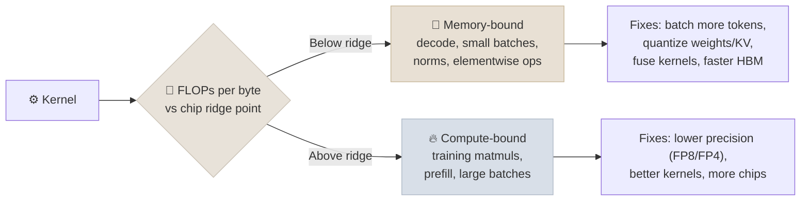

# Accelerators and Interconnects

Every training and serving decision is ultimately bounded by three hardware numbers: how many FLOPs the chip can do, how fast it can read memory, and how fast chips can talk to each other. This note gives you those numbers for the current generation, the low-precision formats that change them, and the roofline model for reasoning about which limit you will hit.

```objectives
time: 45 min
outcomes:
  - Compare current accelerators (Hopper, Blackwell, AMD Instinct, TPU) on memory, bandwidth, compute and interconnect
  - Read a spec sheet correctly - dense vs sparse FLOPs, per-GPU vs per-system figures
  - Use the roofline model to decide whether a workload is compute-bound or memory-bound
  - Explain FP8 and 4-bit microscaling formats (MXFP4, NVFP4) and where each is used
  - Explain why rack-scale NVLink domains (NVL72) and the data-center network shape parallelism choices
prerequisites:
  - "[GPU & Hardware](02-GPU-and-Hardware.mdx)"
  - "[Distributed Training at Scale](05-Distributed-Training-at-Scale.mdx)"
```

## Reading a Spec Sheet

Two traps catch almost everyone:

1. **Sparse vs dense FLOPs.** NVIDIA's headline tensor-core numbers assume 2:4 structured sparsity, which ordinary LLM training and inference do not use. The dense figure is **half** the sparse one. (H100 SXM's page lists 1,979 TFLOPS BF16 and 3,958 TFLOPS FP8 "with sparsity" - dense is 989 and 1,979.)
2. **Per-GPU vs per-system.** Rack and server pages (DGX B200, GB200 NVL72) quote totals; divide by the GPU count.

## The Current Generation (dense, per accelerator)

| Accelerator | HBM | Memory bandwidth | BF16 dense | FP8 dense | FP4 dense | Scale-up link |
|-------------|-----|------------------|------------|-----------|-----------|---------------|
| NVIDIA A100 SXM (2020) | 80 GB HBM2e | ~2.0 TB/s | 312 TFLOPS | - | - | NVLink 3, 600 GB/s |
| NVIDIA H100 SXM (2022) | 80 GB HBM3 | 3.35 TB/s | ~989 TFLOPS | ~1,979 TFLOPS | - | NVLink 4, 900 GB/s |
| NVIDIA H200 | 141 GB HBM3e | 4.8 TB/s | same as H100 | same as H100 | - | NVLink 4, 900 GB/s |
| NVIDIA B200 (in DGX B200) | 180 GB HBM3e | 8 TB/s | ~2,250 TFLOPS | ~4,500 TFLOPS | ~9,000 TFLOPS | NVLink 5, 1.8 TB/s |
| NVIDIA GB200 NVL72 (per GPU) | ~186 GB HBM3e | 8 TB/s | ~2,500 TFLOPS | ~5,000 TFLOPS | ~10,000 TFLOPS | NVLink 5, 72-GPU domain |
| AMD Instinct MI300X | 192 GB HBM3 | 5.3 TB/s | see AMD | see AMD | - | Infinity Fabric |
| AMD Instinct MI355X | 288 GB HBM3e | 8 TB/s | see AMD | see AMD | FP4/FP6 supported | Infinity Fabric |
| Google TPU7x "Ironwood" | 192 GiB | 7.38 TB/s | 2,307 TFLOPS | 4,614 TFLOPS | - | ICI, 1.2 TB/s; pods up to 9,216 chips |

*Derived from vendor pages (NVIDIA figures halved from the published sparse numbers; system totals divided per GPU). Clock and power configurations vary by server, so treat these as reference points, and check the vendor page for the exact SKU you are buying or renting.*

**What changed generation to generation:**
- **Hopper → Blackwell:** roughly 2.3× the dense BF16/FP8 compute, 2.4× the memory bandwidth, twice the NVLink bandwidth, and native FP4.
- **H100 → H200:** same compute, 76% more memory and 43% more bandwidth - which matters a lot for memory-bound inference.
- **NVL72:** 72 GPUs in one NVLink domain (130 TB/s aggregate) instead of 8. Tensor and expert parallelism can now span a whole rack, which is what large MoE inference needed.

---

## The Roofline Model

A kernel's **arithmetic intensity** is the FLOPs it performs per byte it moves from memory. Each chip has a **ridge point** - peak FLOPs ÷ memory bandwidth. Below the ridge, the kernel is **memory-bound** (faster memory helps, more FLOPs don't); above it, **compute-bound**.

```
Ridge point = peak FLOP/s ÷ memory bytes/s
  A100:  312e12 / 2.0e12  ≈ 156 FLOP/byte
  H100:  989e12 / 3.35e12 ≈ 295 FLOP/byte
  B200:  2.25e15 / 8e12   ≈ 281 FLOP/byte
```



**Why decode is memory-bound:** generating one token at batch size 1 multiplies each weight once (2 FLOPs per parameter) but must read every weight (2 bytes in BF16) - an intensity of about 1 FLOP/byte, nearly 300× below H100's ridge. Throughput comes from batching many sequences so each weight read is reused, which is exactly what [continuous batching](../../16-Inference-and-Serving/INDEX.mdx) does.

**Back-of-envelope decode ceiling:** at batch size 1, tokens/second ≤ memory bandwidth ÷ bytes of weights. A 70B BF16 model (140 GB) split across two H100s reads at up to ~6.7 TB/s → at most ~48 tokens/s per sequence, before any overhead.

---

## Low-Precision Formats

| Format | Bits | How it is scaled | Main use today |
|--------|------|------------------|----------------|
| BF16 | 16 | No scaling needed | Default training precision; common serving precision |
| FP8 E4M3 / E5M2 | 8 | Per-tensor, per-channel or per-block scales | Training on Hopper/Blackwell; the default "safe" quantization for serving |
| MXFP8 | 8 | Shared 8-bit exponent (E8M0) per block of 32 values | Blackwell-native FP8 training and inference |
| MXFP4 | 4 | E8M0 scale per block of 32 values (OCP Microscaling spec) | Weights for serving; gpt-oss ships its MoE weights in MXFP4 |
| NVFP4 | 4 | FP8 (E4M3) scale per block of 16 values, plus a per-tensor FP32 scale | NVIDIA's 4-bit format for Blackwell inference (and increasingly training) |

Smaller blocks and finer scales track outliers better, which is why NVFP4's 16-value blocks with FP8 scales typically lose less accuracy than MXFP4's 32-value blocks with power-of-two scales. Quantization for serving is covered in [Inference & Serving](../../16-Inference-and-Serving/INDEX.mdx).

---

## Networking: Scale-Up and Scale-Out

- **Scale-up** (inside a server or rack): NVLink/NVSwitch for NVIDIA, Infinity Fabric for AMD, ICI for TPUs. High bandwidth and low latency - where tensor and expert parallelism live.
- **Scale-out** (between servers): InfiniBand (NDR 400 Gb/s and XDR 800 Gb/s per port) or RDMA over Ethernet (RoCE; Ultra Ethernet is the emerging standard). Clusters are typically wired "rail-optimized": GPU *i* of every server connects to the same leaf switch, so the collectives of each parallel group stay on one rail.
- **Bandwidth gap:** an H100's NVLink (900 GB/s) is about 18× its 400 Gb/s (50 GB/s) network port. That ratio is why the parallelism layout in [Distributed Training at Scale](05-Distributed-Training-at-Scale.mdx) maps the chattiest dimension to NVLink.

---

## Check Yourself

```quiz
- q: "A spec sheet lists 3,958 TFLOPS FP8 for a GPU 'with sparsity'. What figure should you use to estimate dense LLM training throughput?"
  options:
    - "About 1,979 TFLOPS - dense is half the sparse figure"
    - "3,958 TFLOPS"
    - "About 989 TFLOPS - FP8 always runs at BF16 speed"
    - "About 7,916 TFLOPS"
  answer: 1
- q: "Moving an inference service from H100 to H200 (same compute, more memory bandwidth) mostly speeds up which phase?"
  options:
    - "Decode - it is memory-bandwidth-bound"
    - "Prefill - it is compute-bound"
    - "Tokenization"
    - "Neither; only training benefits"
  answer: 1
- q: "Why does a 72-GPU NVLink domain (GB200 NVL72) matter for serving large MoE models?"
  answer: "Expert and tensor parallelism need very high-bandwidth, low-latency all-to-all and all-reduce traffic. With 72 GPUs on one NVLink fabric, a large MoE can be spread across many GPUs without sending that traffic over the much slower data-center network."
- q: "What does NVFP4 do differently from MXFP4 to lose less accuracy?"
  options:
    - "Smaller blocks (16 values) with finer-grained FP8 scales instead of 32-value blocks with power-of-two scales"
    - "It uses 5 bits per value instead of 4"
    - "It stores values as integers"
    - "It keeps all weights in BF16"
  answer: 1
```

## Exercises

```exercise
- title: Pick hardware for a workload
  task: |
    Estimate, for a 70B dense model, the minimum number of GPUs needed just to hold the weights (a) in BF16 on H100, (b) in FP8 on H100, (c) in FP8 on H200, and (d) in FP4 on B200. Then compute the batch-1 decode ceiling (tokens/s) for (b) and (c), assuming weights are split evenly across the minimum GPU count.
  solution: |
    Weights: BF16 140 GB, FP8 70 GB, FP4 35 GB. (a) 2× H100 (b) 1× H100 (70 GB fits in 80 GB, leaving little for KV cache - 2 in practice) (c) 1× H200 with ~70 GB free for KV cache (d) 1× B200. Decode ceilings: (b) 3.35 TB/s ÷ 70 GB ≈ 48 tok/s; (c) 4.8 TB/s ÷ 70 GB ≈ 69 tok/s. The H200's advantage is all bandwidth and memory.
- title: Arithmetic intensity of a matmul
  task: |
    For a BF16 matrix multiply of (B × 8192) activations by an (8192 × 8192) weight matrix, compute FLOPs and bytes moved (count reading both inputs and writing the output) for B = 1, 64 and 4,096. At which batch sizes is it compute-bound on an H100 (ridge ≈ 295 FLOP/byte)?
  hints:
    - "FLOPs = 2 × B × 8192 × 8192. Bytes ≈ 2 × (B × 8192 + 8192² + B × 8192)."
```

## Study Notes

**Must-know:**
- Halve NVIDIA's "with sparsity" numbers; divide system totals by GPU count
- H100: 80 GB, 3.35 TB/s, ~989 TF BF16 dense; H200: same compute, 141 GB, 4.8 TB/s; B200: 180 GB, 8 TB/s, ~2.25 PF BF16 / 4.5 PF FP8 / 9 PF FP4 dense, NVLink 5 1.8 TB/s
- GB200 NVL72: 72 GPUs in one NVLink domain, 130 TB/s aggregate
- Roofline: ridge = peak FLOPs ÷ bandwidth (~300 FLOP/byte on H100/B200); decode is memory-bound, training matmuls compute-bound
- 4-bit microscaling: MXFP4 (32-value blocks, E8M0 scale) vs NVFP4 (16-value blocks, FP8 scale + tensor scale)
- NVLink is ~18× a 400 Gb/s network port on H100 - put chatty parallelism on NVLink

## References

- NVIDIA spec pages: [H100](https://www.nvidia.com/en-us/data-center/h100/), [H200](https://www.nvidia.com/en-us/data-center/h200/), [DGX B200](https://www.nvidia.com/en-us/data-center/dgx-b200/), [GB200 NVL72](https://www.nvidia.com/en-us/data-center/gb200-nvl72/) (accessed 2026-09-26)
- Google Cloud, [TPU7x (Ironwood)](https://docs.cloud.google.com/tpu/docs/tpu7x) (accessed 2026-09-26)
- AMD, [Instinct MI350 Series](https://www.amd.com/en/products/accelerators/instinct/mi350.html)
- Williams, Waterman & Patterson, [Roofline: An Insightful Visual Performance Model](https://doi.org/10.1145/1498765.1498785) (CACM, 2009)
- Open Compute Project, [OCP Microscaling Formats (MX) Specification v1.0](https://www.opencompute.org/documents/ocp-microscaling-formats-mx-v1-0-spec-final-pdf) (2023); Rouhani et al., [Microscaling Data Formats for Deep Learning](https://arxiv.org/abs/2310.10537) (2023)
- NVIDIA, [Introducing NVFP4 for Efficient and Accurate Low-Precision Inference](https://developer.nvidia.com/blog/introducing-nvfp4-for-efficient-and-accurate-low-precision-inference/) (2025)

*Last reviewed: 2026-09*
