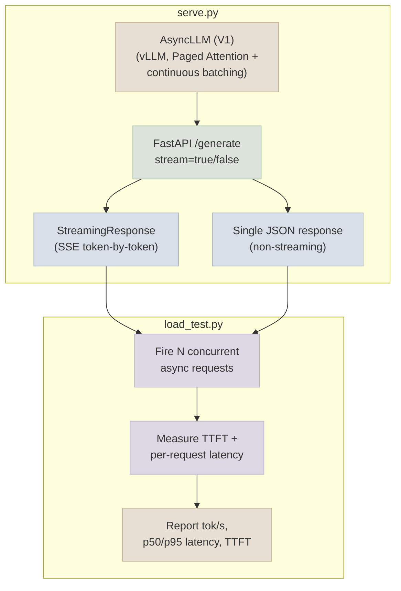

# Code Lab 01 - FastAPI + vLLM Endpoint

A real FastAPI endpoint backed by a vLLM V1 `AsyncLLM`, serving a small open instruction model with both streaming (SSE) and non-streaming responses - plus a concurrent load-testing client that measures tokens/sec, p50/p95 latency, and time-to-first-token under load.

← **Back to Overview:** [Serving & Inference](../INDEX.mdx) · **Back to Concepts:** [vLLM & Paged Attention](../Notes/02-vLLM-and-Paged-Attention.mdx) · [Batching, Concurrency & Latency](../Notes/04-Batching-Concurrency-and-Latency.mdx) · [Streaming & TTFT](../Notes/05-Streaming-and-TTFT.mdx)

```objectives
time: 2 hours (plus GPU time)
outcomes:
  - Serve a model with vLLM's AsyncLLM behind a FastAPI endpoint with streaming (SSE) and non-streaming responses
  - Load-test the endpoint and report tokens per second, p50/p95 latency and TTFT at several concurrency levels
  - Find the concurrency at which a latency SLO breaks, and explain it from batching and KV-cache behaviour
prerequisites:
  - "[vLLM & Paged Attention](../Notes/02-vLLM-and-Paged-Attention.mdx), [Batching, Concurrency & Latency](../Notes/04-Batching-Concurrency-and-Latency.mdx) and [Streaming & TTFT](../Notes/05-Streaming-and-TTFT.mdx)"
  - "A CUDA GPU with at least 16 GB for the default 1.7B model"
```

---

## What's In This Lab

| Property | Detail |
|---|---|
| Task | Serve a small open instruction model behind a production-shaped HTTP endpoint |
| Base model | A small open instruction model (default: `Qwen/Qwen3-1.7B`) - the same class of model used in [Fine-Tuning Lab](../../05-Fine-Tuning-Lab/CodeLabs/01-QLoRA-Fine-Tune.mdx); a QLoRA-merged model from that lab works equally well as a drop-in `--model` swap |
| Serving engine | vLLM V1 `AsyncLLM` (Paged Attention + continuous batching) |
| Verified | `serve.py` compiles and its vLLM imports and calls (`AsyncEngineArgs`, `AsyncLLM.from_engine_args`, `generate`, `shutdown`) were checked against vLLM's source and API docs in September 2026 (vLLM ≥ 0.11, V1 engine only). It has not been run on a GPU as part of this review. |
| Requests | `{"prompt": "..."}` for raw text, or `{"messages": [...]}` to apply the model's chat template (use this for instruct models) |
| API layer | FastAPI, `/generate` endpoint supporting `stream=true` (SSE) and `stream=false` (single JSON response) |
| Load test | Concurrent async client measuring tokens/sec, p50/p95 latency, and TTFT at configurable concurrency |
| Complexity | Intermediate-Advanced |
| Files | `01-FastAPI-vLLM-Endpoint/{serve.py, load_test.py, requirements.txt, README.mdx}` |

## Architecture



## Running

```bash
cd 07-Serving-and-Inference/CodeLabs/01-FastAPI-vLLM-Endpoint
pip install -r requirements.txt

# Terminal 1: start the server
python serve.py --model Qwen/Qwen3-1.7B --port 8000

# Terminal 2: run the load test against it
python load_test.py --url http://localhost:8000/generate --concurrency 16 --requests 64
```

Full details, code walkthrough, and what each part demonstrates: see [README](https://github.com/sundante/sun-course-genai/tree/main/src/content/07-Serving-and-Inference/CodeLabs/01-FastAPI-vLLM-Endpoint).

## Check Yourself

```quiz
- q: "Why should the load test report p95 latency rather than the average?"
  options: ["Averages hide the slow tail that users notice and SLOs are written against", "p95 is always lower", "Averages can't be computed for streams", "vLLM only exposes p95"]
  answer: 1
- q: "TTFT rises sharply at concurrency 64 while aggregate tokens/s still grows. What is happening?"
  answer: "New requests queue and their prefill competes with ongoing decodes (chunked prefill spreads it over several steps), so each request waits longer for its first token even though total throughput is still increasing."
- q: "Why does the server use AsyncLLM rather than calling LLM.generate() per request?"
  options: ["AsyncLLM feeds all in-flight requests into one continuously batched engine", "LLM.generate is deprecated", "AsyncLLM uses less memory per token", "It is required for FastAPI"]
  answer: 1
```

## Exercises

```exercise
- title: Map the latency curve
  task: |
    Run load_test.py at concurrency 1, 4, 16, 64 and 128 with a fixed prompt set. Plot p50/p95 TTFT, p95 end-to-end latency and aggregate tokens/s. For an SLO of p95 TTFT < 500 ms, what capacity do you report?
  solution: |
    Report the highest concurrency where p95 TTFT stays under 500 ms, minus a safety margin; show that aggregate throughput keeps rising past that point, which is why throughput alone is the wrong capacity metric.
- title: Prefix caching on and off
  task: |
    Give every request the same 1,500-token system prompt. Run the load test with prefix caching enabled and disabled (`enable_prefix_caching` in the engine args) and compare TTFT and throughput.
  solution: |
    With caching, the shared prefix is prefilled once and reused, so TTFT drops sharply and throughput rises because prefill compute is freed for decoding; without it, each request pays the full prefill.
```

## References

- Kwon et al., [PagedAttention (vLLM)](https://arxiv.org/abs/2309.06180) (2023)
- vLLM project, [vLLM documentation](https://docs.vllm.ai/) - engine arguments, OpenAI-compatible server, benchmarking (2026)
- FastAPI, [StreamingResponse](https://fastapi.tiangolo.com/advanced/custom-response/#streamingresponse) (2026)

*Last reviewed: 2026-09*
