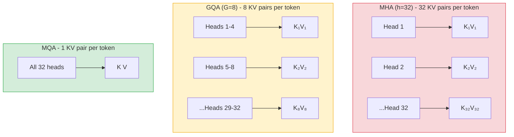
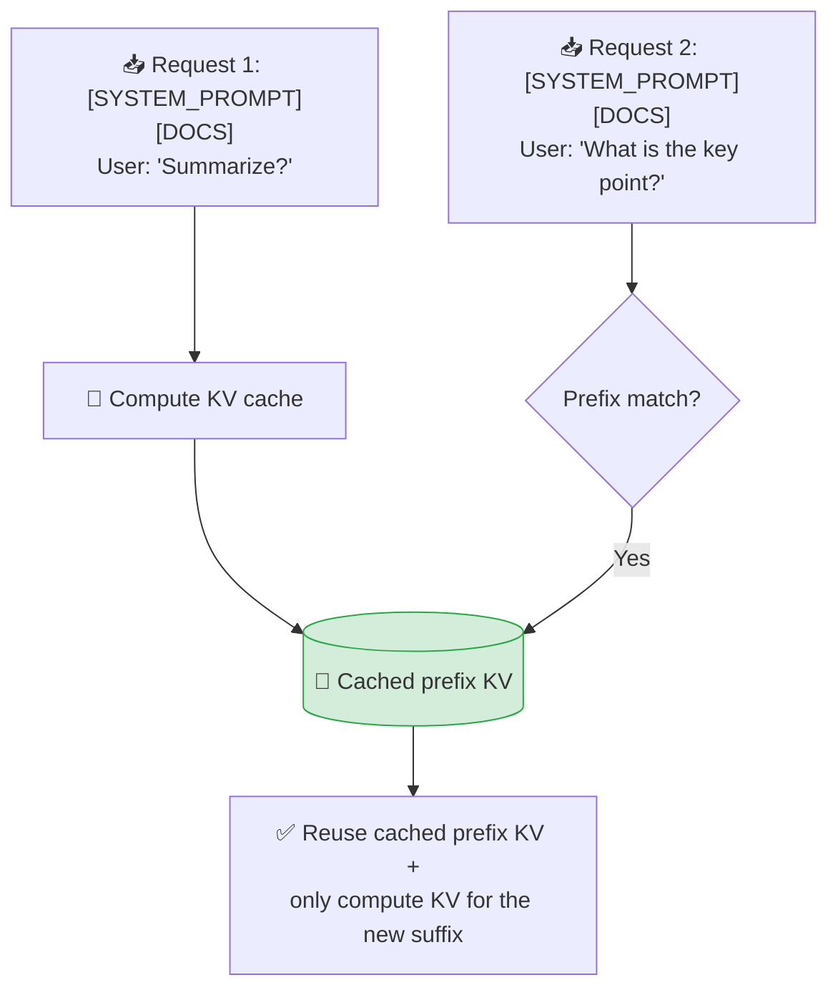
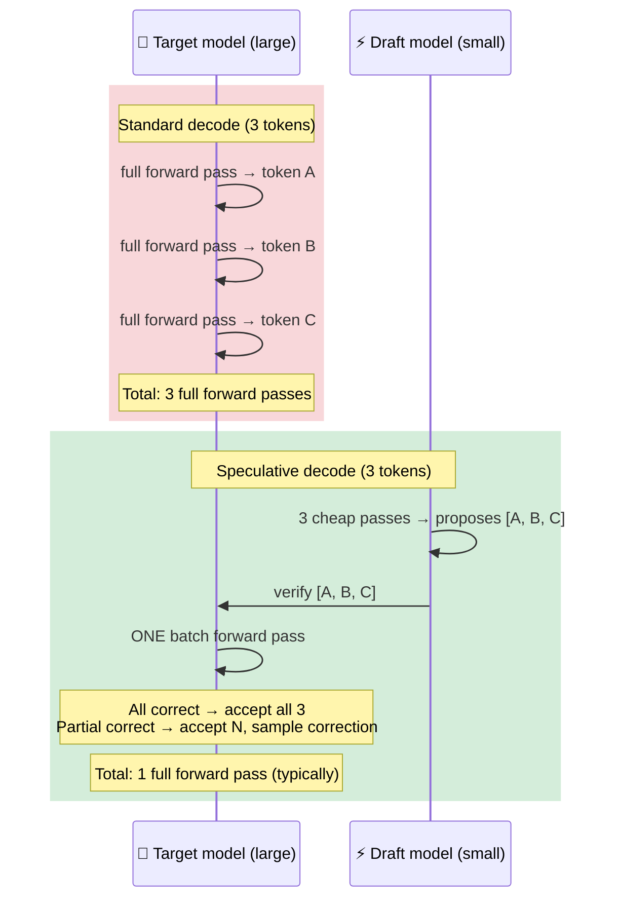
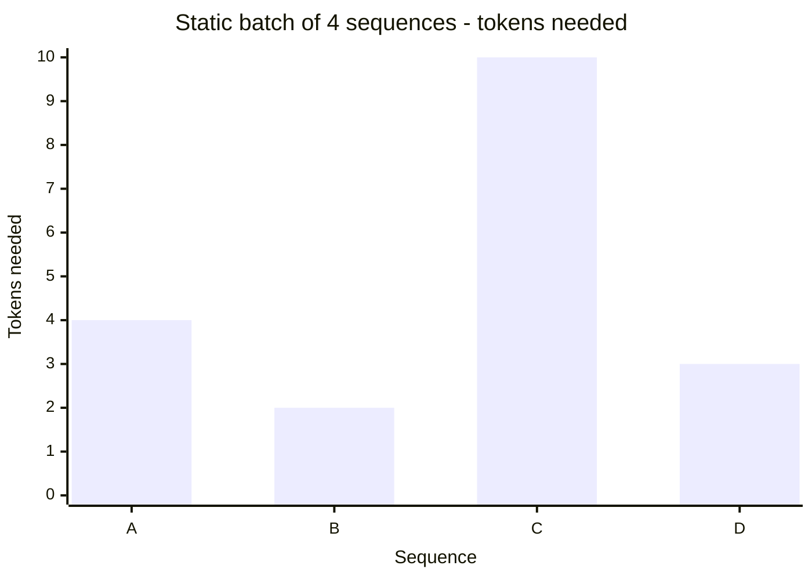
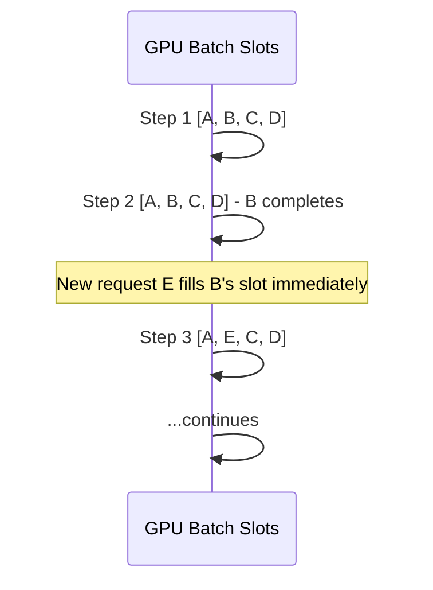
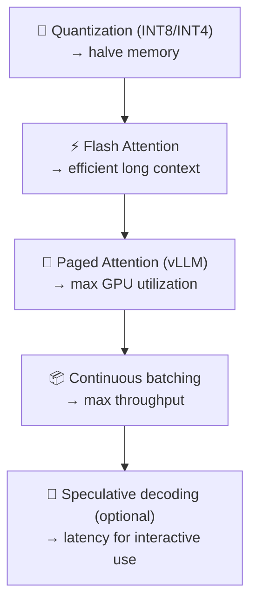

# KV Cache and Inference Optimization

```objectives
time: 45 min
outcomes:
  - Derive a model's KV-cache size from its layer count, KV-head count, head dimension and precision
  - Explain how MQA and GQA shrink the cache, and what they trade away
  - Describe how PagedAttention, prefix caching, continuous batching and speculative decoding raise serving throughput
prerequisites:
  - "[Attention Mechanisms](../../01-LLM-Foundations/Notes/03-Attention-Mechanisms.mdx) - Q/K/V and multi-head attention"
```

## What Is the KV Cache

### Concept

During autoregressive generation, the model generates one token at a time. At each step, it must compute the attention output for the current token, which requires the Key and Value matrices for **all preceding tokens**.

Without caching, this would be catastrophically expensive:
- Generating token 100 requires computing K and V for tokens 0–99 from scratch
- Generating token 101 requires the same K and V for tokens 0–99 again (redundant work)
- Total compute scales as O(n²) in the number of generated tokens

**The KV cache solution:** Store the Key and Value projections for all past tokens. At each new generation step, compute K and V only for the new token and append them to the cache.

```
Without KV cache (step n):
  Compute K, V for tokens 0..n → O(n) matrix ops
  Total across all steps: O(n²)

With KV cache (step n):
  Load K[0..n-1], V[0..n-1] from cache
  Compute K[n], V[n] for new token only
  Append K[n], V[n] to cache
  Total across all steps: O(n) matrix ops
```

**Two phases of inference:**

| Phase | What happens | Bottleneck |
|-------|-------------|------------|
| **Prefill** | Process entire input prompt in parallel (like training) | Compute-bound (many tokens processed at once) |
| **Decode** | Generate one token at a time, reading KV cache | Memory-bandwidth-bound (reading large KV cache per step) |

**Tricky Q:** *Why is prefill faster per-token than decoding?*  
Prefill processes all input tokens in parallel - the GPU is compute-bound (utilization near peak). Decoding generates one token at a time - the GPU must read the entire KV cache from HBM for each single-token step. Reading a large cache for one token wastes compute capacity → memory-bandwidth bound.

---

## KV Cache Memory Math

### Concept

KV cache memory is a critical capacity constraint in production. Every generated sequence consumes cache memory proportional to its length.

**Formula per token per layer:**
```
KV_memory_per_token_per_layer = 2 × n_kv_heads × d_head × bytes_per_element
```

Factor of 2: one K matrix + one V matrix.

**Total KV cache for a single sequence:**
```
total_KV = n_layers × seq_len × 2 × n_kv_heads × d_head × bytes_per_element
```

**Example - LLaMA-3 8B in BF16 (2 bytes):**
- n_layers = 32, n_kv_heads = 8, d_head = 128, seq_len = 4096 (4K context)
- Per token, per layer: 2 (K+V) × 8 × 128 × 2 bytes = 4096 bytes = 4 KB
- For 4K tokens: 4 KB × 4096 tokens × 32 layers = 512 MB
- For 128K tokens: 4 KB × 131072 tokens × 32 layers = 16 GB - just the KV cache!

**Practical implication:** Long-context inference is as much a memory problem as a compute problem. A 70B model serving 128K-context sequences needs enormous GPU memory, most of it for KV caches.

```python
def kv_cache_memory_gb(n_layers, seq_len, n_kv_heads, d_head, dtype_bytes=2):
    """Estimate KV cache memory in GB for a single sequence."""
    bytes_total = n_layers * seq_len * 2 * n_kv_heads * d_head * dtype_bytes
    return bytes_total / (1024**3)

# LLaMA-3 8B at different context lengths
for ctx in [2048, 8192, 32768, 131072]:
    gb = kv_cache_memory_gb(n_layers=32, seq_len=ctx, n_kv_heads=8, d_head=128)
    print(f"  {ctx:>7,} tokens: {gb:.2f} GB KV cache")

#   2,048 tokens: 0.25 GB
#   8,192 tokens: 1.00 GB
#  32,768 tokens: 4.00 GB
# 131,072 tokens: 16.00 GB  ← just KV cache for one sequence (matches the 16 GB above)
```

---

## MHA vs MQA vs GQA

### Concept

These three variants trade KV cache size for generation quality.

**Multi-Head Attention (MHA):**
- Each of the h query heads has its own distinct K and V projection
- KV cache: 2 × h × d_head per token per layer
- Best quality, but most memory-intensive KV cache

**Multi-Query Attention (MQA):**
- All h query heads share a single K and V projection
- KV cache: 2 × 1 × d_head per token per layer (1/h of MHA)
- h× reduction in KV cache memory
- Quality slightly lower - all heads see the same K/V space
- Used by: Falcon, early efficient models, Gemma-1

**Grouped-Query Attention (GQA):**
- h query heads split into G groups; each group shares one K/V pair
- KV cache: 2 × G × d_head per token per layer (G/h reduction vs MHA)
- LLaMA-3 8B: h=32, G=8 → 4× smaller KV cache than MHA
- Quality nearly identical to MHA for most tasks
- Used by: LLaMA-3, Gemma 2, Mistral - the current production standard



**Memory comparison for LLaMA-3 8B at 32K context:**
```
MHA (G=32): 32 × 32768 × 2 × 32 × 128 × 2 bytes = 16 GB
GQA (G=8):  32 × 32768 × 2 × 8  × 128 × 2 bytes =  4 GB  ← LLaMA-3 actual
MQA (G=1):  32 × 32768 × 2 × 1  × 128 × 2 bytes = 0.5 GB
```

---

## Paged Attention (vLLM)

### Concept

Production LLM serving has a fundamental memory fragmentation problem. Traditional KV cache allocation reserves contiguous memory blocks per sequence at the maximum context length - this wastes memory because:
1. Most sequences are much shorter than the maximum context
2. Memory is reserved upfront but used gradually as tokens are generated
3. Different sequences have different lengths → external fragmentation

**Paged Attention** (Kwon et al., 2023 - the key innovation behind vLLM) borrows the virtual memory concept from operating systems:

```
Physical GPU memory is divided into fixed-size "blocks" (e.g., 16 tokens each)

For each sequence, a "page table" maps logical positions to physical blocks:
  Sequence A: [block 3, block 7, block 12, ...]  (non-contiguous physical)
  Sequence B: [block 1, block 4, ...]

As a sequence grows, new blocks are allocated on demand - no pre-reservation
When a sequence finishes, its blocks are freed and immediately reusable
```

**Results:**
- Near-zero memory waste from fragmentation (< 4% vs ~60–80% with contiguous allocation)
- Higher GPU utilization → more sequences in flight simultaneously → 2–4× higher throughput
- Enables efficient KV cache sharing for prefix caching (see below)

---

## Prefix Caching

### Concept

Many production workloads have repeated prompt prefixes:
- Chatbot: same system prompt for every conversation
- RAG: same retrieved context chunks for many queries
- Agent: same tool definitions in every turn

**Prefix caching:** Compute the KV cache for the shared prefix once, store it, and reuse it across all requests that share that prefix.



**ROI:**
- System prompts are often 500–2000 tokens
- At 1000 req/min with a 1000-token system prompt, prefix caching eliminates reprocessing that prefix 1000 times/min
- Effective latency improvement on prefill: often 50–90% reduction for cacheable content

Paged Attention's block-based addressing makes prefix caching efficient - blocks that are identical across requests can be shared in the physical page table (copy-on-write).

---

## Speculative Decoding

### Concept

Speculative decoding uses a small "draft" model to propose K tokens at once, then verifies them with the large "target" model in a single forward pass. This converts the sequential bottleneck of K decode steps into one batch verification step.

**Why this works:**
- The small draft model (e.g., 1B) is fast but lower quality
- The large target model (e.g., 70B) is high quality but slow
- Key insight: if the draft model gets the next K tokens right (which it often does for common phrases), the target model can accept all K in one forward pass - K tokens for the cost of ~1 decode step



**Speedup factors:**
- 2–3× for common tasks with high draft model acceptance rates
- Speedup is higher for tasks with more predictable token sequences (code, structured output, common phrases)
- Speedup is lower for highly creative or diverse generation

**Models:**
- Medusa: adds multiple decoding heads to the original model (no separate draft model)
- EAGLE (1/2/3): a lightweight draft head that predicts from the target model's hidden features; among the highest-acceptance open methods and supported in vLLM and SGLang
- Multi-token prediction (MTP) heads trained with the model (DeepSeek-V3) can be reused as a built-in drafter
- SpecInfer, Lookahead Decoding, prompt-lookup (n-gram) drafting: variations on the theme
- Supported by the major open serving engines (vLLM, SGLang, TensorRT-LLM); closed providers do not publish their serving internals

---

## Continuous Batching

### Concept

**Static batching** (naive approach): wait until a fixed batch of N requests is assembled, run one forward pass for all N, return all results. Problem: different sequences finish at different times - some GPUs sit idle waiting for the longest sequence in the batch to finish.


GPU waits until seq C (10 tokens) finishes → seqs A, B, D waste 6, 8, 7 slots.

**Continuous batching (in-flight batching):** After each decode step, check if any sequences have completed. Remove completed sequences and insert new waiting requests into the batch immediately.



**Why this matters:**
- GPU utilization jumps from ~30–50% (static) to ~80–95% (continuous)
- Throughput (tokens/second) increases by 5–10× in typical workloads
- All production LLM serving systems (vLLM, TGI, SGLang) use continuous batching

---

## Decode Latency vs Throughput Trade-off

### Concept

**Batch size and latency vs throughput:**
- Small batch (1 request): lowest latency (TTFT + decode), GPU underutilized, low throughput
- Large batch (many requests): GPU fully utilized, high throughput, but each individual request waits longer (queuing + longer decode steps)
- **Latency and throughput are fundamentally at odds** - you must tune batch size for your SLO

**Time-To-First-Token (TTFT):** How long from request submission to the first generated token. Dominated by:
1. Queue waiting time (if server is busy)
2. Prefill compute (processing the input prompt)

**Tokens Per Second (TPS) / throughput:** How fast new tokens are generated after TTFT. Dominated by:
1. Decode speed per step (KV cache read + attention + FFN)
2. Number of concurrent requests sharing the GPU

**Rule of thumb:** For user-facing chat applications, TTFT < 500ms is usually required. For batch document processing, throughput matters more than TTFT.

---

## Comprehensive Speed-Up Techniques Reference

### Concept

A consolidated reference of all major LLM inference and training speed-up techniques. Many are covered in depth elsewhere - this table gives you the full landscape for interviews.

| Technique | How It Works | Speedup / Savings | Where Covered |
|-----------|-------------|-------------------|---------------|
| **Quantization** | Reduce weight/activation precision (FP16→INT8→INT4) | 2–4× memory, 1.5–3× latency | GPU & Hardware |
| **KV-Cache Quantization** | Store KV cache in INT8/INT4 instead of FP16 | Reduces KV memory 2–4× | This file |
| **Flash Attention** | Tiling + recomputation to avoid O(n²) memory - compute stays O(n²) but memory is O(n) | 2–4× memory, 2× speed | Attention Mechanisms |
| **Speculative Decoding** | Small draft model proposes K tokens; large target verifies all in one pass | 2–3× decode speedup | This file |
| **LoRA (at inference)** | Merged LoRA weights add zero latency; multiple adapters can share the same base | Zero overhead vs base | Fine-Tuning |
| **Pruning** | Remove low-magnitude weights (unstructured) or entire heads/layers (structured). Structured pruning is inference-friendly; unstructured needs sparse hardware support. | 10–50% size, 10–30% speedup | - |
| **Knowledge Distillation** | Train a smaller "student" model to mimic a larger "teacher" via soft probability targets (not just hard labels). Result: student achieves near-teacher quality at fraction of size. | 3–10× smaller model | - |
| **Weight Sharing** | Share weight matrices across layers or sub-components (ALBERT uses cross-layer parameter sharing). Reduces model size without full distillation pipeline. | 2–4× smaller | - |
| **Sparse Attention** | Replace full O(n²) attention with local windows, global tokens, or hash-based routing (Longformer, BigBird, Reformer) | O(n log n) or O(n) attention | Attention Mechanisms |
| **Batching & Dynamic Batching** | Group multiple requests into one GPU pass; dynamic = fill slots as requests arrive/complete | 5–10× throughput | This file (continuous batching) |
| **Model Serving Optimization** | Frameworks (vLLM, TGI, SGLang) combining paged attention, continuous batching, prefix caching in one stack | Combined 10–20× improvement | Production Deployment |
| **Tensor Parallelism** | Split individual weight matrices across GPUs column/row-wise - each GPU holds a slice | Linear latency scaling with GPU count | GPU & Hardware |
| **Pipeline Parallelism** | Assign different transformer layers to different GPUs - pipeline them with micro-batches | Enables models too large for one GPU | GPU & Hardware |
| **Paged Attention** | Virtual memory for KV cache - non-contiguous blocks, eliminates fragmentation, enables prefix sharing | Near 100% GPU memory utilization | This file |
| **Reduced-Precision Inference** | Serve weights and activations in BF16/FP16 (or FP8 on H100+) instead of FP32; FP32 master weights are a training-only concept. Modern GPUs have dedicated BF16/FP8 tensor cores. | ~2× speed and half the memory vs FP32 at BF16, near-identical quality | GPU & Hardware |
| **Early Exit / Token-Level Pruning** | Shallow layers output confident predictions early - skip remaining layers for "easy" tokens or inputs. Works best on classification; harder to implement for generation. | 20–50% compute reduction on easy inputs | - |

**Most impactful combination in production:**


**Pruning vs Distillation - when to use each:**
- **Pruning**: Already have a large model you want to compress; best for structured pruning (remove whole heads/layers); requires hardware that exploits sparsity for unstructured gains.
- **Distillation**: Want a general-purpose smaller model trained from scratch with teacher guidance; better final quality than pruning at the same size; requires training pipeline.

---

## Check Yourself

```quiz
- q: "Llama 3 8B has 32 layers, 8 KV heads and a head dimension of 128. In BF16, how much KV cache does **one token** occupy across all layers?"
  options:
    - "4 KB"
    - "128 KB"
    - "1 MB"
    - "16 MB"
  answer: 2
  explain: "`2 (K and V) × 32 layers × 8 KV heads × 128 dims × 2 bytes = 131,072 bytes = 128 KiB`. The 4 KB figure is the per-layer cost; multiply by the 32 layers."
- q: "A model moves from multi-head attention with 32 KV heads to grouped-query attention with 8 KV heads. What happens to the KV cache?"
  options:
    - "It shrinks 4×"
    - "It shrinks 8×"
    - "It is unchanged - only compute is saved"
    - "It shrinks 32×"
  answer: 1
  explain: "KV-cache size is proportional to the number of KV heads: 32 / 8 = 4× smaller. The number of query heads (and so the attention compute) is unchanged."
- q: "With standard speculative decoding (draft tokens verified with rejection sampling), how does the output distribution compare with running the target model alone?"
  options:
    - "Identical - the speed-up comes without changing what is sampled"
    - "Slightly worse - it is an approximation traded for speed"
    - "It matches the draft model's distribution"
    - "Identical only at temperature 0"
  answer: 1
  explain: "The accept/reject rule is constructed so that accepted tokens are distributed exactly as the target model would have sampled them, at any temperature. Only latency changes."
- q: "Why is the decode phase usually memory-bandwidth bound rather than compute bound?"
  answer: "Each decode step produces one token per sequence, so every weight and the whole KV cache must be read from HBM to do very little arithmetic (low arithmetic intensity). Batching many sequences reuses each weight read across more tokens, which is why continuous batching raises throughput."
```

## Exercises

```exercise
- title: Size the cache for a 70B model
  task: |
    Llama 3 70B has 80 layers, 8 KV heads and a head dimension of 128.

    1. How much BF16 KV cache does one **128K-token** sequence need?
    2. You serve it in BF16 on 8× H100 80 GB and let the engine use 90% of GPU memory. Ignoring activations, roughly how many concurrent 128K-token sequences fit?
    3. What does an FP8 KV cache change?
  hints:
    - "Per token: `2 × layers × kv_heads × head_dim × bytes`."
    - "Weights take 70B × 2 bytes = 140 GB before any cache."
  solution: |
    1. Per token: `2 × 80 × 8 × 128 × 2 = 327,680 bytes` (320 KiB). For 131,072 tokens: `~42.9 GB` (40 GiB).
    2. Usable memory: `0.9 × 640 GB = 576 GB`, minus 140 GB of weights = 436 GB. `436 / 42.9 ≈ 10` concurrent full-length sequences.
    3. FP8 halves the per-token cost, so about **20** sequences fit - which is why FP8 KV caches are a default lever for long-context serving on H100-class GPUs.
```

## Study Notes

**Must-know for interviews:**
- KV cache stores K and V for all past tokens per layer - avoids O(n²) recomputation during decode
- Memory per token per layer = 2 × n_kv_heads × d_head × bytes (know how to derive this)
- GQA reduces KV cache memory by sharing K/V across groups of heads - LLaMA-3, Gemma use this
- Paged Attention (vLLM) uses virtual memory for KV blocks - eliminates fragmentation, enables prefix sharing
- Prefix caching reuses KV cache for shared prompt prefixes - high ROI for chatbot system prompts
- Speculative decoding: draft proposes K tokens, target verifies in one pass → 2–3× decode speedup
- Continuous batching: remove finished sequences and insert new ones mid-batch → 5–10× throughput vs static batching
- Prefill is compute-bound; decode is memory-bandwidth-bound

**Quick recall Q&A:**
- *What two phases does LLM inference have?* Prefill (process prompt in parallel) and decode (generate one token at a time).
- *Why does a large batch size improve throughput but hurt latency?* More sequences share the GPU → higher utilization → more tokens/second total. But each sequence waits longer for the batch to cycle → higher per-request latency.
- *What is Paged Attention?* A virtual memory system for KV cache blocks - non-contiguous physical allocation with page tables, eliminating memory fragmentation.
- *How does GQA differ from MHA?* GQA groups query heads and shares a single K/V pair per group; MHA has unique K/V per head. GQA reduces KV cache by h/G× with minimal quality loss.
- *When does speculative decoding NOT help?* When the draft model acceptance rate is low - i.e., highly creative, diverse generation where the draft model's predictions are often wrong.
