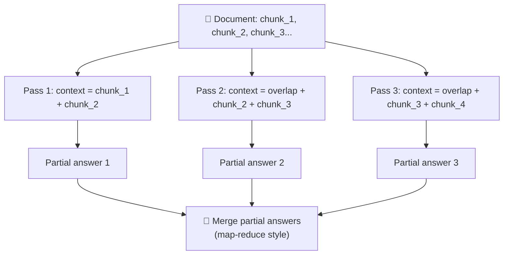
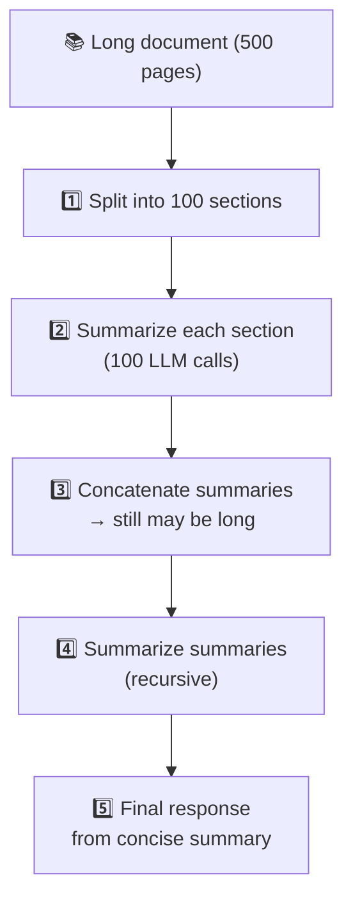

# Production Deployment

Running a model in production is an exercise in budgets: where each millisecond of latency goes, which caches remove work, how to handle inputs longer than the context window, what each request costs, and which metrics tell you the service is healthy.

```objectives
time: 45 min
outcomes:
  - Build a latency budget (queue, prefill, decode) and set SLOs for a use case
  - Use each caching layer - KV, prefix, semantic, batch - where it pays off
  - Handle inputs longer than the context window (RAG, sliding windows, summarisation, compression, RoPE scaling)
  - Estimate and reduce cost per request, and choose the metrics and alerts for a serving deployment
prerequisites:
  - "[Streaming & TTFT](05-Streaming-and-TTFT.mdx)"
```


## Serving Engines and Batching

This note is the production view - latency budgets, caching, context-window workarounds, cost and monitoring. The engine-level mechanics each have one home in this module:

- **Serving engines compared** (vLLM, SGLang, TensorRT-LLM and others) → [vLLM & Paged Attention](02-vLLM-and-Paged-Attention.mdx#serving-framework-comparison)
- **PagedAttention, prefix caching, continuous batching** → [KV Cache & Inference](01-KV-Cache-and-Inference-Optimization.mdx) (concepts) and [vLLM & Paged Attention](02-vLLM-and-Paged-Attention.mdx) (how vLLM implements them)
- **Batch size vs concurrency, capacity planning** → [Batching, Concurrency & Latency](04-Batching-Concurrency-and-Latency.mdx)
- **Disaggregated prefill/decode, KV-aware routing, FP8/FP4, speculative decoding in practice, MoE serving** → [The Modern Serving Stack](07-Modern-Serving-Stack.mdx)

---

## Latency Budget

### Concept

Understanding where latency comes from lets you optimize the right bottleneck.

**Latency components:**
```
Total latency = Queue wait + Prefill time + (N_output_tokens × per-token decode time)

Time-to-First-Token (TTFT) = Queue wait + Prefill time
Tokens-per-second (TPS)    = 1 / per-token-decode-time
```

**Prefill time** (processing input prompt):
- Scales with prompt length
- All input tokens are processed in parallel (like training)
- Bottleneck: compute (matrix multiplications for all tokens simultaneously)
- Rough cost: ~2 × params FLOPs per token, so 10K tokens on a 7B model is ~1.4 × 10^14 FLOPs - roughly 0.5-1 s on one A100 at realistic utilization, and ~10× longer for a 70B model

**Decode time** (generating each output token):
- Each token requires one full forward pass through the model
- Must read the entire KV cache for all past tokens
- Bottleneck: memory bandwidth (reading KV cache from HBM)
- Floor: every decode step reads all the weights - 14 GB for a 7B model in BF16 - so at ~2 TB/s an A100 needs at least ~7 ms per step; real single-request latencies are typically ~10-30 ms per token (roughly 30-100 tokens/s), and rise with batch size

**Queue time:**
- If all GPU capacity is occupied with other requests, your request waits
- Manageable with horizontal scaling and load balancing

**SLO targets (typical):**
- User-facing chat: TTFT < 500ms, TPS > 15 tokens/second (below this feels slow)
- Batch processing: throughput matters, latency is secondary
- Streaming: TTFT is paramount - users see first token immediately

---

## Caching Hierarchy

### Concept

Multiple layers of caching are possible in LLM serving, each with different trade-offs.

**Level 1 - KV Cache (per-request, in-GPU):**
- Stores computed K/V for all tokens in the active sequence
- Eliminated by sequence completion; re-created per request
- Critical for decode speed (see [KV Cache](01-KV-Cache-and-Inference-Optimization.mdx))

**Level 2 - Prefix Cache (across requests, in-GPU):**
- Reuses KV cache blocks for shared prompt prefixes across requests
- High ROI for system prompts (often 500–2000 tokens, shared across all users)
- vLLM automatic prefix caching: compute prefix KV once, share blocks across requests
- Savings: a 1000-token system prompt with 1000 requests/minute = 1M prefill tokens/min saved

**Level 3 - Semantic Cache (across requests, external):**
- Cache full responses for semantically similar (or identical) queries
- Tools: GPTCache, Redis with embedding similarity search
- Works for FAQ-style applications where many users ask near-identical questions
- Does NOT help for unique/dynamic queries

**Level 4 - Batch API (offline):**
- For non-real-time workloads, queue requests to be processed at off-peak hours
- 50% cost reduction in OpenAI Batch API
- Latency: hours, but acceptable for document processing, bulk analysis

---

## Token Window Workarounds

### Concept

When documents or conversations exceed the context window, several strategies exist beyond simply refusing to process them.

**Strategy 1: Sliding Window with Overlap**


**Strategy 2: Hierarchical Summarization**


Suitable for: document QA, long-form summarization, book analysis.

**Strategy 3: RAG (Retrieval-Augmented Generation)**
Instead of loading the entire document, retrieve only relevant passages (see [RAG section](../../11-RAG/Notes/01-RAG-Fundamentals.mdx)). This sidesteps the context window entirely for most questions.

**Strategy 4: Context Compression**
- Use a smaller, faster model to compress/summarize less-relevant context
- LLMLingua, AutoCompressor: compress prompt by 3–20× with minimal information loss
- Selective context: use a classifier to identify irrelevant sentences and drop them

**Strategy 5: Extended Context Models / RoPE Scaling**

For models trained with RoPE positional encoding, you can extend the context window beyond training length by scaling the RoPE frequencies:

```
Position Interpolation (Chen et al., 2023):
  Divide positions by a scale factor so long sequences map into the trained range

NTK-aware / base-frequency (ABF) scaling:
  Increase the RoPE base (theta) so low frequencies stretch while high frequencies stay sharp

YaRN (Peng et al., 2023):
  Interpolate each RoPE frequency band differently (high-frequency dims untouched,
  low-frequency dims interpolated) + an attention temperature correction.
  Needs only a short fine-tune on long sequences; used by e.g. Qwen2.5/Qwen3 long-context variants

Llama 3.1 (128K): its own "llama3" RoPE frequency scaling + a staged
  long-context continued-pretraining phase - not YaRN
  
LongLoRA: 
  Fine-tune with sparse attention (shift-short-attention) on longer sequences
  Enables cheap context extension via fine-tuning
```

**Trade-offs:**

| Approach | Latency | Quality | Cost | When to use |
|----------|---------|---------|------|-------------|
| Sliding window | Medium | Good (if overlap right) | Medium | Sequential document processing |
| Hierarchical summarization | High | Lossy (compression artifacts) | High | Very long documents |
| RAG | Low | High (relevant context) | Low | Knowledge-base queries |
| Context compression | Low-medium | Good | Low | Short on context budget |
| Extended context model | Medium-high | Best | Hardware | When exact retrieval matters |

---

## Latency Optimization Tricks

### Concept

A comprehensive list of techniques to reduce perceived and actual latency:

**1. Quantization (up to ~2-3× decode throughput)**
```
BF16 → FP8 (W8A8, Hopper/Blackwell): the first choice on current GPUs - small quality loss, faster decode
BF16 → INT8 weight-only: up to ~1.5-2× faster decode (half the bytes to read)
BF16 → INT4 / FP4 weight-only: up to ~2-3× faster decode at small batch
Quality: task-dependent - re-evaluate on your own set, especially for code, maths and structured output
```
Details and methods: [Quantized Inference](03-Quantized-Inference.mdx).

**2. Speculative Decoding (2–3× decode speedup)**
- Use a small draft model (1B) to propose K tokens
- Verify with large model in one batch pass
- Most effective for predictable/repetitive output (structured, code)
- See [KV Cache file](01-KV-Cache-and-Inference-Optimization.mdx) for details

**3. Prompt Caching / Prefix Sharing**
- Cache system prompt KV: saves reprocessing 1000-token system prompts per request
- Anthropic, OpenAI, and vLLM all support this
- Savings: ~90% TTFT reduction for requests where prefix is 90% of the prompt

**4. Streaming Responses**
- Return the first token as soon as it's generated - don't wait for the full response
- Reduces *perceived* latency even though total time is the same
- Implementation: Server-Sent Events (SSE) or WebSocket

**5. Smaller Models for Routing/Triage**
- Classify request complexity with a cheap small model (1B)
- Route simple requests to a small model (7B), complex requests to large model (70B)
- Cascade: try small model first → if low confidence → retry with large model

**6. Flash Attention 2/3**
- Replace standard attention with Flash Attention kernel
- 2–4× faster for long sequences with no quality change

**7. Continuous Batching**
- Already discussed - essential for production throughput

**8. Tensor Parallelism Tuning**
- Splitting a model across GPUs lowers per-token latency sub-linearly - each layer adds all-reduces, so the gain depends on model size and interconnect (NVLink vs PCIe)
- Small models (≤ 8B) rarely benefit beyond 2 GPUs; prefer replicas for throughput
- Measure latency and throughput at your batch sizes before choosing a TP degree

**9. CUDA Graphs (static shapes)**
- Capture the computation graph for fixed-size batches
- Replay the same graph without Python overhead
- Significant benefit for small batch sizes where CPU overhead is a bottleneck

---

## Cost Optimization

### Concept

At scale, LLM inference cost is significant. Key levers:

**1. Prompt caching ROI:**
```
Without caching:
  1M requests × 1000 token system prompt × $0.01/1K tokens = $10,000/day

With 90% cache hit rate:
  100K uncached × $0.01 + 900K cached × $0.001 = $1,900/day  (81% savings)
```

**2. Smaller models for simple tasks:**
- Classify request complexity → route to appropriate model tier
- 80% of requests may be satisfiable by a 7B model; 20% need 70B
- Cost of 7B vs 70B inference: roughly 8–10× difference in throughput/GPU

**3. Batch API for offline workloads:**
- Background document processing, embedding generation, bulk classification
- OpenAI batch API: 50% discount for 24-hour turnaround
- Self-hosted: run batch jobs during off-peak hours to maximize GPU utilization

**4. Quantization:**
- INT4 inference: ~2–4× higher throughput per GPU → fewer GPUs needed
- Quality: FP8 is usually near-lossless; 4-bit is task-dependent - gate every quantized deployment on your evaluation set

**5. Output length control:**
- `max_new_tokens`: set tight bounds to prevent runaway generation
- Structured output: constrain output to JSON/specific format → predictable shorter outputs

---

## Monitoring and Observability

### Concept

Key metrics to track in production LLM serving:

**Latency metrics:**
- `TTFT p50/p95/p99`: time-to-first-token distribution
- `TPS p50/p95`: tokens per second for decode phase
- `E2E latency p99`: total time from request to response

**Throughput metrics:**
- `tokens_per_second_total`: aggregate throughput across all requests
- `requests_per_second`: request rate
- `queue_depth`: number of waiting requests (early warning for capacity issues)

**Quality metrics:**
- `context_length_distribution`: are requests using more context over time?
- `generation_length_distribution`: output getting longer? (cost signal)
- `cache_hit_rate`: prefix cache effectiveness

**GPU metrics:**
- `gpu_utilization`: coarse (nvidia-smi counts a GPU as busy if any kernel is running); prefer throughput, batch occupancy and KV-cache utilization as capacity signals
- `gpu_memory_used`: approaching limit → reduce batch size or add GPUs
- `kv_cache_utilization`: paged attention's block utilization

**Tools:**
- vLLM metrics endpoint: Prometheus-compatible `/metrics`
- OpenTelemetry traces for distributed LLM pipelines
- LangSmith / Langfuse for LLM-specific observability (prompt versions, output quality)

### Code

```python
# vLLM server setup and basic usage
# pip install vllm

# Start server (command line):
# vllm serve meta-llama/Llama-3.2-1B-Instruct \
#   --tensor-parallel-size 1 \
#   --max-model-len 8192 \
#   --port 8000
# (Prefix caching is on by default in vLLM V1; quantized checkpoints are detected from their config)

# Client usage (OpenAI-compatible):
from openai import OpenAI
import time

client = OpenAI(base_url="http://localhost:8000/v1", api_key="placeholder")

# Standard chat completion
def chat_with_timing(messages, model="meta-llama/Llama-3.2-1B-Instruct"):
    start = time.time()
    first_token_time = None
    full_response = ""
    
    # Streaming to measure TTFT
    stream = client.chat.completions.create(
        model=model,
        messages=messages,
        max_tokens=200,
        stream=True,
        temperature=0.7,
    )
    
    for chunk in stream:
        if chunk.choices[0].delta.content:
            if first_token_time is None:
                first_token_time = time.time()
            full_response += chunk.choices[0].delta.content
    
    end = time.time()
    total_tokens = len(full_response.split())  # approximate
    
    print(f"TTFT: {(first_token_time - start)*1000:.0f}ms")
    print(f"Total time: {(end - start)*1000:.0f}ms")
    print(f"TPS (approx): {total_tokens / (end - first_token_time):.1f} tok/s")
    return full_response

result = chat_with_timing([
    {"role": "system", "content": "You are a helpful assistant."},
    {"role": "user", "content": "Explain transformers in 3 sentences."}
])

# Prefix caching benefit measurement
SYSTEM_PROMPT = "You are a helpful AI assistant specialized in machine learning. " * 50  # ~200 tokens

# First request: cache miss (slower)
t0 = time.time()
r1 = client.chat.completions.create(
    model="meta-llama/Llama-3.2-1B-Instruct",
    messages=[
        {"role": "system", "content": SYSTEM_PROMPT},
        {"role": "user", "content": "What is attention?"}
    ],
    max_tokens=100
)
print(f"First request (cache miss): {(time.time()-t0)*1000:.0f}ms")

# Second request: cache hit (faster prefill)
t0 = time.time()
r2 = client.chat.completions.create(
    model="meta-llama/Llama-3.2-1B-Instruct",
    messages=[
        {"role": "system", "content": SYSTEM_PROMPT},  # same prefix
        {"role": "user", "content": "What is a transformer?"}
    ],
    max_tokens=100
)
print(f"Second request (cache hit): {(time.time()-t0)*1000:.0f}ms")
# Should be significantly faster due to prefix caching
```

---

## Study Notes

**Must-know for interviews:**
- vLLM is the dominant open-source serving framework: Paged Attention + continuous batching + OpenAI-compatible API
- Latency has two components: TTFT (prefill, compute-bound) and TPS (decode, memory-bandwidth-bound)
- Prefix caching eliminates reprocessing shared system prompts - very high ROI for chatbots
- Speculative decoding: small draft model proposes tokens → large model verifies in one pass → 2–3× speedup
- Token window workarounds: sliding window, hierarchical summarization, RAG, LLMLingua compression, RoPE scaling
- Cost levers: prompt caching, model routing, quantization, batch APIs, output-length control - their order depends on the workload, so measure

## Check Yourself

```quiz
- q: "A 1,000-token system prompt is shared by every request. Which cache removes most of its cost?"
  options: ["Prefix (prompt) caching", "Semantic caching", "The per-request KV cache", "A CDN"]
  answer: 1
- q: "Which metric is the better early warning of running out of serving capacity?"
  options: ["Queue depth / waiting requests", "nvidia-smi GPU utilization", "Average output length", "Number of models loaded"]
  answer: 1
- q: "What is TTFT and what determines it?"
  answer: "Time-to-first-token = queue wait + prefill compute time. Determined by input prompt length and server load."
- q: "Why is continuous batching better than static batching?"
  answer: "Completed sequences are evicted immediately and new requests fill their slots - no wasted GPU capacity waiting for stragglers."
- q: "What is chunked prefill?"
  answer: "Processing long prompts in chunks to avoid monopolizing the GPU during prefill, which would delay decode steps for other in-flight requests."
- q: "When should you use RAG vs sliding window?"
  answer: "RAG when you can identify relevant content via search. Sliding window when you must process a document sequentially without a query."
- q: "Name 3 ways to improve TTFT."
  answer: "Prefix caching (eliminate redundant prefill), quantization (faster compute), reduce prompt length (LLMLingua compression)."
```

## Exercises

```exercise
- title: "Cost per request"
  task: |
    A chat product serves 2M requests a day with 1,500 input tokens (1,000 of them a shared system prompt) and 300 output tokens. At $3 per million input tokens, $15 per million output tokens and cache reads at 10% of the input price, compute the daily cost with and without prompt caching (ignore cache writes).
  solution: |
    Without caching: input 2M × 1,500 = 3B tokens → $9,000; output 2M × 300 = 600M tokens → $9,000; total $18,000/day. With caching the 1,000 shared tokens are read at $0.30/M: 2B × $0.30/M = $600 plus 1B uncached × $3/M = $3,000, so input is $3,600 and the total $12,600/day - a 30% saving, limited by output cost.
```

## References

- Kwon et al., [PagedAttention (vLLM)](https://arxiv.org/abs/2309.06180) (2023)
- Jiang et al., [LLMLingua](https://arxiv.org/abs/2310.05736) (2023)
- Chen et al., [Extending Context Window via Positional Interpolation](https://arxiv.org/abs/2306.15595) (2023); Peng et al., [YaRN](https://arxiv.org/abs/2309.00071) (2023)
- vLLM project, [vLLM documentation](https://docs.vllm.ai/) (2026) - production metrics

*Last reviewed: 2026-09*
