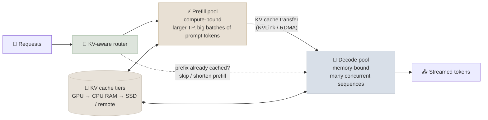

# The Modern Serving Stack

The earlier notes cover a single serving engine on one GPU or one server: PagedAttention, continuous batching, quantization, streaming. Serving at scale in 2025-2026 adds a layer above the engine - splitting prefill and decode onto different GPUs, routing requests to where their KV cache already lives, spreading mixture-of-experts models across many GPUs - plus newer precision formats and speculative decoding that actually ships. This note maps that stack.

```objectives
time: 60 min
outcomes:
  - Define TTFT, TPOT/ITL, throughput and goodput, and set SLOs in those terms
  - Explain chunked prefill and prefill/decode disaggregation, and when disaggregation pays off
  - Explain KV-cache-aware routing and KV offloading, and why they matter for multi-turn and agent traffic
  - Choose a precision (BF16, FP8, FP4) and KV-cache dtype for a deployment
  - Describe how speculative decoding (EAGLE-style draft heads, MTP, n-gram) and multi-LoRA serving are used in practice
  - Explain how large MoE models are served with expert parallelism
prerequisites:
  - "[KV Cache & Inference](01-KV-Cache-and-Inference-Optimization.mdx)"
  - "[vLLM & Paged Attention](02-vLLM-and-Paged-Attention.mdx)"
  - "[Accelerators & Interconnects](../../03-Pretraining/Notes/07-Accelerators-and-Interconnects.mdx) - roofline, FP8/FP4, NVLink domains"
```

## Metrics That Define an SLO

| Metric | Definition | What drives it |
|--------|------------|----------------|
| **TTFT** (time to first token) | Request arrival → first output token | Queueing + prefill of the prompt (compute-bound) |
| **TPOT / ITL** (time per output token / inter-token latency) | Average gap between output tokens | Decode step time (memory-bandwidth-bound) and batch size |
| **E2E latency** | TTFT + TPOT × (output tokens - 1) | Both |
| **Throughput** | Output tokens/s across all requests | Batch size, hardware, precision |
| **Goodput** | Requests/s completed **within** the SLO (e.g. TTFT < 600 ms and TPOT < 40 ms at p99) | The balance of all of the above |

Throughput alone is misleading: a system can maximize tokens/s by batching aggressively while blowing through latency targets. **Goodput** (from the DistServe paper) is the number to optimize.

**Worked example:** with a 40 ms TPOT, a 500-token answer takes 20 s of decode after the first token - which is why streaming matters for chat, and why TPOT, not TTFT, dominates long-output workloads.

---

## Prefill vs Decode: Chunking and Disaggregation

### Concept

Prefill (process the whole prompt at once) is **compute-bound**; decode (one token per sequence per step) is **memory-bound**. Running both on the same GPU causes interference: a long prefill stalls every in-flight decode, spiking ITL.

Two fixes:

- **Chunked prefill** (Sarathi-Serve): split long prefills into chunks and mix them with decode steps under a per-step token budget (vLLM's `max_num_batched_tokens`). Smooths ITL at a small TTFT cost. On by default in current engines.
- **Prefill/decode (P/D) disaggregation** (DistServe, Splitwise, Mooncake): run prefill and decode on **separate GPU pools**, then transfer the KV cache from prefill to decode workers. Each pool is sized and parallelized for its own bottleneck, and neither interferes with the other.



**When disaggregation pays off:** long prompts, strict ITL targets, and enough scale to run two pools. The cost is the KV transfer: an 8K-token prompt on a 70B GQA model is about 2.7 GB of KV cache - roughly 50 ms over a 400 Gb/s network link, or a few milliseconds over NVLink. For short prompts and small deployments, chunked prefill on unified workers is usually simpler and just as good.

---

## KV-Cache-Aware Routing and Offloading

Agentic and multi-turn traffic resends a long, mostly unchanged prefix every turn (system prompt, tool definitions, conversation history). If each turn lands on a random replica, every turn recomputes that prefix.

- **KV-cache-aware routing** sends a request to the replica that already holds the longest matching prefix, turning prefill into a cache hit. It is a core feature of NVIDIA Dynamo's router, llm-d's scheduler (built on the Kubernetes Gateway API Inference Extension) and SGLang's router.
- **KV offloading** extends the cache beyond GPU memory - to CPU RAM, local SSD or a shared store - so evicted prefixes can be reloaded instead of recomputed (LMCache, Dynamo's KV block manager, Mooncake's KV-centric design).
- **Provider prompt caching** is the API-side version of the same idea: cached input tokens are billed at a fraction of the normal price (see [Prompt & Context Engineering](../../10-Prompt-Engineering/INDEX.mdx)).

---

## Precision for Serving

| Choice | Memory vs BF16 | Typical quality impact | Hardware |
|--------|----------------|------------------------|----------|
| BF16 weights | 1× | Baseline | Any modern GPU |
| **FP8 weights + activations (W8A8)** | ~0.5× | Usually negligible on large models | Hopper (H100/H200) and newer |
| INT4 weight-only (AWQ, GPTQ) | ~0.25-0.3× | Small; larger on small models and on math/code | Broad; good for memory-bound decode |
| **FP4 (NVFP4, MXFP4)** | ~0.25-0.3× | Small with good calibration and block scaling | Blackwell (native); gpt-oss ships MXFP4 experts |
| **FP8 KV cache** | KV cache ~0.5× | Usually small; check long-context tasks | Hopper and newer |

FP8 has become the default "safe" serving quantization on H100-class GPUs: vLLM can quantize weights to FP8 on the fly (`--quantization fp8`) or load pre-quantized checkpoints, and `--kv-cache-dtype fp8` halves the KV cache. Offline quantization for serving has consolidated around **llm-compressor** (AWQ, GPTQ, FP8, NVFP4 recipes producing checkpoints vLLM loads directly). Details in [Quantized Inference](03-Quantized-Inference.mdx).

---

## Speculative Decoding in Practice

Decode is memory-bound, so verifying several proposed tokens in one forward pass costs little more than generating one. Production options:

| Method | Drafter | Notes |
|--------|---------|-------|
| **EAGLE (1/2/3)** | A small head trained on the target model's hidden states | High acceptance rates; supported by vLLM, SGLang and TensorRT-LLM; pre-trained EAGLE heads exist for popular models |
| **MTP heads** | Multi-token-prediction modules trained with the model (DeepSeek-V3) | "Free" drafter - no separate training |
| **n-gram / prompt lookup** | Copies spans from the prompt | No model at all; great for editing, RAG and code where output repeats input |
| **Draft model** | A smaller model of the same family | Simple; needs a compatible tokenizer |

Gains are largest at low batch sizes (latency-bound serving) and shrink as the batch grows and the GPU becomes compute-bound. Measure TPOT at your real concurrency before and after enabling it.

---

## Serving Mixture-of-Experts Models

A large MoE (DeepSeek-V3, Kimi K2, Qwen3-235B) has hundreds of experts but activates only a few per token. Serving it well means:

- **Expert parallelism (EP):** spread experts across many GPUs; each token is dispatched (all-to-all) to the GPUs holding its experts and the results combined. Libraries such as DeepSeek's DeepEP optimize this communication.
- **Wide EP + data-parallel attention:** attention runs data-parallel on each GPU while experts are sharded across a large EP group - the layout SGLang and vLLM use for DeepSeek-style models across dozens of GPUs, often combined with P/D disaggregation.
- **Big NVLink domains help:** rack-scale domains such as GB200 NVL72 keep the all-to-all on NVLink instead of the network.
- **Load balancing:** hot experts overload their GPUs; engines replicate popular experts (redundant experts) to spread load.

---

## Multi-LoRA Serving

One base model, many fine-tuned adapters (per customer or per task): **multi-LoRA serving** keeps the base weights once in GPU memory and batches requests for different adapters together, applying each request's LoRA delta with specialized kernels (S-LoRA, Punica). In vLLM: start with `--enable-lora` and pass the adapter per request. It turns "one GPU per fine-tune" into "hundreds of fine-tunes per GPU".

---

## The Orchestration Layer

| Project | What it adds on top of engines |
|---------|--------------------------------|
| **NVIDIA Dynamo** | Disaggregated serving, KV-aware router, KV block manager across memory tiers, NIXL for fast KV transfer; runs vLLM, SGLang or TensorRT-LLM workers |
| **llm-d** | Kubernetes-native distributed vLLM: KV-cache-aware scheduling via the Gateway API Inference Extension, P/D disaggregation, wide EP |
| **SGLang router / PD mode** | Cache-aware routing and prefill-decode disaggregation within the SGLang ecosystem |
| **KServe, Ray Serve** | General model-serving control planes (autoscaling, rollout) that host LLM engines - see [Production Engineering](../../08-Production-Engineering/INDEX.mdx) |

---

## Check Yourself

```quiz
- q: "A chat service must keep p99 inter-token latency under 50 ms, but long RAG prompts cause ITL spikes when their prefill runs. What is the first thing to try on a single-pool deployment?"
  options:
    - "Chunked prefill with a per-step token budget"
    - "Disable continuous batching"
    - "Switch from FP8 to BF16"
    - "Increase max_model_len"
  answer: 1
  explain: "Chunked prefill interleaves prompt chunks with decode steps so one long prefill no longer stalls every decoding sequence. Disaggregation is the next step if that isn't enough."
- q: "Why does KV-cache-aware routing matter most for agent workloads?"
  options:
    - "Each agent turn resends a long, mostly identical prefix; routing to the replica holding it turns prefill into a cache hit"
    - "Agents generate longer outputs than chat"
    - "Agents cannot use continuous batching"
    - "Agent requests are always shorter"
  answer: 1
- q: "Speculative decoding speeds up TPOT a lot at batch size 1 but barely at batch size 64. Why?"
  answer: "Speculation exploits spare compute in memory-bound decode. At small batches the GPU is idle waiting on memory, so verifying extra draft tokens is almost free; at large batches decode is closer to compute-bound, so the extra verification work competes with useful work."
- q: "What does goodput measure that throughput doesn't?"
  options:
    - "Requests completed within their latency SLOs, rather than raw tokens per second"
    - "Tokens per dollar"
    - "GPU memory utilization"
    - "The number of cache hits"
  answer: 1
```

## Exercises

```exercise
- title: Size a disaggregated deployment
  task: |
    Traffic: 20 requests/s, prompts average 6K tokens, outputs average 300 tokens. SLO: TTFT p99 < 1.5 s, TPOT p99 < 40 ms. You measure that one prefill GPU (TP=1) processes about 30K prompt tokens/s at acceptable latency, and one decode GPU sustains about 60 concurrent sequences within the TPOT target.

    1. How many prefill GPUs do you need for the average load, before headroom?
    2. Roughly how many sequences are decoding concurrently at steady state (Little's law), and how many decode GPUs does that imply?
    3. What headroom would you add, and why?
  solution: |
    1. Prompt tokens/s = 20 × 6,000 = 120,000 → 120,000 / 30,000 = 4 prefill GPUs at average load.
    2. Each request decodes for about 300 × 40 ms = 12 s, so concurrency ≈ 20 req/s × 12 s = 240 sequences → 240 / 60 = 4 decode GPUs.
    3. Plan for peak rather than average (often 2-3× the mean) and for p99 rather than mean latency - e.g. 50-100% extra, with autoscaling on queue depth. Validate with a load test before committing.
- title: FP8 on your lab server
  task: |
    Run the [FastAPI + vLLM lab](../CodeLabs/01-FastAPI-vLLM-Endpoint.mdx) on an H100-class GPU with and without `--quantization fp8 --kv-cache-dtype fp8`. Using `load_test.py` at 1, 16 and 64 concurrent users, report TTFT, tokens/s and max stable concurrency, then spot-check 20 outputs for quality differences.
```

## Study Notes

**Must-know:**
- SLO metrics: TTFT (prefill + queue), TPOT/ITL (decode), E2E, throughput, and goodput (requests/s within SLO)
- Prefill is compute-bound, decode memory-bound; chunked prefill smooths ITL; P/D disaggregation separates them into pools at the cost of KV transfer
- KV-aware routing + KV offloading turn repeated prefixes (agents, multi-turn) into cache hits; provider prompt caching is the API equivalent
- FP8 W8A8 is the default safe serving precision on Hopper; FP4 (NVFP4/MXFP4) on Blackwell; FP8 KV cache halves cache memory; llm-compressor produces vLLM-ready checkpoints
- Speculative decoding (EAGLE, MTP, n-gram) helps most at low batch sizes
- Large MoE serving: expert parallelism with all-to-all, DP attention, redundant experts, big NVLink domains
- Multi-LoRA serving batches many adapters over one base model
- Orchestration: Dynamo, llm-d, SGLang router add disaggregation and cache-aware routing over engines

## References

- Zhong et al., [DistServe: Disaggregating Prefill and Decoding for Goodput-optimized LLM Serving](https://arxiv.org/abs/2401.09670) (2024)
- Patel et al., [Splitwise](https://arxiv.org/abs/2311.18677) (2023); Qin et al., [Mooncake: A KVCache-centric Disaggregated Architecture](https://arxiv.org/abs/2407.00079) (2024)
- Agrawal et al., [Taming Throughput-Latency Tradeoff in LLM Inference with Sarathi-Serve](https://arxiv.org/abs/2403.02310) (2024) - chunked prefill
- Kwon et al., [PagedAttention / vLLM](https://arxiv.org/abs/2309.06180) (2023); Zheng et al., [SGLang (RadixAttention)](https://arxiv.org/abs/2312.07104) (2023)
- Li et al., [EAGLE-3](https://arxiv.org/abs/2503.01840) (2025); Leviathan et al., [Fast Inference via Speculative Decoding](https://arxiv.org/abs/2211.17192) (2022)
- Sheng et al., [S-LoRA](https://arxiv.org/abs/2311.03285) (2023)
- DeepSeek-AI, [DeepSeek-V3 Technical Report](https://arxiv.org/abs/2412.19437) (2024) - MTP, deployment with expert parallelism
- Project docs: [vLLM](https://docs.vllm.ai/), [SGLang](https://docs.sglang.ai/), [NVIDIA Dynamo](https://github.com/ai-dynamo/dynamo), [llm-d](https://llm-d.ai/), [LMCache](https://github.com/LMCache/LMCache), [llm-compressor](https://github.com/vllm-project/llm-compressor)

*Last reviewed: 2026-09*
