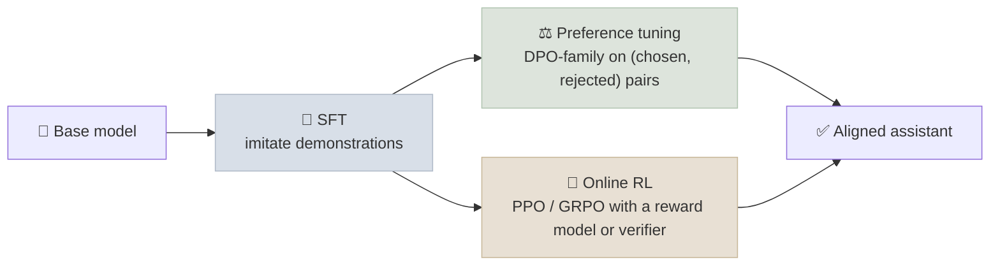

# Preference Optimization

Supervised fine-tuning teaches a model to imitate good answers. Preference optimization teaches it to prefer better answers over worse ones - which is easier to collect data for (people and models are better at comparing than at writing ideal responses) and closer to what we actually want. This note covers reward models, DPO and its descendants, and how to choose among them.

```objectives
time: 50 min
outcomes:
  - Explain the Bradley-Terry preference model and how a reward model is trained
  - Derive the DPO objective's intuition from the RLHF objective, and explain the role of β and the reference model
  - Compare DPO, IPO, KTO, SimPO and ORPO by data requirements, reference-model needs and failure modes
  - Choose between offline preference tuning and online RL for a given goal
prerequisites:
  - "[Fine-Tuning & Alignment](01-Fine-Tuning-and-Alignment.mdx) - SFT, RLHF overview, LoRA"
```

## Where Preference Tuning Sits



A **preference dataset** holds triples `(prompt x, chosen y_w, rejected y_l)`. Sources: human raters comparing two samples, an LLM judge (RLAIF), or verifiable signals (the answer that passed the tests is "chosen").

---

## Reward Models and Bradley-Terry

The **Bradley-Terry** model says the probability a rater prefers `y_w` over `y_l` depends only on the difference of their scalar rewards:

```
P(y_w ≻ y_l | x) = σ( r(x, y_w) - r(x, y_l) )
Reward-model loss = -log σ( r(x, y_w) - r(x, y_l) )
```

A reward model is usually the SFT model with its LM head replaced by a scalar head, trained with this loss. It is then used either as the reward signal for online RL (next note) or to rank samples for rejection sampling.

**Known weaknesses:** reward models reward length and confident tone, are exploitable by the policy they score ("reward hacking"), and drift out of distribution as the policy improves.

---

## Direct Preference Optimization (DPO)

Classic RLHF maximizes reward while staying close to a reference policy:

```
max over π:  E[ r(x, y) ] - β · KL( π(·|x) || π_ref(·|x) )
```

That objective has a closed-form optimum, `π*(y|x) ∝ π_ref(y|x) · exp(r(x, y) / β)`. Rafailov et al. (2023) inverted it: the reward is implied by the policy, `r(x, y) = β · log(π(y|x) / π_ref(y|x)) + const`. Substituting into the Bradley-Terry loss removes the reward model entirely:

```
L_DPO = -log σ( β · [ log π_θ(y_w|x)/π_ref(y_w|x)  -  log π_θ(y_l|x)/π_ref(y_l|x) ] )
```

In words: increase the log-probability margin of the chosen response over the rejected one, **measured relative to the reference model**.

- **β** sets how far the policy may move from the reference: small β allows large moves (more reward, more risk of degrading), large β keeps it close. Typical values are 0.01-0.5.
- **π_ref** is a frozen copy of the SFT model. It costs memory (a second model), but it is what keeps the update anchored.

**Why DPO won adoption:** one supervised-style training stage, no reward model, no sampling during training, stable. Llama 3 used SFT + rejection sampling + DPO rather than PPO.

**Its limits:** it is **offline** - it only learns from the fixed pairs - so it cannot discover responses better than those in the data, and it degrades when the data comes from a very different model than the one being trained. It can also lower the likelihood of *both* chosen and rejected responses, and it tends to lengthen outputs.

---

## The DPO Family

| Method | What it changes | Needs π_ref? | Data | When to consider |
|--------|-----------------|--------------|------|------------------|
| **DPO** (2023) | Baseline: log-ratio margin, sigmoid loss | Yes | Pairs | Default starting point |
| **IPO** (2023) | Squared loss toward a target margin instead of sigmoid | Yes | Pairs | Near-deterministic preferences where DPO overfits |
| **KTO** (2024) | Prospect-theory loss on single responses labelled good or bad | Yes | **Unpaired** thumbs-up / thumbs-down | You have product feedback, not pairs |
| **SimPO** (2024) | Reward = **length-normalized** average log-prob; adds a target margin γ | **No** | Pairs | Save memory; counter length exploitation |
| **ORPO** (2024) | Adds an odds-ratio preference penalty to the SFT loss - one stage | **No** | Pairs (with chosen used as SFT target) | Fold SFT and preference tuning into one run |
| **Iterative / online DPO** | Regenerate pairs from the current policy each round and re-label | Yes | Fresh pairs per round | Closes much of the gap to online RL |

---

## Offline Preference Tuning vs Online RL

| | Offline (DPO family) | Online RL (PPO, GRPO) |
|---|---|---|
| Training data | Fixed pairs collected beforehand | Fresh samples from the current policy |
| Needs | Pairs; a reference model (usually) | A reward model or programmatic verifier, and rollout generation |
| Cost | Close to SFT | Much higher - generation dominates |
| Discovers new behaviour? | Limited to what is in the data | Yes - can find strategies no dataset contained |
| Best for | Style, tone, helpfulness, safety refusals, formatting | Reasoning, math, code, agentic tasks with checkable outcomes |

The 2025 pattern: preference tuning for chat quality and behaviour, **online RL with verifiable rewards** for reasoning (see [Reinforcement Learning for LLMs](03-RL-for-LLMs.mdx)).

---

## Check Yourself

```quiz
- q: "In the DPO loss, what does the reference model π_ref provide?"
  options:
    - "An anchor: the chosen/rejected margin is measured relative to it, which keeps the policy from drifting arbitrarily"
    - "The reward score for each response"
    - "Fresh samples during training"
    - "The target for supervised fine-tuning"
  answer: 1
- q: "You have 200,000 thumbs-up/thumbs-down ratings on single responses but no side-by-side pairs. Which method fits the data?"
  options:
    - "KTO"
    - "DPO"
    - "IPO"
    - "SimPO"
  answer: 1
  explain: "KTO works on unpaired binary labels. DPO, IPO and SimPO all need (chosen, rejected) pairs for the same prompt."
- q: "Raising DPO's β from 0.05 to 0.5 mostly does what?"
  options:
    - "Keeps the trained policy closer to the reference model"
    - "Lets the policy move further from the reference"
    - "Removes the need for a reference model"
    - "Changes the loss from sigmoid to squared"
  answer: 1
- q: "Why can't DPO alone produce a strong reasoning model the way GRPO-style RL did?"
  answer: "DPO is offline: it learns only from the fixed preference pairs, so it cannot explore or discover solution strategies beyond those in the data. Reasoning gains came from online RL, where the model generates many fresh attempts and is rewarded for the ones a verifier marks correct."
```

## Exercises

```exercise
- title: Implement the DPO loss
  task: |
    Write `dpo_loss(policy_chosen_logps, policy_rejected_logps, ref_chosen_logps, ref_rejected_logps, beta)` in PyTorch, where each argument is a tensor of summed log-probabilities per sequence. Also return the implicit rewards `beta * (policy - ref)` for chosen and rejected, and the "reward accuracy" (fraction where chosen > rejected). Test it on random tensors, then compare with TRL's `DPOTrainer` loss on a tiny model.
  solution: |
    ```python
    import torch.nn.functional as F

    def dpo_loss(pc, pr, rc, rr, beta=0.1):
        chosen_reward = beta * (pc - rc)
        rejected_reward = beta * (pr - rr)
        loss = -F.logsigmoid(chosen_reward - rejected_reward).mean()
        acc = (chosen_reward > rejected_reward).float().mean()
        return loss, chosen_reward.detach(), rejected_reward.detach(), acc
    ```
- title: Choose a method
  task: |
    For each case, pick a method and justify it: (a) make a support assistant's answers shorter and more polite, with 20K labelled pairs; (b) teach a model to solve competition math where answers can be checked; (c) you can only fit one copy of a 70B model in memory for training.
```

## Study Notes

**Must-know:**
- Bradley-Terry: P(chosen ≻ rejected) = σ(r_w - r_l); reward models are trained with -log σ of the margin
- DPO: reward implied by β·log(π/π_ref); loss = -log σ(β·[chosen log-ratio - rejected log-ratio]); offline, no reward model, needs π_ref
- IPO (squared loss), KTO (unpaired labels), SimPO (length-normalized, reference-free, margin γ), ORPO (odds-ratio term on SFT, reference-free)
- Offline preference tuning is cheap and good for style/behaviour; online RL is needed to discover new reasoning strategies

## References

- Christiano et al., [Deep RL from Human Preferences](https://arxiv.org/abs/1706.03741) (2017); Ouyang et al., [InstructGPT](https://arxiv.org/abs/2203.02155) (2022)
- Rafailov et al., [Direct Preference Optimization](https://arxiv.org/abs/2305.18290) (2023)
- Azar et al., [A General Theoretical Paradigm to Understand Learning from Human Preferences (IPO)](https://arxiv.org/abs/2310.12036) (2023)
- Ethayarajh et al., [KTO: Model Alignment as Prospect Theoretic Optimization](https://arxiv.org/abs/2402.01306) (2024)
- Meng et al., [SimPO: Simple Preference Optimization with a Reference-Free Reward](https://arxiv.org/abs/2405.14734) (2024)
- Hong et al., [ORPO: Monolithic Preference Optimization without Reference Model](https://arxiv.org/abs/2403.07691) (2024)
- Bai et al., [Constitutional AI: Harmlessness from AI Feedback](https://arxiv.org/abs/2212.08073) (2022) - RLAIF
- Llama Team, [The Llama 3 Herd of Models](https://arxiv.org/abs/2407.21783) (2024) - SFT + rejection sampling + DPO

*Last reviewed: 2026-09*
