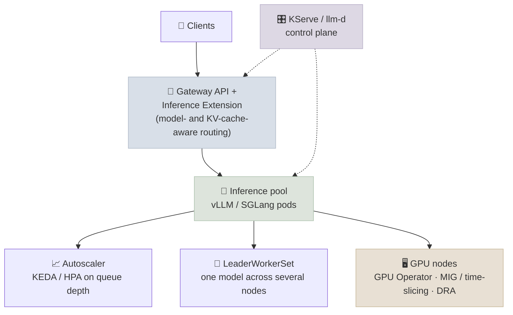

# LLM Serving on Kubernetes

[Kubernetes & Helm](02-Kubernetes-and-Helm.mdx) covers the core objects and GPU node pools. Running LLMs on Kubernetes at scale adds problems generic web services don't have: GPUs that must be shared or scheduled by attributes, models too big for one node, autoscaling that CPU metrics can't drive, and cold starts measured in minutes. This note maps the Kubernetes-native tools that address them.

```objectives
time: 50 min
outcomes:
  - Choose between whole-GPU allocation, MIG, time-slicing and DRA-based scheduling for a workload
  - Describe the serving layer options - KServe, LeaderWorkerSet for multi-node models, llm-d and the Gateway API Inference Extension
  - Design autoscaling on the right signal (queue depth, KV-cache usage) and explain why GPU utilization is a poor one
  - Estimate and reduce cold-start time for large models
prerequisites:
  - "[Kubernetes & Helm](02-Kubernetes-and-Helm.mdx)"
  - "[The Modern Serving Stack](../../07-Serving-and-Inference/Notes/07-Modern-Serving-Stack.mdx)"
```

## The Stack at a Glance



---

## GPUs as a Kubernetes Resource

### Getting GPUs onto nodes

The **NVIDIA GPU Operator** installs and manages everything a node needs - driver, container toolkit, device plugin, DCGM exporter for metrics, MIG manager - as Kubernetes-managed components, so GPU nodes are configured declaratively rather than by hand.

### Sharing and allocating GPUs

| Approach | How it works | Isolation | Use when |
|----------|--------------|-----------|----------|
| **Whole GPU** (`nvidia.com/gpu: 1`) | Device plugin hands out integer GPUs | Full | Most LLM serving - models need the whole GPU's memory |
| **MIG** (A100/H100 and newer) | Partition one GPU into up to 7 hardware-isolated instances with their own memory and compute | Hardware | Many small models (embeddings, rerankers, small LLMs) on one GPU |
| **Time-slicing** | Several pods share a GPU in turns | None - memory is shared, no fault isolation | Dev/test, bursty low-priority workloads |
| **DRA (Dynamic Resource Allocation)** | Pods request devices by attributes (memory size, model, interconnect) through `ResourceClaim`s; GA since Kubernetes 1.34 | Depends on driver | Heterogeneous fleets; requesting "an H100 with ≥ 80 GB" or topology-aware placement instead of an opaque count |

---

## The Serving Layer

| Project | What it does |
|---------|--------------|
| **KServe** | A model-serving control plane (CNCF): `InferenceService` resources with autoscaling, canary rollout and standard protocols; supports vLLM as the LLM runtime |
| **LeaderWorkerSet (LWS)** | Kubernetes API for a *group* of pods that together serve one replica - a leader plus workers across nodes - for models that need multi-node tensor/pipeline parallelism; scaled and restarted as a unit |
| **Gateway API Inference Extension** | Extends Kubernetes Gateway API with `InferencePool` and model-aware routing, so the gateway can pick a replica by queue length, KV-cache utilization or loaded LoRA adapter instead of round-robin |
| **llm-d** | A Kubernetes-native distributed-inference stack on vLLM: builds on the Inference Extension for KV-cache-aware scheduling, and adds prefill/decode disaggregation and wide expert parallelism |
| **NVIDIA Dynamo** | Distributed-inference framework with its own Kubernetes operator (see [The Modern Serving Stack](../../07-Serving-and-Inference/Notes/07-Modern-Serving-Stack.mdx)) |

**Why round-robin load balancing fails for LLMs:** requests differ by 100× in cost (a 50-token question vs a 100K-token document), and replicas differ in what they have cached. A replica with a hot prefix cache or a short queue is worth far more than "the next one in the list".

---

## Autoscaling on the Right Signal

GPU utilization is a poor scaling signal: a vLLM server batching aggressively reports near-100% utilization whether it has 5 or 500 requests waiting.

| Signal | Why it's useful |
|--------|-----------------|
| **Waiting requests** (`vllm:num_requests_waiting`) | Direct measure of queueing → TTFT risk |
| **KV-cache usage** (`vllm:kv_cache_usage_perc`) | Near 100% means preemptions and recomputation are coming |
| **TTFT / ITL p95** (`vllm:time_to_first_token_seconds`, `vllm:inter_token_latency_seconds`) | Scale on the SLO itself (reacts later, but is what users feel) |

**KEDA** scales Deployments on Prometheus queries (and scales to zero for idle models); HPA can do the same through a custom-metrics adapter. Set scale-up thresholds early enough to absorb the cold-start time below.

---

## Cold Starts

A new replica must pull a multi-GB image, load weights into GPU memory, and warm up (CUDA graphs, compilation). For large models this dominates scale-up time.

```
Weights to load ÷ read bandwidth ≈ load time
  70 GB (a 70B model in FP8) from object storage at ~1 GB/s  →  ~70 s
  same from local NVMe at ~5 GB/s                             →  ~14 s
  plus image pull, engine start-up, CUDA-graph capture and warm-up
```

Ways to cut it:

- **Keep weights out of the image** and on fast storage close to the GPU - local NVMe caches, pre-populated persistent volumes, or node-level caches.
- **Stream weights** directly into GPU memory rather than download-then-load (e.g. Run:ai Model Streamer, supported by vLLM).
- **Pre-pull images** on GPU nodes; keep images slim (multi-stage builds - see [Docker for GPU Inference](01-Docker-for-GPU-Inference.mdx)).
- **Keep warm capacity** (minimum replicas, or scale-to-zero only for rarely used models).
- **Use smaller or quantized checkpoints** where quality allows - FP8 halves the bytes to load.

---

## Check Yourself

```quiz
- q: "A vLLM deployment shows 98% GPU utilization at both 3 AM and peak hour, but TTFT at peak is 10× worse. What should autoscaling watch instead?"
  options:
    - "Queue depth (waiting requests) and/or TTFT, not GPU utilization"
    - "CPU utilization"
    - "Memory usage of the host"
    - "Number of pods"
  answer: 1
- q: "You need to serve 12 small embedding and reranking models with strict isolation on a few H100s. Which GPU-sharing approach fits best?"
  options:
    - "MIG partitions"
    - "Time-slicing"
    - "One whole GPU per model"
    - "DRA with shared memory"
  answer: 1
  explain: "MIG gives hardware-isolated memory and compute slices, so small models share a GPU without interfering. Time-slicing offers no memory isolation; whole GPUs would waste most of each card."
- q: "What problem does LeaderWorkerSet solve that a Deployment doesn't?"
  answer: "A model too large for one node needs a group of pods (a leader plus workers across nodes) that start, scale and restart together as one replica. A Deployment manages independent identical pods, so it can't express 'these four pods are one model instance'."
```

## Exercises

```exercise
- title: Design a scaling policy
  task: |
    Your 70B FP8 model runs on 2× H100 per replica. Cold start is about 3 minutes; traffic doubles over roughly 10 minutes at the morning peak; the SLO is TTFT p95 under 2 s. Propose the metric, thresholds, minimum replicas and scale-down behaviour for KEDA, and justify each against the cold-start time.
- title: Map the course lab to Kubernetes
  task: |
    Take the [Helm chart lab](../CodeLabs/01-Helm-Chart-and-Release-Checklist.mdx). List what you would change to (a) scale on `vllm:num_requests_waiting` via KEDA instead of GPU utilization, (b) load weights from a pre-populated volume, and (c) put the service behind a Gateway API route.
```

## Study Notes

**Must-know:**
- GPU Operator manages drivers, toolkit, device plugin, DCGM and MIG on nodes
- GPU sharing: whole GPU (default for LLMs), MIG (hardware isolation), time-slicing (no isolation), DRA (attribute-based claims, GA in Kubernetes 1.34)
- Serving layer: KServe (control plane), LeaderWorkerSet (multi-node replicas), Gateway API Inference Extension (model- and cache-aware routing), llm-d (distributed vLLM)
- Autoscale on queue depth, KV-cache usage or latency SLOs - not GPU utilization; KEDA supports Prometheus signals and scale-to-zero
- Cold start ≈ weights ÷ read bandwidth + start-up; keep weights on fast local storage, stream them, pre-pull images, keep warm capacity

## References

- NVIDIA, [GPU Operator](https://docs.nvidia.com/datacenter/cloud-native/gpu-operator/latest/index.html); NVIDIA, [Multi-Instance GPU User Guide](https://docs.nvidia.com/datacenter/tesla/mig-user-guide/)
- Kubernetes, [Dynamic Resource Allocation](https://kubernetes.io/docs/concepts/scheduling-eviction/dynamic-resource-allocation/)
- Kubernetes SIGs, [LeaderWorkerSet](https://github.com/kubernetes-sigs/lws) and [Gateway API Inference Extension](https://gateway-api-inference-extension.sigs.k8s.io/)
- [KServe](https://kserve.github.io/website/), [llm-d](https://llm-d.ai/), [KEDA](https://keda.sh/)
- vLLM docs, [Production metrics](https://docs.vllm.ai/en/latest/usage/metrics.html)

*Last reviewed: 2026-09*
