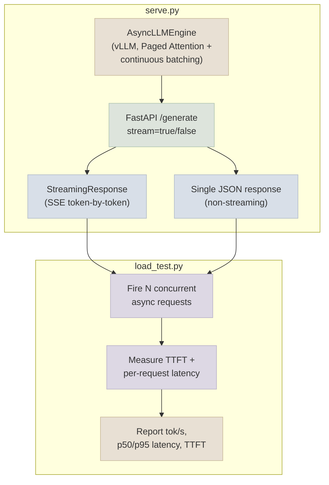

# Code Lab 01 - FastAPI + vLLM Endpoint

A real FastAPI endpoint backed by a vLLM `AsyncLLMEngine`, serving a small open instruction model with both streaming (SSE) and non-streaming responses - plus a concurrent load-testing client that measures tokens/sec, p50/p95 latency, and time-to-first-token under load.

← **Back to Overview:** [Serving & Inference](../INDEX.mdx) · **Back to Concepts:** [vLLM & Paged Attention](../Notes/01-vLLM-and-Paged-Attention.mdx) · [Batching, Concurrency & Latency](../Notes/03-Batching-Concurrency-and-Latency.mdx) · [Streaming & TTFT](../Notes/04-Streaming-and-TTFT.mdx)

---

## What's In This Lab

| Property | Detail |
|---|---|
| Task | Serve a small open instruction model behind a production-shaped HTTP endpoint |
| Base model | A small open ~1-2B instruction model (default: `Qwen/Qwen2.5-1.5B-Instruct`) - the same class of model used in [07-Fine-Tuning-Lab](../../07-Fine-Tuning-Lab/CodeLabs/01-QLoRA-Fine-Tune.mdx); a QLoRA-merged model from that lab works equally well as a drop-in `--model` swap |
| Serving engine | vLLM `AsyncLLMEngine` (Paged Attention + continuous batching) |
| API layer | FastAPI, `/generate` endpoint supporting `stream=true` (SSE) and `stream=false` (single JSON response) |
| Load test | Concurrent async client measuring tokens/sec, p50/p95 latency, and TTFT at configurable concurrency |
| Complexity | Intermediate-Advanced |
| Files | `01-FastAPI-vLLM-Endpoint/{serve.py, load_test.py, requirements.txt, README.mdx}` |

## Architecture



## Running

```bash
cd 08-Serving-and-Inference/CodeLabs/01-FastAPI-vLLM-Endpoint
pip install -r requirements.txt

# Terminal 1: start the server
python serve.py --model Qwen/Qwen2.5-1.5B-Instruct --port 8000

# Terminal 2: run the load test against it
python load_test.py --url http://localhost:8000/generate --concurrency 16 --requests 64
```

Full details, code walkthrough, and what each part demonstrates: see [README](01-FastAPI-vLLM-Endpoint/README.mdx).
