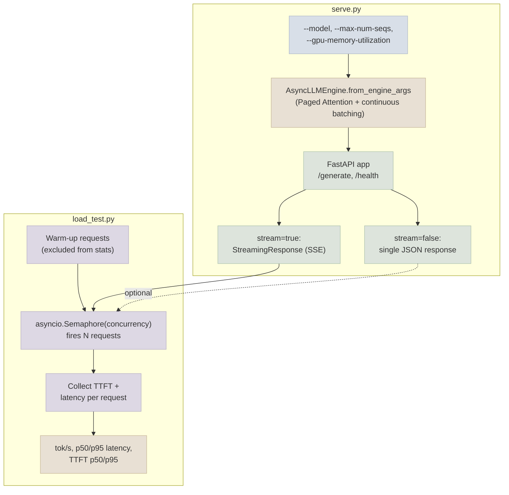

# FastAPI + vLLM Endpoint

A small open instruction model, served behind a real FastAPI endpoint backed by vLLM's `AsyncLLMEngine` - the hands-on counterpart to the [Notes](../../Notes) files. Every concept (Paged Attention + continuous batching under the hood, streaming vs non-streaming responses, TTFT measurement, concurrent load testing) appears here as real, runnable code.

## Architecture



## What This Demonstrates

1. **A real vLLM `AsyncLLMEngine`** - `AsyncEngineArgs(model=..., gpu_memory_utilization=0.85, max_num_seqs=32, enable_prefix_caching=True)` loads the model with Paged Attention and continuous batching active, the same mechanics covered in [vLLM & Paged Attention](../../Notes/01-vLLM-and-Paged-Attention.mdx)
2. **Streaming via Server-Sent Events** - `/generate` with `stream=true` returns a `StreamingResponse` that yields `data: {...}\n\n` chunks token-by-token, including a `ttft_ms` field on the first chunk, matching the pattern in [Streaming & TTFT](../../Notes/04-Streaming-and-TTFT.mdx#implementing-streaming---sse-and-chunked-responses)
3. **Non-streaming responses** - `/generate` with `stream=false` consumes the full generator server-side and returns one JSON response, for callers that don't need incremental delivery
4. **A concurrent load test, not a single-request benchmark** - `load_test.py` fires `--requests` total requests bounded by an `asyncio.Semaphore(--concurrency)`, matching the capacity-planning methodology in [Batching, Concurrency & Latency](../../Notes/03-Batching-Concurrency-and-Latency.mdx#capacity-planning-basics)
5. **Warm-up exclusion** - `--warmup-requests` runs and discards a few requests before measurement starts, so the one-time CUDA kernel compilation/allocator cost doesn't skew reported latency, per the caveat in [Streaming & TTFT](../../Notes/04-Streaming-and-TTFT.mdx#measuring-ttft-correctly-client-side)
6. **The full metric set the module targets** - `load_test.py` reports aggregate tokens/sec, p50/p95 per-request latency, and p50/p95 TTFT, the exact numbers referenced throughout [Batching, Concurrency & Latency](../../Notes/03-Batching-Concurrency-and-Latency.mdx) and [Streaming & TTFT](../../Notes/04-Streaming-and-TTFT.mdx)

## Files

| File | Purpose |
|---|---|
| `serve.py` | Loads a model into a vLLM `AsyncLLMEngine`, exposes a FastAPI `/generate` endpoint with streaming (SSE) and non-streaming modes, plus a `/health` check |
| `load_test.py` | Fires concurrent async requests against a running `serve.py` instance, reports tokens/sec, p50/p95 latency, and TTFT |
| `requirements.txt` | `vllm`, `fastapi`, `uvicorn`, `pydantic`, `httpx` |

## Running

```bash
pip install -r requirements.txt

# Terminal 1: start the server (requires a CUDA GPU)
python serve.py --model Qwen/Qwen2.5-1.5B-Instruct --port 8000

# Or serve a QLoRA-merged model from 07-Fine-Tuning-Lab instead of the base model:
python serve.py --model ./qwen2.5-1.5b-support-bot-merged --port 8000

# Terminal 2: single non-streaming sanity check
curl -X POST http://localhost:8000/generate \
  -H "Content-Type: application/json" \
  -d '{"prompt": "Explain KV cache in one sentence.", "stream": false, "max_tokens": 64}'

# Terminal 2: run the load test
python load_test.py --url http://localhost:8000/generate --concurrency 16 --requests 64
```

vLLM's `AsyncLLMEngine` requires a CUDA GPU - this script is not runnable on CPU-only machines. The default base model (`Qwen/Qwen2.5-1.5B-Instruct`) fits comfortably within a single free-tier T4 GPU (16 GB).

Expected shape of a `load_test.py` run at moderate concurrency:

```
====================================================================
Metric                                                         Value
====================================================================
Concurrency                                                       16
Requests (succeeded / failed)                                 64 / 0
Wall-clock time (s)                                              9.42
Total output tokens                                              6821
Aggregate throughput (tok/s)                                   724.31
TTFT p50 (ms)                                                    142.3
TTFT p95 (ms)                                                    398.7
Per-request latency p50 (ms)                                   1834.2
Per-request latency p95 (ms)                                   2601.5
Per-request latency stdev (ms)                                  312.4
====================================================================
```

Re-run at `--concurrency 1` and `--concurrency 64` to see the throughput/latency trade-off described in [Batching, Concurrency & Latency](../../Notes/03-Batching-Concurrency-and-Latency.mdx#tokens-sec-vs-latency-per-request) directly in your own numbers - aggregate throughput should climb with concurrency while TTFT and per-request latency also climb, illustrating exactly why capacity planning requires picking a target point on that curve rather than maximizing either number in isolation.
