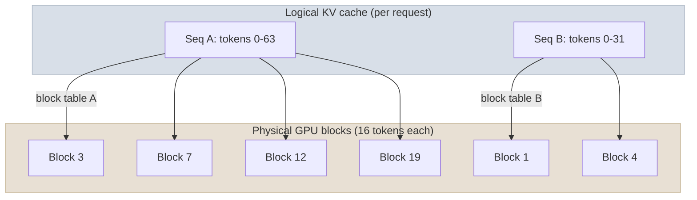

# vLLM and Paged Attention

## The One-Line Definition

vLLM is the dominant open-source LLM serving engine because it treats the GPU's KV-cache memory the way an operating system treats virtual memory - paged, non-contiguous, and shared wherever possible - which is what lets it run continuous batching at near-full GPU utilization instead of the ~30-50% typical of naive serving.

If you've only run a model in a notebook with `model.generate()`, this page explains the gap between that and a production endpoint serving hundreds of concurrent users. The short version: most of the engineering effort in serving an LLM well goes into not wasting GPU memory and not leaving the GPU idle, and vLLM's two headline features - Paged Attention and continuous batching - solve exactly those two problems.

This page assumes the KV-cache fundamentals (what the cache stores, why it exists, the memory formula) from [01-LLM-Models: KV Cache & Inference](../../01-LLM-Models/Notes/05-KV-Cache-and-Inference-Optimization.mdx) - it is not re-derived here. This page is specifically about how vLLM manages that cache in production and why the resulting throughput gain is so large.

> **Prerequisite:** KV-cache memory math, MHA/MQA/GQA, and a first pass at Paged Attention and continuous batching are covered in [KV Cache & Inference](../../01-LLM-Models/Notes/05-KV-Cache-and-Inference-Optimization.mdx). This page goes deeper on the vLLM engine itself and how you configure/operate it.

---

## Why vLLM Exists

Before vLLM (2023), most people serving open LLMs used the same code they trained or prototyped with - `transformers`' `.generate()` in a loop, one request at a time or in small fixed batches. That works for a demo. It falls over in production because GPU memory gets reserved wastefully and the GPU sits idle waiting for the slowest request in a batch to finish. vLLM was built specifically to fix both problems at once.

Two structural problems with naive serving:

1. **Memory fragmentation** - a naive KV-cache allocator reserves a contiguous memory block per sequence sized for the *maximum* possible context length, even though most sequences are much shorter and grow gradually. Measured waste from this pattern: 60-80% of KV-cache memory unused.
2. **GPU idling under static batching** - a fixed batch runs until its longest sequence finishes; every sequence that finished early leaves its GPU slot empty rather than being replaced.

vLLM's answer to each: Paged Attention (memory) and continuous batching (scheduling). Both are covered at the conceptual/math level in [KV Cache & Inference](../../01-LLM-Models/Notes/05-KV-Cache-and-Inference-Optimization.mdx#paged-attention-vllm); this page focuses on what that means operationally when you actually stand up a vLLM server.

---

## Paged Attention in Practice

Instead of reserving one big continuous chunk of memory per conversation (most of which goes unused), vLLM splits GPU memory into small fixed-size blocks and hands them out on demand as a conversation grows - exactly like how an operating system pages a program's memory into RAM. When a conversation ends, its blocks go straight back into the pool for the next request, with almost no waste.

Concretely, vLLM's `block_size` (default 16 tokens) determines the granularity of memory allocation. Each sequence's logical KV cache is mapped to physical blocks via a per-sequence block table, exactly like a page table maps virtual to physical memory addresses. This has two practical consequences you configure around:

- **`gpu_memory_utilization`** - fraction of GPU memory vLLM is allowed to claim for the KV-cache block pool (commonly `0.85-0.95`). Set too low and you under-utilize the GPU; too high and you risk OOM from other processes.
- **Automatic prefix caching (`enable_prefix_caching=True`)** - because blocks are addressed by content hash, identical prefixes (e.g. a shared system prompt) across different requests can literally point at the same physical blocks, with copy-on-write semantics if they diverge partway through. This is why vLLM's prefix caching is cheap to enable and high-ROI for chatbot/RAG workloads with repeated system prompts.

### Measured Results

| Metric | Naive contiguous allocation | Paged Attention |
|---|---|---|
| Memory waste from fragmentation | 60-80% | < 4% |
| Sequences served concurrently (same GPU) | Baseline | 2-4x more |
| Throughput | Baseline | 2-4x higher |

---

## Continuous Batching in Practice

vLLM never waits for a whole batch to finish together. After every single decode step, it checks which sequences in the current batch are done, evicts them immediately, and slots in the next waiting request - so the GPU is always working on a full batch, not draining down to a handful of stragglers.

This is scheduled by vLLM's continuous (in-flight) batching engine, distinct from the "dynamic batching" some frameworks do at the request-queue level (grouping same-length requests before a fixed batch starts). vLLM operates at the token-generation-step granularity, which is what produces the 5-10x throughput gain over static batching referenced in [KV Cache & Inference](../../01-LLM-Models/Notes/05-KV-Cache-and-Inference-Optimization.mdx#continuous-batching).

Key scheduler knobs:

| Parameter | Controls |
|---|---|
| `max_num_seqs` | Maximum number of sequences batched together per step |
| `max_num_batched_tokens` | Token budget per scheduling step - caps prefill from monopolizing a step and starving decode-phase sequences (chunked prefill) |
| `max_model_len` | Maximum context length vLLM will allocate KV-cache blocks for |

---

## Serving Framework Comparison

| Framework | Batching model | KV-cache management | Best for |
|---|---|---|---|
| **vLLM** | Continuous (in-flight) batching | Paged Attention, automatic prefix caching | Highest-throughput self-hosted serving, OpenAI-compatible API |
| **TGI** | Continuous batching | Flash-Attention-based, less granular paging | HuggingFace-native models, streaming |
| **TensorRT-LLM** | Continuous batching (in-flight) | Custom NVIDIA-optimized paging | Maximum single-GPU throughput on NVIDIA hardware |
| **SGLang** | Continuous batching | RadixAttention (tree-structured prefix cache) | Complex generation pipelines, heavy prefix reuse |
| **Ollama** | None (single request at a time, typically) | Simple, GGUF-based | Local development, prototyping |

**Interview Q:** *Why does naive `transformers.generate()` in a loop not scale to production traffic even on a large GPU?*
Because it allocates KV-cache memory contiguously per request (wasting 60-80% to fragmentation) and processes one static batch at a time, leaving the GPU idle whenever any sequence in the batch finishes early. Both problems compound under real, variable-length concurrent traffic - the GPU is simultaneously memory-starved and compute-idle.

---

## Study Notes

**Must-know for interviews:**
- vLLM's two headline features are Paged Attention (KV-cache memory) and continuous batching (scheduling) - they solve memory fragmentation and GPU idling respectively
- Paged Attention allocates fixed-size blocks (default 16 tokens) on demand via a per-sequence block table, borrowing the OS virtual-memory-paging model
- Automatic prefix caching works because content-addressed blocks let identical prefixes across requests share physical memory with copy-on-write
- Continuous batching evicts finished sequences and inserts waiting ones after every decode step, not at fixed batch boundaries
- `gpu_memory_utilization`, `max_num_seqs`, and `max_num_batched_tokens` are the primary vLLM server tuning knobs
- Combined, these features typically deliver 2-4x higher throughput than naive serving on identical hardware

**Quick recall Q&A:**
- *What does vLLM's `block_size` control?* The granularity (in tokens) of each physical KV-cache block - the unit Paged Attention allocates and frees.
- *Why is chunked prefill needed alongside continuous batching?* A very long prompt's prefill would otherwise monopolize a full scheduling step, delaying decode steps for other in-flight requests - `max_num_batched_tokens` caps how much prefill work happens per step.
- *How does prefix caching avoid recomputing a shared system prompt for every request?* Blocks are addressed by content hash, so identical prefixes across different requests point at the same physical blocks instead of being recomputed and stored separately.
- *What's the practical effect of setting `gpu_memory_utilization` too low?* The KV-cache block pool is smaller than it could be, so vLLM can serve fewer concurrent sequences than the GPU's memory would otherwise allow.
