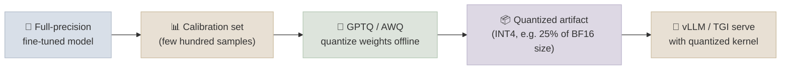

# Quantized Inference

## The One-Line Definition

Inference-time quantization (GPTQ, AWQ) and training-time quantization (NF4/`bitsandbytes`) both shrink model weights to fewer bits, but they optimize for different things - GPTQ/AWQ are calibrated once, offline, purely to make a frozen model cheaper and faster to *serve*, while NF4/`bitsandbytes` is designed to make a model cheap enough to *train* against, with speed as a secondary concern.

<div class="audience-biz" markdown="1">

If module 08 taught you to quantize a model so you could afford to fine-tune it on a single GPU, this page is about a related but distinct decision: quantizing an already-trained model purely to make it cheaper and faster to run for everyone who calls it in production. The tools and priorities are different even though the underlying idea - "use fewer bits per weight" - sounds the same.

</div>

<div class="audience-tech" markdown="1">

This page assumes the quantization fundamentals (NF4 bin placement, VRAM formulas, INT8/INT4 tradeoffs) from [01-LLM-Models: GPU & Hardware](../../01-LLM-Models/Notes/08-GPU-and-Hardware.mdx) and the QLoRA training-time setup from [07-Fine-Tuning-Lab: LoRA & QLoRA Hands-On](../../07-Fine-Tuning-Lab/Notes/02-LoRA-and-QLoRA-Hands-On.mdx). It is specifically about the serving-side quantization formats (GPTQ, AWQ) and when to reach for them.

</div>



---

## GPTQ and AWQ vs NF4/bitsandbytes

<div class="audience-biz" markdown="1">

`bitsandbytes` NF4 quantization happens on the fly, right when a model is loaded, and is chosen because it's simple to set up during training. GPTQ and AWQ instead do a one-time, more careful calibration pass over a small dataset *before* the model is deployed - which costs extra setup time, but produces a quantized model that runs faster in production because it can use specialized fast INT4 GPU kernels that on-the-fly NF4 loading doesn't take advantage of the same way.

</div>

<div class="audience-tech" markdown="1">

The distinction is about optimization target and when the quantization decision is made:

| | NF4 / `bitsandbytes` | GPTQ | AWQ |
|---|---|---|---|
| When quantized | On-the-fly at `from_pretrained` load time | Offline, one-time calibration pass | Offline, one-time calibration pass |
| Optimized for | Fitting a frozen base model in memory during training (QLoRA) | Fast, low-memory inference | Fast, low-memory inference, better low-bit accuracy |
| Calibration data | None required | Few hundred representative samples (layer-wise reconstruction error minimization) | Few hundred representative samples (activation-aware channel scaling) |
| Inference kernel | Standard `bitsandbytes` dequant-on-the-fly kernels - not optimized for max serving throughput | Specialized INT4 GPU kernels (`exllama`, `marlin`) - fast | Specialized INT4 GPU kernels - fast, often better throughput/accuracy than GPTQ at equal bit-width |
| Typical use case | Training-time memory reduction (QLoRA) | Serving-time memory + latency reduction | Serving-time memory + latency reduction, preferred when accuracy at INT4 matters most |

**How GPTQ works (briefly):** quantizes weights layer by layer, using a calibration set to solve for the INT4 weight values that minimize the reconstruction error of that layer's output, correcting for quantization error in already-quantized weights as it proceeds through the layer.

**How AWQ works (briefly):** observes that a small fraction of weight channels are disproportionately important based on activation magnitudes (not weight magnitude), and preserves those channels at higher effective precision via per-channel scaling before quantizing everything to INT4 - this is why AWQ tends to retain accuracy better than GPTQ at the same bit-width on many benchmarks.

</div>

### Code - Loading a Pre-Quantized AWQ Model in vLLM

```python
from vllm import LLM

# A model already quantized and published in AWQ format (e.g. via AutoAWQ)
llm = LLM(
    model="TheBloke/Mistral-7B-Instruct-v0.2-AWQ",
    quantization="awq",
    dtype="float16",
)
```

### Code - Quantizing Your Own Fine-Tuned Model with AutoAWQ

```python
from awq import AutoAWQForCausalLM
from transformers import AutoTokenizer

model_path = "./my-merged-finetuned-model"
quant_path = "./my-model-awq"

model = AutoAWQForCausalLM.from_pretrained(model_path)
tokenizer = AutoTokenizer.from_pretrained(model_path)

quant_config = {"zero_point": True, "q_group_size": 128, "w_bit": 4, "version": "GEMM"}
model.quantize(tokenizer, quant_config=quant_config)  # runs calibration internally

model.save_quantized(quant_path)
tokenizer.save_pretrained(quant_path)
```

---

## Accuracy and Speed Tradeoffs

<div class="audience-biz" markdown="1">

Quantizing to INT4 typically costs a small amount of quality - usually small enough to be acceptable for most production tasks - in exchange for roughly a quarter of the memory footprint and meaningfully faster generation. Whether that trade is worth it depends entirely on how sensitive your task is to small quality regressions.

</div>

<div class="audience-tech" markdown="1">

Rough, workload-dependent ranges (validate against your own eval set before shipping):

| Precision | Memory vs BF16 | Typical latency change | Typical quality delta |
|---|---|---|---|
| BF16/FP16 (baseline) | 1x | Baseline | Baseline |
| INT8 (GPTQ/AWQ) | ~50% | ~1.3-1.5x faster | Usually negligible |
| INT4 (GPTQ/AWQ) | ~25% | ~2-3x faster (with optimized kernels) | Small, task-dependent - often 1-3% on standard benchmarks, more on tasks sensitive to precise numeric/reasoning output |

</div>

---

## When to Quantize for Serving - and When Not To

<div class="audience-biz" markdown="1">

Quantize for serving when GPU cost or throughput is the binding constraint and your task tolerates a small quality dip - customer support chat, summarization, classification-style generation. Skip it, or quantize less aggressively (INT8 instead of INT4), when the task is precision-sensitive - code generation, numeric reasoning, or anything where a small accuracy regression has an outsized downstream cost.

</div>

<div class="audience-tech" markdown="1">

**Quantize for serving when:**
- GPU cost per request is the primary constraint (INT4 roughly quarters memory, often 2-3x's throughput)
- The task's eval metrics show acceptable degradation at the target bit-width on your own held-out set, not just published benchmarks
- You're deploying a single fixed model version at scale (calibration cost is a one-time investment, amortized over serving volume)

**Don't quantize (or use INT8, not INT4) when:**
- The task is precision-sensitive (code, math, structured extraction) where quantization-induced errors compound
- You're still iterating on the model (frequent re-quantization calibration cost outweighs the benefit)
- Serving volume is low enough that the memory/throughput win doesn't offset the quality risk and operational overhead of maintaining a quantized artifact alongside the full-precision one

**A common production pattern:** merge a LoRA/QLoRA fine-tune (see [LoRA & QLoRA Hands-On](../../07-Fine-Tuning-Lab/Notes/02-LoRA-and-QLoRA-Hands-On.mdx#merging-adapters-vs-serving-separately)) into a full-precision dense model first, then separately AWQ/GPTQ-quantize that merged model for serving - training-time and serving-time quantization decisions are made independently, at different stages of the pipeline.

</div>

**Interview Q:** *A teammate proposes reusing the QLoRA NF4 config from training directly for production serving, to save setup time. What's the issue?*
NF4/`bitsandbytes` quantization is optimized for training-time memory reduction with dequant-on-the-fly kernels, not for serving throughput - it doesn't benefit from the specialized fast INT4 inference kernels (`exllama`, `marlin`) that GPTQ/AWQ formats are built for. For a serving deployment, the better path is to merge the adapter into a full-precision model, then separately run an offline GPTQ/AWQ calibration pass targeting the serving stack's optimized kernels.

---

## Study Notes

**Must-know for interviews:**
- NF4/`bitsandbytes` (training-time) and GPTQ/AWQ (serving-time) both quantize to low bit-width but optimize for different goals and use different kernels
- GPTQ minimizes per-layer reconstruction error via calibration; AWQ preserves activation-important weight channels via per-channel scaling - AWQ often retains accuracy better at equal bit-width
- INT4 quantization typically costs ~25% of BF16 memory and 2-3x's throughput with optimized kernels, at a small task-dependent quality cost
- Quantize aggressively for cost-sensitive, quality-tolerant tasks; use INT8 or skip quantization for precision-sensitive tasks (code, math, structured extraction)
- A common production pipeline: merge LoRA adapter into a full-precision model, then separately AWQ/GPTQ-quantize the merged model for serving

**Quick recall Q&A:**
- *Why can't you just serve a `bitsandbytes` NF4-quantized model the same way you'd serve a GPTQ/AWQ model?* You can load it, but it won't get the throughput benefit of the specialized INT4 serving kernels GPTQ/AWQ artifacts are built for - `bitsandbytes` optimizes for training-time memory fit, not serving-time latency.
- *What does AWQ preserve that plain uniform quantization doesn't?* A small fraction of weight channels identified as disproportionately important based on activation magnitude, kept at effectively higher precision via per-channel scaling before the rest is quantized to INT4.
- *When would INT8 be the better choice over INT4 for a production deployment?* When the task is precision-sensitive enough that INT4's larger quality delta is unacceptable, but the memory/throughput win of some quantization is still wanted.
