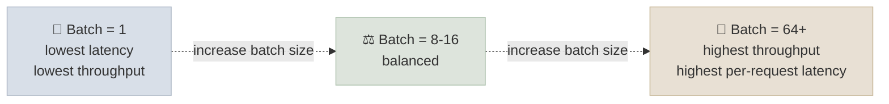

# Batching, Concurrency and Latency

## The One-Line Definition

Batch size and concurrency both push throughput up, but they cost latency differently - a bigger batch increases tokens/sec by keeping the GPU busier, while more concurrent requests increase queuing and per-request wait time, so capacity planning is really the exercise of picking a target point on that curve for your specific SLO.

<div class="audience-biz" markdown="1">

Two questions look similar but aren't: "how many tokens per second can this GPU produce in total?" and "how long does any one user wait for their response?" Optimizing purely for the first number can make the second one worse. This page is about understanding that trade-off well enough to answer "how many concurrent users can this GPU serve" with real numbers instead of a guess.

</div>

<div class="audience-tech" markdown="1">

This page assumes the latency-budget breakdown (TTFT, decode TPS, prefill vs decode bottlenecks) from [01-LLM-Models: Production Deployment](../../01-LLM-Models/Notes/10-Production-Deployment.mdx#latency-budget) and continuous batching mechanics from [vLLM & Paged Attention](01-vLLM-and-Paged-Attention.mdx). This page is specifically about the batch-size/concurrency math you use for capacity planning.

</div>



---

## Batch Size vs Concurrency

<div class="audience-biz" markdown="1">

"Batch size" and "concurrency" get used loosely, but they answer different questions. Batch size is how many sequences the GPU is actively computing on in a single forward pass at any instant. Concurrency is how many requests are in flight from the client's perspective - waiting in queue, being prefilled, or being decoded. With continuous batching, concurrency can be much higher than the instantaneous batch size, because requests queue and rotate through batch slots as others finish.

</div>

<div class="audience-tech" markdown="1">

- **Batch size (in vLLM: bounded by `max_num_seqs`)** - the number of sequences occupying GPU compute in a single scheduling step
- **Concurrency** - the number of requests the server is handling simultaneously across all states (queued, prefilling, decoding)
- Under continuous batching, as sequences finish and are evicted, queued requests immediately fill their slots - so a server with `max_num_seqs=32` can sustain far more than 32 concurrent client connections if requests are shorter than the batch's steady-state cycle time

**Key relationship:** throughput (tokens/sec) scales with batch size up to the point the GPU becomes compute-bound rather than memory-bandwidth-bound (decode is normally memory-bandwidth-bound per [KV Cache & Inference](../../01-LLM-Models/Notes/05-KV-Cache-and-Inference-Optimization.mdx#what-is-the-kv-cache)) - beyond that point, larger batches add queuing latency without meaningfully increasing throughput.

</div>

---

## Tokens/Sec vs Latency-Per-Request

<div class="audience-biz" markdown="1">

There are really two throughput numbers to keep straight: total tokens/sec the GPU is producing across every active request combined, and tokens/sec *for one specific user's response*. The first number goes up as you add more concurrent requests. The second number can go down, because each decode step is now shared across more sequences.

</div>

<div class="audience-tech" markdown="1">

```
Aggregate throughput (tok/s) = batch_size × (1 / per-step decode latency)
Per-request throughput (tok/s) ≈ Aggregate throughput / batch_size  [when batch is compute-saturated]
```

At small batch sizes, per-step decode latency barely increases as batch size grows (the GPU has spare compute/bandwidth) - so aggregate throughput scales almost linearly with batch size while per-request latency stays roughly flat. Past a hardware-dependent saturation point, per-step latency starts increasing with batch size, so aggregate throughput growth slows and per-request latency starts climbing measurably.

</div>

### Illustrative Numbers - 7B Model on a Single A100

| Batch size (concurrent decodes) | Per-step decode latency | Per-request tok/s | Aggregate tok/s |
|---|---|---|---|
| 1 | ~20ms | ~50 | ~50 |
| 8 | ~22ms | ~45 | ~360 |
| 32 | ~28ms | ~36 | ~1,150 |
| 64 | ~40ms | ~25 | ~1,600 |
| 128 | ~70ms | ~14 | ~1,830 |

These are illustrative, not universal - always measure on your actual model/hardware/prompt-length distribution (see the [FastAPI + vLLM Endpoint Code Lab](../CodeLabs/01-FastAPI-vLLM-Endpoint.mdx)'s `load_test.py` for how to measure your own).

**Pattern to notice:** aggregate throughput keeps climbing well past the point where per-request throughput has meaningfully degraded - this is the core tension capacity planning has to resolve.

---

## Capacity Planning Basics

<div class="audience-biz" markdown="1">

To answer "how many concurrent users can one GPU serve," you need a target - a maximum acceptable per-request latency, or a minimum acceptable per-request tokens/sec - and then you find the largest batch size that still meets that target, using either your own load test or the serving framework's built-in benchmarking tools.

</div>

<div class="audience-tech" markdown="1">

**A basic capacity planning workflow:**

1. Define your SLO (e.g. "p95 per-request throughput must stay above 15 tok/s" or "p95 TTFT under 500ms")
2. Load test at increasing concurrency levels (see [FastAPI + vLLM Endpoint Code Lab](../CodeLabs/01-FastAPI-vLLM-Endpoint.mdx))
3. Plot per-request latency/throughput against concurrency; find the concurrency level where the SLO is violated
4. That concurrency level (minus a safety margin, typically 20-30%) is your per-GPU capacity
5. Divide expected peak concurrent users by that per-GPU capacity to size the fleet; add horizontal replicas behind a load balancer, not a single larger batch, once you exceed one GPU's headroom

**Rough estimation formula (order-of-magnitude, not a substitute for measurement):**

```
max_concurrent_users_per_gpu ≈ (GPU KV-cache capacity in tokens) / (avg_sequence_length_tokens)
                                  subject to: per-request tok/s at that batch size still meets SLO
```

Both constraints matter - a GPU might have enough *memory* to hold KV cache for 200 concurrent long sequences, but the *compute/bandwidth* budget might only sustain acceptable per-request latency at 60. Whichever constraint binds first sets your real capacity.

</div>

**Interview Q:** *Your load test shows aggregate throughput still climbing at concurrency=200, but p95 per-request latency has already tripled. Do you keep raising the concurrency limit?*
No - aggregate throughput climbing is not the metric that matters if your SLO is per-request latency. The right capacity limit is the concurrency level where per-request latency/throughput last met the SLO, with a safety margin, not the point where aggregate throughput stops improving.

---

## Study Notes

**Must-know for interviews:**
- Batch size (instantaneous GPU occupancy) and concurrency (total in-flight requests) are related but distinct, especially under continuous batching
- Aggregate throughput (tok/s across all requests) and per-request throughput (tok/s for one user) trade off against each other as batch size/concurrency grows
- At small batch sizes, aggregate throughput scales roughly linearly with little per-request latency cost; past a saturation point, per-request latency starts climbing measurably
- Capacity planning means picking the largest concurrency level that still satisfies a defined SLO (p95 latency or p95 per-request tok/s), then sizing the GPU fleet around it with a safety margin
- Both KV-cache memory capacity and compute/bandwidth budget can bind capacity - whichever hits its limit first determines real capacity, not either one in isolation

**Quick recall Q&A:**
- *Why can concurrency exceed `max_num_seqs` under continuous batching?* Because requests rotate through batch slots as sequences finish - concurrency counts all in-flight requests (queued + active), not just the instantaneous batch occupancy.
- *What's the risk of sizing GPU capacity purely off an aggregate throughput number?* Aggregate throughput can look great while individual users experience unacceptable latency - capacity should be sized against a per-request SLO, not the aggregate number alone.
- *Why add more GPU replicas instead of just raising batch size indefinitely on one GPU?* Past the saturation point, a bigger batch on one GPU adds queuing/decode latency without proportional throughput gains - horizontal scaling keeps per-request latency in check while still growing total capacity.
