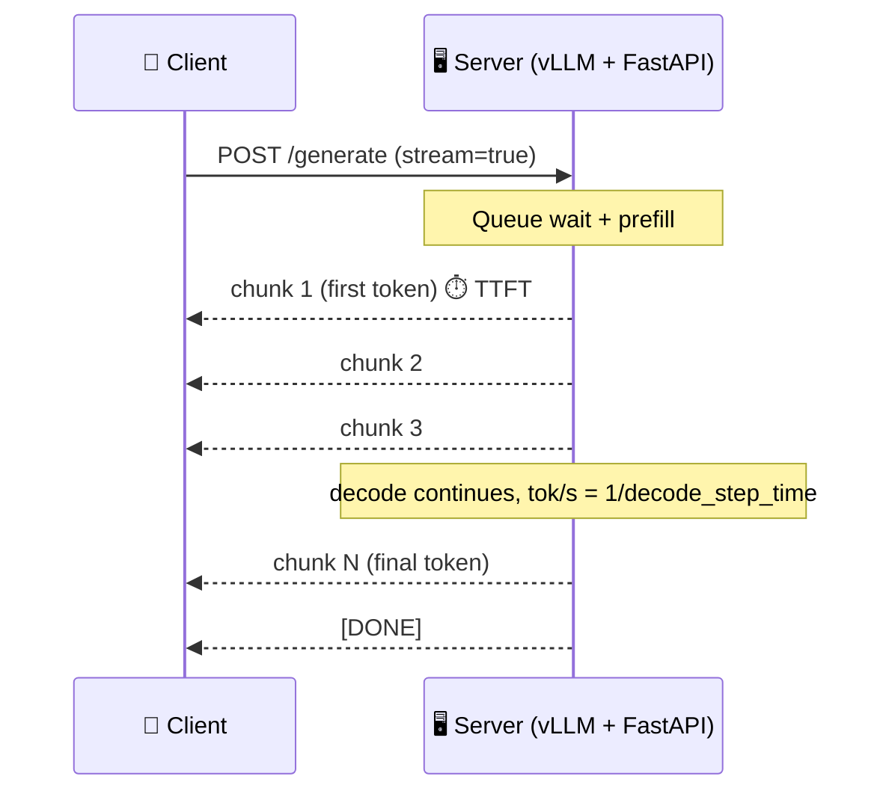

# Streaming and TTFT

## The One-Line Definition

Streaming sends each generated token to the client as soon as it exists instead of waiting for the full response, which doesn't change total generation time but collapses perceived latency down to time-to-first-token (TTFT) - the single number that dominates how fast an interactive LLM application *feels*.

<div class="audience-biz" markdown="1">

Two responses that take the exact same total time to fully generate can feel completely different to a user - one where words start appearing almost immediately, and one where nothing happens for several seconds and then the whole answer appears at once. Streaming is the technique that produces the first experience, and TTFT is the number that measures it.

</div>

<div class="audience-tech" markdown="1">

This page assumes the latency-component breakdown (queue wait + prefill = TTFT, decode = TPS) from [01-LLM-Models: Production Deployment](../../01-LLM-Models/Notes/10-Production-Deployment.mdx#latency-budget) and the batch/concurrency trade-offs from [Batching, Concurrency & Latency](03-Batching-Concurrency-and-Latency.mdx). This page is specifically about implementing streaming and measuring TTFT correctly.

</div>



---

## TTFT vs Total Generation Time

<div class="audience-biz" markdown="1">

Time-to-first-token is exactly what it sounds like - the time from when a user submits a request to the moment the very first word starts appearing. Total generation time is how long the entire response takes to finish. For a chat interface, TTFT is usually what determines whether the product feels fast, because a streaming UI keeps the user engaged the moment text starts appearing, even if the full answer takes several more seconds to complete.

</div>

<div class="audience-tech" markdown="1">

```
TTFT = queue_wait_time + prefill_time
Total generation time = TTFT + (output_tokens × per-token_decode_time)
```

- **Queue wait** - time spent waiting for a GPU batch slot if the server is at capacity
- **Prefill time** - compute-bound processing of the entire input prompt in parallel (scales with prompt length, see [KV Cache & Inference](../../01-LLM-Models/Notes/05-KV-Cache-and-Inference-Optimization.mdx#what-is-the-kv-cache))
- **Decode time per token** - memory-bandwidth-bound, roughly constant per token once decoding starts (assuming stable batch composition)

A long system prompt or RAG context directly inflates TTFT via prefill time, independent of how long the actual answer ends up being - this is exactly why prefix caching (see [vLLM & Paged Attention](01-vLLM-and-Paged-Attention.mdx#paged-attention-in-practice)) has such high ROI for TTFT specifically.

</div>

---

## Implementing Streaming - SSE and Chunked Responses

<div class="audience-biz" markdown="1">

Under the hood, streaming works by keeping the HTTP connection open and sending small pieces of the response as they're generated, instead of waiting to send one complete response at the end. The two common ways to do this on the web are Server-Sent Events (SSE) and plain chunked HTTP responses - both let a client start rendering text token by token.

</div>

<div class="audience-tech" markdown="1">

**Server-Sent Events (SSE)** - a standard, one-directional streaming protocol over plain HTTP, natively supported by browsers via `EventSource` and universally supported by HTTP client libraries. This is what the OpenAI-compatible API (and vLLM's own API server) use for `stream=True` responses - each chunk is sent as a `data: {...}\n\n` line, terminated by a sentinel like `data: [DONE]\n\n`.

**Chunked transfer encoding** - lower-level HTTP mechanism (no `Content-Length` header, body sent in chunks) that SSE is built on top of. Framework streaming responses (e.g. FastAPI's `StreamingResponse`) typically use this directly if you're not following the SSE `data:` framing convention.

</div>

### Code - FastAPI Streaming Endpoint (SSE-Style)

```python
import json
from fastapi import FastAPI
from fastapi.responses import StreamingResponse

app = FastAPI()

async def token_stream(prompt: str):
    async for token in generate_tokens(prompt):  # vLLM AsyncLLMEngine generator
        yield f"data: {json.dumps({'token': token})}\n\n"
    yield "data: [DONE]\n\n"

@app.post("/generate")
async def generate(prompt: str, stream: bool = True):
    if stream:
        return StreamingResponse(token_stream(prompt), media_type="text/event-stream")
    # non-streaming path: collect all tokens, return one JSON response
    full_text = "".join([t async for t in generate_tokens(prompt)])
    return {"text": full_text}
```

The full working version of this pattern, backed by a real vLLM `AsyncLLMEngine`, is in the [FastAPI + vLLM Endpoint Code Lab](../CodeLabs/01-FastAPI-vLLM-Endpoint.mdx).

### Measuring TTFT Correctly (Client Side)

```python
import time
import httpx

def measure_ttft(url: str, payload: dict) -> float:
    start = time.monotonic()
    first_token_time = None
    with httpx.stream("POST", url, json=payload, timeout=60) as response:
        for line in response.iter_lines():
            if line.startswith("data: ") and first_token_time is None:
                first_token_time = time.monotonic()
                break
    return first_token_time - start  # seconds
```

Common measurement mistake: including a cold-start request (first request after server boot pays CUDA kernel compilation / allocator warm-up cost) in a TTFT average - always discard or separately report the first request, same principle as the warm-up-pass caveat in [07-Fine-Tuning-Lab: Benchmarking Base vs Tuned](../../07-Fine-Tuning-Lab/Notes/04-Benchmarking-Base-vs-Tuned.mdx).

---

## How Streaming Interacts With Batching

<div class="audience-biz" markdown="1">

Streaming doesn't conflict with serving many users at once - continuous batching still processes many sequences' decode steps together under the hood, streaming just changes when each individual user's tokens get sent to them. A busier server (more concurrent requests) will generally have a somewhat higher TTFT for any one request, because prefill work has to be scheduled alongside everyone else's decode steps.

</div>

<div class="audience-tech" markdown="1">

- Streaming is a client-facing response format decision; continuous batching is a server-side scheduling decision - they're orthogonal but interact:
  - Each token generated for *any* sequence in the batch is available to stream to *that* sequence's client the instant its decode step completes, regardless of what other sequences in the batch are doing
  - Under load, chunked prefill (see [vLLM & Paged Attention](01-vLLM-and-Paged-Attention.mdx#continuous-batching-in-practice)) means a new request's prefill can be spread across multiple scheduling steps if the server is busy with in-flight decodes, which increases that request's TTFT
  - This is why TTFT under concurrent load is measured, not assumed - see the [FastAPI + vLLM Endpoint Code Lab](../CodeLabs/01-FastAPI-vLLM-Endpoint.mdx)'s `load_test.py`, which reports TTFT specifically at increasing concurrency levels

</div>

**Interview Q:** *A user reports that responses "feel slow" even though your dashboard shows average total generation time is well within SLO. What's the likely gap in your metrics?*
Total generation time doesn't capture perceived latency - the dashboard is probably missing TTFT specifically, or averaging it in a way that hides p95/p99 tail latency. A user waiting 3 seconds before anything appears feels slow even if the full response completes quickly once streaming starts; TTFT (and its tail, not just its average) needs to be tracked as its own SLO.

---

## Study Notes

**Must-know for interviews:**
- Streaming doesn't reduce total generation time, it reduces *perceived* latency by surfacing tokens as they're generated instead of waiting for the full response
- TTFT = queue wait + prefill time; total generation time = TTFT + (output tokens × decode time per token)
- SSE (`data: ...\n\n` framing over chunked HTTP) is the standard streaming format used by OpenAI-compatible and vLLM APIs
- Long prompts/system prompts/RAG context inflate TTFT via prefill, independent of the eventual answer's length - prefix caching is the main lever for reducing this
- Streaming and continuous batching are orthogonal but interact - TTFT under concurrent load is measured empirically, not assumed from single-request numbers
- Always exclude or separately report a cold-start request when measuring TTFT - it includes one-time CUDA warm-up cost

**Quick recall Q&A:**
- *Does streaming reduce total generation time?* No - it reduces perceived latency by delivering tokens incrementally; total wall-clock time to the last token is unchanged (or marginally higher due to streaming overhead).
- *What two components make up TTFT?* Queue wait time and prefill compute time.
- *Why does a long RAG context increase TTFT even if the model's actual answer is short?* Prefill time scales with input prompt length, and TTFT = queue wait + prefill - a long retrieved context is processed in full before the first output token can be generated, regardless of output length.
- *Why measure TTFT at increasing concurrency instead of just at concurrency=1?* Chunked prefill scheduling means a busy server can delay a new request's prefill across more scheduling steps, increasing its TTFT - single-request TTFT understates what users experience under real load.
