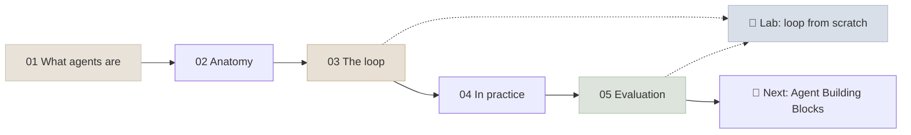

# 09 - Introduction to AI Agents

An AI agent is a model that directs its own process: it reads its context, decides on an action (usually a tool call), observes the result, and repeats until the goal is met. This module builds that idea from first principles - the definition, the components, the loop, where agents work and how to evaluate one. The next modules add the [building blocks](../10-Agent-Building-Blocks/INDEX.mdx) (tools, memory, planning), [protocols](../11-MCP-and-A2A/INDEX.mdx) and [agentic workflows](../12-Agentic-Workflows/INDEX.mdx).

```objectives
scope: module
time: 5-6 hours (notes + lab)
outcomes:
  - Decide whether a task needs a single call, a workflow or an agent, and at what autonomy level
  - Name the parts of an agent - model, instructions, tools, memory, orchestration, guardrails, environment - and what each is responsible for
  - Write a correct tool-use loop against the Claude and OpenAI APIs and against any OpenAI-compatible server, with bounds and error handling
  - Evaluate an agent on environment state with pass^k over repeated trials
prerequisites:
  - "[Foundation Models](../03-Foundation-Models/INDEX.mdx) - tokens, context windows, sampling"
  - "[Prompt & Context Engineering](../05-Prompt-Engineering/INDEX.mdx) - system prompts, structured outputs, context engineering"
  - "Optional, later in the course: [RAG Systems](../13-RAG/INDEX.mdx) - retrieval, which agents use as a tool"
```

## Where This Module Fits



## Chapter Map

| # | Chapter | You will learn | Time |
|---|---|---|---|
| 1 | [What Are AI Agents](Notes/01-What-Are-AI-Agents.mdx) | Agents vs workflows, the autonomy spectrum, why now, the decision test | 40 min |
| 2 | [Anatomy of an AI Agent](Notes/02-Anatomy-of-an-AI-Agent.mdx) | Model + harness: instructions, tools, memory, orchestration, guardrails, environment | 35 min |
| 3 | [The Agent Loop](Notes/03-The-Agent-Loop.mdx) | Correct loops for Claude and OpenAI APIs, invariants, stop reasons, bounds, failures | 60 min |
| 4 | [Agents in Practice](Notes/04-Agents-in-Practice.mdx) | Good use cases, personal vs enterprise, human-in-the-loop, build or buy | 40 min |
| 5 | [Agent Evaluation Basics](Notes/05-Agent-Evaluation-Basics.mdx) | State-based grading, pass@k vs pass^k, first test sets, failure taxonomies | 45 min |

Tool use, memory and planning - the parts every agent is assembled from - are covered in depth in [Agent Building Blocks](../10-Agent-Building-Blocks/INDEX.mdx).

## Code Lab

| Lab | What you build | Runs on |
|---|---|---|
| [Agent Loop from Scratch](CodeLabs/01-Agent-Loop-from-Scratch.mdx) | A tool-use loop with validation and bounds over a small retail environment, graded on database state with pass^k across prompt and tool-description variants | Any OpenAI-compatible endpoint: a local Qwen3 on a laptop (mlx-lm, Ollama, vLLM) or a hosted API |

## Mini-Project

Build and evaluate a **single agent for a domain you know** (an internal help desk, a lab-inventory assistant, a personal finance helper). Start it here and finish it after Agent Building Blocks:

1. An environment with 4-8 tools, at least two of them write tools with preconditions enforced in code, and a reset function.
2. A test set of 40 tasks across the six categories in [Agent Evaluation Basics](Notes/05-Agent-Evaluation-Basics.mdx), each with an expected end state.
3. The loop from the lab (or a framework), with bounds, argument validation and informative errors.
4. Results: pass@1 with a confidence interval, pass^4, per-task counts, tokens and seconds per episode.
5. A failure taxonomy from the traces, one targeted fix, and before/after numbers.

## Review

- [Q&A Review Bank](Notes/06-Interview-QA-Bank.mdx) - interview-style questions for this module
- [Module quiz](/quiz/agent-fundamentals) - every *Check Yourself* question in this module, in course order

## Summary & Key Terms

[Summary & Key Terms](APPENDIX.mdx) - a quick recap of this module and its essential vocabulary.

---

## Next Topic

Previous: [08 - Post-Training & Fine-Tuning](../08-Post-Training/INDEX.mdx) · Next: [10 - Agent Building Blocks](../10-Agent-Building-Blocks/INDEX.mdx)
