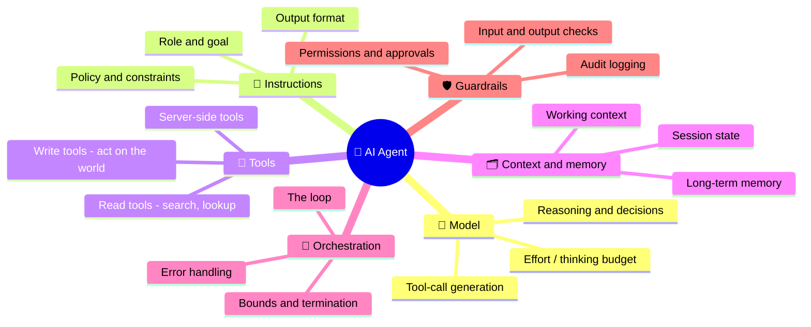
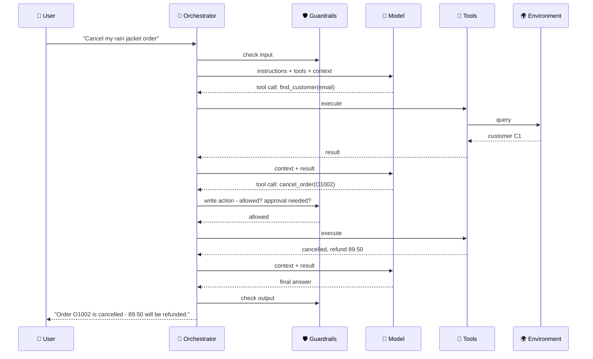

# Anatomy of an AI Agent

An agent is not a model: it is a **model plus a harness** - instructions, tools, context and memory, an orchestration loop and guardrails - acting on an environment. This chapter names each component, what it is responsible for, and which of the agent's capabilities it provides, so that when an agent fails you know which part to look at.

```objectives
time: 35 min
outcomes:
  - Name the components of an agent and the responsibility of each
  - Map an agent capability (planning, tool use, memory, self-correction) to the component that provides it
  - Diagnose which component is at fault from a description of a failure
  - Explain why the same model can perform very differently in two harnesses
prerequisites:
  - "[What Are AI Agents](01-What-Are-AI-Agents.mdx)"
```

## The Components

OpenAI's guide reduces an agent to three foundations - **model, tools, instructions**. That is the minimum. A production agent adds four more: context and memory, the orchestration loop, guardrails, and the environment it acts on.



| Component | Responsible for | Typical failure when it is weak |
|---|---|---|
| **Model** | Understanding the goal, choosing the next action, writing tool arguments and the final answer | Wrong tool or arguments, gives up early, over-long reasoning |
| **Instructions** (system prompt) | Role, goal, policies, when to use which tool, what "done" looks like | Violates a policy it was never told; stops at the wrong time |
| **Tools** | The actions available and their descriptions and schemas | Calls the wrong tool, invents ids, drowns in huge tool outputs |
| **Context & memory** | What the model sees on each call; what persists across calls and sessions | Forgets earlier findings, repeats work, loses the user's preferences |
| **Orchestration** (the loop) | Calling the model, executing tools, feeding results back, stopping | Infinite loops, orphaned tool calls, runaway cost |
| **Guardrails** | Checking inputs, outputs and actions; permissions; human approval | Harmful or unauthorised actions, prompt injection succeeds |
| **Environment** | The systems the agent acts on through tools | Side effects that can't be undone; non-determinism that breaks tests |

The model is the only component you usually don't build. **Everything else is the harness** - and it matters as much as the model. On SWE-bench, the same model scores very differently depending on the scaffold around it; the SWE-agent paper showed that designing the *agent-computer interface* (what tools exist, what they return, how errors are shown) changes results substantially (Yang et al., 2024). Module [Agent Engineering](../../19-Agent-Engineering/INDEX.mdx) is devoted to building harnesses.

---

## Each Component in Brief

### Model

The model makes every decision. Choose it on three axes: **tool-use reliability** (does it pick the right tool and write valid arguments - see the Berkeley Function Calling Leaderboard and τ-bench), **reasoning control** (can you set effort or a thinking budget per call), and **cost and latency per step**, which multiply by the number of steps. Many systems route: a strong model plans and handles hard steps; a small fast model does simple ones. Current families are compared in [Model Landscape](../../03-Foundation-Models/Notes/08-Model-Landscape.mdx).

### Instructions

The system prompt is the agent's standing orders. It should state the role and goal, the **policies** (what the agent may and may not do), guidance on when to use each tool, and what a finished answer looks like. Write policies as checkable rules ("only pending orders can be cancelled"), not adjectives ("be careful"). The [lab](../CodeLabs/01-Agent-Loop-from-Scratch.mdx) removes the policy section and finds that the rules the *tools* enforced still held, while the one rule only the prompt stated was broken either way.

### Tools

Tools are the agent's only way to observe or change the world. Their **descriptions and schemas are prompts**: the model reads them to decide what to call. Separate read tools (safe to retry) from write tools (need validation, idempotency and often approval). Details in [Tool Use & Function Calling](../../10-Agent-Building-Blocks/Notes/01-Tool-Use-and-Function-Calling.mdx).

### Context and memory

Each model call sees only what is in its context window: instructions, tool definitions, the conversation so far and anything retrieved. Memory is what you choose to persist and bring back - within a task (state, checkpoints) and across tasks (facts, past episodes, learned procedures). See [Agent Memory](../../10-Agent-Building-Blocks/Notes/02-Agent-Memory.mdx).

### Orchestration

The loop that calls the model, executes tool calls, appends results, and decides when to stop. It also owns **bounds** (steps, tokens, time, cost), error handling and retries. Frameworks mostly package this component. See [The Agent Loop](03-The-Agent-Loop.mdx).

### Guardrails and governance

Checks around the model rather than inside it: input filters, output validation, tool permissions scoped to the task, human approval for irreversible actions, and an audit log of every action. Treat anything a tool returns - a web page, an email, a document - as untrusted input that may contain instructions ([Production Agents](../../15-Production-Agents/INDEX.mdx) covers prompt injection defences).

### Environment

What the agent acts on: APIs, databases, file systems, browsers, other agents. For development you want environments that are **resettable** (start each test from the same state) and **observable** (you can check the final state), which is how the lab and benchmarks like τ-bench grade agents.

---

## Capabilities Come From Components

People describe agents by capabilities - "it can plan", "it remembers". Each capability is produced by specific components, which tells you where to intervene when it is missing.

| Capability | Provided mainly by | Where to intervene |
|---|---|---|
| **Understanding the request** | Model + instructions | Clarify the goal and "done" criteria; add examples |
| **Planning** | Model (reasoning) + orchestration | Raise effort; add an explicit plan/todo tool; plan-and-execute ([Planning](../../10-Agent-Building-Blocks/Notes/03-Planning-and-Reasoning.mdx)) |
| **Tool use** | Model + tool design | Rewrite descriptions; strict schemas; fewer, better tools |
| **Memory** | Context management + memory stores | Summarise or compact; persist facts; retrieve at the right moment |
| **Self-correction** | Tools that return informative errors + verification | Return actionable errors; add checks (tests, validators) the agent can run |
| **Safety and compliance** | Guardrails + instructions + tool permissions | Enforce in code, not only in the prompt |
| **Collaboration with other agents** | Orchestration (handoffs, sub-agents) + protocols | See [Agentic Workflows & Multi-Agent Systems](../../12-Agentic-Workflows/INDEX.mdx) and [MCP & A2A](../../11-MCP-and-A2A/INDEX.mdx) |

Self-correction deserves emphasis: models are poor at finding their own reasoning errors without an external signal (Huang et al., 2024). Agents self-correct well when the **environment gives feedback** - a failing test, a validation error, an empty search result - so an informative error message is a capability, not an afterthought.

---

## One Request Through the Components



---

## Check Yourself

```quiz
- q: "An agent keeps calling get_order with ids the user never mentioned. Which component would you fix first?"
  options:
    - "The tool design and instructions - describe where ids come from and give a lookup tool"
    - "The memory store"
    - "The audit log"
    - "The environment"
  answer: 1
  explain: "Invented arguments usually mean the model has no legitimate way to get the value, or wasn't told not to guess. A list/lookup tool and a description saying 'never guess ids' fix most cases; argument validation in the harness catches the rest."
- q: "Why can the same model score very differently on SWE-bench in two different agents?"
  options:
    - "The harness - tools, what they return, context management - changes what the model can do"
    - "SWE-bench is random"
    - "Different tokenizers"
    - "Only the system prompt differs"
  answer: 1
- q: "Which is the most reliable basis for agent self-correction?"
  options:
    - "Feedback from the environment - errors, test results, validation"
    - "Asking the model to re-read its answer"
    - "A longer system prompt"
    - "Higher temperature"
  answer: 1
  explain: "Without an external signal, models rarely find their own reasoning errors (Huang et al., 2024)."
- q: "Where should a rule like 'never refund more than $500 without approval' be enforced?"
  answer: "In code - in the tool or a guardrail that checks the amount and requires approval - and also stated in the instructions so the model plans around it. A prompt-only rule can be ignored or overridden by injected text."
```

## Exercises

```exercise
- title: Diagnose by component
  task: |
    For each failure, name the component at fault and one fix: (a) after 40 steps the agent forgets the user's original constraint; (b) the agent emails a customer an internal note it found in a document; (c) the agent loops calling search with the same query; (d) the agent answers "done" without running the tests it was asked to run; (e) the agent follows an instruction hidden in a web page it read.
  solution: |
    (a) Context/memory - keep the goal and constraints in a pinned task summary; compact old history. (b) Guardrails + tools - output checks for internal data; scope the email tool to approved templates or require approval. (c) Orchestration - repeated-call detection and a step bound; tool returning "no results, try a different query" helps the model. (d) Instructions + verification - define done as "tests pass" and check it in the harness before accepting the answer. (e) Guardrails - treat tool output as untrusted data, restrict what tools can do after reading untrusted content, require approval for side effects.
- title: Draw your agent
  task: |
    For an agent you use (a coding assistant, a research assistant), list each component: which model, what instructions you can see or infer, which tools, what memory persists between sessions, how the loop stops, and what guardrails you notice (approvals, sandboxes).
  solution: |
    For a coding agent, for example: a frontier model with adjustable effort; a system prompt plus project files like AGENTS.md; tools to read, search, edit files and run shell commands; memory in project files and conversation compaction; a loop that stops when the model answers or the user interrupts; guardrails such as permission prompts for shell commands and a sandbox.
```

## Study Notes

- Agent = model + harness (instructions, tools, context/memory, orchestration, guardrails) acting on an environment
- OpenAI's minimal three: model, tools, instructions
- The harness matters as much as the model - SWE-agent's agent-computer interface result
- Capabilities map to components; fix the component, not the symptom
- Self-correction needs external feedback: informative errors, tests, validators
- Enforce rules in code (tools, guardrails), and also state them in instructions
- Treat all tool output as untrusted input

## References

- OpenAI, [A Practical Guide to Building Agents](https://cdn.openai.com/business-guides-and-resources/a-practical-guide-to-building-agents.pdf) (2025)
- Yang et al., [SWE-agent: Agent-Computer Interfaces Enable Automated Software Engineering](https://arxiv.org/abs/2405.15793) (NeurIPS 2024)
- Sumers et al., [Cognitive Architectures for Language Agents (CoALA)](https://arxiv.org/abs/2309.02427) (TMLR 2024)
- Huang et al., [Large Language Models Cannot Self-Correct Reasoning Yet](https://arxiv.org/abs/2310.01798) (ICLR 2024)
- Patil et al., [Berkeley Function Calling Leaderboard](https://gorilla.cs.berkeley.edu/leaderboard.html) (2024-)

*Last reviewed: 2026-09*
