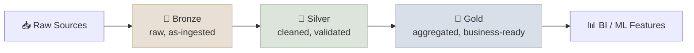

# Databricks and Spark

<div class="audience-biz" markdown="1">

Databricks is a data-and-AI platform built around one core idea: a "lakehouse" - your raw data lake and your structured warehouse, unified into one system, so you're not maintaining two copies of the same data for two different purposes.

</div>

<div class="audience-tech" markdown="1">

Databricks packages Apache Spark (distributed data processing) with governance (Unity Catalog), a table format with ACID guarantees (Delta Lake), and MLOps tooling (MLflow) into one managed platform. It's the AWS/Azure/GCP-agnostic answer to "where does data engineering and ML training actually run" - relevant wherever a JD mentions PySpark, Delta Lake, or Unity Catalog by name.

</div>

```objectives
time: 30 min
outcomes:
  - Explain the medallion architecture and what Delta Lake adds to Parquet (ACID, schema enforcement, time travel)
  - Describe what Unity Catalog governs, including models and vector indexes, and how MLflow registry aliases drive promotion
  - Identify Spark operations that shuffle, and the DBU and cluster-policy levers that control cost
prerequisites:
  - "[Model Lifecycle & Rollout](../../08-Production-Engineering/Notes/03-Model-Lifecycle-and-Rollout.mdx)"
```

---

## The Lakehouse and Medallion Architecture

<div class="audience-biz" markdown="1">

Data flows through three quality tiers on its way from raw to analysis-ready: Bronze (raw, as-ingested), Silver (cleaned, validated), Gold (aggregated, business-ready). Each tier is a real, queryable table - not a black box - so you can always trace a number back to its raw source.

</div>

<div class="audience-tech" markdown="1">

The medallion architecture organizes tables by refinement stage: **Bronze** ingests raw data as-is (schema-on-read, append-only), **Silver** applies cleaning/dedup/schema enforcement, **Gold** aggregates into business-level tables (often star-schema, feeding BI or ML feature stores). Each stage is a Delta table, so lineage between stages is queryable, not implicit.

</div>



---

## Delta Lake and Unity Catalog

<div class="audience-biz" markdown="1">

Delta Lake adds database-like reliability to files sitting in cloud storage - you can query a table as it looked yesterday, or roll back a bad write. Unity Catalog is the governance layer on top - who can see and touch which tables, tracked centrally instead of per-workspace.

</div>

<div class="audience-tech" markdown="1">

**Delta Lake** is an open table format on top of Parquet adding ACID transactions, schema enforcement/evolution, and time travel (`SELECT * FROM table VERSION AS OF n` or `TIMESTAMP AS OF`). **Unity Catalog** provides a three-level namespace (`catalog.schema.table`), centralized access control, and lineage tracking across all workspaces in an account - the governance layer that answers "who can query this table" and "what fed into this table."

</div>

---

## MLflow and PySpark

<div class="audience-biz" markdown="1">

MLflow tracks every training run so nothing gets lost - what data, what parameters, what result, and whether it's the version currently in production. PySpark is how you write data-processing code that scales across many machines instead of just one.

</div>

<div class="audience-tech" markdown="1">

**MLflow** natively integrated into Databricks: `mlflow.log_metric`/`log_param`/`log_artifact` inside a training run, with the Model Registry - in Unity Catalog, registered models addressed as `catalog.schema.model` and promoted by moving aliases such as `@champion` (the older Staging/Production/Archived stages are deprecated) - as the natural continuation of [Model Lifecycle & Rollout](../../08-Production-Engineering/Notes/03-Model-Lifecycle-and-Rollout.mdx)'s registry concept - this is the concrete tool behind that note's abstract "registry" discussion. **PySpark** distributes computation via partitioning (splitting data across executors) and can trigger shuffles (expensive data movement between partitions) on operations like `groupBy`/`join` - Photon (Databricks' native execution engine) accelerates common Spark SQL/DataFrame operations without code changes.

</div>

---

## GenAI on Databricks

<div class="audience-tech" markdown="1">

The same platform also hosts the GenAI pieces, so data, models and governance stay in one place: **Model Serving** endpoints (hosted foundation-model APIs, external models behind one gateway, and your own fine-tunes), **Vector Search** indexes that sync from Delta tables, and agent tooling under **Agent Bricks** (including custom code agents, formerly the Mosaic AI Agent Framework, and Agent Evaluation) with MLflow tracing. Unity Catalog governs the models, indexes and tools as well as the tables - the practical argument for Databricks when the data already lives there. Product names in this area change often; check the current docs.

</div>

---

## Cost Levers: DBU Pricing and Cluster Policies

<div class="audience-biz" markdown="1">

Databricks charges per compute-second in a unit called a DBU, on top of the underlying cloud VM cost. Cluster policies let a platform team cap what kind of (and how much) compute any given team can spin up, keeping costs predictable.

</div>

<div class="audience-tech" markdown="1">

DBU (Databricks Unit) pricing varies by workload type (jobs vs all-purpose interactive clusters vs SQL warehouses) and compute tier - all-purpose clusters cost more per DBU than automated job clusters, incentivizing scheduled jobs over long-running interactive clusters for production workloads. Cluster policies constrain instance types, autotermination timeouts, and max worker counts per team/workspace, the primary cost-control lever a platform/DSA role owns.

</div>

---

## Study Notes

**Must-know for interviews:**
- Medallion architecture: Bronze (raw) → Silver (cleaned) → Gold (business-ready), each a real queryable Delta table
- Delta Lake adds ACID transactions, schema enforcement, and time travel on top of Parquet
- Unity Catalog is the governance/access-control/lineage layer, using a `catalog.schema.table` namespace
- MLflow's Model Registry (models in Unity Catalog, promoted with aliases) is the concrete implementation of the abstract "registry" concept from production lifecycle management
- GenAI on the same platform: Model Serving, Vector Search synced from Delta tables, agent tooling with MLflow tracing - all governed by Unity Catalog
- Job clusters (automated) are cheaper per DBU than all-purpose interactive clusters - a real cost lever, not just an operational choice

## Check Yourself

```quiz
- q: "A bad pipeline run overwrote yesterday's Silver table. Which Delta Lake feature lets you inspect and restore the previous state?"
  options: ["Unity Catalog lineage", "Time travel (`VERSION AS OF` / `RESTORE TABLE`)", "Photon", "Cluster policies"]
  answer: 2
- q: "Which PySpark operation is most likely to trigger a shuffle?"
  options: ["`filter`", "`select`", "`groupBy(...).agg(...)`", "`withColumn`"]
  answer: 3
  explain: "Aggregating by key moves rows with the same key to the same partition; narrow transformations work partition by partition."
- q: "What does \"time travel\" mean in Delta Lake, concretely?"
  answer: "Querying a table as it existed at a prior version or timestamp (`VERSION AS OF` / `TIMESTAMP AS OF`), made possible because Delta Lake retains transaction history rather than overwriting files in place."
- q: "What problem does Unity Catalog solve that Delta Lake alone doesn't?"
  answer: "Centralized, account-wide access control and lineage across workspaces - Delta Lake gives you reliable tables, Unity Catalog governs who can see and query them."
- q: "Why would a platform team push production ML training onto job clusters instead of all-purpose clusters?"
  answer: "Job clusters (automated, spin up/down per run) bill at a lower DBU rate than all-purpose interactive clusters, and the cost difference compounds significantly at scale."
```

## Exercises

```exercise
- title: "Design a RAG ingestion pipeline on Databricks"
  task: |
    Support articles arrive as HTML in cloud storage daily. Sketch Bronze, Silver and Gold tables for a RAG index, where the vector index lives, and how access control reaches the retrieval step.
  solution: |
    - **Bronze:** raw HTML plus source path and ingestion time, append-only.
    - **Silver:** cleaned text, deduplicated by URL and content hash, with metadata (product, language, updated_at, access group).
    - **Gold:** chunked text with chunk ids and metadata - the source table for a Vector Search index that syncs from it, so re-chunking or an article update flows through automatically.
    - **Access:** Unity Catalog grants on the tables and the index; carry the access-group column into the index and filter on it at query time so users only retrieve what they may read (OWASP LLM08).
```

## References

- Armbrust et al., [Delta Lake: High-Performance ACID Table Storage over Cloud Object Stores](https://www.vldb.org/pvldb/vol13/p3411-armbrust.pdf) (VLDB 2020)
- Databricks, [What is the medallion lakehouse architecture?](https://docs.databricks.com/aws/en/lakehouse/medallion) (2026)
- Databricks, [Manage model lifecycle in Unity Catalog](https://docs.databricks.com/aws/en/machine-learning/manage-model-lifecycle/) (2026)
- Databricks, [Agent Bricks](https://www.databricks.com/product/artificial-intelligence/agent-bricks) (2026)

*Last reviewed: 2026-09*
