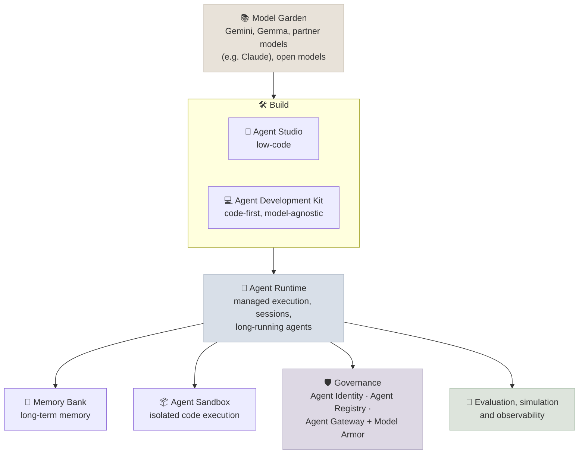

# Google Cloud: Gemini Enterprise Agent Platform

Google's managed AI platform was called **Vertex AI** until April 2026, when Google announced its evolution into the **Gemini Enterprise Agent Platform** and said all Vertex AI services and roadmap would be delivered through it. Most documentation, code samples and job descriptions still say "Vertex AI", so you need both names. This note maps the platform's parts to the concepts in this course and to their AWS and Azure counterparts.

```objectives
time: 30 min
outcomes:
  - Name the main components of Google's agent platform and what each does
  - Map them to the equivalent services on AWS (Bedrock, AgentCore) and Azure (Microsoft Foundry)
  - Choose between the managed agent runtime, GKE, and TPUs/GPUs for a given workload
prerequisites:
  - "[AWS Bedrock](01-AWS-Bedrock.mdx) - for the comparison"
```

## Naming, Then and Now

| You may read | Current framing (2026) |
|--------------|------------------------|
| Vertex AI | Gemini Enterprise Agent Platform ("the evolution of Vertex AI") |
| Vertex AI Agent Builder, Agent Engine | Agent Studio (low-code), ADK (code-first), Agent Runtime (managed execution) |
| Agentspace | Folded into the Gemini Enterprise product for end users |
| Vertex AI Model Garden | Model Garden (200+ models) |

---

## The Components



| Component | What it does | Course link |
|-----------|--------------|-------------|
| **Model Garden** | Catalog and deployment of Google, partner and open models | [Model Landscape](../../01-LLM-Foundations/Notes/07-Model-Landscape.mdx) |
| **Agent Studio / ADK** | Build agents visually or in code; ADK is Google's open-source agent framework | [Agent Frameworks](../../15-Agent-Frameworks/INDEX.mdx) |
| **Agent Runtime** | Hosts agents with sessions, scaling and support for long-running work | [Production Agents](../../16-Production-Agents/INDEX.mdx) |
| **Memory Bank** | Managed long-term memory across sessions | [Agent Foundations](../../12-Agent-Foundations/INDEX.mdx) |
| **Agent Sandbox** | Isolated execution for model-written code | [Production Agents](../../16-Production-Agents/INDEX.mdx) |
| **Agent Identity, Registry, Gateway** | Per-agent identities, an approved catalog of tools and skills, and a policy-enforcing gateway with Model Armor protection against prompt injection and data leakage | [Security & Compliance](../../08-Production-Engineering/Notes/04-Security-and-Compliance.mdx) |
| **Evaluation, simulation, observability** | Test agents before release and trace them in production | [Evaluation & Benchmarks](../../06-Evaluation/INDEX.mdx) |
| **Managed RAG and search** (historically RAG Engine and Vertex AI Search) | Managed retrieval over your documents | [Vertex AI RAG](../../11-RAG/Notes/08-Vertex-AI-RAG.mdx) |

---

## Where Workloads Run

| Workload | Managed option | Build-your-own option |
|----------|----------------|------------------------|
| Call a hosted model | Model Garden endpoints | - |
| Serve an open model | Model Garden one-click deploy | vLLM/SGLang on GKE with GPUs or TPUs (see [LLM Serving on Kubernetes](../../08-Production-Engineering/Notes/05-LLM-Serving-on-Kubernetes.mdx)) |
| Run an agent | Agent Runtime | Your framework on Cloud Run or GKE |
| Train or fine-tune | Managed tuning for supported models | GKE or TPU slices (Ironwood/TPU7x pods scale to 9,216 chips - see [Accelerators & Interconnects](../../03-Pretraining/Notes/07-Accelerators-and-Interconnects.mdx)) |

---

## Check Yourself

```quiz
- q: "A job description asks for 'Vertex AI Agent Engine' experience. What is the current equivalent?"
  options:
    - "Agent Runtime in the Gemini Enterprise Agent Platform"
    - "BigQuery ML"
    - "Cloud Functions"
    - "Model Armor"
  answer: 1
- q: "Which AWS and Azure services are the closest counterparts to Google's agent platform runtime?"
  answer: "Amazon Bedrock AgentCore (Runtime, Memory, Gateway, Identity, Observability) and the Microsoft Foundry Agent Service."
```

## Study Notes

**Must-know:**
- Vertex AI → Gemini Enterprise Agent Platform (announced April 2026); expect both names in the wild
- Components: Model Garden, Agent Studio, ADK, Agent Runtime, Memory Bank, Agent Sandbox, Agent Identity/Registry/Gateway with Model Armor, evaluation and observability
- Counterparts: AWS Bedrock + AgentCore; Microsoft Foundry + Foundry Agent Service
- Self-managed path: open models on GKE with GPUs or TPUs

## References

- Google Cloud, [Introducing Gemini Enterprise Agent Platform](https://cloud.google.com/blog/products/ai-machine-learning/introducing-gemini-enterprise-agent-platform) (April 2026)
- Google Cloud, [Agent Platform overview](https://docs.cloud.google.com/gemini-enterprise-agent-platform/overview)
- Google, [Agent Development Kit](https://adk.dev/)

*Last reviewed: 2026-09*
