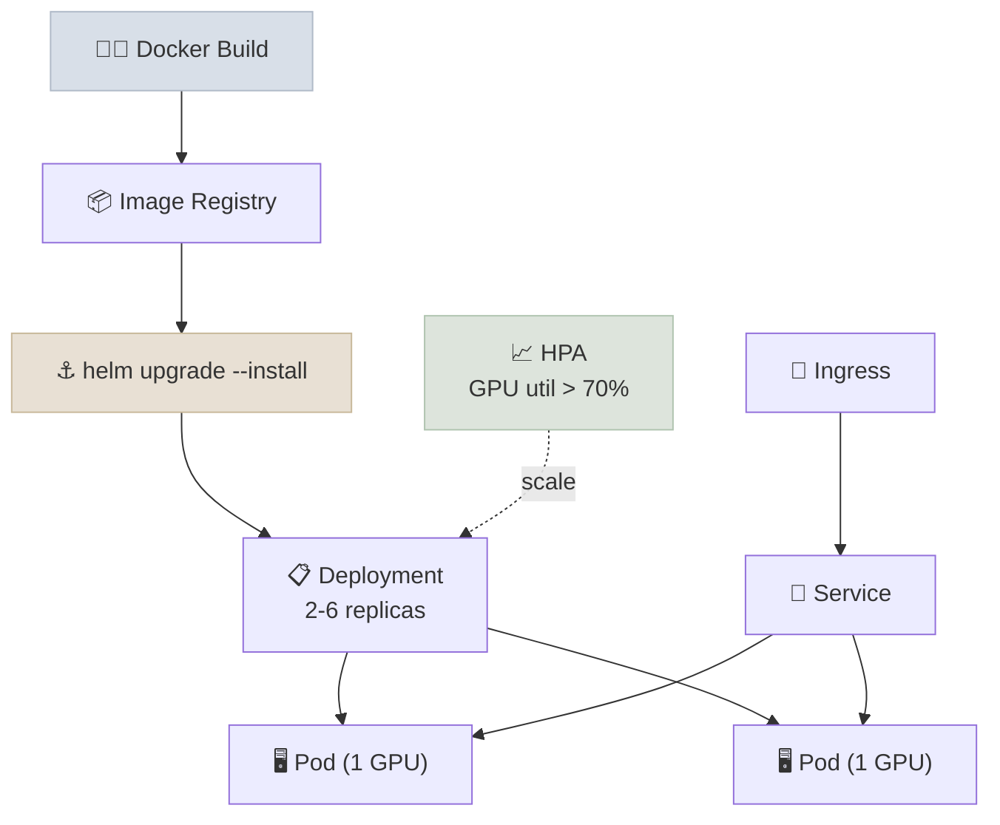

# Helm Chart & Release Checklist

Deploys the [Serving & Inference](../../../08-Serving-and-Inference/CodeLabs/01-FastAPI-vLLM-Endpoint.mdx) FastAPI + vLLM endpoint to Kubernetes with GPU scheduling and autoscaling, plus a standalone release-readiness checklist.

## Architecture



## What This Demonstrates

1. A GPU-inference Dockerfile using a multi-stage build (CUDA `-devel` for install, `-runtime` for the final image)
2. A Helm chart with proper `Chart.yaml`, environment-driven `values.yaml`, and templated Deployment/Service/HPA manifests
3. GPU resource requests/limits set equal, as required by the Kubernetes device plugin model
4. An HPA scaling on a custom GPU-utilization metric rather than default CPU/memory
5. A release-readiness checklist that turns the [Model Lifecycle & Rollout](../../../Notes/03-Model-Lifecycle-and-Rollout.mdx) note into something you'd actually hand to a team

## Running

```bash
# Pull in the serve.py this image packages (see Dockerfile comment)
cp ../../../08-Serving-and-Inference/CodeLabs/01-FastAPI-vLLM-Endpoint/serve.py .

# Build the image
docker build -t vllm-serving:latest .

# Validate the chart without touching a cluster
helm lint helm-chart/

# Render the manifests locally
helm template vllm-serving helm-chart/ -f helm-chart/values.yaml

# Validate against a real (even local kind/minikube) cluster without applying
helm install --dry-run vllm-serving helm-chart/ -f helm-chart/values.yaml

# Actually deploy
helm upgrade --install vllm-serving helm-chart/ -f helm-chart/values.yaml
```

See `release-readiness-checklist.md` for the one-page checklist to walk through before promoting a new model version to production.
