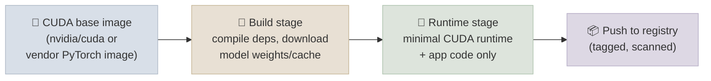

# Docker for GPU Inference

## The One-Line Definition

A GPU inference Dockerfile is a normal Python Dockerfile with three things bolted on: a CUDA-enabled base image instead of a plain Python one, a runtime that can actually see the host GPU, and a multi-stage build so the final image doesn't ship a full compiler toolchain to production.

<div class="audience-biz" markdown="1">

Packaging a model server into a container is not fundamentally different from packaging any other web service - except the container needs to talk to a physical GPU on the host machine, and the base image alone can be several gigabytes before a single line of application code is added. This page is about what actually changes versus a normal web-app Dockerfile, and how to keep the image from becoming unnecessarily bloated.

</div>

<div class="audience-tech" markdown="1">

This page assumes the FastAPI + vLLM serving stack from [08-Serving-and-Inference](../../08-Serving-and-Inference/CodeLabs/01-FastAPI-vLLM-Endpoint.mdx) as the thing being containerized, and builds toward the [Helm Chart & Release Checklist Code Lab](../CodeLabs/01-Helm-Chart-and-Release-Checklist.mdx) where this image gets deployed to Kubernetes.

</div>



---

## Why a Normal Python Dockerfile Doesn't Work

<div class="audience-biz" markdown="1">

A standard `python:3.11-slim` image has no idea a GPU exists. It has no CUDA driver bindings, no NVIDIA runtime libraries, and no way for `torch.cuda.is_available()` to ever return `True` inside the container, no matter how powerful the underlying machine is. GPU inference needs a base image that already carries the CUDA toolkit/runtime libraries that PyTorch and vLLM link against.

</div>

<div class="audience-tech" markdown="1">

Three things a GPU inference Dockerfile needs that a normal one doesn't:

1. **A CUDA-compatible base image** - either an official `nvidia/cuda:<version>-runtime-<os>` image, or a vendor-maintained image that already bundles a matching PyTorch build (e.g. `pytorch/pytorch:<version>-cuda<ver>-cudnn<ver>-runtime`). The CUDA version in the image must match what the installed PyTorch/vLLM wheel was built against - a mismatch is a common source of `CUDA driver version is insufficient` errors at container start, not build time.
2. **The NVIDIA Container Toolkit on the host**, not in the image. The image never bundles a GPU driver - drivers are host-level and version-pinned to the physical GPU. The container runtime (`docker run --gpus all`, or `nvidia` as the Kubernetes `runtimeClassName`) is what bridges the container's CUDA userspace libraries to the host's driver.
3. **Explicit `ENV NVIDIA_VISIBLE_DEVICES=all` and `NVIDIA_DRIVER_CAPABILITIES=compute,utility`** (usually already set in official CUDA base images) so the container requests GPU visibility correctly at the orchestrator level.

```dockerfile
# Won't work for GPU inference - no CUDA runtime present
FROM python:3.11-slim
RUN pip install torch vllm
# torch.cuda.is_available() -> False, always, regardless of the host GPU
```

```dockerfile
# Correct base for GPU inference
FROM nvidia/cuda:12.1.0-runtime-ubuntu22.04
RUN apt-get update && apt-get install -y python3.11 python3-pip
RUN pip install torch vllm
```

</div>

---

## Image Size Considerations

<div class="audience-biz" markdown="1">

CUDA base images are large before any application code is added - often 3-8 GB just for the base layer, versus a few hundred MB for a plain Python image. That size matters operationally: bigger images take longer to pull on every new pod/node, slow down autoscaling and rolling deploys, and cost more in registry storage and network egress at scale.

</div>

<div class="audience-tech" markdown="1">

Where the size actually comes from, and what to do about each source:

| Source | Typical size | Mitigation |
|---|---|---|
| CUDA runtime base image | 2-4 GB | Use `-runtime` variant, not `-devel` (no compiler toolchain needed at runtime) |
| PyTorch + CUDA-linked wheels | 3-6 GB | Pin exact versions; avoid pulling both CPU and GPU wheel variants |
| Model weights baked into the image | Multi-GB per model | Prefer mounting weights from a volume/object store at startup over `COPY`-ing them into the image (see below) |
| pip/apt build caches, `.git`, test files | 100s of MB - GBs if unmanaged | `--no-cache-dir` on pip, `rm -rf /var/lib/apt/lists/*`, `.dockerignore` |

**Should model weights live inside the image or be mounted at runtime?** Baking multi-GB weights into the image makes every rebuild re-push the full weight layer even for a one-line code change, and couples model versioning to container versioning. Mounting weights from a PersistentVolume, object storage (S3/GCS), or the HuggingFace Hub cache at container start keeps the image itself small and lets model version and code version roll independently - this is the pattern used in the [Helm Chart Code Lab](../CodeLabs/01-Helm-Chart-and-Release-Checklist.mdx)'s `values.yaml` (`modelPath` mounted as a volume rather than `COPY`'d).

</div>

---

## Multi-Stage Builds

<div class="audience-biz" markdown="1">

A multi-stage build compiles and installs everything needed to build the application in one throwaway stage, then copies only the finished artifacts into a clean, minimal final image - the compiler, build tools, and intermediate files never make it into what actually ships and runs in production.

</div>

<div class="audience-tech" markdown="1">

```dockerfile
# ---- Stage 1: build ----
FROM nvidia/cuda:12.1.0-devel-ubuntu22.04 AS builder
RUN apt-get update && apt-get install -y python3.11 python3-pip python3.11-venv
WORKDIR /build
COPY requirements.txt .
RUN python3.11 -m venv /opt/venv \
    && /opt/venv/bin/pip install --no-cache-dir -r requirements.txt

# ---- Stage 2: runtime ----
FROM nvidia/cuda:12.1.0-runtime-ubuntu22.04
RUN apt-get update && apt-get install -y python3.11 --no-install-recommends \
    && rm -rf /var/lib/apt/lists/*
COPY --from=builder /opt/venv /opt/venv
ENV PATH="/opt/venv/bin:$PATH"
WORKDIR /app
COPY serve.py .
EXPOSE 8000
CMD ["python3.11", "serve.py"]
```

**Why this matters here specifically:** the `-devel` CUDA image (with `nvcc`, headers, and build tools for compiling packages like `flash-attn` from source) can be 2-3 GB larger than the `-runtime` variant. Building in a `-devel` stage and shipping only the resulting virtualenv on a `-runtime` base can meaningfully cut final image size while keeping the exact same compiled binaries. See the [Code Lab Dockerfile](../CodeLabs/01-Helm-Chart-and-Release-Checklist/Dockerfile) for a complete, runnable version of this pattern.

</div>

**Interview Q:** *A teammate suggests `FROM python:3.11-slim` and installing `torch` with CUDA support via pip, arguing it's simpler than a CUDA base image. What's wrong with that plan?*
The GPU-enabled `torch` wheel includes CUDA *userspace* libraries, but the container still has no CUDA *runtime* environment (`libcuda.so`, driver bridge) unless the base image or host mount provides one - `torch.cuda.is_available()` will report `False` even though the wheel installed cleanly, because pip installing a CUDA-linked package doesn't install a CUDA runtime.

---

## Study Notes

**Must-know for interviews:**
- GPU inference images need a CUDA-compatible base image (official `nvidia/cuda` or a vendor PyTorch image) - a plain `python:slim` image cannot see the GPU no matter what's pip-installed on top
- GPU drivers live on the host, never in the image - the NVIDIA Container Toolkit (`--gpus all` in Docker, `runtimeClassName: nvidia` in Kubernetes) bridges the container's CUDA libraries to the host driver
- CUDA base images are large (multi-GB) before any app code - use `-runtime` not `-devel` variants for the final stage, and avoid baking model weights into the image
- Multi-stage builds let you compile in a fat `-devel` stage and ship only the resulting artifacts on a slim `-runtime` stage, cutting final image size without changing the compiled output
- Model weights are generally better mounted at container start (volume/object store) than `COPY`'d into the image, so model version and code version can roll independently

**Quick recall Q&A:**
- *Why does `torch.cuda.is_available()` return `False` inside a container even on a GPU host?* Because the container's base image has no CUDA runtime bridge to the host driver - either the base image lacks CUDA libraries, or the container runtime wasn't invoked with GPU access (`--gpus all` / `runtimeClassName: nvidia`).
- *What's the practical difference between a CUDA `-devel` and `-runtime` image tag?* `-devel` includes the full toolkit (`nvcc`, headers, static libs) for compiling CUDA code; `-runtime` includes only the shared libraries needed to run already-compiled CUDA binaries - `-runtime` is smaller and is what should ship in the final production image.
- *Why should model weights usually not be `COPY`'d into the Docker image?* It couples model version to container version (any weight update forces a full image rebuild/repush of multi-GB layers) and bloats the image - mounting weights from a volume or object store at startup decouples the two and keeps the image itself lean.
