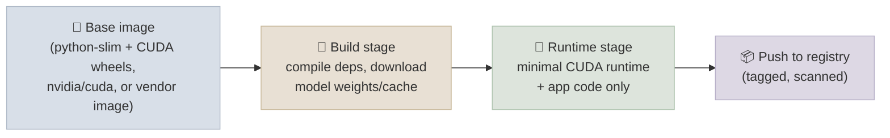

# Docker for GPU Inference

## The One-Line Definition

A GPU inference image is a normal Python image plus CUDA user-space libraries (from pip wheels or a CUDA base image), run with a container runtime that injects the host's GPU driver - and, when kernels must be compiled, a multi-stage build so the compiler toolchain never ships to production.

```objectives
time: 35 min
outcomes:
  - Explain which layer supplies the GPU driver, the CUDA libraries and the framework in a GPU container
  - Diagnose `torch.cuda.is_available() == False` in a container by checking GPU access, wheel variant and driver version in order
  - Choose between a slim Python base with CUDA wheels, a CUDA base image and a vendor image such as `vllm/vllm-openai`
  - Write a multi-stage Dockerfile that compiles in a `-devel` stage and ships a `-runtime` stage, with weights mounted rather than copied
prerequisites:
  - "[FastAPI + vLLM Endpoint](../../08-Serving-and-Inference/CodeLabs/01-FastAPI-vLLM-Endpoint.mdx) - the service being containerized"
```

<div class="audience-biz" markdown="1">

Packaging a model server into a container is not fundamentally different from packaging any other web service - except the container needs to talk to a physical GPU on the host machine, and the base image alone can be several gigabytes before a single line of application code is added. This page is about what actually changes versus a normal web-app Dockerfile, and how to keep the image from becoming unnecessarily bloated.

</div>

<div class="audience-tech" markdown="1">

This page assumes the FastAPI + vLLM serving stack from [Inference & Serving](../../08-Serving-and-Inference/CodeLabs/01-FastAPI-vLLM-Endpoint.mdx) as the thing being containerized, and builds toward the [Helm Chart & Release Checklist Code Lab](../CodeLabs/01-Helm-Chart-and-Release-Checklist.mdx) where this image gets deployed to Kubernetes.

</div>


```mermaid
flowchart LR
    Base["🧱 Base image\n(python-slim + CUDA wheels,\nnvidia/cuda, or vendor image)"] --> Build["🔧 Build stage\ncompile deps, download\nmodel weights/cache"]
    Build --> Runtime["🚀 Runtime stage\nminimal CUDA runtime\n+ app code only"]
    Runtime --> Registry["📦 Push to registry\n(tagged, scanned)"]

    style Base fill:#d8dfe8,stroke:#b0bac8
    style Build fill:#e8e0d4,stroke:#c8b89a
    style Runtime fill:#dde4dc,stroke:#b0c4b0
    style Registry fill:#ddd8e4,stroke:#b8b0c8
```

---

## What a GPU Container Actually Needs

<div class="audience-tech" markdown="1">

A GPU program in a container needs three layers, and only the last one comes from your image:

1. **The GPU driver - on the host, never in the image.** The driver (including `libcuda.so`) is tied to the host's kernel and GPU. The **NVIDIA Container Toolkit** injects the driver libraries and device nodes into the container when you run it with GPU access - `docker run --gpus all`, or in Kubernetes the NVIDIA device plugin plus the NVIDIA runtime (`runtimeClassName: nvidia` where required).
2. **CUDA user-space libraries** (runtime, cuBLAS, cuDNN, NCCL) - these *can* come from the image, and they must be supported by the host driver version (newer CUDA needs a newer driver).
3. **Your framework** - PyTorch, vLLM and similar.

So where do the CUDA libraries come from? **Pip wheels bring their own**: the Linux CUDA builds of `torch` and `vllm` depend on `nvidia-*` pip packages containing the CUDA runtime, cuBLAS, cuDNN and NCCL. A plain Python base image therefore works for many inference servers:

```dockerfile
# Works for pip-installed CUDA wheels, as long as the container runs with --gpus all
FROM python:3.12-slim
RUN pip install --no-cache-dir vllm
# docker run --gpus all ... -> torch.cuda.is_available() == True
```

A **CUDA base image** (`nvidia/cuda:<version>-runtime-<os>`, or a vendor image such as `vllm/vllm-openai` that pins CUDA, PyTorch and vLLM together) is the better choice when:

- you **compile** CUDA code (flash-attn or custom kernels from source) - that needs the `-devel` image's `nvcc` and headers, typically in a build stage;
- a library expects **system** CUDA libraries rather than pip-provided ones (some TensorRT and custom C++ builds);
- you want **one known-good combination** of CUDA, cuDNN and NCCL across every service.

```dockerfile
# CUDA runtime base + a virtualenv
FROM nvidia/cuda:12.8.1-runtime-ubuntu24.04
RUN apt-get update && apt-get install -y python3.12 python3.12-venv
# Ubuntu 24.04 blocks system-wide pip installs (PEP 668), so install into a virtualenv
RUN python3.12 -m venv /opt/venv && /opt/venv/bin/pip install vllm
ENV PATH="/opt/venv/bin:$PATH"
```

**When `torch.cuda.is_available()` is `False` in a container**, check in this order: the container was started without GPU access (no `--gpus`, missing device plugin or runtime class); a CPU-only wheel was installed (for example from the CPU index URL); or the host driver is too old for the wheel's CUDA version (`nvidia-smi` shows the maximum CUDA version the driver supports).

</div>

---

## Image Size Considerations

<div class="audience-biz" markdown="1">

CUDA base images are large before any application code is added - often 3-8 GB just for the base layer, versus a few hundred MB for a plain Python image. That size matters operationally: bigger images take longer to pull on every new pod/node, slow down autoscaling and rolling deploys, and cost more in registry storage and network egress at scale.

</div>

<div class="audience-tech" markdown="1">

Where the size actually comes from, and what to do about each source:

| Source | Typical size | Mitigation |
|---|---|---|
| CUDA runtime base image | 2-4 GB | Use `-runtime` variant, not `-devel` (no compiler toolchain needed at runtime) |
| PyTorch + CUDA-linked wheels | 3-6 GB | Pin exact versions; avoid pulling both CPU and GPU wheel variants. The wheels carry their own CUDA libraries, so on a CUDA base image you ship two copies - one reason the framework's own image or a slim base is often smaller |
| Model weights baked into the image | Multi-GB per model | Prefer mounting weights from a volume/object store at startup over `COPY`-ing them into the image (see below) |
| pip/apt build caches, `.git`, test files | 100s of MB - GBs if unmanaged | `--no-cache-dir` on pip, `rm -rf /var/lib/apt/lists/*`, `.dockerignore` |

**Should model weights live inside the image or be mounted at runtime?** Baking multi-GB weights into the image makes every rebuild re-push the full weight layer even for a one-line code change, and couples model versioning to container versioning. Mounting weights from a PersistentVolume, object storage (S3/GCS), or the HuggingFace Hub cache at container start keeps the image itself small and lets model version and code version roll independently - this is the pattern used in the [Helm Chart Code Lab](../CodeLabs/01-Helm-Chart-and-Release-Checklist.mdx)'s `values.yaml` (`modelPath` mounted as a volume rather than `COPY`'d).

</div>

---

## Multi-Stage Builds

<div class="audience-biz" markdown="1">

A multi-stage build compiles and installs everything needed to build the application in one throwaway stage, then copies only the finished artifacts into a clean, minimal final image - the compiler, build tools, and intermediate files never make it into what actually ships and runs in production.

</div>

<div class="audience-tech" markdown="1">

```dockerfile
# ---- Stage 1: build ----
FROM nvidia/cuda:12.8.1-devel-ubuntu24.04 AS builder
RUN apt-get update && apt-get install -y python3.12 python3-pip python3.12-venv
WORKDIR /build
COPY requirements.txt .
RUN python3.12 -m venv /opt/venv \
    && /opt/venv/bin/pip install --no-cache-dir -r requirements.txt

# ---- Stage 2: runtime ----
FROM nvidia/cuda:12.8.1-runtime-ubuntu24.04
RUN apt-get update && apt-get install -y python3.12 --no-install-recommends \
    && rm -rf /var/lib/apt/lists/*
COPY --from=builder /opt/venv /opt/venv
ENV PATH="/opt/venv/bin:$PATH"
WORKDIR /app
COPY serve.py .
EXPOSE 8000
CMD ["python3.12", "serve.py"]
```

**Why this matters here specifically:** the `-devel` CUDA image (with `nvcc`, headers, and build tools for compiling packages like `flash-attn` from source) can be 2-3 GB larger than the `-runtime` variant. Building in a `-devel` stage and shipping only the resulting virtualenv on a `-runtime` base can meaningfully cut final image size while keeping the exact same compiled binaries. See the [Code Lab Dockerfile](../CodeLabs/01-Helm-Chart-and-Release-Checklist/Dockerfile) for a complete, runnable version of this pattern.

</div>

---

## Study Notes

**Must-know for interviews:**
- The host provides the driver (injected by the NVIDIA Container Toolkit when the container runs with GPU access); the image provides CUDA user-space libraries - pip CUDA wheels bundle them, CUDA base images provide them system-wide and are needed for compiling kernels
- CUDA base images are large (multi-GB) before any app code - use `-runtime` not `-devel` variants for the final stage, and avoid baking model weights into the image
- Multi-stage builds let you compile in a fat `-devel` stage and ship only the resulting artifacts on a slim `-runtime` stage, cutting final image size without changing the compiled output
- Model weights are generally better mounted at container start (volume/object store) than `COPY`'d into the image, so model version and code version can roll independently

## Check Yourself

```quiz
- q: "Where does `libcuda.so` (the GPU driver library) come from inside a running GPU container?"
  options: ["It is installed by `pip install torch`", "It must be copied into the image from the `nvidia/cuda` base", "It is injected from the host by the NVIDIA Container Toolkit when the container runs with GPU access", "It is compiled by `nvcc` in the build stage"]
  answer: 3
  explain: "The driver is tied to the host kernel and GPU, so it never ships in the image; the toolkit mounts it in at run time (`--gpus all`, or the device plugin and runtime in Kubernetes)."
- q: "Which situation genuinely requires a CUDA `-devel` image (in at least one build stage)?"
  options: ["Running a pip-installed CUDA `torch` wheel", "Compiling flash-attn or a custom CUDA kernel from source", "Serving a model with `vllm serve`", "Using `--gpus all`"]
  answer: 2
  explain: "Only compilation needs `nvcc` and the CUDA headers. Prebuilt wheels run on a slim or `-runtime` base."
- q: "Why does `torch.cuda.is_available()` return `False` inside a container even on a GPU host?"
  answer: "Most often the container was started without GPU access (no `--gpus all`, missing device plugin or runtime class); otherwise a CPU-only wheel was installed, or the host driver is older than the CUDA version the wheel needs."
- q: "What's the practical difference between a CUDA `-devel` and `-runtime` image tag?"
  answer: "`-devel` includes the full toolkit (`nvcc`, headers, static libs) for compiling CUDA code; `-runtime` includes only the shared libraries needed to run already-compiled CUDA binaries - `-runtime` is smaller and is what should ship in the final production image."
- q: "Why should model weights usually not be `COPY`'d into the Docker image?"
  answer: "It couples model version to container version (any weight update forces a full image rebuild/repush of multi-GB layers) and bloats the image - mounting weights from a volume or object store at startup decouples the two and keeps the image itself lean."
- q: "A teammate suggests `FROM python:3.12-slim` and installing CUDA `torch` via pip, arguing it's simpler than a CUDA base image. Is that wrong?"
  answer: "Not necessarily - the CUDA wheels bundle the CUDA user-space libraries, and the NVIDIA Container Toolkit injects the host driver when the container runs with GPU access, so inference works. The trade-offs: no `nvcc` for compiling extensions such as flash-attn, less control over the exact CUDA/cuDNN/NCCL combination, and the host driver must still be new enough for the wheel's CUDA version. Many teams use the framework's own image (for example `vllm/vllm-openai`) to get a pinned, tested combination."
```

## Exercises

```exercise
- title: "Debug a GPU-less container"
  task: |
    A container built `FROM python:3.12-slim` with `pip install torch` prints `torch.cuda.is_available() == False` on a host with an H100. List the checks you would run, in order, and the command or evidence for each.
  hints: ["Three causes cover almost every case."]
  solution: |
    1. **GPU access** - was it started with `docker run --gpus all` (or, in Kubernetes, does the pod request `nvidia.com/gpu` on a node with the device plugin and NVIDIA runtime)? Inside the container, `nvidia-smi` or `ls /dev/nvidia*` should succeed.
    2. **Wheel variant** - `python -c "import torch; print(torch.version.cuda)"`. `None` means a CPU-only wheel was installed; reinstall from the CUDA index.
    3. **Driver version** - `nvidia-smi` on the host shows the highest CUDA version the driver supports; it must be at least the wheel's `torch.version.cuda` (minor-version compatibility aside). Upgrade the driver or pick a wheel built for an older CUDA.
- title: "Shrink an image"
  task: |
    An image is 14 GB: `nvidia/cuda:*-devel` base (≈7 GB), CUDA `torch` + vLLM wheels (≈5 GB), and a 2 GB model copied in with `COPY`. Propose changes and estimate the new size.
  solution: |
    - Move compilation (if any) to a `-devel` build stage and ship on a slim or `-runtime` base: the `-devel` toolkit is several GB you do not need at run time. Since the wheels bundle their own CUDA libraries, a `python:3.12-slim` base (≈0.15 GB) is enough if nothing is compiled.
    - Mount the weights from a volume or object store instead of `COPY` - removes 2 GB and decouples model and code versions.
    - `--no-cache-dir`, cleaned apt lists and a `.dockerignore`.
    
    Result: roughly 5-6 GB (wheels plus a slim base), down from 14 GB - and a code change no longer re-pushes the weights.
```

## References

- NVIDIA, [Container Toolkit documentation](https://docs.nvidia.com/datacenter/cloud-native/container-toolkit/latest/) (2026)
- NVIDIA, [CUDA compatibility](https://docs.nvidia.com/deploy/cuda-compatibility/) - driver vs toolkit versions (2026)
- PyTorch, [Get Started - install matrix](https://pytorch.org/get-started/locally/) (2026)
- Docker, [Multi-stage builds](https://docs.docker.com/build/building/multi-stage/) (2026)

*Last reviewed: 2026-09*
