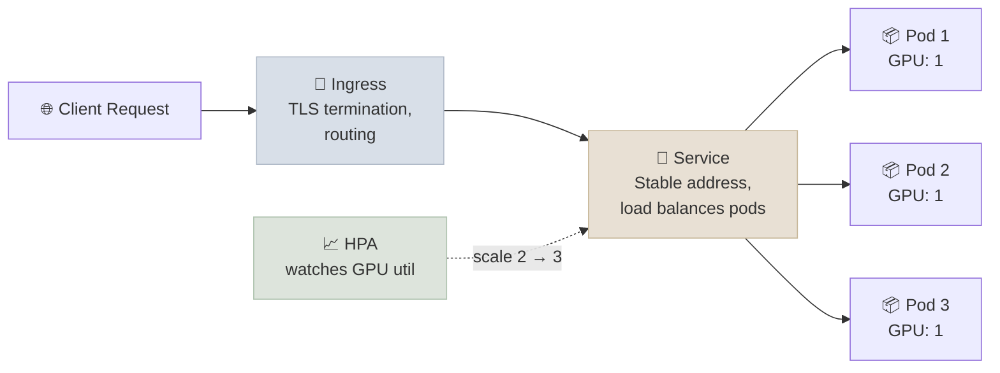

# Kubernetes and Helm

Kubernetes is the system that keeps your model-serving app running in production - it restarts crashed pods, spreads traffic across replicas, and scales up when demand spikes. Helm is the packaging layer on top: instead of hand-editing a dozen YAML files per environment, you fill in one small values file and Helm generates the rest.

A GPU inference workload on Kubernetes needs the same core objects as any web service (Deployment, Service, Ingress) plus GPU-specific scheduling concerns (node pools, resource requests, autoscaling triggers that account for GPU utilization, not just CPU). Helm templates the boilerplate so the same chart deploys to dev/staging/prod with different `values.yaml` overrides.

---

## The Core Objects

Four building blocks cover most of what you need: a Deployment (how many copies of your app to run and how to update them), a Service (a stable network address for those copies), an Ingress (the public door into your cluster), and an HPA (a rule that adds more copies automatically under load).

- **Deployment** - declares desired replica count, the pod template (container image, resource requests/limits, GPU count via `nvidia.com/gpu: 1`), and the rollout strategy (`RollingUpdate` with `maxSurge`/`maxUnavailable`)
- **Service** - a stable ClusterIP/virtual address in front of a set of pods selected by label, so pods can restart or reschedule without clients needing to track individual pod IPs
- **Ingress** - routes external HTTP(S) traffic into the cluster to the right Service, usually via an ingress controller (nginx, Traefik) that terminates TLS
- **HorizontalPodAutoscaler (HPA)** - watches a metric (CPU/memory by default; GPU utilization requires a custom metrics adapter like DCGM exporter + Prometheus Adapter) and adjusts replica count within a min/max band

---

## GPU Scheduling and Node Pools

GPU machines are expensive, so most clusters keep them in a separate pool from regular CPU machines and use "taints" to stop ordinary workloads from accidentally landing there. Your model-serving pods carry a matching "toleration" that says, in effect, "I'm allowed on the expensive machines."

GPU node pools are tainted (e.g. `nvidia.com/gpu=present:NoSchedule`) so only pods with a matching `tolerations` entry get scheduled there. The pod spec requests GPUs via `resources.limits."nvidia.com/gpu"` - Kubernetes' device plugin framework (the NVIDIA device plugin DaemonSet) advertises GPU capacity per node and the scheduler bin-packs accordingly. Unlike CPU/memory, GPU requests and limits must be equal - GPUs are not shareable/overcommittable by default (MIG partitioning is the exception, out of scope here).

---

## Helm Charts

A Helm chart is a template. You write the Kubernetes YAML once with placeholders (image tag, replica count, GPU count), then supply a short `values.yaml` per environment. `helm install` fills in the placeholders and applies the result - no more maintaining four near-identical copies of the same YAML.

A chart's structure: `Chart.yaml` (metadata, apiVersion), `values.yaml` (defaults), `templates/*.yaml` (Go-templated Kubernetes manifests referencing `.Values.x`). `helm template` renders the manifests without applying them (useful for review/diffing in CI); `helm install --dry-run` validates against the live cluster's API without creating resources; `helm upgrade --install` is the idempotent deploy command used in most pipelines. Terraform typically owns the layer underneath the chart - VPC, the GKE/EKS/AKS cluster itself, node pools, IAM - while Helm owns what runs inside the cluster.

---

## Study Notes

**Must-know for interviews:**
- Deployment + Service + Ingress + HPA are the four objects that cover most model-serving deployments
- GPU requests/limits must be equal - GPUs aren't overcommittable like CPU/memory
- Taints on GPU node pools + tolerations on pods keep non-GPU workloads off expensive machines
- Default HPA only watches CPU/memory - GPU-aware autoscaling needs a custom metrics pipeline (DCGM + Prometheus Adapter)
- Helm separates "what to deploy" (templates) from "how" per environment (values.yaml) - Terraform typically owns the cluster/infra layer beneath it

**Quick recall Q&A:**
- *Why can't you just set a GPU limit higher than the request, like you would for CPU?* GPUs aren't a divisible/shareable resource by default in Kubernetes - a pod either gets a whole GPU or it doesn't, so request and limit must match.
- *What does a taint on a GPU node pool actually do?* It repels any pod that doesn't explicitly declare a matching toleration, preventing regular CPU workloads from landing on and wasting expensive GPU machines.
- *What's the difference between `helm template` and `helm install --dry-run`?* `helm template` renders locally with no cluster contact; `helm install --dry-run` renders and also validates the result against the live cluster's API (catching schema errors `helm template` would miss).
