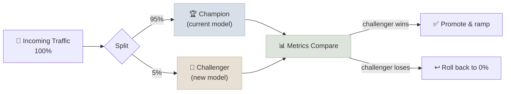

# Model Lifecycle and Rollout

Deploying a new model version isn't a light switch - it's a controlled rollout with an exit plan. The best teams decide in advance what "worse" looks like and how to back out, before a single real user sees the new version. Deciding that mid-incident, under pressure, is how bad rollbacks happen.

Model lifecycle management covers four concerns: tracking which model version is running where (registry), how a new version is introduced without a hard cutover (rollout strategy), how the new version is compared against the old one on live traffic (champion-challenger), and what automatically triggers a rollback (pre-decided criteria, not judgment calls made during an incident).

---

## Model Registry and Versioning

A model registry is a paper trail - which model version is currently serving, what data it was trained on, who approved it, and what the previous version was in case you need to go back.

Tools like MLflow Model Registry track a model's lineage: training run, metrics, artifacts, and stage (`Staging` / `Production` / `Archived`). This is metadata infrastructure - it doesn't move traffic by itself; it's the source of truth that rollout tooling (Kubernetes, a feature-flag/traffic-splitting layer) reads from when deciding what to deploy where. See [Fine-Tuning Lab](../../07-Fine-Tuning-Lab/Notes/04-Benchmarking-Base-vs-Tuned.mdx) for how the base-vs-tuned benchmark table this course builds earlier becomes the registry entry that justifies a promotion to `Production`.

---

## Rollout Strategies

Instead of switching every user to the new model at once, roll it out gradually - a small slice of traffic first, then more, watching for problems the whole way. If something looks wrong, you've only affected a fraction of users, and you can revert instantly.

- **Blue/green** - two full environments running simultaneously (old = blue, new = green); traffic cuts over atomically at the load balancer/Service level, and rollback is just cutting back
- **Canary** - a small percentage of traffic (e.g. 5%) routed to the new version while most stays on the old one; the percentage ramps up only if health/quality metrics hold
- **Champion-challenger** - both versions run continuously on live traffic (often via shadow traffic or a persistent small split), with the challenger promoted to champion only after it wins on the metrics that matter over a meaningful sample size

---

## Rollback Criteria, Decided Up Front

The single biggest cause of bad rollbacks isn't the rollback itself - it's not having agreed in advance what "bad enough to roll back" actually means. Write the thresholds down before launch, so the decision during an incident is "check the number against the line we already drew," not a debate.

Rollback criteria should be quantitative and pre-agreed: error rate above X%, p95 latency above Y ms, eval/quality score below Z, or a spike in a specific failure mode (refusal rate, tool-call failure rate - see [Agentic AI Evaluation & Observability](../../06-Agentic-AI/Notes/11-Evaluation-and-Observability.mdx)). Automating the rollback trigger (a monitor that reverts the traffic split when a threshold breaches) removes the temptation to "wait and see" during an incident.

---

## Study Notes

**Must-know for interviews:**
- A model registry (e.g. MLflow) is metadata/lineage tracking, not a deployment mechanism by itself
- Blue/green cuts over atomically; canary ramps gradually; champion-challenger compares continuously on live traffic
- Rollback criteria must be decided and quantified before launch, not during an incident
- The base-vs-tuned benchmark table from a fine-tuning workflow is exactly the evidence a registry promotion decision needs

**Quick recall Q&A:**
- *What's the difference between canary and champion-challenger?* Canary is a temporary, ramping traffic shift during a single rollout event; champion-challenger is an ongoing comparison pattern that can run continuously, not just during a deploy.
- *Why is "we'll decide if it's bad enough to roll back when we see it" a risky plan?* Under incident pressure, teams tend to under-react (hoping it self-resolves) or over-react (rolling back a false alarm) - pre-agreed quantitative thresholds remove that judgment call from the highest-stress moment.
- *What does a model registry actually store?* Lineage and metadata - training run, metrics, artifacts, and promotion stage - not the serving infrastructure itself.
