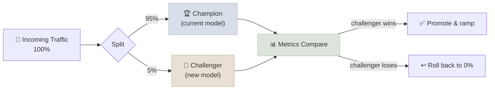

# Model Lifecycle and Rollout

<div class="audience-biz" markdown="1">

Deploying a new model version isn't a light switch - it's a controlled rollout with an exit plan. The best teams decide in advance what "worse" looks like and how to back out, before a single real user sees the new version. Deciding that mid-incident, under pressure, is how bad rollbacks happen.

</div>

<div class="audience-tech" markdown="1">

Model lifecycle management covers four concerns: tracking which model version is running where (registry), how a new version is introduced without a hard cutover (rollout strategy), how the new version is compared against the old one on live traffic (champion-challenger), and what automatically triggers a rollback (pre-decided criteria, not judgment calls made during an incident).

</div>

```objectives
time: 30 min
outcomes:
  - Explain what a model registry stores and how aliases (such as `@champion`) drive promotion
  - Compare blue/green, canary, shadow and champion-challenger rollouts and pick one for a scenario
  - Write quantified rollback criteria before launch, covering quality, latency, errors and cost
prerequisites:
  - "[Kubernetes & Helm](02-Kubernetes-and-Helm.mdx)"
  - "[Evaluation & Benchmarks](../../07-Evaluation/INDEX.mdx) - offline evaluation"
```

---

## Model Registry and Versioning

<div class="audience-biz" markdown="1">

A model registry is a paper trail - which model version is currently serving, what data it was trained on, who approved it, and what the previous version was in case you need to go back.

</div>

<div class="audience-tech" markdown="1">

Tools like MLflow Model Registry track a model's lineage: training run, metrics, artifacts, and which version is currently promoted. Current MLflow does this with **aliases** (mutable named pointers such as `@champion` and `@challenger`) and tags; the older fixed stages (`Staging` / `Production` / `Archived`) have been deprecated since MLflow 2.9. Serving code loads `models:/support-bot@champion`, and promotion is just moving the alias. This is metadata infrastructure - it doesn't move traffic by itself; it's the source of truth that rollout tooling (Kubernetes, a feature-flag/traffic-splitting layer) reads from when deciding what to deploy where. See [Fine-Tuning Lab](../../06-Fine-Tuning-Lab/Notes/04-Benchmarking-Base-vs-Tuned.mdx) for how the base-vs-tuned benchmark table this course builds earlier becomes the registry entry that justifies moving the `@champion` alias to the new version.

</div>

---

## Rollout Strategies

<div class="audience-biz" markdown="1">

Instead of switching every user to the new model at once, roll it out gradually - a small slice of traffic first, then more, watching for problems the whole way. If something looks wrong, you've only affected a fraction of users, and you can revert instantly.

</div>

<div class="audience-tech" markdown="1">

- **Blue/green** - two full environments running simultaneously (old = blue, new = green); traffic cuts over atomically at the load balancer/Service level, and rollback is just cutting back
- **Canary** - a small percentage of traffic (e.g. 5%) routed to the new version while most stays on the old one; the percentage ramps up only if health/quality metrics hold
- **Shadow** - the new version receives a mirrored copy of live requests and its responses are logged but never returned to users; no user risk, but double the compute and no signal on user reactions
- **Champion-challenger** - both versions run continuously on live traffic (often via shadow traffic or a persistent small split), with the challenger promoted to champion only after it wins on the metrics that matter over a meaningful sample size

</div>


```mermaid
flowchart LR
    T["🚦 Incoming Traffic\n100%"] --> S{"Split"}
    S -->|"95%"| C["🏆 Champion\n(current model)"]
    S -->|"5%"| Ch["🥊 Challenger\n(new model)"]
    C --> M["📊 Metrics Compare"]
    Ch --> M
    M -->|"challenger wins"| P["✅ Promote & ramp"]
    M -->|"challenger loses"| R["↩️ Roll back to 0%"]

    style C fill:#d8dfe8,stroke:#b0bac8
    style Ch fill:#e8e0d4,stroke:#c8b89a
    style M fill:#dde4dc,stroke:#b0c4b0
```

---

## Rollback Criteria, Decided Up Front

<div class="audience-biz" markdown="1">

The single biggest cause of bad rollbacks isn't the rollback itself - it's not having agreed in advance what "bad enough to roll back" actually means. Write the thresholds down before launch, so the decision during an incident is "check the number against the line we already drew," not a debate.

</div>

<div class="audience-tech" markdown="1">

Rollback criteria should be quantitative and pre-agreed: error rate above X%, p95 latency above Y ms, eval/quality score below Z, or a spike in a specific failure mode (refusal rate, tool-call failure rate - see [Agent Evaluation and Benchmarks](../../17-Production-Agents/Notes/05-Agent-Evaluation-and-Benchmarks.mdx)). Automating the rollback trigger (a monitor that reverts the traffic split when a threshold breaches) removes the temptation to "wait and see" during an incident.

</div>

---

## Study Notes

**Must-know for interviews:**
- A model registry (e.g. MLflow) is metadata/lineage tracking, not a deployment mechanism by itself
- Blue/green cuts over atomically; canary ramps gradually; champion-challenger compares continuously on live traffic
- Rollback criteria must be decided and quantified before launch, not during an incident
- The base-vs-tuned benchmark table from a fine-tuning workflow is exactly the evidence a registry promotion decision needs

## Check Yourself

```quiz
- q: "You want to see how a new model behaves on real traffic without any user seeing its answers. Which strategy fits?"
  options: ["Blue/green", "Canary at 5%", "Shadow deployment - mirror requests to the new model and discard its responses", "Rolling update"]
  answer: 3
  explain: "Every other option serves some users from the new version. Shadowing costs extra compute but carries no user risk."
- q: "In MLflow's current registry, how is \"the version production should serve\" usually marked?"
  options: ["By the `Production` stage", "By an alias such as `@champion` that points at a version", "By the highest version number", "By a Git tag"]
  answer: 2
  explain: "Stages are deprecated in favour of aliases; moving an alias is an instant promotion or rollback."
- q: "What's the difference between canary and champion-challenger?"
  answer: "Canary is a temporary, ramping traffic shift during a single rollout event; champion-challenger is an ongoing comparison pattern that can run continuously, not just during a deploy."
- q: "Why is \"we'll decide if it's bad enough to roll back when we see it\" a risky plan?"
  answer: "Under incident pressure, teams tend to under-react (hoping it self-resolves) or over-react (rolling back a false alarm) - pre-agreed quantitative thresholds remove that judgment call from the highest-stress moment."
- q: "What does a model registry actually store?"
  answer: "Lineage and metadata - training run, metrics, artifacts, and promotion status (aliases such as `@champion`) - not the serving infrastructure itself."
```

## Exercises

```exercise
- title: "Rollback criteria for a canary"
  task: |
    A fine-tuned support model replaces the current one through a canary (5% → 25% → 100%). Write four quantified rollback criteria and say how each is measured.
  solution: |
    Example (numbers depend on the product):
    
    | Criterion | Threshold | Measured by |
    |---|---|---|
    | Quality | Resolution rate or judge score more than 2 points below the champion, significant at 95% | Online eval on a sample of canary vs control traffic |
    | Latency | p95 TTFT above 800 ms for 10 minutes | Serving metrics per version label |
    | Errors | 5xx or malformed-output rate above 1% | Gateway logs and output validators |
    | Cost | Tokens per resolved conversation up more than 20% | Usage logs per version |
    
    Each stage runs long enough to collect the samples the quality test needs; any breach reverts the traffic split (or moves the alias back) automatically.
```

## References

- MLflow, [Model Registry](https://mlflow.org/docs/latest/ml/model-registry/) - aliases (2026)
- Google, [The Site Reliability Workbook - Canarying Releases](https://sre.google/workbook/canarying-releases/) (2018)

*Last reviewed: 2026-09*
