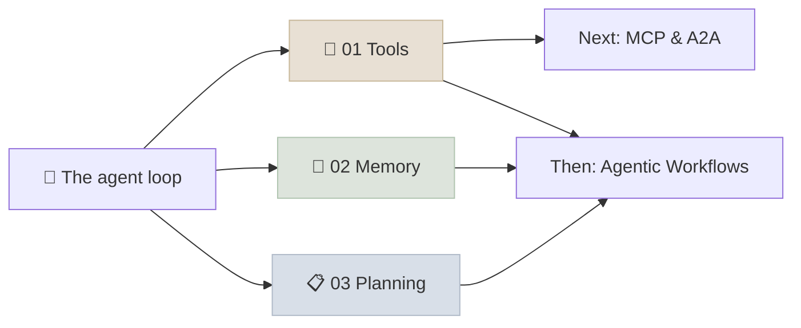

# 10 - Agent Building Blocks

Every agent is assembled from the same parts. This module covers the three that decide whether an agent works: **tools** (how the model acts on the world, and how to design schemas and errors it uses reliably), **memory** (what the agent keeps in context, in task state and across sessions) and **planning** (how it decides what to do next, and when reflection helps). [Agent Protocols: MCP & A2A](../11-MCP-and-A2A/INDEX.mdx) then standardizes how tools and other agents are connected, and [Agentic Workflows & Multi-Agent Systems](../12-Agentic-Workflows/INDEX.mdx) composes these blocks into patterns.

```objectives
scope: module
time: 3-4 hours
outcomes:
  - Design tools, schemas and error messages a model uses reliably, and scale to large tool sets with tool search
  - Design working memory, task state and long-term memory (semantic, episodic, procedural), and name their risks
  - Choose a planning strategy - native reasoning, ReAct, plan-and-execute, ReWOO - and know when reflection helps
prerequisites:
  - "[The Agent Loop](../09-Agent-Fundamentals/Notes/03-The-Agent-Loop.mdx) - the loop these blocks plug into"
  - "[Structured Outputs](../05-Prompt-Engineering/Notes/04-Structured-Outputs.mdx) and [Context Engineering](../05-Prompt-Engineering/Notes/06-Context-Engineering.mdx)"
```

## Where This Module Fits



## Chapter Map

| # | Chapter | You will learn | Time |
|---|---|---|---|
| 1 | [Tool Use & Function Calling](Notes/01-Tool-Use-and-Function-Calling.mdx) | Strict schemas, tool_choice, tool design, errors, idempotency, tool search | 60 min |
| 2 | [Agent Memory](Notes/02-Agent-Memory.mdx) | One taxonomy; context management; checkpoints; Letta, Mem0, Zep, LangMem; poisoning | 60 min |
| 3 | [Planning & Reasoning](Notes/03-Planning-and-Reasoning.mdx) | Reasoning models, ReAct, plan-and-execute, ReWOO, LLMCompiler, reflection, todo lists | 50 min |

Practice with the [Agent Loop from Scratch](../09-Agent-Fundamentals/CodeLabs/01-Agent-Loop-from-Scratch.mdx) lab: its tool descriptions and validation are the tool-design ideas of chapter 1 under measurement.

## Review

- [Q&A Review Bank](Notes/04-Interview-QA-Bank.mdx) - interview-style questions on tools, memory and planning
- [Module quiz](/quiz/agent-building-blocks) - every *Check Yourself* question in this module
- [Summary & Key Terms](APPENDIX.mdx) - a quick recap of this module and its essential vocabulary

---

## Next Topic

Previous: [09 - Introduction to AI Agents](../09-Agent-Fundamentals/INDEX.mdx) · Next: [11 - Agent Protocols: MCP & A2A](../11-MCP-and-A2A/INDEX.mdx)
