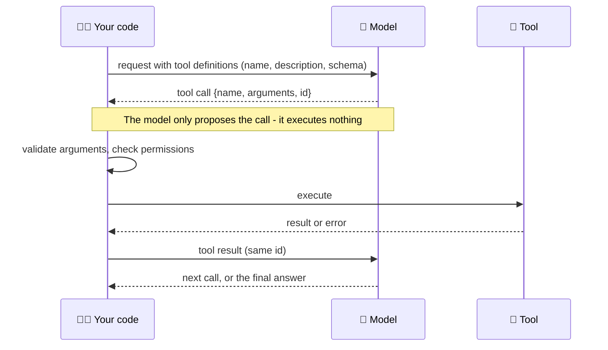

# Tool Use & Function Calling

Tool use (function calling) is how a model acts: you describe functions with a name, a description and a JSON Schema; the model replies with a structured call instead of text; **your code** runs it and returns the result. This chapter covers the mechanics across providers, how to design tools a model uses well, how to scale to hundreds of tools, and the safety properties write tools need.

```objectives
time: 60 min
outcomes:
  - Describe the define-decide-execute-return cycle and which side (model or your code) does each step
  - Write tool definitions with strict schemas and descriptions that state when to call the tool
  - Choose tool_choice and parallel-call settings, and explain the portability differences between providers
  - Design tool outputs and errors for the model's next step - concise, identifiable, actionable
  - Pick a strategy for large tool sets - fewer tools, tool search, deferred loading or programmatic calling
prerequisites:
  - "[The Agent Loop](../../09-Agent-Fundamentals/Notes/03-The-Agent-Loop.mdx)"
  - "[Structured Outputs](../../05-Prompt-Engineering/Notes/04-Structured-Outputs.mdx) - JSON Schema and constrained decoding"
```

## The Cycle: Define, Decide, Execute, Return



Models were post-trained on this format: tool definitions are rendered into the prompt through the model's chat template, and the model learns to emit calls in a special syntax that the server parses into structured `tool_calls`. That is why tool-use quality varies by model and why open models need the right **tool-call parser** on the server (for example vLLM's `--tool-call-parser`).

### The same tool in three APIs

| | Claude Messages | OpenAI Responses | Chat Completions (OpenAI-compatible servers) |
|---|---|---|---|
| Definition | `{name, description, input_schema}` | `{type: "function", name, description, parameters, strict}` | `{type: "function", function: {name, description, parameters}}` |
| Model's call | `tool_use` block: `id`, `name`, `input` (object) | `function_call` item: `call_id`, `name`, `arguments` (JSON string) | `message.tool_calls[]`: `id`, `function.name`, `function.arguments` (string) |
| Your result | `tool_result` block with `tool_use_id`, optional `is_error` | `function_call_output` item with `call_id`, `output` | `{role: "tool", tool_call_id, content}` |

Gemini's API follows the same pattern with `functionDeclarations`, `functionCall` and `functionResponse` parts. The concepts transfer; the field names don't, which is one reason agent frameworks and [MCP](../../11-MCP-and-A2A/INDEX.mdx) exist.

---

## Schemas and Strict Mode

Without constraints, a model can emit arguments that don't match your schema: a missing field, a string where you wanted an integer, an invented extra key. **Strict mode** applies constrained decoding (see [Structured Outputs](../../05-Prompt-Engineering/Notes/04-Structured-Outputs.mdx)) so the arguments always validate:

- **OpenAI:** `"strict": true` on the function. Every object needs `"additionalProperties": false` and every property must be listed in `required`; express optional fields as nullable (`"type": ["string", "null"]`). The Responses API tries to normalise schemas to strict mode by default and falls back to best-effort if it can't.
- **Claude:** `"strict": true` on the tool guarantees schema-valid inputs.
- **Open models:** servers such as vLLM can apply grammar-constrained decoding to tool arguments; check your server's options.

Strict mode guarantees **shape, not truth**: `{"order_id": "O9999"}` is schema-valid and still wrong if that order doesn't exist. Always validate semantics in the tool (does the id exist, does it belong to this user, is the state transition allowed).

```python
# A tool with a strict schema (OpenAI Responses format)
{
    "type": "function",
    "name": "refund_item",
    "description": (
        "Refund one line item of a delivered order (the full quantity of that line). "
        "Call get_order first to find the item_id. Only works when the order status is 'delivered'. "
        "Returns the refunded amount."
    ),
    "parameters": {
        "type": "object",
        "properties": {
            "order_id": {"type": "string", "description": "Order id such as O1004 - never guess one"},
            "item_id": {"type": "integer", "description": "item_id from get_order"},
            "reason": {"type": ["string", "null"], "description": "Customer's reason, if given"},
        },
        "required": ["order_id", "item_id", "reason"],
        "additionalProperties": False,
    },
    "strict": True,
}
```

---

## Controlling When and How Tools Are Called

| Intent | Claude `tool_choice` | OpenAI `tool_choice` | Gemini `function_calling_config.mode` |
|---|---|---|---|
| Model decides (default) | `{"type": "auto"}` | `"auto"` | `AUTO` |
| Must call some tool | `{"type": "any"}` | `"required"` | `ANY` |
| Must call this tool | `{"type": "tool", "name": ...}` | `{"type": "function", "name": ...}` | `ANY` + `allowed_function_names` |
| No tools this turn | `{"type": "none"}` | `"none"` | `NONE` |
| Restrict to a subset | - (send fewer tools) | `{"type": "allowed_tools", ...}` | `allowed_function_names` |
| At most one call per turn | `disable_parallel_tool_use: true` | `parallel_tool_calls: false` | - |

Two portability notes. First, **forced tool choice is not universal**: some of the newest Claude models reject `any` and `tool` with a 400, so code that relies on forcing a call should use `auto` plus an explicit instruction and a check that a call was made - or, if the forced call only existed to extract JSON, use structured outputs instead. Second, forcing a tool on a reasoning model can skip useful thinking; prefer `auto` in agent loops and reserve forcing for single-step extraction.

---

## Designing Tools the Model Uses Well

The tool set is the model's user interface to your system - the **agent-computer interface** (Yang et al., 2024). Anthropic's guidance from building tools for its own agents (*Writing effective tools for agents*, 2025):

| Principle | In practice |
|---|---|
| **Choose the right tools** | Build tools around the agent's tasks, not your API's endpoints. One `schedule_meeting` that finds availability and books beats `list_users` + `list_events` + `create_event` for most agents |
| **Namespace related tools** | Prefix by service and resource (`crm_search_contacts`, `billing_get_invoice`) so the model can tell similar tools apart |
| **Return meaningful context** | Names and human-readable fields over opaque UUIDs; include what the model needs for its next step and nothing else |
| **Be token-efficient** | Paginate, filter and truncate with sensible defaults; Claude Code caps tool responses at 25,000 tokens by default. Offer a `response_format` of `concise` or `detailed` |
| **Engineer the descriptions** | Describe it as you would to a new colleague: what it does, **when to call it**, what each parameter means and where its value comes from, what it returns, and its limits |

Description checklist:

1. **Purpose and trigger** - "Call this when the user asks about an order's status or contents."
2. **Preconditions** - "Only works for pending orders."
3. **Argument provenance** - "Use the exact id from list_orders; never guess."
4. **Return shape** - "Returns status, items with item_id, and total."
5. **Neighbours** - "For refunds use refund_item, not cancel_order."

The [lab](../../09-Agent-Fundamentals/CodeLabs/01-Agent-Loop-from-Scratch.mdx) runs the same agent with full descriptions and with one-word descriptions and measures the difference.

### Errors the model can act on

A tool error is a message to the model. Compare:

```json
{"ok": false, "error": "400"}
{"ok": false, "error": "Order O1003 is shipped; only pending orders can be cancelled. You can offer a return after delivery.", "retryable": false}
```

The second tells the model what went wrong, whether retrying helps and what to do instead - which is how agents self-correct from environment feedback. On Claude, set `is_error: true` on the result. Classify errors as **retryable** (timeouts, rate limits - the harness should retry with backoff before the model even sees them) or **not retryable** (validation, permission, business rule - return to the model).

### Write tools: idempotency and approval

Agents retry. A write tool that isn't idempotent turns a network timeout into a double charge. Accept an **idempotency key** (derived from the episode id and step) and return the original result on a repeat:

```python
def create_invoice(customer_id: str, amount: float, idempotency_key: str) -> dict:
    if (existing := db.invoices.find_one({"idempotency_key": idempotency_key})):
        return {"invoice_id": existing["id"], "created": False}
    inv = db.invoices.insert({"customer_id": customer_id, "amount": amount,
                              "idempotency_key": idempotency_key})
    return {"invoice_id": inv["id"], "created": True}
```

Separate **read** tools (safe to call freely, safe to parallelise) from **write** tools (validate, scope to the current user, log, and gate irreversible ones behind human approval). Give each agent the smallest tool set its task needs: every extra write tool is extra blast radius if the agent is manipulated by injected content ([Production Agents](../../15-Production-Agents/INDEX.mdx)).

---

## Client Tools, Server Tools and Many Tools

**Client tools** run in your code - everything above. **Server tools** run on the provider's side inside the same API call: web search, web fetch, code execution, file search. They save you building infrastructure, but their results enter the context like any tool result, and long server-side loops can pause (`pause_turn` on Claude).

As tool counts grow, three problems appear: definitions consume context (a few dozen detailed tools can take tens of thousands of tokens), selection accuracy drops as similar tools multiply, and chained calls pour intermediate data into the context. The remedies:

| Technique | What it does | Reported effect |
|---|---|---|
| **Fewer, better tools** | Consolidate around tasks; remove overlapping tools | The first thing to try |
| **Tool search / deferred loading** | Mark tools `defer_loading`; the model searches for relevant tools and only those definitions are loaded (Claude tool search tool; OpenAI `tool_search` with namespaces) | Anthropic: 85% fewer tokens for tool definitions; MCP-eval accuracy 49% → 74% (Opus 4) and 79.5% → 88.1% (Opus 4.5) |
| **Programmatic tool calling** | The model writes code that calls tools in a sandbox; only the final output returns to the context | Anthropic: 37% fewer tokens on complex research tasks |
| **Tool-use examples** | Example calls attached to a tool definition | Anthropic: 72% → 90% on complex parameter handling |
| **Routing / sub-agents** | A router or sub-agent owns each tool group ([Agentic Workflows](../../12-Agentic-Workflows/INDEX.mdx)) | Keeps each context small |

The numbers above are vendor-reported on their own evaluations; treat them as direction, and measure on yours. Tool sets that change mid-conversation invalidate the prompt cache unless the API supports adding tools without rewriting the prefix - another reason to prefer deferred loading over editing `tools` between turns.

---

## Check Yourself

```quiz
- q: "What does strict mode guarantee about tool arguments?"
  options:
    - "They match the JSON Schema - not that the values are correct"
    - "They are correct for the user's request"
    - "The tool will succeed"
    - "The model will call the tool"
  answer: 1
- q: "In OpenAI strict mode, how do you express an optional parameter?"
  options:
    - "List it in required and make its type nullable, e.g. ['string', 'null']"
    - "Leave it out of required"
    - "Set additionalProperties to true"
    - "Use a default value"
  answer: 1
- q: "Your agent has 180 tools across 12 services and often picks the wrong one. Which change addresses both context cost and selection accuracy?"
  options:
    - "Deferred loading with tool search (plus consolidating overlapping tools)"
    - "Higher temperature"
    - "Forcing tool_choice to 'required'"
    - "Longer tool descriptions for all 180 tools"
  answer: 1
- q: "Why should a payment tool accept an idempotency key?"
  answer: "Agents and harnesses retry after timeouts and errors. With a key derived from the episode and step, a retried call returns the original result instead of charging twice."
- q: "Rewrite this error for the model: {\"error\": \"E_STATE\"}"
  answer: "Something like: {\"ok\": false, \"error\": \"Order O1003 is shipped; only pending orders can be cancelled. Offer the customer a return once it is delivered.\", \"retryable\": false} - it says what failed, why, whether to retry, and what to do instead."
```

## Exercises

```exercise
- title: Rewrite a tool set
  task: |
    An agent for an HR system has these tools: `get_emp(id)`, `get_emps()`, `upd(id, field, value)`, `q(sql)`. Redesign the tool set for an agent that answers employees' leave questions and books leave. Give names, descriptions, schemas and which tools need approval.
  solution: |
    For example: `hr_find_employee(email)`; `hr_get_leave_balance(employee_id)`; `hr_list_leave_requests(employee_id, status?)`; `hr_request_leave(employee_id, start_date, end_date, leave_type, idempotency_key)` with a description of the policy checks it performs. Remove `q(sql)` (arbitrary SQL is an injection and privacy risk) and the generic `upd`. Scope every tool to the authenticated employee; only `hr_request_leave` writes, and it can go through manager approval rather than agent approval.
- title: Measure descriptions
  task: |
    Run the lab with `--variants full,terse_tools --trials 4`. Which tasks change most between the variants? Look at the failing traces and classify each failure (wrong tool, wrong argument, skipped a step, claimed an action).
  solution: |
    In our reference run (Qwen3-8B) terse descriptions did not lower success (pass@1 0.61 vs 0.58 - within noise on 18 tasks) but roughly quadrupled invalid calls (0.32 vs 0.08 per episode): the model guessed argument names and types, got informative error results, and recovered. Good errors are a safety net for poor documentation; they cost extra calls and tokens and won't catch a wrong-but-valid call. Classify your own failures - each class has a different fix (description, schema, harness check).
- title: Count definition tokens
  task: |
    Take any MCP server or API you use and estimate the tokens its tool definitions would take in a prompt (the JSON length in characters divided by about 4). How many such servers could you attach before definitions exceed 20% of a 200K-token window?
  solution: |
    Detailed tools are often 200-800 tokens each. A 40-tool server at 500 tokens per tool is 20K tokens - two such servers use a fifth of a 200K window before any work starts, which is the case for deferred loading or tool search.
```

## Study Notes

- The model proposes calls; your code validates and executes them and returns results with the same id
- Field names differ across APIs (input_schema/parameters; tool_use/function_call/tool_calls; tool_result/function_call_output/tool role) - concepts don't
- Strict mode = schema-valid arguments via constrained decoding; still validate meaning in the tool
- tool_choice: auto / any-required / specific / none; forced choice is not supported by every model - prefer auto in loops
- Tool design: task-shaped tools, namespacing, meaningful and concise outputs, descriptions that say when to call and where arguments come from
- Errors are messages to the model: what, why, retryable, what instead
- Write tools: idempotency keys, per-user scoping, audit logs, approval for irreversible actions; least privilege per agent
- Many tools: consolidate; tool search / deferred loading; programmatic tool calling; examples; sub-agents

## References

- Anthropic, [Writing effective tools for agents - with agents](https://www.anthropic.com/engineering/writing-tools-for-agents) (Sep 2025)
- Anthropic, [Introducing advanced tool use on the Claude Developer Platform](https://www.anthropic.com/engineering/advanced-tool-use) (Nov 2025)
- OpenAI, [Function calling guide](https://developers.openai.com/api/docs/guides/function-calling) (docs, 2026)
- Anthropic, [Tool use with Claude](https://platform.claude.com/docs/en/agents-and-tools/tool-use/overview) (docs, 2026)
- Schick et al., [Toolformer: Language Models Can Teach Themselves to Use Tools](https://arxiv.org/abs/2302.04761) (NeurIPS 2023)
- Patil et al., [Gorilla: Large Language Model Connected with Massive APIs](https://arxiv.org/abs/2305.15334) (2023)
- Yang et al., [SWE-agent: Agent-Computer Interfaces Enable Automated Software Engineering](https://arxiv.org/abs/2405.15793) (NeurIPS 2024)

*Last reviewed: 2026-09*
