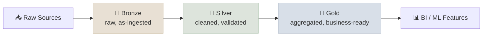

# Databricks and Spark

Databricks is a data-and-AI platform built around one core idea: a "lakehouse" - your raw data lake and your structured warehouse, unified into one system, so you're not maintaining two copies of the same data for two different purposes.

Databricks packages Apache Spark (distributed data processing) with governance (Unity Catalog), a table format with ACID guarantees (Delta Lake), and MLOps tooling (MLflow) into one managed platform. It's the AWS/Azure/GCP-agnostic answer to "where does data engineering and ML training actually run" - relevant wherever a JD mentions PySpark, Delta Lake, or Unity Catalog by name.

---

## The Lakehouse and Medallion Architecture

Data flows through three quality tiers on its way from raw to analysis-ready: Bronze (raw, as-ingested), Silver (cleaned, validated), Gold (aggregated, business-ready). Each tier is a real, queryable table - not a black box - so you can always trace a number back to its raw source.

The medallion architecture organizes tables by refinement stage: **Bronze** ingests raw data as-is (schema-on-read, append-only), **Silver** applies cleaning/dedup/schema enforcement, **Gold** aggregates into business-level tables (often star-schema, feeding BI or ML feature stores). Each stage is a Delta table, so lineage between stages is queryable, not implicit.

---

## Delta Lake and Unity Catalog

Delta Lake adds database-like reliability to files sitting in cloud storage - you can query a table as it looked yesterday, or roll back a bad write. Unity Catalog is the governance layer on top - who can see and touch which tables, tracked centrally instead of per-workspace.

**Delta Lake** is an open table format on top of Parquet adding ACID transactions, schema enforcement/evolution, and time travel (`SELECT * FROM table VERSION AS OF n` or `TIMESTAMP AS OF`). **Unity Catalog** provides a three-level namespace (`catalog.schema.table`), centralized access control, and lineage tracking across all workspaces in an account - the governance layer that answers "who can query this table" and "what fed into this table."

---

## MLflow and PySpark

MLflow tracks every training run so nothing gets lost - what data, what parameters, what result, and whether it's the version currently in production. PySpark is how you write data-processing code that scales across many machines instead of just one.

**MLflow** natively integrated into Databricks: `mlflow.log_metric`/`log_param`/`log_artifact` inside a training run, with the Model Registry (Staging/Production/Archived stages) as the natural continuation of [Model Lifecycle & Rollout](../../09-Production-Engineering/Notes/03-Model-Lifecycle-and-Rollout.mdx)'s registry concept - this is the concrete tool behind that note's abstract "registry" discussion. **PySpark** distributes computation via partitioning (splitting data across executors) and can trigger shuffles (expensive data movement between partitions) on operations like `groupBy`/`join` - Photon (Databricks' native execution engine) accelerates common Spark SQL/DataFrame operations without code changes.

---

## Cost Levers: DBU Pricing and Cluster Policies

Databricks charges per compute-second in a unit called a DBU, on top of the underlying cloud VM cost. Cluster policies let a platform team cap what kind of (and how much) compute any given team can spin up, keeping costs predictable.

DBU (Databricks Unit) pricing varies by workload type (jobs vs all-purpose interactive clusters vs SQL warehouses) and compute tier - all-purpose clusters cost more per DBU than automated job clusters, incentivizing scheduled jobs over long-running interactive clusters for production workloads. Cluster policies constrain instance types, autotermination timeouts, and max worker counts per team/workspace, the primary cost-control lever a platform/DSA role owns.

---

## Study Notes

**Must-know for interviews:**
- Medallion architecture: Bronze (raw) → Silver (cleaned) → Gold (business-ready), each a real queryable Delta table
- Delta Lake adds ACID transactions, schema enforcement, and time travel on top of Parquet
- Unity Catalog is the governance/access-control/lineage layer, using a `catalog.schema.table` namespace
- MLflow's Model Registry is the concrete implementation of the abstract "registry" concept from production lifecycle management
- Job clusters (automated) are cheaper per DBU than all-purpose interactive clusters - a real cost lever, not just an operational choice

**Quick recall Q&A:**
- *What does "time travel" mean in Delta Lake, concretely?* Querying a table as it existed at a prior version or timestamp (`VERSION AS OF` / `TIMESTAMP AS OF`), made possible because Delta Lake retains transaction history rather than overwriting files in place.
- *What problem does Unity Catalog solve that Delta Lake alone doesn't?* Centralized, account-wide access control and lineage across workspaces - Delta Lake gives you reliable tables, Unity Catalog governs who can see and query them.
- *Why would a platform team push production ML training onto job clusters instead of all-purpose clusters?* Job clusters (automated, spin up/down per run) bill at a lower DBU rate than all-purpose interactive clusters, and the cost difference compounds significantly at scale.
