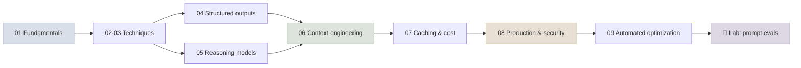

# 10 - Prompt & Context Engineering

How to get reliable, affordable behaviour from a model without changing its weights: writing prompts, constraining outputs, prompting reasoning models, choosing what goes into the context window, caching it, defending it, and optimizing it automatically - all measured with evals.

```objectives
scope: module
time: 9-11 hours (notes + lab)
outcomes:
  - Write and debug prompts using a clear model of what the model sees (chat templates, roles, tokens)
  - Apply and evaluate few-shot, chain-of-thought, self-consistency and decomposition techniques, and know when reasoning models make them unnecessary
  - Produce schema-valid outputs from hosted and open models with constrained decoding
  - Engineer the context window and prompt cache for quality, latency and cost
  - Ship prompts like code - versioned, eval-gated, monitored and defended against injection - and optimize them with DSPy
prerequisites:
  - "[LLM Foundations](../01-LLM-Foundations/INDEX.mdx) - tokenization, attention, next-token prediction"
  - "[Evaluation & Benchmarks](../06-Evaluation/INDEX.mdx) - building eval sets and confidence intervals"
```

## Where This Module Fits

Prompting is the first lever you pull - before retrieval, fine-tuning or agents - and the fastest to iterate on. Everything later in the course is built on it: [RAG](../11-RAG/INDEX.mdx) is context assembly for knowledge, and [agents](../12-Agent-Foundations/INDEX.mdx) are prompts, tools and context managed in a loop. Understanding [how LLMs work](../01-LLM-Foundations/INDEX.mdx) explains *why* the techniques work: tokenization explains letter-counting failures, attention explains position effects, and post-training explains why instructions and reasoning work at all.



## Chapter Map

| # | Chapter | You will learn | Time |
|---|---|---|---|
| 1 | [Prompt Fundamentals](Notes/01-Prompt-Fundamentals.mdx) | Prompt anatomy, chat templates, roles and the instruction hierarchy, tokens, sampling and non-determinism | 50 min |
| 2 | [Core Techniques](Notes/02-Core-Techniques.mdx) | Zero-/few-/many-shot, what examples teach, chain-of-thought, ReAct, personas | 55 min |
| 3 | [Advanced Techniques](Notes/03-Advanced-Techniques.mdx) | Self-consistency, Tree of Thoughts, least-to-most, chaining, self-refine and its limits | 50 min |
| 4 | [Structured Outputs](Notes/04-Structured-Outputs.mdx) | JSON mode vs schemas, constrained decoding (XGrammar, llguidance, Outlines), provider APIs, vLLM | 50 min |
| 5 | [Prompting Reasoning Models](Notes/05-Prompting-Reasoning-Models.mdx) | Effort controls, goal-first prompts, reasoning state in tool loops, inverse scaling | 40 min |
| 6 | [Context Engineering](Notes/06-Context-Engineering.mdx) | Long-context evidence, write/select/compress/isolate, arranging and budgeting the window | 45 min |
| 7 | [Prompt Caching & Cost](Notes/07-Prompt-Caching-and-Cost.mdx) | How prefix caches work, provider comparison, cache-friendly design, other cost levers | 40 min |
| 8 | [Prompts in Production](Notes/08-Prompts-in-Production.mdx) | Templates, versioning, eval gates, model drift, prompt injection and layered defences | 55 min |
| 9 | [Automated Prompt Optimization](Notes/09-Automated-Prompt-Optimization.mdx) | APE, OPRO, DSPy with MIPROv2 and GEPA, metrics and overfitting | 55 min |
| 10 | [Q&A Review Bank](Notes/10-Interview-QA-Bank.mdx) | 56 questions across the module | 60 min |

## Code Lab

| Lab | What you build | Runs on |
|---|---|---|
| [Prompt Evals & Structured Outputs](CodeLabs/01-Prompt-Evals-and-Structured-Outputs.mdx) | An eval harness comparing zero-/few-shot and free/constrained decoding on a local model, with bootstrap CIs | Laptop CPU, ~2 min |

## Mini-Project

Build and ship a **ticket triage prompt** for a real or synthetic dataset of at least 200 labelled items:

1. A versioned prompt template with category definitions and an enforced output schema.
2. An eval harness reporting accuracy per category with confidence intervals, gated in CI on a paired comparison.
3. A cost report: tokens per call, cache hit rate, and cost per 1,000 tickets at two reasoning-effort levels.
4. A security test set of 20 injection attempts embedded in tickets, with the defence layers you applied and their measured success rates.
5. One optimization run (few-shot bootstrap or MIPROv2) evaluated on a held-out test set.

Deliverables: the repository, a one-page results summary with intervals, and a short note on what you would change for production.

## Review

- [Q&A Review Bank](Notes/10-Interview-QA-Bank.mdx) - consolidated questions for this module
- [Module quiz](/quiz/prompt-engineering) - every *Check Yourself* question in this module, in course order

---

Previous: [09 - Cloud Platforms](../09-Cloud-Platforms/INDEX.mdx) · Next: [11 - RAG](../11-RAG/INDEX.mdx)
