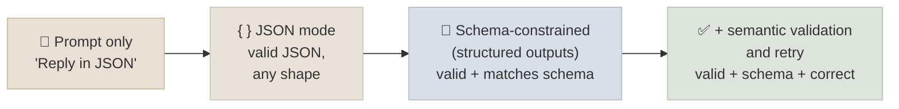
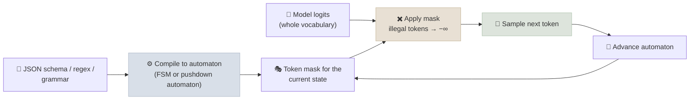

# Structured Outputs

Structured outputs make a model's response conform to a schema - JSON, a regex, an enum or a grammar - by constraining which tokens it is allowed to generate, so application code can parse every response.

```objectives
time: 50 min
outcomes:
  - Place prompt-only JSON, JSON mode, schema-constrained decoding and strict tool calling on a reliability ladder and pick one for a use case
  - Explain how constrained decoding works (token masks from a grammar) and why it can be nearly free at inference time
  - Request schema-constrained output from the major hosted APIs and from an open model served with vLLM or Outlines
  - Design schemas that don't hurt answer quality (field order, reasoning fields) and add the semantic validation that constraints can't provide
prerequisites:
  - "[Prompt Fundamentals](01-Prompt-Fundamentals.mdx)"
  - "[LLM Fundamentals](../../01-LLM-Foundations/Notes/01-LLM-Fundamentals.mdx) - decoding and logits"
```

## The Reliability Ladder



| Approach | Guarantees | Typical failures | Use when |
|---|---|---|---|
| **Prompt only** | Nothing | Preamble text, Markdown fences, trailing commentary, missing or renamed fields | Prototypes; models without constrained decoding |
| **JSON mode** | Syntactically valid JSON | Wrong keys, wrong types, extra fields | Legacy; prefer schemas |
| **Schema-constrained** ("structured outputs") | Output parses and matches the schema | Correctly shaped but wrong values; refusals | Any production extraction, classification or data-to-code step |
| **Strict tool calling** | Tool arguments match the tool's input schema | Wrong tool choice, wrong values | The model is choosing an *action*, not just returning data |
| **+ validation and retry** (e.g. Pydantic validators, `instructor`) | Business rules you can check in code | Retries cost latency and money | Values have constraints a JSON schema can't express, or constrained decoding isn't available |

A schema guarantee is about **shape, not truth**. `{"invoice_total": 1200.0}` is perfectly valid when the invoice says 120.00. Keep semantic checks (totals add up, dates are in range, IDs exist) in code, and measure accuracy with an eval set.

---

## How Constrained Decoding Works

At every step the model produces logits over the whole vocabulary. A constrained decoder computes which tokens could legally come next given the grammar and what has been generated so far, sets the logits of every other token to minus infinity, and samples from what remains.



Key ideas:

- **Regular languages** (regex, enums, JSON with bounded nesting) compile to a finite-state machine; Willard and Louf (2023, the paper behind Outlines) showed you can precompute, for each FSM state, which vocabulary tokens are allowed, so masking costs a lookup per step.
- **Context-free grammars** (arbitrary JSON nesting, SQL, code) need a pushdown automaton. XGrammar (Dong et al., 2024) splits tokens into those whose validity is context-independent (precomputed) and a small context-dependent set checked at runtime, bringing overhead to near zero. llguidance takes a similar approach, and both are used by major serving engines.
- **Token boundaries are the hard part.** Tokens don't align with grammar symbols (one token may close a string, add a comma and open the next key), which is why good libraries work at the token level rather than the character level.
- **Constraints can make generation faster**: when only one token is legal (a fixed key name, a brace), engines can emit it without sampling.

---

## Hosted APIs

All three major providers support JSON-schema constrained output. The SDKs accept a Pydantic model and return a parsed object.

```python
from pydantic import BaseModel
from typing import Literal

class Ticket(BaseModel):
    category: Literal["billing", "bug", "account_access", "feature_request"]
    urgent: bool
    summary: str
```

```python
# OpenAI - Responses API
from openai import OpenAI
resp = OpenAI().responses.parse(
    model=MODEL,  # see the Model Landscape for current names
    input=[{"role": "system", "content": "Classify the support ticket."},
           {"role": "user", "content": ticket_text}],
    text_format=Ticket,
)
ticket = resp.output_parsed
```

```python
# Anthropic - Messages API
import anthropic
resp = anthropic.Anthropic().messages.parse(
    model=MODEL,
    max_tokens=1024,
    messages=[{"role": "user", "content": f"Classify this support ticket:\n{ticket_text}"}],
    output_format=Ticket,
)
ticket = resp.parsed_output
```

```python
# Google Gemini - Interactions API (google-genai SDK)
from google import genai
interaction = genai.Client().interactions.create(
    model=MODEL,
    input=f"Classify this support ticket:\n{ticket_text}",
    response_format={"type": "text", "mime_type": "application/json",
                     "schema": Ticket.model_json_schema()},
)
```

Things to know:

- **Schemas are a subset of JSON Schema.** Providers typically require every property to be listed in `required` and `additionalProperties: false`, and support only some keywords. Model optional fields as nullable types (`str | None`) rather than omitting them.
- **Refusals don't match your schema.** If the model declines on safety grounds the response carries a refusal (a `refusal` item or stop reason) instead of your JSON - handle it before parsing.
- **Truncation breaks the guarantee.** If generation hits the output-token limit mid-object, you get invalid JSON. Check the stop reason and size `max_tokens` generously - for reasoning models the limit also covers thinking.
- **Structured outputs replace prefill.** On models that no longer accept a prefilled assistant turn, schema-constrained output is the supported way to force a format (see [Prompt Fundamentals](01-Prompt-Fundamentals.mdx)).
- **Strict tool calling** applies the same guarantee to tool arguments (`strict: true` on the tool definition). See [Tool Use & Function Calling](../../12-Agent-Foundations/Notes/05-Tool-Use-and-Function-Calling.mdx).

---

## Open Models

**Outlines** wraps a Hugging Face model and constrains it to a Pydantic type, regex, enum or grammar (this is what the [code lab](../CodeLabs/01-Prompt-Evals-and-Structured-Outputs.mdx) uses):

```python
import outlines
from transformers import AutoModelForCausalLM, AutoTokenizer

name = "Qwen/Qwen3-0.6B"
model = outlines.from_transformers(AutoModelForCausalLM.from_pretrained(name),
                                   AutoTokenizer.from_pretrained(name))
raw = model(prompt, output_type=Ticket, max_new_tokens=128)  # JSON string, guaranteed to parse
ticket = Ticket.model_validate_json(raw)
```

**vLLM** exposes the same capability through its OpenAI-compatible server (`response_format` with a `json_schema`) and offline through `SamplingParams(structured_outputs=StructuredOutputsParams(json=...))`, with XGrammar, llguidance or Outlines as the backend (chosen automatically by default). The older `guided_json` / `guided_*` parameters were removed in vLLM 0.12 - update code that still uses them.

```python
from vllm import LLM, SamplingParams
from vllm.sampling_params import StructuredOutputsParams

llm = LLM(model="Qwen/Qwen3-8B")
params = SamplingParams(max_tokens=256,
                        structured_outputs=StructuredOutputsParams(json=Ticket.model_json_schema()))
out = llm.generate([prompt], params)
```

---

## Do Constraints Hurt Quality?

Tam et al. (2024) reported that strict format constraints can lower accuracy on reasoning tasks compared with free-form answers, especially when the format forces the answer to come before the reasoning. Follow-up analyses (including from the Outlines team) argued most of the loss came from prompt and schema design rather than constraining itself. The practical rules that follow from both sides:

1. **Order fields so reasoning comes first.** Generation is left to right; a schema of `{"reasoning": ..., "answer": ...}` lets the model think before committing, while `{"answer": ..., "reasoning": ...}` forces it to answer first and justify afterwards.
2. **Keep the prompt's instructions consistent with the schema** - describe the fields and label definitions in the prompt as well.
3. **For reasoning models, the thinking happens before the constrained answer**, so a minimal answer-only schema is fine.
4. **For hard reasoning with a non-reasoning model, use two steps**: reason freely, then extract into the schema with a cheap call.
5. **Measure it.** In the code lab, constrained and free decoding scored within 2 points of each other on a four-way classification, with overlapping intervals - on your task the answer may differ.

---

## Check Yourself

```quiz
- q: "JSON mode is enabled, yet your parser rejects some responses with a KeyError. Why?"
  options:
    - "JSON mode guarantees valid JSON syntax, not your schema's keys and types"
    - "JSON mode only works at temperature 0"
    - "The tokenizer dropped the key"
    - "JSON mode requires few-shot examples"
  answer: 1
- q: "How does a constrained decoder prevent invalid output?"
  options:
    - "It masks the logits of tokens that cannot legally follow in the grammar's current state, so they can't be sampled"
    - "It retries until the output parses"
    - "It fine-tunes the model on the schema"
    - "It post-processes the text with regexes"
  answer: 1
- q: "A schema is {\"answer\": string, \"explanation\": string} and accuracy on a reasoning task dropped after adding it to a non-reasoning model. What is the cheapest fix to try first?"
  options:
    - "Reorder the fields so a reasoning/explanation field comes before the answer"
    - "Remove the schema and parse free text"
    - "Increase the temperature"
    - "Add more few-shot examples"
  answer: 1
  explain: "Generation is left to right. Putting the answer first forces the model to commit before reasoning."
- q: "Your structured-output call returns text that fails JSON parsing even though constrained decoding is on. Name two likely causes."
  answer: "(1) The output hit the max-token limit mid-object (check the stop reason - for reasoning models the limit also covers thinking). (2) The model refused, and the refusal message doesn't follow the schema. Handle both before parsing."
```

## Exercises

```exercise
- title: Make free generation fail
  task: |
    Extend the code lab's schema to a nested object: `{"category": ..., "urgent": bool, "entities": [{"type": "product|person|amount", "value": str}]}`. Run free and constrained generation on Qwen3-0.6B over the 52 test tickets. Compare the valid-output rate and accuracy on `category`.
  hints: ["Add the new fields to the Pydantic model and update SYSTEM so the prompt describes them."]
  solution: |
    With the flat one-field schema, free generation was 100% valid. With the nested schema, zero-shot free generation fell to 88.5% valid in our run while constrained decoding stayed at 100%; few-shot examples of the exact shape also restored validity. The benefit of constraints grows with schema complexity and shrinks with model capability and good examples.
- title: Semantic validation
  task: |
    Write a Pydantic model for an invoice (`line_items` with quantity and unit price, `subtotal`, `tax`, `total`) with validators that check the arithmetic. Wrap an extraction call so that a validation failure triggers one retry with the error message included in the prompt.
  solution: |
    Use a `model_validator(mode="after")` that checks subtotal equals the sum of quantity × unit_price (within rounding) and total equals subtotal + tax, raising ValueError with a specific message. On ValidationError, resend the original prompt plus "Your previous output failed validation: <message>. Fix it." Cap at one or two retries and log failures - schema-constrained decoding can't enforce these cross-field rules.
```

## Study Notes

**Must-know:**
- Prompt-only → JSON mode (syntax) → structured outputs (schema) → strict tools (action arguments); validate semantics in code
- Constrained decoding masks illegal tokens using an automaton compiled from the schema; XGrammar and llguidance make it near free
- Hosted APIs: OpenAI `responses.parse(text_format=...)`, Anthropic `messages.parse(output_format=...)`, Gemini `response_format` with a schema
- vLLM: `response_format` json_schema or `StructuredOutputsParams`; `guided_*` removed in 0.12
- Handle refusals and truncation; schemas support only a subset of JSON Schema
- Put reasoning fields before answer fields; shape ≠ correctness

## References

- Willard & Louf, [Efficient Guided Generation for Large Language Models](https://arxiv.org/abs/2307.09702) (2023) - the Outlines FSM approach
- Dong et al., [XGrammar: Flexible and Efficient Structured Generation Engine for Large Language Models](https://arxiv.org/abs/2411.15100) (MLSys 2025)
- Microsoft, [llguidance](https://github.com/guidance-ai/llguidance)
- Tam et al., [Let Me Speak Freely? A Study on the Impact of Format Restrictions on Performance of Large Language Models](https://arxiv.org/abs/2408.02442) (EMNLP 2024 Industry)
- OpenAI, [Structured Outputs guide](https://developers.openai.com/api/docs/guides/structured-outputs)
- Anthropic, [Structured outputs](https://platform.claude.com/docs/en/build-with-claude/structured-outputs)
- Google, [Gemini API structured output](https://ai.google.dev/gemini-api/docs/structured-output)
- vLLM, [Structured Outputs](https://docs.vllm.ai/en/latest/features/structured_outputs.html)
- [Outlines documentation](https://dottxt-ai.github.io/outlines/)

*Last reviewed: 2026-09*
