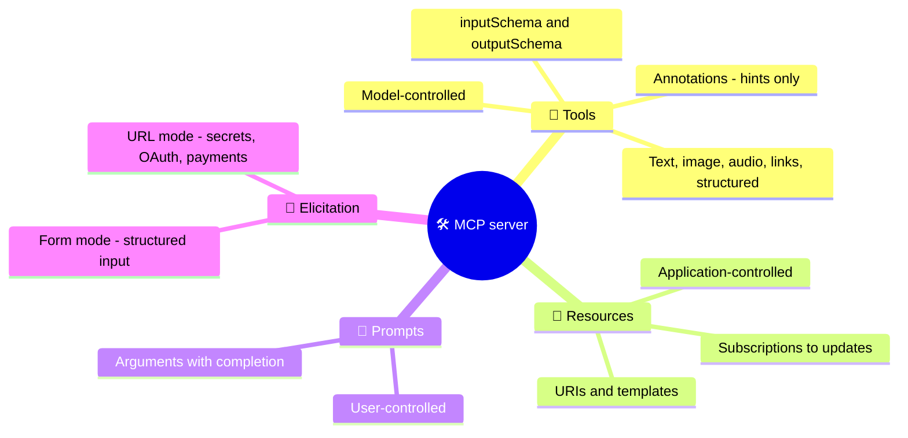

# MCP Server Features

What an MCP server can offer and how each feature is meant to be used: **tools** (with input and output schemas, annotations and rich results), **resources** (URI-addressed context), **prompts** (user-invoked templates), and **elicitation** (asking the user for input mid-request). The chapter ends with the client features deprecated in 2026-07-28 - roots, sampling and logging - and what replaces them.

```objectives
time: 55 min
outcomes:
  - Define an MCP tool with inputSchema, outputSchema, annotations and structured results, following the naming rules
  - Decide whether a capability should be a tool, a resource or a prompt, based on who controls it
  - Use form-mode and URL-mode elicitation correctly, including the rule that secrets never go through form mode
  - Design stateful tools with explicit handles and explain why annotations are untrusted hints
  - Replace deprecated roots, sampling and logging with their recommended alternatives
prerequisites:
  - "[Architecture & Protocol](02-Architecture-and-Protocol.mdx)"
  - "[Tool Use & Function Calling](../../10-Agent-Building-Blocks/Notes/01-Tool-Use-and-Function-Calling.mdx) - tool design principles"
```

## Overview



---

## Tools

A tool definition has a `name`, an optional human-readable `title`, a `description`, an `inputSchema` (JSON Schema; draft 2020-12 by default), an optional `outputSchema`, optional `annotations` and optional `icons`.

```json
{
  "name": "refund_item",
  "title": "Refund an order line",
  "description": "Refund one line item of a delivered order. Call get_order first for the item_id. Refunds over $100 ask the user to confirm.",
  "inputSchema": {
    "type": "object",
    "properties": {
      "order_id": {"type": "string", "description": "Order id such as O1004"},
      "item_id": {"type": "integer", "description": "item_id from get_order"}
    },
    "required": ["order_id", "item_id"],
    "additionalProperties": false
  },
  "outputSchema": {
    "type": "object",
    "properties": {"order_id": {"type": "string"}, "refund_amount": {"type": "number"}},
    "required": ["order_id", "refund_amount"]
  },
  "annotations": {"readOnlyHint": false, "destructiveHint": true, "idempotentHint": false, "openWorldHint": false}
}
```

**Names** should be 1-128 characters from `A-Z a-z 0-9 _ - .`, unique within the server. Clients that aggregate several servers must disambiguate collisions (two servers each exposing `search`), typically by prefixing a server identifier - and must not rely on server names being unique.

Everything in [Tool Use & Function Calling](../../10-Agent-Building-Blocks/Notes/01-Tool-Use-and-Function-Calling.mdx) applies: the description is a prompt, arguments need provenance, and errors should tell the model what to do next. In MCP, a failed execution is returned as a result with `isError: true` so the model can self-correct; unknown tools and malformed requests are JSON-RPC errors.

### Results

A result's `content` array can hold `text`, `image` and `audio` items, `resource_link` items (a URI the client may fetch or subscribe to) and embedded `resource` items. Content items can carry annotations - `audience` (`user`, `assistant`), `priority` and `lastModified` - so a host can, for example, show an image to the user without putting it in the model's context.

**Structured output.** A tool with an `outputSchema` must return `structuredContent` conforming to it (any JSON value), and should also return the same JSON serialised as text for older clients. Clients should validate it. Structured results let a host use tool output programmatically - render a table, chain into another tool - without parsing prose. (This is server-produced data, unrelated to schema-constrained *model* generation.)

### Annotations are hints, not guarantees

| Annotation | Meaning | Default |
|---|---|---|
| `readOnlyHint` | Doesn't modify its environment | `false` |
| `destructiveHint` | May perform destructive updates (meaningful when not read-only) | `true` |
| `idempotentHint` | Repeating the call with the same arguments has no further effect | `false` |
| `openWorldHint` | Interacts with an open set of external entities (the web) rather than a closed domain | `true` |

Hosts use annotations to decide UI - auto-approve read-only tools, require confirmation for destructive ones. But **clients must treat annotations as untrusted unless the server is trusted**: a malicious server can label `delete_everything` read-only. Base security decisions on your own allowlists, not on the server's self-description ([MCP Security](06-MCP-Security.mdx)).

### Stateful tools use handles

There are no sessions in 2026-07-28. A server that needs state across calls - a shopping cart, a browser tab, a database transaction - returns an explicit **handle** from a creation tool and accepts it as an argument later (`create_basket` → `{"basket_id": "bsk_a1b2c3"}` → `add_item(basket_id, sku)`). Design handles to be opaque and unguessable, **bind them to the authenticated user** and check that binding on every call (possession of a handle is not authentication), state their lifetime in the tool description, and return an actionable error when one has expired.

### The tool list

`tools/list` supports pagination and caching (`ttlMs`, `cacheScope`). The list must not vary per connection, but **may vary by the caller's authorization** - returning only the tools the token's scopes permit is a good least-privilege pattern. Return tools in a deterministic order, and emit `notifications/tools/list_changed` to subscribers when it changes.

---

## Resources

Resources are read-only data identified by a **URI** (`file:///repo/README.md`, `postgres://orders/schema`, `shop://policy`), with a `mimeType` and optional `title`, `description`, `size` and annotations. They are **application-controlled**: the host decides when to fetch them and how to present them - attach to context, let the user pick from a menu, or index them for retrieval.

| Operation | Purpose |
|---|---|
| `resources/list` | Enumerate concrete resources (paginated, cacheable) |
| `resources/templates/list` | Parameterised URIs using RFC 6570 templates, e.g. `orders://{order_id}` |
| `resources/read` | Fetch contents - `text` or base64 `blob` (may return an `InputRequiredResult`) |
| `subscriptions/listen` with `resourceSubscriptions` | Receive `notifications/resources/updated` when a resource changes |

Use a resource when the data is context the application or user should choose to include (a schema, a policy, a document); use a tool when the model should decide to fetch it, especially with parameters.

## Prompts

Prompts are **user-controlled** templates - typically surfaced as slash commands or menu items. A prompt has a name, description and arguments; `prompts/get` returns a list of messages (which can embed resources) ready to send to the model. `completion/complete` lets a client autocomplete prompt arguments and resource-template parameters as the user types.

Prompts are how a server packages expertise: `/review-pr` that pulls the diff and the team's review checklist, `/incident-summary` for an on-call tool.

---

## Elicitation: Asking the User

Elicitation lets a server ask the user for input in the middle of handling a request - delivered as an `elicitation/create` entry inside an `InputRequiredResult` ([multi round-trip requests](02-Architecture-and-Protocol.mdx#multi-round-trip-requests-mrtr)). The user answers **accept** (with content), **decline** or **cancel**, and the server must handle all three.

| | Form mode | URL mode |
|---|---|---|
| **How** | The client renders a form from a flat JSON Schema (strings with `email`/`uri`/`date`/`date-time` formats, numbers, booleans, single- and multi-select enums) | The client shows the full URL and, with consent, opens it in a secure browser context; the interaction happens out of band |
| **Data visible to the client** | Yes | No - only the URL |
| **Use for** | Confirmations, choosing between options, missing non-sensitive parameters | **Secrets, API keys, payments, third-party OAuth** |
| **Rule** | **Must not** request passwords, API keys, tokens or payment credentials | Must not put user secrets or pre-authenticated links in the URL; the server must verify the person completing the flow is the user who triggered it (anti-phishing) |

URL mode is how an MCP server obtains **third-party** authorization (say, to a user's calendar) without ever seeing or passing on the client's token - the server becomes an OAuth client of the third party and stores those tokens bound to the user. It is separate from, and never a substitute for, the MCP client's own authorization to the server ([Authorization](04-Authorization.mdx)).

Clients must make clear which server is asking, let the user review and edit form answers before sending, and let them decline at any time.

---

## Deprecated in 2026-07-28: Roots, Sampling, Logging

These client-side features still work during the twelve-month deprecation window, but new implementations should not adopt them:

| Feature | What it did | Use instead |
|---|---|---|
| **Roots** | Client told the server which directories or URIs it may operate on | Pass paths or URIs as tool parameters, resource URIs or server configuration |
| **Sampling** | Server asked the client's model to generate text (`sampling/createMessage`) | Call a model provider API directly from the server |
| **Logging** | Server sent log messages at a client-set level | Log to stderr (stdio) or emit OpenTelemetry; per-request log level remains available via `_meta` |

Sampling was elegant - a server could use the user's model without its own API key - but it made servers depend on unpredictable client models and complicated the stateless design; roots duplicated what arguments and configuration already express.

---

## Check Yourself

```quiz
- q: "A server's tool is annotated readOnlyHint: true. What should a client do with that?"
  options:
    - "Use it for UI hints if the server is trusted; never base security decisions on it for untrusted servers"
    - "Always auto-approve the tool"
    - "Reject the tool"
    - "Ignore annotations entirely"
  answer: 1
- q: "Your server needs the user's Stripe API key to finish a request. How should it get it?"
  options:
    - "URL-mode elicitation to a page on the server's own domain"
    - "Form-mode elicitation with a password field"
    - "Ask the model to request it in chat"
    - "Read it from the MCP access token"
  answer: 1
  explain: "Form mode must not request secrets, and using the client's token would be token passthrough."
- q: "What must accompany structuredContent for backwards compatibility?"
  options:
    - "The same JSON serialised in a text content block"
    - "An image rendering"
    - "A resource link"
    - "Nothing"
  answer: 1
- q: "Which is the recommended replacement for sampling?"
  options:
    - "Call a model provider API directly from the server"
    - "Elicitation"
    - "Resources"
    - "Prompts"
  answer: 1
- q: "Should a company style guide be a tool, a resource or a prompt?"
  answer: "Usually a resource (application-controlled context the host or user attaches), possibly embedded inside a prompt such as /draft-announcement. Make it a tool only if the model should decide to fetch parts of it on demand, e.g. search_style_guide(topic)."
```

## Exercises

```exercise
- title: Design a server
  task: |
    Design the MCP surface for a calendar integration: list the tools (with annotations), resources (with URIs or templates) and prompts, and where elicitation is needed and in which mode.
  solution: |
    Tools: calendar_find_free_slots (read-only, idempotent, closed world), calendar_create_event (not read-only, not destructive, not idempotent - use an idempotency key), calendar_cancel_event (destructive). Resources: calendar://{calendar_id}/today, calendar://settings/working-hours. Prompts: /schedule-meeting, /weekly-agenda. Elicitation: form mode to confirm attendees and time before create_event; URL mode for connecting a third-party calendar account via OAuth.
- title: Handles done right
  task: |
    Write the description and the server-side checks for a tool `add_to_cart(cart_id, sku, qty)` on an authenticated server.
  solution: |
    Description: "Add an item to a cart created with create_cart. cart_id comes from create_cart; carts expire after 24 hours of inactivity." Checks: cart exists and is not expired (else isError with "cart expired - call create_cart"); the cart's owner equals the user id from the verified access token (else isError/forbidden - never trust possession of the id); sku exists; qty within limits.
- title: Migrate off sampling
  task: |
    A 2025 server uses sampling to summarise long documents with the client's model. Plan its migration to 2026-07-28.
  solution: |
    Options: return the document (or a resource link) and let the host's model summarise it - often the simplest; or call a model API from the server with its own credentials and cost controls; for user-specific behaviour, expose a prompt the user can invoke. Keep the sampling path working for legacy clients until the deprecation window ends.
```

## Study Notes

- Tool = name (1-128 chars, [A-Za-z0-9_.-]), title, description, inputSchema, optional outputSchema, annotations, icons
- Results: text, image, audio, resource_link, embedded resource; structuredContent must match outputSchema (plus a text copy)
- Execution errors → isError results; protocol errors → JSON-RPC errors
- Annotations (readOnly false, destructive true, idempotent false, openWorld true by default) are untrusted hints
- State via explicit, opaque, user-bound handles; tools/list may vary by authorization, not by connection; deterministic order
- Resources: application-controlled URIs, templates, reads, update subscriptions; prompts: user-controlled templates with completion
- Elicitation via MRTR: form mode for non-sensitive input; URL mode for secrets, payments, third-party OAuth; handle accept/decline/cancel
- Deprecated: roots (use parameters/config), sampling (call a model API), logging (stderr/OpenTelemetry)

## References

- MCP specification 2026-07-28: [Tools](https://modelcontextprotocol.io/specification/2026-07-28/server/tools), [Resources](https://modelcontextprotocol.io/specification/2026-07-28/server/resources), [Prompts](https://modelcontextprotocol.io/specification/2026-07-28/server/prompts), [Elicitation](https://modelcontextprotocol.io/specification/2026-07-28/client/elicitation), [Deprecated features](https://modelcontextprotocol.io/specification/2026-07-28/deprecated)
- [RFC 6570: URI Template](https://www.rfc-editor.org/rfc/rfc6570) (2012)

*Last reviewed: 2026-09*
