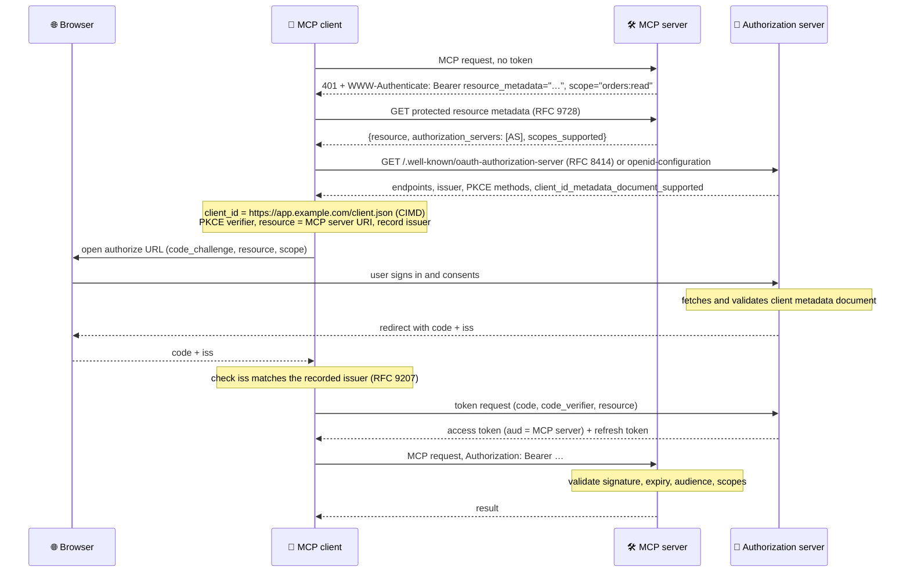

# MCP Authorization

Remote MCP servers are protected with **OAuth 2.1**: the MCP server is a resource server that accepts only access tokens issued for it, the client discovers the right authorization server from the server's metadata, identifies itself with a Client ID Metadata Document, and obtains a user-consented, audience-bound token with PKCE. This chapter walks the flow step by step and lists the rules that prevent token theft, mix-ups and confused-deputy attacks.

```objectives
time: 50 min
outcomes:
  - Walk through the MCP authorization flow from a 401 to an authenticated tool call, naming the standard behind each step
  - Explain why tokens must be audience-bound (RFC 8707) and why token passthrough is forbidden
  - Choose a client registration mechanism - pre-registration, Client ID Metadata Documents or (deprecated) dynamic registration
  - Design least-privilege scopes with step-up authorization
  - Configure an MCP server as a resource server that validates tokens
prerequisites:
  - "[Architecture & Protocol](02-Architecture-and-Protocol.mdx)"
  - "Basic OAuth concepts: authorization code flow, access tokens, scopes"
```

## Who Is Who

| Role | In MCP | Responsibility |
|---|---|---|
| **Resource owner** | The user | Consents to the client acting on their behalf |
| **Client** (OAuth client) | The MCP client inside the host | Obtains tokens; sends them on every request |
| **Resource server** | The MCP server | Validates tokens; enforces scopes; never forwards them |
| **Authorization server** (AS) | Your identity provider (Entra ID, Okta, Auth0, Keycloak, Google…) or one bundled with the server | Authenticates the user, records consent, issues tokens |

Authorization is optional in MCP, and it applies to **HTTP transports only**. A stdio server runs as a local process of the user and takes credentials from its environment (an API key in an environment variable), not from OAuth.

---

## The Flow



| Step | Standard | Why it's there |
|---|---|---|
| 401 with `resource_metadata` | RFC 9728 (Protected Resource Metadata) | The server tells the client **which** authorization server protects it - clients need no prior configuration. Fallback: `/.well-known/oauth-protected-resource` (path-specific, then root) |
| AS metadata discovery | RFC 8414 / OpenID Connect Discovery | Finds the endpoints; the client must check the document's `issuer` equals the URL it derived, or reject it |
| Client identification | Client ID Metadata Documents (IETF draft) | The client's `client_id` is an HTTPS URL of a JSON document (`client_id`, `client_name`, `redirect_uris`) - works with servers the client has never met |
| PKCE (`S256`) | OAuth 2.1 | Stops an intercepted authorization code from being redeemed by someone else |
| `resource` parameter | RFC 8707 (Resource Indicators) | Asks for a token **for this MCP server only**; must be sent on both authorization and token requests |
| `iss` validation | RFC 9207 | Defeats mix-up attacks where a malicious AS tries to get a code meant for an honest one |
| Bearer token on every request | RFC 6750 / OAuth 2.1 | Never in the query string |

### Client registration

Before the flow, a client needs a `client_id`. Clients should prefer, in order:

1. **Pre-registration** - credentials configured for this authorization server (enterprise deployments).
2. **Client ID Metadata Documents (CIMD)** - if the AS advertises `client_id_metadata_document_supported`. The AS fetches the document, checks its `client_id` matches the URL exactly and that the `redirect_uri` is listed, and shows the `client_name` on the consent screen. CIMD client ids are portable across authorization servers.
3. **Dynamic Client Registration** (RFC 7591) - **deprecated** in 2026-07-28, kept for older authorization servers. Clients using it must send an appropriate `application_type` (`native` for desktop, CLI and localhost apps).
4. Ask the user to enter client details.

Credentials are bound to the authorization server that issued them - keyed by its `issuer`, never reused with another, and re-registered if the protected resource metadata points to a new AS.

---

## Tokens: Audience, Passthrough and Confused Deputies

**Audience binding.** An MCP server must validate that each token was issued **for it** (the audience or resource claim) and reject anything else with 401. Otherwise a token issued for service A could be replayed against MCP server B.

**No token passthrough.** An MCP server that calls downstream APIs (GitHub, Salesforce) must **not** forward the client's token to them, and clients must not send the MCP server tokens meant for other services. Passthrough breaks audit trails, bypasses the downstream service's controls, and turns the MCP server into a confused deputy. If the server needs access to a third-party API on the user's behalf, it obtains its **own** token for that API - through URL-mode elicitation ([Server Features](03-Server-Features.mdx#elicitation-asking-the-user)), token exchange, or enterprise-managed authorization - and stores it bound to the user.

**Proxy servers and consent.** An MCP server that fronts a third-party API with a single static OAuth client id can be abused to skip user consent (the *confused deputy* attack in the MCP security guide). Such proxies must keep **per-client consent** - show their own consent screen naming the requesting MCP client and its redirect URI before forwarding to the third party - and validate `state` and exact redirect URIs.

---

## Scopes and Step-Up

Request the least privilege that works, and add more only when needed:

- The server's `scopes_supported` should list a **minimal** baseline (for example `orders:read`), not every scope it knows.
- When a call needs more, the server answers **403** with `WWW-Authenticate: Bearer error="insufficient_scope", scope="orders:write", resource_metadata="…"` - listing *all* scopes the operation needs in one challenge.
- The client re-authorises with the **union** of its previous scopes and the new ones, then retries - a bounded number of times.
- `tools/list` may return only the tools the caller's scopes allow.

Avoid omnibus scopes (`*`, `admin`, `full-access`): a stolen broad token is a large blast radius, and users abandon consent screens that ask for everything.

---

## Configuring a Server as a Resource Server

With the official Python SDK (v2), a server declares its authorization server and resource URL and supplies a token verifier; the SDK serves the protected resource metadata and returns the 401/403 challenges:

```python
from mcp.server.mcpserver import MCPServer
from mcp.server.auth.settings import AuthSettings
from mcp.server.auth.provider import AccessToken, TokenVerifier

class JWTVerifier(TokenVerifier):
    async def verify_token(self, token: str) -> AccessToken | None:
        claims = verify_jwt(token, issuer=ISSUER, audience="https://shop.example.com/mcp")  # your JWT library
        if claims is None:
            return None
        return AccessToken(token=token, client_id=claims["client_id"], subject=claims["sub"],
                           scopes=claims["scope"].split(), expires_at=claims["exp"],
                           resource="https://shop.example.com/mcp")

mcp = MCPServer(
    "shop",
    token_verifier=JWTVerifier(),
    auth=AuthSettings(
        issuer_url="https://auth.example.com",
        resource_server_url="https://shop.example.com/mcp",
        required_scopes=["orders:read"],
        validate_token_resource=True,        # refuse tokens issued for any other resource
    ),
)
```

Inside a tool, derive the user from the **verified token's subject**, never from something the model or client says ("I am ana@example.com").

For organisations, the **enterprise-managed authorization** extension lets the company's identity provider decide which MCP servers employees may connect to and with which scopes, instead of each user consenting server by server.

---

## Check Yourself

```quiz
- q: "How does an MCP client learn which authorization server protects a server it has never seen?"
  options:
    - "From the server's Protected Resource Metadata (RFC 9728), linked in the 401 WWW-Authenticate header or at a well-known URI"
    - "It must be configured manually"
    - "From the MCP initialize response"
    - "From DNS TXT records"
  answer: 1
- q: "What does the RFC 8707 resource parameter achieve?"
  options:
    - "It binds the token to one MCP server, so it can't be replayed against another"
    - "It encrypts the token"
    - "It lists the tools the client may call"
    - "It replaces PKCE"
  answer: 1
- q: "Which client registration mechanism does 2026-07-28 deprecate?"
  options: ["Dynamic Client Registration (RFC 7591)", "Client ID Metadata Documents", "Pre-registration", "PKCE"]
  answer: 1
- q: "Your MCP server wraps the GitHub API. Can it forward the user's MCP access token to GitHub?"
  options:
    - "No - that is token passthrough; the server must obtain its own GitHub token for the user"
    - "Yes, if the scopes match"
    - "Yes, over HTTPS"
    - "Only for read operations"
  answer: 1
- q: "A tool needs a write scope the current token lacks. Describe the exchange."
  answer: "The server responds 403 with WWW-Authenticate: Bearer error=\"insufficient_scope\", scope=\"<all scopes needed>\", resource_metadata=\"…\". The client re-authorises with the union of previously granted and challenged scopes (the user consents), gets a new token, and retries the call - giving up after a few failed attempts."
```

## Exercises

```exercise
- title: Trace the headers
  task: |
    Write the HTTP exchanges (method, URL, key headers, key JSON fields) for a client connecting to https://mcp.acme.com/mcp protected by https://login.acme.com, using a CIMD client id, up to the first successful tools/list.
  solution: |
    1) POST /mcp → 401, WWW-Authenticate: Bearer resource_metadata="https://mcp.acme.com/.well-known/oauth-protected-resource/mcp", scope="tools:read". 2) GET that URL → {"resource":"https://mcp.acme.com/mcp","authorization_servers":["https://login.acme.com"],"scopes_supported":["tools:read"]}. 3) GET https://login.acme.com/.well-known/oauth-authorization-server → issuer, authorization_endpoint, token_endpoint, code_challenge_methods_supported ["S256"], client_id_metadata_document_supported true. 4) Browser: GET /authorize?response_type=code&client_id=https://app.example.com/client.json&redirect_uri=http://127.0.0.1:3000/cb&code_challenge=…&code_challenge_method=S256&resource=https://mcp.acme.com/mcp&scope=tools:read&state=…. 5) Callback with code and iss=https://login.acme.com (checked). 6) POST /token with code, code_verifier, resource. 7) POST /mcp tools/list with Authorization: Bearer <token>, MCP-Protocol-Version, Mcp-Method.
- title: Scope design
  task: |
    Design scopes for an MCP server over a CRM with tools: search_contacts, get_contact, update_contact, delete_contact, export_all_contacts. Give scopes_supported and which tools each scope unlocks.
  solution: |
    scopes_supported: ["crm:read"] (baseline). crm:read → search_contacts, get_contact; crm:write → update_contact; crm:delete → delete_contact; crm:export → export_all_contacts (separate because bulk export is the highest exfiltration risk). Step-up challenges request the specific scope when a tool first needs it; tools/list shows only tools the token allows.
```

## Study Notes

- OAuth 2.1 roles: user, MCP client (OAuth client), MCP server (resource server), authorization server
- HTTP only; stdio servers use environment credentials
- Flow: 401 + resource_metadata (RFC 9728) → AS metadata (RFC 8414/OIDC, check issuer) → client id (pre-registered, CIMD, or deprecated DCR) → PKCE S256 + resource (RFC 8707) → iss check (RFC 9207) → token → Bearer on every request
- Servers validate audience; no token passthrough; proxies need per-client consent
- Least-privilege scopes with 403 insufficient_scope step-up; client requests the union
- Credentials are bound to the issuing AS; CIMD ids are portable
- SDK: MCPServer(token_verifier=…, auth=AuthSettings(issuer_url, resource_server_url, required_scopes, validate_token_resource))

## References

- MCP specification 2026-07-28: [Authorization](https://modelcontextprotocol.io/specification/2026-07-28/basic/authorization), [Client Registration](https://modelcontextprotocol.io/specification/2026-07-28/basic/authorization/client-registration), [Authorization Server Discovery](https://modelcontextprotocol.io/specification/2026-07-28/basic/authorization/authorization-server-discovery)
- [MCP Security Best Practices](https://modelcontextprotocol.io/docs/2026-07-28/tutorials/security/security_best_practices) (2026)
- [RFC 9728: OAuth 2.0 Protected Resource Metadata](https://datatracker.ietf.org/doc/html/rfc9728) (2025); [RFC 8707: Resource Indicators](https://www.rfc-editor.org/rfc/rfc8707.html) (2020); [RFC 9207: Issuer Identification](https://datatracker.ietf.org/doc/html/rfc9207) (2022); [RFC 8414: AS Metadata](https://datatracker.ietf.org/doc/html/rfc8414) (2018)
- [OAuth 2.1 draft](https://datatracker.ietf.org/doc/html/draft-ietf-oauth-v2-1-13); [OAuth Client ID Metadata Document draft](https://datatracker.ietf.org/doc/html/draft-ietf-oauth-client-id-metadata-document-00)

*Last reviewed: 2026-09*
