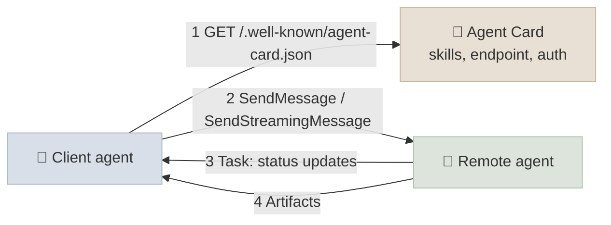
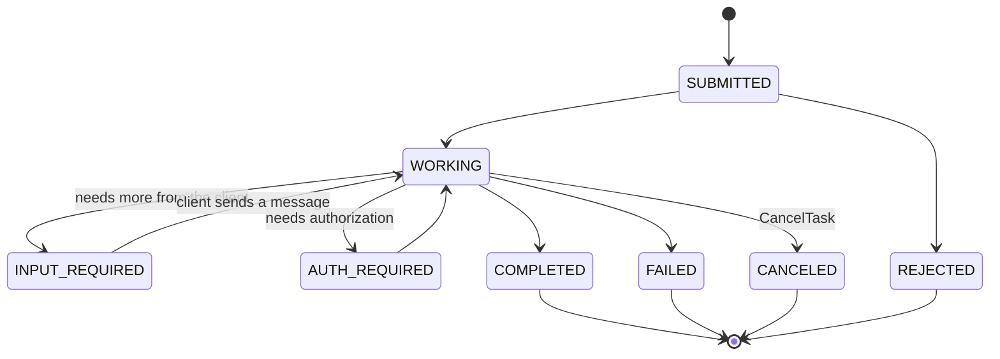

# The A2A Protocol

Agent2Agent (A2A) is an open protocol for **one agent to delegate work to another** - across frameworks, vendors and organisations - without either side exposing its internals. Where MCP connects an agent to tools, A2A connects agents to agents: a client agent discovers a remote agent through its **Agent Card**, sends it a message, and follows the resulting **task** through its lifecycle by polling, streaming or push notification. This chapter covers A2A v1.0.

```objectives
time: 45 min
outcomes:
  - Explain when to use A2A rather than MCP or an in-process sub-agent
  - Describe the Agent Card, messages, parts, tasks, artifacts and context, and the task state machine
  - Choose between polling, streaming and push notifications for a task, and between the JSON-RPC, gRPC and HTTP+JSON bindings
  - Secure an A2A integration - authentication schemes, signed Agent Cards, and treating remote agents as untrusted
  - Publish an agent over A2A and call it from another agent with the Python SDK
prerequisites:
  - "[Why MCP](01-Why-MCP.mdx) - MCP vs A2A"
  - "[Agents in Practice](../../09-Agent-Fundamentals/Notes/04-Agents-in-Practice.mdx)"
```

## Why a Second Protocol?

An MCP server exposes **tools**: small, well-described operations whose inputs and outputs the calling agent controls. Some counterparts aren't tools. A fraud-investigation agent run by another team, a supplier's procurement agent, a travel agent product - each has its own model, tools, memory and policies, works for minutes or hours, may ask follow-up questions, and must keep its internals private. Treating it as a tool loses all of that.

| | MCP | A2A |
|---|---|---|
| Other side | A server exposing tools, resources, prompts | An **opaque agent** with its own reasoning |
| Unit of work | A tool call | A **task** with a lifecycle |
| Duration | Usually seconds | Seconds to days |
| Mid-work interaction | Elicitation for a specific input | Multi-turn: the agent can ask for input or authorization |
| Output | Tool result | Messages and **artifacts** (documents, data, files) |
| Typical boundary | Inside your application | Across teams, frameworks and organisations |

The two compose: an agent reachable over A2A usually uses MCP servers internally. And inside a single application, a sub-agent is often just a function call ([Agentic Workflows & Multi-Agent Systems](../../12-Agentic-Workflows/INDEX.mdx)); A2A earns its overhead when the agents are built, deployed or owned separately.

### History

| Date | Milestone |
|---|---|
| Apr 2025 | Google announces A2A with 50+ partners |
| Jun 2025 | A2A becomes a Linux Foundation project (AWS, Cisco, Google, Microsoft, Salesforce, SAP, ServiceNow) |
| Aug 2025 | IBM's Agent Communication Protocol (ACP) merges into A2A |
| Sep 2025 | Agent Payments Protocol (AP2) launched as an A2A extension for agent-initiated payments |
| Mar 2026 | **A2A v1.0**: signed Agent Cards, multi-tenancy, multiple protocol bindings, version negotiation |
| Aug 2026 | A2A joins the Agentic AI Foundation, alongside MCP |

---

## Core Concepts



| Concept | What it is |
|---|---|
| **Agent Card** | A JSON document describing the agent: name, description, version, provider, **skills** (id, description, tags, examples, input/output modes), capabilities (streaming, push notifications, extended card), interfaces (URL + protocol binding + version), security schemes and requirements, and optional signatures. Published at `https://{domain}/.well-known/agent-card.json` or distributed through a registry or configuration |
| **Message** | One turn: a `role` (user or agent), a `messageId`, optional `contextId` and `taskId`, and **parts** |
| **Part** | Content: text, a file (inline bytes or a URL, with media type), or structured data (JSON) |
| **Task** | The unit of work, with a server-generated id and a status; created when the remote agent decides the request needs tracked work (a simple reply can be a plain message) |
| **Artifact** | An output of a task - a document, a dataset, an image - made of parts, possibly streamed in chunks |
| **Context** (`contextId`) | Groups related tasks and messages into one conversation |

### The task lifecycle



`COMPLETED`, `FAILED`, `CANCELED` and `REJECTED` are terminal; `INPUT_REQUIRED` and `AUTH_REQUIRED` are interrupted states that resume when the client responds in the same task.

### Operations and update delivery

| Operation | Purpose |
|---|---|
| `SendMessage` | Start or continue an interaction; returns a message or a task |
| `SendStreamingMessage` | Same, with a stream of task, status and artifact events |
| `GetTask`, `ListTasks` | Read task state (polling) |
| `CancelTask` | Request cancellation |
| `SubscribeToTask` | Re-attach a stream to an existing task |
| Push notification config (create / get / list / delete) | Register a webhook the agent calls on state changes |
| `GetExtendedAgentCard` | Fetch a fuller card after authenticating |

Three ways to follow a task: **polling** `GetTask` (simple, fine for short tasks), **streaming** over SSE (live progress while connected), and **push notifications** to a webhook (long tasks, disconnected clients - the webhook must authenticate the agent's calls and validate URLs to avoid SSRF).

### Protocol bindings

The same operations are defined over **JSON-RPC 2.0 over HTTP**, **gRPC** and **HTTP+JSON** (REST-style); an agent lists the bindings it supports as interfaces in its card, and clients pick one they share. Version negotiation lets v0.3 and v1.0 peers interoperate during migration.

---

## Security

A remote agent is a **third party**. Its outputs are untrusted input to your agent - exactly like tool results ([MCP Security](06-MCP-Security.mdx)) - and your requests may carry your users' data to it.

- **Authentication** uses standard schemes declared in the Agent Card: API keys, HTTP auth, OAuth 2.0, OpenID Connect or mutual TLS. Credentials travel in HTTP headers, never in A2A messages.
- **Signed Agent Cards** (v1.0) let a client verify a card was issued by the domain owner, defeating fake cards that redirect traffic to an attacker. Verify signatures before trusting a card from a registry or a link.
- **Authorization** is the remote agent's job, per skill and per task; the extended card can reveal skills only to authenticated clients.
- **Data minimisation**: send only what the task needs; check the remote agent's data handling before sending personal data across an organisational boundary.
- **Treat artifacts as untrusted**: validate structured data, never execute returned content, and don't let instructions inside an artifact drive your agent's privileged actions.

---

## A2A in Code

The Python SDK (`a2a-sdk`, v1.x) provides a server side - you implement an `AgentExecutor` and publish task events through a `TaskUpdater` - and a client that resolves the card and streams events. From the [lab](../CodeLabs/01-MCP-Server-and-Agent.mdx), which wraps the MCP-backed shop agent:

```python
from a2a.types import AgentCard, AgentInterface, AgentSkill, AgentCapabilities, TaskState

CARD = AgentCard(
    name="Outdoor-gear shop support agent", version="0.3.0",
    description="Resolves order questions, cancellations, address changes and refunds.",
    supported_interfaces=[AgentInterface(url="http://127.0.0.1:9999", protocol_binding="JSONRPC",
                                         protocol_version="1.0")],
    capabilities=AgentCapabilities(streaming=True),
    default_input_modes=["text/plain"], default_output_modes=["text/plain"],
    skills=[AgentSkill(id="order-support", name="Order support", tags=["retail", "orders"],
                       description="Look up, cancel, re-address or refund a customer's orders.")])

class ShopAgentExecutor(AgentExecutor):
    async def execute(self, context: RequestContext, event_queue: EventQueue) -> None:
        if context.current_task is None:                        # publish the task first
            await event_queue.enqueue_event(new_task_from_user_message(context.message))
        updater = TaskUpdater(event_queue, context.task_id, context.context_id)
        await updater.start_work(updater.new_agent_message([new_text_part("Looking into it...")]))
        answer = await run_shop_agent(context.get_user_input())  # the MCP-backed loop
        await updater.add_artifact([new_text_part(answer)], name="reply")
        await updater.complete()
```

A client run against it prints the lifecycle:

```text
[task] id=b01dcae5 state=TASK_STATE_SUBMITTED
[status] TASK_STATE_WORKING Looking into it...
[status] TASK_STATE_WORKING Tools used: find_customer, list_orders, cancel_order
[artifact] Your order O1002 has been cancelled. A refund of $89.50 will be processed.
[status] TASK_STATE_COMPLETED
```

Frameworks increasingly expose agents over A2A directly (for example Google ADK, the Microsoft Agent Framework and LangGraph deployments), and cloud agent platforms can host A2A endpoints - see [Agent Frameworks](../../14-Agent-Frameworks/INDEX.mdx).

### Related protocols

| Protocol | Scope |
|---|---|
| **MCP** | Agent ↔ tools and context |
| **A2A** | Agent ↔ agent |
| **AP2** (Agent Payments Protocol, an A2A extension) | Agent-initiated payments: signed intent, cart and payment mandates |
| **AG-UI** | Agent ↔ user-interface streaming (events for front ends) |

---

## Check Yourself

```quiz
- q: "Where does a client agent find a remote agent's skills, endpoint and auth requirements?"
  options:
    - "Its Agent Card, typically at /.well-known/agent-card.json"
    - "Its MCP tools/list"
    - "A DNS TXT record"
    - "The first task's artifact"
  answer: 1
- q: "Which task states are interrupted (the task waits for the client) rather than terminal?"
  options:
    - "INPUT_REQUIRED and AUTH_REQUIRED"
    - "COMPLETED and FAILED"
    - "SUBMITTED and WORKING"
    - "CANCELED and REJECTED"
  answer: 1
- q: "A task will take about six hours and the client may disconnect. How should it follow the task?"
  options:
    - "Register a push-notification webhook (and poll GetTask as a fallback)"
    - "Keep a streaming connection open for six hours"
    - "Call SendMessage repeatedly"
    - "Use MCP instead"
  answer: 1
- q: "What threat do signed Agent Cards address?"
  options:
    - "A forged card that impersonates an agent and redirects traffic to an attacker"
    - "Prompt injection inside artifacts"
    - "Slow tasks"
    - "Token expiry"
  answer: 1
- q: "Your planner agent calls a summarisation step that lives in the same codebase and deploys with it. Should that be A2A?"
  answer: "Usually not: an in-process sub-agent (a function call) is simpler, faster and easier to debug. A2A pays off when the other agent is separately built, deployed or owned - another team, another framework, another company - and needs a task lifecycle, its own auth and opacity."
```

## Exercises

```exercise
- title: Write an Agent Card
  task: |
    Write the Agent Card JSON for an internal "IT help desk" agent with two skills (password reset guidance, laptop request), streaming support, OAuth 2.0 client-credentials authentication for other internal agents, and a JSON-RPC interface.
  solution: |
    Include name, description, version, provider, supportedInterfaces [{url, protocolBinding: "JSONRPC", protocolVersion: "1.0"}], capabilities {streaming: true}, defaultInputModes ["text/plain"], defaultOutputModes ["text/plain", "application/json"], skills with id, name, description, tags and examples, securitySchemes {"oauth": {oauth2 flows: clientCredentials with tokenUrl and scopes}}, and securityRequirements [{"oauth": ["helpdesk.tasks"]}]. Sign it if it will be published beyond your own configuration.
- title: MCP or A2A?
  task: |
    Classify each integration and justify: (a) an agent needs to read Jira issues; (b) your sales agent hands a qualified lead to a partner company's onboarding agent, which takes days and asks questions; (c) a coding agent runs the test suite; (d) a travel-booking agent offered by a vendor that your assistant should use for trips.
  solution: |
    (a) MCP - a tool/data source. (b) A2A - opaque agent, long-running, multi-turn, cross-organisation. (c) Neither protocol needed - a local tool (or an MCP server if shared). (d) A2A - a separately operated agent product with its own reasoning; your assistant delegates tasks and receives itineraries as artifacts.
- title: Run the A2A part of the lab
  task: |
    Start the lab's A2A server, fetch the Agent Card with curl, and send two requests with the client - one that succeeds and one that the policy should refuse (cancel a shipped order). Compare the task events.
  solution: |
    The card appears at http://127.0.0.1:9999/.well-known/agent-card.json. Both requests produce SUBMITTED → WORKING → artifact → COMPLETED at the protocol level: a policy refusal is a successful task whose artifact explains the refusal. FAILED is reserved for the agent failing to process the task. This distinction - business outcome vs protocol outcome - is worth designing deliberately.
```

## Study Notes

- A2A = agent ↔ agent for opaque, separately owned agents; MCP = agent ↔ tools; they compose
- Agent Card at /.well-known/agent-card.json: skills, capabilities, interfaces, security schemes, optional signatures
- Messages (role, parts: text/file/data), tasks (server ids, lifecycle), artifacts (outputs), contextId (conversation)
- States: SUBMITTED, WORKING, INPUT_REQUIRED, AUTH_REQUIRED, COMPLETED, FAILED, CANCELED, REJECTED
- Operations: SendMessage, SendStreamingMessage, GetTask, ListTasks, CancelTask, SubscribeToTask, push config, GetExtendedAgentCard
- Follow tasks by polling, streaming or push notifications; bindings JSON-RPC, gRPC, HTTP+JSON
- v1.0 (Mar 2026): signed cards, multi-tenancy, version negotiation; governed by the Agentic AI Foundation since Aug 2026
- Remote agents are untrusted third parties: authenticate, verify cards, minimise data, validate artifacts

## References

- [A2A Protocol specification](https://a2a-protocol.org/latest/specification/) and [Agent discovery](https://a2a-protocol.org/latest/topics/agent-discovery/)
- A2A Project, [A2A Protocol ships v1.0](https://a2a-protocol.org/latest/blog/2026/03/12/a2a-protocol-ships-v10-production-ready-standard-for-agent-to-agent-communication/) (Mar 2026)
- Linux Foundation, [Linux Foundation launches the Agent2Agent Protocol project](https://www.linuxfoundation.org/press/linux-foundation-launches-the-agent2agent-protocol-project-to-enable-secure-intelligent-communication-between-ai-agents) (Jun 2025)
- LF AI & Data, [ACP joins forces with A2A](https://lfaidata.foundation/communityblog/2025/08/29/acp-joins-forces-with-a2a-under-the-linux-foundations-lf-ai-data/) (Aug 2025)
- Google Cloud, [Announcing the Agent Payments Protocol (AP2)](https://cloud.google.com/blog/products/ai-machine-learning/announcing-agents-to-payments-ap2-protocol) (Sep 2025)
- [a2a-sdk for Python](https://github.com/a2aproject/a2a-python)

*Last reviewed: 2026-09*
