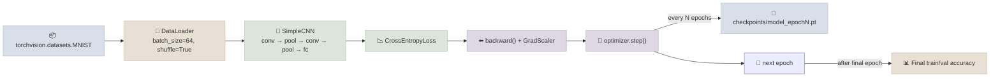

# Code Lab 01 - Raw PyTorch Classifier

A small CNN image classifier trained end-to-end in **raw PyTorch** - no `Trainer` class, no wrapper library. This lab exists to make every mechanic from the Notes files (Dataset/DataLoader, the hand-written training loop, checkpointing, mixed precision) concrete in one runnable script.

← **Back to Overview:** [PyTorch Fundamentals](../INDEX.mdx) · **Back to Concepts:** [Training Loop From Scratch](../Notes/03-Training-Loop-From-Scratch.mdx) · [Checkpointing & Mixed Precision](../Notes/04-Checkpointing-and-Mixed-Precision.mdx)

---

## What's In This Lab

| Property | Detail |
|---|---|
| Task | Image classification (MNIST digits, via `torchvision.datasets`) |
| Model | A small hand-written CNN (`SimpleCNN` in `model.py`) |
| Training | Hand-written loop - custom `Dataset` usage via `torchvision`, `DataLoader`, forward/backward/step |
| Checkpointing | Saves model + optimizer state every N epochs to `checkpoints/` |
| Mixed Precision | `torch.cuda.amp.autocast()` + `GradScaler` (auto-disabled gracefully on CPU-only machines) |
| Output | Final train/val accuracy printed at the end of the run |
| Complexity | Beginner-Intermediate |
| Files | `01-Raw-PyTorch-Classifier/{train.py, model.py, requirements.txt, README.mdx}` |

## Architecture



## Running

```bash
cd 11-Prog-Langs/PyTorch/CodeLabs/01-Raw-PyTorch-Classifier
pip install -r requirements.txt
python train.py
```

Full details, code walkthrough, and what each part demonstrates: see [README](01-Raw-PyTorch-Classifier/README.mdx).
