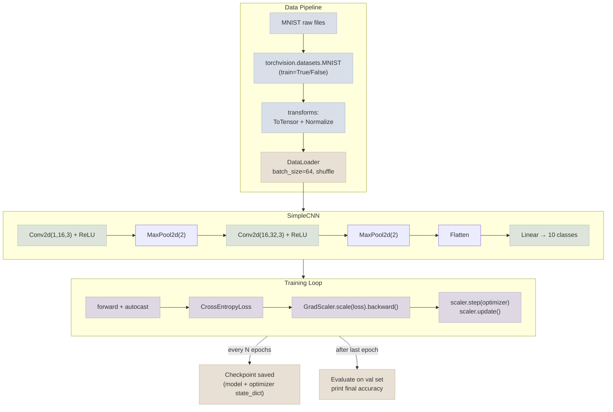

# Raw PyTorch Classifier

A small CNN trained end-to-end on MNIST digit classification, written entirely in raw PyTorch mechanics - no `Trainer` abstraction. This is the hands-on counterpart to the [Notes](../../Notes) files: every concept (custom Dataset/DataLoader usage, the hand-written training loop, checkpointing, mixed precision) appears here as real, runnable code.

## Architecture



## What This Demonstrates

1. **Custom Dataset/DataLoader usage** - `torchvision.datasets.MNIST` wrapped by a standard `DataLoader` with `batch_size`, `shuffle`, and `num_workers` configured explicitly (see [Dataset & DataLoader](../../Notes/02-Dataset-and-DataLoader.mdx))
2. **A hand-written training loop** - explicit `model.train()`/`model.eval()` switching, `optimizer.zero_grad()` → forward → loss → `backward()` → `optimizer.step()`, with a separate validation pass every epoch (see [Training Loop From Scratch](../../Notes/03-Training-Loop-From-Scratch.mdx))
3. **Checkpointing** - `model.state_dict()` + `optimizer.state_dict()` saved every N epochs, resumable via `--resume` (see [Checkpointing & Mixed Precision](../../Notes/04-Checkpointing-and-Mixed-Precision.mdx))
4. **Mixed precision** - `torch.cuda.amp.autocast()` + `GradScaler`, automatically disabled on CPU-only machines so the script still runs correctly without a GPU
5. **Device-agnostic code** - runs on CPU or GPU without modification (`.to(device)` used consistently)

## Files

| File | Purpose |
|---|---|
| `model.py` | `SimpleCNN` - a small 2-conv-layer CNN for 28x28 grayscale digit classification |
| `train.py` | Full training script: data loading, training loop, checkpointing, mixed precision, final accuracy report |
| `requirements.txt` | `torch`, `torchvision` |

## Running

```bash
pip install -r requirements.txt
python train.py
```

Optional flags:

```bash
python train.py --epochs 5 --batch-size 64 --lr 1e-3 --checkpoint-every 2
python train.py --resume checkpoints/model_epoch2.pt   # resume from a saved checkpoint
```

On first run, `torchvision` downloads MNIST automatically into `./data`. The script auto-detects a CUDA GPU if available and falls back to CPU otherwise; mixed precision is only enabled when a CUDA GPU is present, since `autocast`/`GradScaler` are only beneficial (and only fully supported) on GPU.

Expected output at the end of a run:

```
Epoch 5/5 | train_loss=0.0421 val_loss=0.0512 val_acc=0.9843
Final: train_acc=0.9887 val_acc=0.9843
Checkpoint saved to checkpoints/model_epoch5.pt
```
