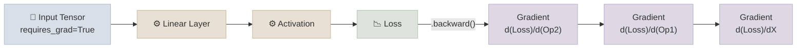
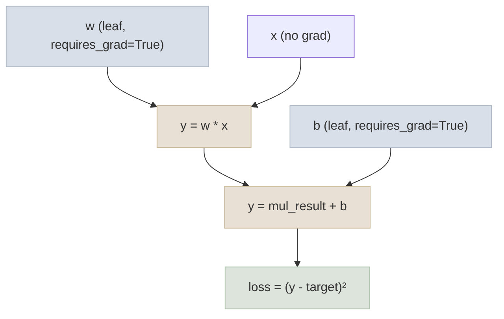

# Tensors and Autograd

## The One-Line Definition

A **tensor** is PyTorch's core data structure - a multi-dimensional array that can live on CPU or GPU - and **autograd** is the engine that automatically tracks every operation on tensors so it can compute gradients for you via `.backward()`.

<div class="audience-biz" markdown="1">

Think of a tensor as a smart spreadsheet of numbers that PyTorch can move to a graphics card for speed. Autograd is like a flight recorder - it silently logs every calculation the model does, so that later, when you want to know "how do I need to adjust this number to reduce the error," PyTorch can look back at the recording and work out the answer automatically instead of you doing calculus by hand.

</div>

<div class="audience-tech" markdown="1">

A `torch.Tensor` wraps a contiguous memory buffer plus shape/stride/dtype/device metadata. When `requires_grad=True`, every operation on that tensor is recorded as a node in a dynamic, define-by-run computation graph (`torch.autograd.Function` objects, each holding a reference to its inputs via `grad_fn`). Calling `.backward()` traverses this graph in reverse topological order, applying the chain rule at each node to accumulate gradients into `.grad` on every leaf tensor that requires them.

</div>



---

## Tensor Basics

<div class="audience-biz" markdown="1">

Everything a neural network touches - images, text, weights, predictions - is stored as a tensor. A tensor is just a grid of numbers with a shape (like "3 rows by 4 columns") and a data type (like whole numbers vs. decimals). PyTorch tensors can be moved to a GPU, which is what makes training fast.

</div>

<div class="audience-tech" markdown="1">

Key attributes on every tensor: `.shape` (dimensions), `.dtype` (`float32`, `float16`, `bfloat16`, `int64`, ...), `.device` (`cpu` or `cuda:0`), and `.requires_grad` (whether autograd should track it). Tensors are created from Python lists/NumPy arrays, via factory functions (`torch.zeros`, `torch.randn`, `torch.arange`), or as the output of operations on existing tensors.

```python
import torch

# Creation
x = torch.tensor([[1.0, 2.0], [3.0, 4.0]])
zeros = torch.zeros(3, 4)
randn = torch.randn(2, 3, requires_grad=True)

# Key attributes
print(x.shape, x.dtype, x.device)   # torch.Size([2, 2]) torch.float32 cpu

# Moving to GPU (no-op if no GPU is available)
device = torch.device("cuda" if torch.cuda.is_available() else "cpu")
x = x.to(device)

# Reshaping - view() shares memory, reshape() may copy
x.view(4)          # flatten, must be contiguous
x.reshape(4)        # flatten, safe even if non-contiguous

# NumPy interop (shares memory on CPU!)
import numpy as np
arr = np.array([1.0, 2.0, 3.0])
t = torch.from_numpy(arr)
```

</div>

---

## `requires_grad` and the Computation Graph

<div class="audience-biz" markdown="1">

When you tell PyTorch "track this number," it starts building an invisible map of every calculation that number is involved in. That map is what lets PyTorch later figure out exactly how much each individual weight in the model contributed to the final error - and therefore how it should be nudged to reduce that error.

</div>

<div class="audience-tech" markdown="1">

`requires_grad=True` marks a tensor as a **leaf** that needs gradients. Every subsequent op producing a new tensor from tracked tensors sets `.grad_fn` on the output, pointing back to the `Function` that created it (e.g. `AddBackward0`, `MulBackward0`). This forms a DAG: leaves (model parameters, inputs with `requires_grad=True`) at the "bottom," the scalar loss at the "top." Model parameters (`nn.Parameter`) have `requires_grad=True` by default; inputs typically don't.

```python
w = torch.tensor(2.0, requires_grad=True)
b = torch.tensor(1.0, requires_grad=True)
x = torch.tensor(3.0)                      # no grad needed - it's data, not a parameter

y = w * x + b        # y.grad_fn -> AddBackward0
loss = (y - 10) ** 2  # loss.grad_fn -> PowBackward0

loss.backward()       # walks the graph backward from loss
print(w.grad)          # dLoss/dw
print(b.grad)          # dLoss/db
```

Use `torch.no_grad()` (or `@torch.no_grad()`) to disable graph-building entirely for inference/evaluation - it saves memory since PyTorch doesn't need to keep intermediate activations around for a backward pass that will never happen. `tensor.detach()` produces a new tensor sharing the same data but detached from the graph.

</div>



---

## `.backward()`, `optimizer.step()`, and `zero_grad()`

<div class="audience-biz" markdown="1">

Training a model is a three-step dance repeated thousands of times: (1) figure out how wrong the current guess is, (2) work out which direction to nudge every internal setting to be less wrong, (3) actually make that nudge. Critically, PyTorch **adds** new nudges on top of old ones unless you explicitly clear the slate first - so forgetting to "reset" between rounds silently corrupts training.

</div>

<div class="audience-tech" markdown="1">

`loss.backward()` populates `.grad` on every leaf tensor with `requires_grad=True`, accumulating (summing) into whatever is already there. `optimizer.step()` then reads those `.grad` values and updates the parameters according to the optimizer's update rule (SGD, Adam, ...). Because gradients accumulate by default, you must call `optimizer.zero_grad()` (or `model.zero_grad()`) before each new `.backward()` call in the standard single-step training loop - otherwise gradients from the previous batch bleed into the current one.

```python
import torch.nn as nn
import torch.optim as optim

model = nn.Linear(10, 1)
optimizer = optim.Adam(model.parameters(), lr=1e-3)
loss_fn = nn.MSELoss()

for batch_x, batch_y in dataloader:
    optimizer.zero_grad()          # 1. clear stale gradients
    pred = model(batch_x)          # 2. forward pass (builds the graph)
    loss = loss_fn(pred, batch_y)  # 3. compute loss
    loss.backward()                 # 4. backward pass (populates .grad)
    optimizer.step()                # 5. update parameters using .grad
```

**Why gradient accumulation is sometimes deliberate:** skipping `zero_grad()` for N batches before calling `optimizer.step()` is a common trick to simulate a larger effective batch size when GPU memory is limited - gradients from N small batches sum together as if they came from one big batch.

```python
# Gradient accumulation over 4 mini-batches to simulate a 4x larger batch
accum_steps = 4
optimizer.zero_grad()
for i, (batch_x, batch_y) in enumerate(dataloader):
    pred = model(batch_x)
    loss = loss_fn(pred, batch_y) / accum_steps
    loss.backward()                 # accumulates - no zero_grad() here
    if (i + 1) % accum_steps == 0:
        optimizer.step()
        optimizer.zero_grad()
```

</div>

---

## Study Notes

- A tensor with `requires_grad=True` is tracked by autograd; every op on it extends a dynamic computation graph
- `.backward()` computes gradients via reverse-mode automatic differentiation (chain rule) and **accumulates** them into `.grad`
- `optimizer.zero_grad()` must run before each new `.backward()` in a standard loop, or gradients from previous steps silently add in
- `torch.no_grad()` disables graph tracking - always use it for inference/evaluation to save memory
- `optimizer.step()` reads `.grad` and updates parameters; it does not touch the graph itself
- `.detach()` returns a tensor sharing data but excluded from the graph - useful for logging/metrics without leaking memory

**Q: Why do gradients accumulate by default instead of being overwritten?**
A: It's a deliberate design choice that enables gradient accumulation across multiple `backward()` calls (e.g. to simulate larger batch sizes, or when a loss is computed from multiple sub-losses called separately). The tradeoff is that a standard single-step loop must explicitly zero gradients each iteration.

**Q: What happens if you call `.backward()` twice on the same graph without `retain_graph=True`?**
A: PyTorch frees intermediate buffers used for the backward pass by default (to save memory) after the first `.backward()` call, so a second call raises a runtime error. Pass `retain_graph=True` to `.backward()` if you genuinely need to backward through the same graph more than once.

**Q: What is the difference between `.detach()` and `torch.no_grad()`?**
A: `.detach()` creates a new tensor disconnected from the graph, while the original tensor(s) still track gradients if used elsewhere. `torch.no_grad()` is a context manager that disables graph construction for every operation inside it, regardless of `requires_grad` on the inputs - it's the right tool for validation/inference loops.

**Q: Why does `model.parameters()` require gradients by default but a raw input tensor doesn't?**
A: `nn.Parameter` (what `nn.Linear`, `nn.Conv2d`, etc. use internally for weights/biases) sets `requires_grad=True` automatically because parameters are what training updates. Plain input data doesn't need gradients unless you're doing something unusual like adversarial example generation or input optimization.

**Q: What does `loss.backward()` actually compute mathematically?**
A: It computes `d(loss)/d(param)` for every leaf parameter in the graph, using reverse-mode automatic differentiation - applying the chain rule from the scalar loss backward through every intermediate operation to each leaf.

**Q: Can you call `.backward()` on a non-scalar tensor?**
A: Only if you pass a `gradient` argument matching its shape (the "vector-Jacobian product" seed). In practice, losses are reduced to a scalar (e.g. via `.mean()` or `.sum()`) before calling `.backward()`, which is why loss functions like `nn.MSELoss()` default to `reduction='mean'`.
