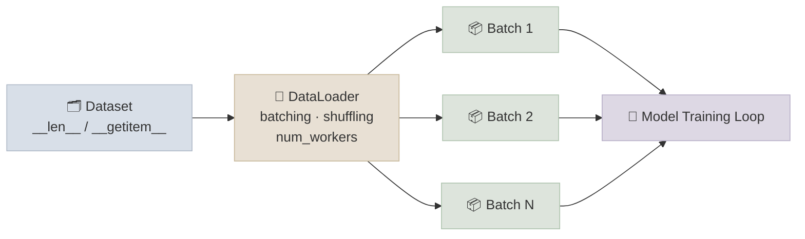

# Dataset and DataLoader

## The One-Line Definition

A `Dataset` defines **how to access one example at a time**, and a `DataLoader` wraps a `Dataset` to handle **batching, shuffling, and parallel loading** so training code never has to manage those details itself.

<div class="audience-biz" markdown="1">

Think of a `Dataset` as a labeled filing cabinet - you can ask it "give me item #47" and it hands back one example. A `DataLoader` is the assistant who grabs handfuls of items from that cabinet, shuffles the order so the model doesn't learn the filing order by accident, and can even use several assistants at once (workers) to fetch items faster while the model is busy training on the previous handful.

</div>

<div class="audience-tech" markdown="1">

`torch.utils.data.Dataset` is a simple Python protocol (`__len__`, `__getitem__`) - it decouples "how do I fetch and preprocess one sample" from "how do I efficiently produce shuffled mini-batches for training." `DataLoader` is a separate, reusable component that adds batching, optional shuffling, multi-process prefetching (`num_workers`), and a `collate_fn` to assemble a list of samples into a batched tensor. This separation is what lets the same `DataLoader` machinery work for images, text, tabular data, or anything else - only the `Dataset` implementation changes.

</div>



---

## Writing a Custom `Dataset`

<div class="audience-biz" markdown="1">

Every real project needs a custom `Dataset` because your data lives in a specific format - a folder of images, a CSV file, a database. You write two small methods: "how many examples are there" and "give me example number `i`." Everything else (batching, shuffling, parallelism) is handled for you by the `DataLoader`.

</div>

<div class="audience-tech" markdown="1">

A minimal `Dataset` subclass implements:
- `__len__(self)` - total number of samples, used by the `DataLoader` to know epoch boundaries and build shuffled index orderings
- `__getitem__(self, idx)` - returns a single `(input, label)` pair (or whatever structure your training loop expects), doing any per-sample transforms (resize, normalize, tokenize) lazily at access time rather than upfront

```python
import os
import pandas as pd
from PIL import Image
from torch.utils.data import Dataset
from torchvision import transforms

class ImageFolderDataset(Dataset):
    """Custom Dataset for a folder of images with a CSV of (filename, label)."""

    def __init__(self, csv_path: str, image_dir: str, transform=None):
        self.labels_df = pd.read_csv(csv_path)   # columns: filename, label
        self.image_dir = image_dir
        self.transform = transform or transforms.Compose([
            transforms.Resize((32, 32)),
            transforms.ToTensor(),
            transforms.Normalize((0.5,), (0.5,)),
        ])

    def __len__(self):
        return len(self.labels_df)

    def __getitem__(self, idx):
        row = self.labels_df.iloc[idx]
        img_path = os.path.join(self.image_dir, row["filename"])
        image = Image.open(img_path).convert("RGB")
        image = self.transform(image)
        label = int(row["label"])
        return image, label


class TabularCSVDataset(Dataset):
    """Custom Dataset for a plain CSV of numeric features + a target column."""

    def __init__(self, csv_path: str, target_col: str):
        df = pd.read_csv(csv_path)
        self.X = torch.tensor(df.drop(columns=[target_col]).values, dtype=torch.float32)
        self.y = torch.tensor(df[target_col].values, dtype=torch.float32)

    def __len__(self):
        return len(self.X)

    def __getitem__(self, idx):
        return self.X[idx], self.y[idx]
```

Transforms are applied inside `__getitem__` (not `__init__`) so that random augmentations (crop, flip) differ every epoch, and so that only the currently-requested sample is decoded/processed - not the entire dataset upfront.

</div>

---

## `DataLoader`: Batching, Shuffling, and Workers

<div class="audience-biz" markdown="1">

The `DataLoader` is what actually feeds the model during training. It groups individual examples into batches (say, 32 at a time, since GPUs are efficient at processing many examples together), shuffles the order every epoch so the model doesn't memorize a fixed sequence, and can fetch the next batch in the background using extra CPU processes while the GPU is busy training on the current batch.

</div>

<div class="audience-tech" markdown="1">

```python
from torch.utils.data import DataLoader

train_ds = ImageFolderDataset("train_labels.csv", "train_images/")
val_ds = ImageFolderDataset("val_labels.csv", "val_images/")

train_loader = DataLoader(
    train_ds,
    batch_size=64,
    shuffle=True,          # reshuffle indices every epoch - essential for training
    num_workers=4,          # subprocesses that prefetch/preprocess in parallel
    pin_memory=True,        # page-locks host memory for faster host->GPU copy
    drop_last=True,         # drop the final incomplete batch (keeps batch shape fixed)
)

val_loader = DataLoader(
    val_ds,
    batch_size=64,
    shuffle=False,           # never shuffle validation/test - order should be stable/reproducible
    num_workers=2,
)
```

Key parameters:

| Parameter | Effect |
|---|---|
| `batch_size` | Number of samples grouped into one forward/backward pass |
| `shuffle` | Randomizes sample order each epoch (`True` for train, `False` for val/test) |
| `num_workers` | Number of subprocesses used to load/preprocess data in parallel with GPU compute; `0` means load in the main process (simplest, sometimes fastest for tiny datasets) |
| `pin_memory` | Allocates batches in page-locked memory for faster asynchronous CPU→GPU transfer (`.to(device, non_blocking=True)`) |
| `drop_last` | Drops the final batch if it's smaller than `batch_size` - avoids shape-dependent bugs (e.g. BatchNorm with a batch of size 1) |
| `collate_fn` | Custom function controlling how a list of `__getitem__` outputs is merged into one batch - needed when samples have variable length (e.g. text sequences) |

**Custom `collate_fn` for variable-length sequences** (common in NLP):

```python
from torch.nn.utils.rnn import pad_sequence

def collate_variable_length(batch):
    sequences, labels = zip(*batch)
    padded = pad_sequence(sequences, batch_first=True, padding_value=0)
    return padded, torch.tensor(labels)

loader = DataLoader(text_ds, batch_size=32, collate_fn=collate_variable_length)
```

</div>

---

## Study Notes

- `Dataset` = how to fetch one example (`__len__`, `__getitem__`); `DataLoader` = how to batch/shuffle/parallelize many examples
- Apply transforms/augmentations inside `__getitem__`, not `__init__`, so they're computed lazily and randomized per-epoch
- `shuffle=True` for training, `shuffle=False` for validation/test - reproducibility matters for evaluation
- `num_workers > 0` moves data loading to subprocesses so it overlaps with GPU compute instead of blocking it
- `pin_memory=True` + `.to(device, non_blocking=True)` speeds up host-to-GPU transfer
- Use a custom `collate_fn` whenever samples don't have a uniform shape (e.g. variable-length text)

**Q: Why does `__getitem__` apply transforms instead of pre-processing the whole dataset once in `__init__`?**
A: Two reasons - memory (loading every image decoded into RAM upfront doesn't scale) and randomness (data augmentation like random crop/flip needs a fresh random transform each time a sample is drawn, so every epoch sees slightly different versions of each image).

**Q: What's the tradeoff of increasing `num_workers`?**
A: More workers can hide data-loading latency behind GPU compute, but each worker consumes CPU and memory, and too many can cause contention or "too many open files" errors. A common starting point is 4 workers per GPU, tuned empirically.

**Q: Why use `drop_last=True` for training but not always for validation?**
A: Training often uses layers like `BatchNorm` that behave badly on a batch of size 1, and consistent batch size can matter for throughput/graph-compilation determinism. Validation typically wants every sample evaluated, so `drop_last=False` (the default) is usually kept there even if the last batch is smaller.

**Q: What does `collate_fn` do and when do you need a custom one?**
A: It's the function that turns a list of individual `__getitem__` outputs into one batched tensor (or tuple of tensors). The default `collate_fn` works when every sample has the same shape (e.g. fixed-size images). You need a custom one when samples vary in size - most commonly variable-length text sequences, which need padding before they can be stacked into a single tensor.
