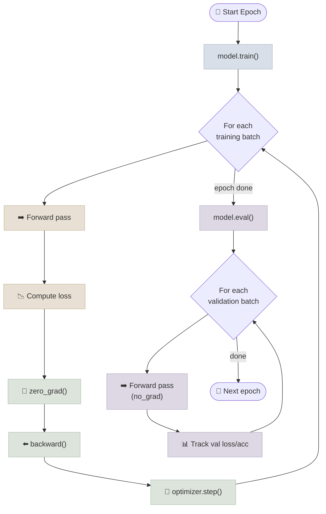

# Training Loop From Scratch

## The One-Line Definition

The canonical PyTorch training loop is a hand-written `for epoch` / `for batch` nested loop that runs **forward pass → compute loss → `backward()` → `optimizer.step()` → `zero_grad()`** for every batch, with an explicit `model.eval()` pass over held-out data to track generalization.

<div class="audience-biz" markdown="1">

There's no hidden "train" button in PyTorch - you write the training loop yourself. That's intentional: it forces you to see exactly what happens on each pass through the data, which makes it much easier to debug when something goes wrong (loss not decreasing, model not learning, etc.). Once you've written it by hand a few times, wrapper libraries like `Trainer` classes make a lot more sense because you know what they're doing under the hood.

</div>

<div class="audience-tech" markdown="1">

Unlike higher-level frameworks that hide the loop behind a `.fit()` call, PyTorch's philosophy is "the training loop is just Python" - full control over logging, gradient clipping, custom schedulers, mixed precision, and multi-loss objectives without fighting a framework abstraction. Every production training script (including `transformers.Trainer` internally) is a variation on the same five-step loop.

</div>



---

## The Canonical Loop

<div class="audience-biz" markdown="1">

Every epoch (one full pass over the training data) has two phases: a **training phase**, where the model sees examples, makes predictions, gets corrected, and updates its internal settings; and a **validation phase**, where the model is tested on data it hasn't been updated with, to check whether it's actually learning general patterns rather than just memorizing the training examples.

</div>

<div class="audience-tech" markdown="1">

```python
import torch
import torch.nn as nn
import torch.optim as optim

device = torch.device("cuda" if torch.cuda.is_available() else "cpu")
model = MyModel().to(device)
optimizer = optim.Adam(model.parameters(), lr=1e-3)
loss_fn = nn.CrossEntropyLoss()

num_epochs = 10

for epoch in range(num_epochs):
    # ---- Training phase ----
    model.train()                      # enables dropout, uses batch stats for BatchNorm
    running_loss = 0.0
    for batch_x, batch_y in train_loader:
        batch_x, batch_y = batch_x.to(device), batch_y.to(device)

        optimizer.zero_grad()           # clear stale gradients
        outputs = model(batch_x)        # forward pass
        loss = loss_fn(outputs, batch_y)
        loss.backward()                  # backward pass
        optimizer.step()                 # update weights

        running_loss += loss.item() * batch_x.size(0)

    train_loss = running_loss / len(train_loader.dataset)

    # ---- Validation phase ----
    model.eval()                        # disables dropout, uses running stats for BatchNorm
    val_loss, correct = 0.0, 0
    with torch.no_grad():               # no graph needed - saves memory and compute
        for batch_x, batch_y in val_loader:
            batch_x, batch_y = batch_x.to(device), batch_y.to(device)
            outputs = model(batch_x)
            loss = loss_fn(outputs, batch_y)
            val_loss += loss.item() * batch_x.size(0)
            correct += (outputs.argmax(dim=1) == batch_y).sum().item()

    val_loss /= len(val_loader.dataset)
    val_acc = correct / len(val_loader.dataset)

    print(f"Epoch {epoch+1}/{num_epochs} | train_loss={train_loss:.4f} "
          f"val_loss={val_loss:.4f} val_acc={val_acc:.4f}")
```

</div>

---

## `model.train()` vs `model.eval()`

<div class="audience-biz" markdown="1">

Some layers behave differently depending on whether the model is learning or being tested. **Dropout** randomly "turns off" parts of the network during training to prevent over-reliance on any single piece - but you want the full network active when actually using it. **Batch Normalization** uses statistics from the current batch during training, but switches to stable, pre-computed averages during evaluation so predictions don't depend on what else happens to be in the same batch. Forgetting to switch modes is one of the most common PyTorch bugs.

</div>

<div class="audience-tech" markdown="1">

`model.train()` and `model.eval()` toggle the `.training` flag on every submodule (recursively), which changes behavior for exactly two layer types that most architectures include:

| Layer | `train()` mode | `eval()` mode |
|---|---|---|
| `nn.Dropout` | Randomly zeroes activations at rate `p` | Passes all activations through unchanged (identity) |
| `nn.BatchNorm*` | Uses current batch mean/variance; updates running statistics | Uses stored running mean/variance from training, ignoring the current batch |

Forgetting `model.eval()` before validation/inference causes silently wrong results (dropout still randomly zeroing activations, BatchNorm using unstable single-batch statistics) - not a crash, just degraded and non-reproducible metrics, which makes this bug easy to miss. Always pair it with `torch.no_grad()` for inference to also skip graph construction.

</div>

---

## Study Notes

- The loop is always: forward → loss → `zero_grad()` → `backward()` → `step()`, repeated per batch, nested inside a per-epoch loop
- Call `model.train()` before the training phase and `model.eval()` before the validation/inference phase, every epoch
- Wrap validation/inference in `torch.no_grad()` to skip autograd graph construction and save memory
- `model.eval()` changes `Dropout` (becomes identity) and `BatchNorm` (uses running stats instead of batch stats) - the two layers most commonly responsible for train/eval mismatch bugs
- Track both train and validation loss per epoch to catch overfitting (train loss keeps falling, val loss starts rising)

**Q: What's the single most common bug caused by forgetting `model.eval()`?**
A: Inconsistent, seemingly-random evaluation metrics from run to run, because `Dropout` is still randomly zeroing activations and `BatchNorm` is computing statistics from whatever batch happens to be passed in - rather than using the stable running statistics accumulated during training.

**Q: Why is `optimizer.zero_grad()` called before `backward()` and not after `step()`?**
A: Functionally either position works as long as it happens once per iteration before the next `backward()` call - the common convention is to call it at the top of the loop body so it's visually adjacent to the forward pass, making the loop easy to read top-to-bottom. What matters is that it happens exactly once per step, not the exact line position.

**Q: Why wrap the validation loop in `torch.no_grad()` even though you're not calling `backward()` there?**
A: Without it, PyTorch still builds the autograd graph for every operation in the forward pass, holding onto intermediate activations it would need for a backward pass that will never happen - wasting memory and compute for no benefit during evaluation.

**Q: How do you compute an epoch-level average loss correctly when the last batch is smaller than the others?**
A: Multiply each batch's mean loss by its actual batch size (`loss.item() * batch_x.size(0)`), sum those across all batches, then divide by the total number of samples in the dataset - not by the number of batches, which would over-weight the last, possibly smaller, batch if divided naively.
