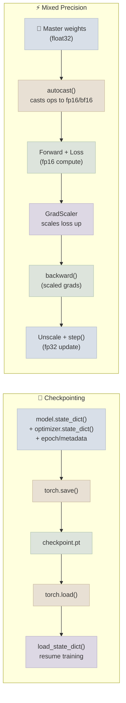

# Checkpointing and Mixed Precision

## The One-Line Definition

**Checkpointing** saves a model's (and optimizer's) state to disk so training can be paused and resumed exactly where it left off, while **mixed precision** trains using a mix of 16-bit and 32-bit floating point numbers to cut memory usage and speed up training with minimal accuracy loss.

<div class="audience-biz" markdown="1">

Checkpointing is like a video game save file for a model - if training crashes after 8 hours, or you just want to try the model as it stood at epoch 20, you can load that exact save point instead of starting over. Mixed precision is like using a smaller, faster notepad for most calculations while keeping a full-size notepad only for the parts where precision really matters - it lets you train bigger models faster on the same GPU without meaningfully hurting accuracy.

</div>

<div class="audience-tech" markdown="1">

A checkpoint is a snapshot of `model.state_dict()` (all learnable parameters + buffers like BatchNorm running stats) plus `optimizer.state_dict()` (momentum/variance estimates for Adam, etc.) and any training metadata (epoch, best validation score, RNG state). Mixed precision (AMP - Automatic Mixed Precision) runs most ops in `float16`/`bfloat16` while keeping a master copy of weights and precision-sensitive ops (reductions, loss computation) in `float32`, using a `GradScaler` to prevent gradient underflow in `float16`.

</div>



---

## Saving and Loading `state_dict()`

<div class="audience-biz" markdown="1">

PyTorch recommends saving just the model's "settings" (its learned numbers), not the entire Python object - this is more portable and less likely to break when code changes slightly. To resume training properly, you also need to save the optimizer's internal state (things like momentum), otherwise resumed training can behave differently than an uninterrupted run.

</div>

<div class="audience-tech" markdown="1">

```python
# ---- Saving a checkpoint ----
checkpoint = {
    "epoch": epoch,
    "model_state_dict": model.state_dict(),
    "optimizer_state_dict": optimizer.state_dict(),
    "best_val_loss": best_val_loss,
}
torch.save(checkpoint, f"checkpoints/model_epoch{epoch}.pt")

# ---- Loading and resuming ----
checkpoint = torch.load("checkpoints/model_epoch10.pt", map_location=device)
model.load_state_dict(checkpoint["model_state_dict"])
optimizer.load_state_dict(checkpoint["optimizer_state_dict"])
start_epoch = checkpoint["epoch"] + 1
best_val_loss = checkpoint["best_val_loss"]

model.to(device)
for epoch in range(start_epoch, num_epochs):
    ...  # continue training exactly where it left off
```

`torch.save(model.state_dict(), ...)` is preferred over `torch.save(model, ...)` (pickling the whole object) because it's robust to refactors in the model's class definition, doesn't tie the checkpoint to exact file paths/class locations, and is the portable format expected by most downstream tooling. Always pass `map_location=device` when loading, so a checkpoint saved on GPU can still be loaded on a CPU-only machine.

**Saving only the best model** (common pattern to avoid disk bloat from saving every epoch):

```python
if val_loss < best_val_loss:
    best_val_loss = val_loss
    torch.save(model.state_dict(), "checkpoints/best_model.pt")
```

</div>

---

## Mixed Precision with `autocast` and `GradScaler`

<div class="audience-biz" markdown="1">

GPUs can do 16-bit math roughly 2-3x faster than 32-bit math and it uses about half the memory - which means either training faster, or fitting a bigger model/batch size in the same GPU. The catch is that 16-bit numbers have a much smaller range, so very small gradient values can round down to zero ("underflow") and get lost. `GradScaler` works around this by temporarily multiplying the loss by a large number before the backward pass, then dividing back out before updating weights - keeping small gradients away from that underflow zone.

</div>

<div class="audience-tech" markdown="1">

```python
from torch.cuda.amp import autocast, GradScaler

model = MyModel().to(device)
optimizer = optim.Adam(model.parameters(), lr=1e-3)
scaler = GradScaler()

for epoch in range(num_epochs):
    model.train()
    for batch_x, batch_y in train_loader:
        batch_x, batch_y = batch_x.to(device), batch_y.to(device)
        optimizer.zero_grad()

        with autocast():                     # ops inside run in fp16 where safe
            outputs = model(batch_x)
            loss = loss_fn(outputs, batch_y)

        scaler.scale(loss).backward()          # scale loss up before backward - avoids fp16 underflow
        scaler.step(optimizer)                  # unscales gradients, then calls optimizer.step()
        scaler.update()                         # adjusts the scale factor for next iteration
```

Why this saves VRAM and speeds up training:
- **Memory**: activations and gradients stored in `float16` (2 bytes) instead of `float32` (4 bytes) roughly halves activation memory - the single biggest VRAM consumer during training for large batch sizes/sequence lengths
- **Speed**: modern GPU tensor cores (NVIDIA Volta and newer) execute `float16`/`bfloat16` matrix multiplications at significantly higher throughput than `float32`
- **`autocast()`** automatically chooses which ops are safe to run in reduced precision (matmuls, convolutions) versus which need `float32` for numerical stability (softmax, loss reductions, batch norm statistics) - you don't have to manually cast tensors
- **`bfloat16`** (available on newer GPUs/TPUs) has the same exponent range as `float32`, so it often doesn't need `GradScaler` at all - it trades some mantissa precision for range stability, avoiding the underflow problem `float16` has

</div>

---

## Study Notes

- Save `state_dict()` (model + optimizer), not the whole model object, for portable and refactor-safe checkpoints
- A resumable checkpoint needs: model weights, optimizer state, epoch number, and any tracked best-metric value
- Always pass `map_location=device` when loading a checkpoint to avoid device-mismatch errors
- `autocast()` picks safe ops to run in reduced precision automatically; you don't manually cast every tensor
- `GradScaler` prevents small gradients from underflowing to zero in `float16` by scaling the loss up before `backward()` and unscaling before `optimizer.step()`
- Mixed precision roughly halves activation/gradient memory and speeds up compute on tensor-core GPUs, with minimal accuracy impact when done correctly

**Q: Why save `model.state_dict()` instead of `torch.save(model, path)`?**
A: `state_dict()` is just an ordered dict of tensor names to parameter/buffer values - portable across code refactors, Python versions, and even different (compatible) model implementations. Saving the whole model object pickles the class definition and file paths, which breaks if the source code changes even slightly.

**Q: What exactly does `GradScaler` do, step by step?**
A: (1) Multiplies the loss by a scale factor before `.backward()`, so gradients throughout the network are scaled up proportionally and stay above `float16`'s minimum representable magnitude. (2) During `scaler.step(optimizer)`, it unscales the gradients back down before applying the optimizer update, and checks for `inf`/`NaN` values (which indicate the scale was too high) - skipping the step if found. (3) `scaler.update()` adjusts the scale factor up or down for the next iteration based on whether overflow was detected.

**Q: Why does `map_location=device` matter when loading a checkpoint?**
A: A checkpoint saved from a GPU tensor is serialized with its original device info. Without `map_location`, loading it on a machine without that same GPU (or a CPU-only machine) raises an error. Passing `map_location=device` (or `map_location="cpu"`) tells PyTorch to remap all tensors to the target device during deserialization.

**Q: Does mixed precision hurt model accuracy?**
A: In most cases, no - `autocast` keeps precision-sensitive operations (loss computation, normalization statistics, reductions) in `float32`, and `GradScaler` protects against gradient underflow. For most CNN/transformer training, final accuracy is statistically indistinguishable from full `float32` training, while training runs measurably faster and uses less memory.
