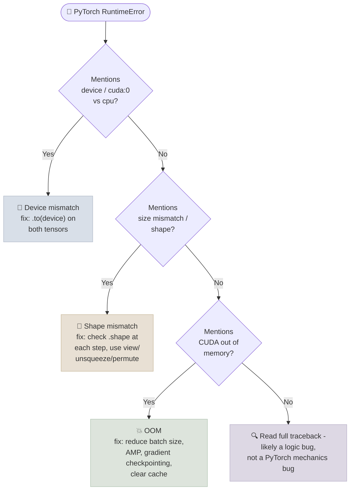

# Debugging and GPU Memory

## The One-Line Definition

Most PyTorch bugs fall into two buckets - **device mismatches** (a tensor on CPU meeting a tensor on GPU) and **shape mismatches** (tensors with incompatible dimensions being combined) - while **CUDA out-of-memory (OOM) errors** are a separate class of failure caused by activations, gradients, and optimizer state exceeding available VRAM.

<div class="audience-biz" markdown="1">

When a PyTorch script crashes, the error almost always falls into one of three buckets: "these two pieces of data are stored in different places" (CPU vs. GPU), "these two pieces of data are shaped differently than expected" (like trying to add a list of 10 numbers to a list of 5), or "the GPU ran out of room to store everything training needs at once." Once you know which bucket an error belongs to, the fix is usually mechanical.

</div>

<div class="audience-tech" markdown="1">

PyTorch enforces that operations between tensors require matching `device` and broadcast-compatible `shape` - both raise explicit `RuntimeError`s with messages that name the mismatch directly, which makes them straightforward to triage once you know how to read them. GPU memory (VRAM) is consumed by four categories that grow with batch size and model size: parameters, gradients, optimizer state (e.g. Adam's two moment estimates per parameter), and activations retained for the backward pass - the last of these is usually the largest and most controllable via batch size, gradient checkpointing, and mixed precision.

</div>



---

## Moving Tensors Between CPU and GPU

<div class="audience-biz" markdown="1">

The model and the data it processes both need to be in the same "location" (CPU or GPU) at the same time, or PyTorch refuses to combine them. The fix is always the same: move whichever piece is in the wrong place using `.to(device)`. A very common bug is moving the model to GPU but forgetting to move each new batch of data there too, since data loading happens fresh every batch.

</div>

<div class="audience-tech" markdown="1">

```python
device = torch.device("cuda" if torch.cuda.is_available() else "cpu")

model = MyModel().to(device)          # move model parameters once, outside the loop

for batch_x, batch_y in train_loader:
    batch_x = batch_x.to(device)       # move each batch, every iteration
    batch_y = batch_y.to(device)
    outputs = model(batch_x)            # now both are on the same device - safe
```

Common device-mismatch error:
```
RuntimeError: Expected all tensors to be on the same device, but found at least two devices,
cuda:0 and cpu!
```

**Debugging checklist:**
- Model moved to `device` exactly once, right after construction (or after loading a checkpoint)
- Every batch from the `DataLoader` moved to `device` inside the loop (data loaders yield CPU tensors by default)
- Any tensor created *inside* the forward pass (e.g. a mask, a constant) also created on `device`, or with `.to(x.device)` matching an existing input
- Loss targets moved to `device`, not just the inputs - easy to miss

</div>

---

## Shape Mismatches

<div class="audience-biz" markdown="1">

Every layer in a model expects its input to have a specific shape, and a single wrong dimension anywhere upstream cascades into a confusing error several layers later. The fastest way to debug this is to print the shape of the tensor at each step until you find where it stops matching what the next layer expects.

</div>

<div class="audience-tech" markdown="1">

Common causes and fixes:

| Symptom | Likely cause | Fix |
|---|---|---|
| `mat1 and mat2 shapes cannot be multiplied` | `nn.Linear` input feature dimension doesn't match `in_features` | Print `.shape` right before the linear layer; flatten (`x.view(x.size(0), -1)`) if coming from a conv/pool stack |
| `Expected input batch_size (X) to match target batch_size (Y)` | Labels and predictions have mismatched batch dimension | Check `DataLoader` batching / `collate_fn`; verify no accidental slicing of one tensor but not the other |
| `Sizes of tensors must match except in dimension 0` | `torch.cat`/`torch.stack` on tensors with different non-batch dimensions | Verify all inputs to `cat`/`stack` share the same shape outside the concatenation dimension |
| Silent wrong output shape (no error, wrong results) | Broadcasting quietly "succeeded" on unintended dimensions | Never rely on implicit broadcasting for shapes you haven't explicitly checked; add `assert x.shape == (...)` during development |

```python
# Debugging pattern: print shapes at every stage during development
def forward(self, x):
    print("input:", x.shape)
    x = self.conv1(x); print("after conv1:", x.shape)
    x = self.pool(x);   print("after pool:", x.shape)
    x = x.view(x.size(0), -1); print("after flatten:", x.shape)
    x = self.fc1(x);    print("after fc1:", x.shape)
    return x
```

</div>

---

## CUDA Out-of-Memory Errors

<div class="audience-biz" markdown="1">

GPUs have a fixed amount of fast memory, and training a neural network needs to hold the model, its gradients, the optimizer's internal bookkeeping, and every intermediate calculation from the current batch all at once. If any of these grow too large - usually because the batch size or model size is too big for the GPU - training crashes with an "out of memory" error. The most reliable fix is almost always to make the batch smaller or to use mixed precision.

</div>

<div class="audience-tech" markdown="1">

```
RuntimeError: CUDA out of memory. Tried to allocate 2.00 GiB (GPU 0; 15.78 GiB total capacity;
13.24 GiB already allocated; 1.02 GiB free; 13.90 GiB reserved in total by PyTorch)
```

**What consumes VRAM, roughly in order of controllability:**
1. **Activations** (largest, most controllable) - every intermediate tensor kept for the backward pass; scales with batch size and sequence/image resolution
2. **Optimizer state** - Adam stores two extra tensors per parameter (first/second moment estimates), roughly 2x the parameter memory on top of the parameters themselves
3. **Gradients** - one tensor per parameter, same size as the parameters
4. **Model parameters** - fixed, doesn't scale with batch size

**Mitigation, roughly in order to try first:**
```python
# 1. Reduce batch size (biggest, simplest lever)
train_loader = DataLoader(train_ds, batch_size=16)  # was 64

# 2. Use mixed precision (roughly halves activation memory)
with autocast():
    outputs = model(batch_x)

# 3. Use gradient accumulation to keep effective batch size while lowering peak memory
#    (see 01-Tensors-and-Autograd.mdx for the accumulation pattern)

# 4. Gradient checkpointing - recompute activations during backward instead of storing them
from torch.utils.checkpoint import checkpoint
x = checkpoint(self.expensive_block, x)

# 5. Clear cached (but unused) memory PyTorch is holding onto
torch.cuda.empty_cache()

# 6. Inspect current allocation in detail
print(torch.cuda.memory_summary(device=device, abbreviated=True))
```

`torch.cuda.memory_summary()` prints a breakdown of allocated vs. reserved memory and the largest allocation blocks - useful for identifying whether memory is fragmented (many small blocks, `empty_cache()` may help) versus genuinely exhausted (need to actually reduce what's held, e.g. lower batch size).

**Gradient checking basics:** when debugging whether gradients are flowing correctly (e.g. after modifying a custom `autograd.Function` or freezing/unfreezing layers), inspect `.grad` directly after `.backward()`:

```python
for name, param in model.named_parameters():
    if param.grad is None:
        print(f"{name}: NO GRADIENT (check requires_grad or graph connectivity)")
    elif torch.isnan(param.grad).any():
        print(f"{name}: NaN gradient - check for exploding gradients or bad loss scaling")
```

</div>

---

## Study Notes

- Device mismatches: move the model once outside the loop, move every batch (inputs *and* labels) inside the loop
- Shape mismatches: print `.shape` at each stage of the forward pass during development to isolate exactly where dimensions diverge
- VRAM is consumed by parameters, gradients, optimizer state, and activations - activations usually dominate and scale directly with batch size
- First lever for OOM: reduce batch size. Next: mixed precision. Then: gradient accumulation or gradient checkpointing
- `torch.cuda.memory_summary()` shows allocated vs. reserved memory to distinguish fragmentation from genuine exhaustion
- A parameter with `.grad is None` after `.backward()` means it wasn't connected to the loss in the computation graph - check `requires_grad` and that the tensor was actually used in the forward pass

**Q: You get "Expected all tensors to be on the same device, but found at least two devices." What's the most common overlooked cause?**
A: Forgetting to move the labels/targets to the GPU, not just the inputs - it's easy to remember `batch_x.to(device)` and forget `batch_y.to(device)` since the model only directly consumes `batch_x`.

**Q: What's the fastest way to isolate a shape-mismatch bug in a multi-layer model?**
A: Add temporary `print(x.shape)` statements (or `assert` checks) after each layer in the forward pass, then run a single batch through it - the shape divergence point tells you exactly which layer's expected input doesn't match what the previous layer actually produced.

**Q: Why does reducing batch size fix a CUDA OOM error?**
A: Activation memory (the largest and most controllable VRAM consumer) scales roughly linearly with batch size, since every sample in the batch needs its own set of intermediate tensors retained for the backward pass. Halving the batch size roughly halves activation memory.

**Q: What does `torch.cuda.empty_cache()` actually do - does it free up "more" memory for training?**
A: It doesn't free memory that's actively in use; it returns memory that PyTorch's caching allocator is holding in reserve (from previously freed tensors) back to CUDA, reducing the "reserved but not allocated" gap shown in `memory_summary()`. It can help with fragmentation-caused OOMs but won't help if the model genuinely needs more memory than the GPU has.

**Q: A parameter shows `param.grad is None` after `.backward()` - what are the two most likely causes?**
A: Either `requires_grad=False` on that parameter (it was frozen, e.g. for transfer learning), or the parameter simply wasn't used anywhere in the forward pass that led to the loss (a graph-connectivity bug, e.g. a layer defined in `__init__` but never called in `forward()`).
