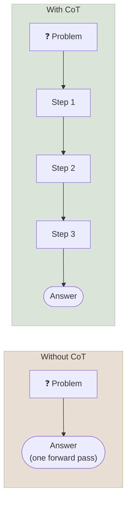

# Core Prompting Techniques

Zero-shot instructions, few-shot examples, chain-of-thought, tool-using loops and roles are the working vocabulary of prompting - each was introduced to fix a specific failure, and each has known limits.

```objectives
time: 55 min
outcomes:
  - Decide between zero-shot, few-shot and many-shot prompting for a task, and design a balanced example set
  - Explain why chain-of-thought helps, which task types benefit, and why it is largely redundant with reasoning models
  - Describe the ReAct loop and how native tool calling replaced text-parsed actions
  - Evaluate persona and negative-instruction prompting against the evidence
prerequisites:
  - "[Prompt Fundamentals](01-Prompt-Fundamentals.mdx)"
```


---

## Zero-Shot Prompting

A task instruction with no examples. It works because **instruction tuning** (FLAN, InstructGPT and every chat model since) trained models on thousands of tasks phrased as natural-language instructions, installing a general instruction-following skill. On a *base* model - one that has only been pretrained - zero-shot instructions often fail: the model continues your text rather than obeying it.

Before adding examples, tighten the zero-shot prompt:

1. **Make the label set explicit** - "Classify as exactly one of: billing, bug, account_access, feature_request."
2. **Define the labels** - most "model errors" on classification are really disagreements about category boundaries.
3. **Specify the output contract** - JSON with a schema, enforced by [structured outputs](04-Structured-Outputs.mdx) where available.
4. **Give the purpose** - "used to route tickets to the right team" helps the model resolve ambiguous cases the way you would.

---

## Few-Shot Prompting (In-Context Learning)

Few-shot prompting shows input-output examples before the real input. The model infers the task, format and decision boundary from them with no weight updates - **in-context learning**.

```python
messages = [
    {"role": "system", "content": "Classify support tickets. Reply with JSON: {\"category\": ...}"},
    {"role": "user", "content": "Ticket: I was charged twice this month."},
    {"role": "assistant", "content": '{"category": "billing"}'},
    {"role": "user", "content": "Ticket: The export button does nothing in Chrome."},
    {"role": "assistant", "content": '{"category": "bug"}'},
    {"role": "user", "content": f"Ticket: {ticket}"},
]
```

Writing examples as prior user/assistant turns (as above) usually works better with chat models than one long text block.

### What the examples actually teach

| Finding | Source | Practical consequence |
|---|---|---|
| Format and label space matter a lot; for smaller models, randomly *wrong* labels hurt surprisingly little | Min et al. (2022) | Get the format and the input distribution right first |
| Larger models *do* learn the input-label mapping: with flipped labels they follow the flips and override their priors | Wei et al. (2023) | With frontier models, wrong or inconsistent labels in examples will be copied - label them carefully |
| Predictions are biased toward labels that are frequent or recent in the prompt | Zhao et al. (2021) | Balance classes; randomise or vary order; evaluate |
| Example order alone can move accuracy from near-chance to near-best | Lu et al. (2022) | Never judge a few-shot prompt on one ordering |
| With long contexts, hundreds or thousands of examples ("many-shot") keep improving results on many tasks | Agarwal et al. (2024) | The old "over 20 examples, fine-tune instead" rule is outdated - compare many-shot plus prompt caching against fine-tuning on cost and quality |

### Choosing examples

- **Cover the input distribution**, especially the confusable boundary cases - not five easy ones.
- **Keep formatting identical** across examples; the model copies inconsistencies.
- **Retrieve examples dynamically** for large or varied tasks: embed a pool of labelled examples and insert the nearest neighbours of each input (a retrieval problem - see [RAG](../../12-RAG/INDEX.mdx)).
- **Measure.** In the [code lab](../CodeLabs/01-Prompt-Evals-and-Structured-Outputs.mdx), adding eight examples raised accuracy by about 4 points on 52 tickets, with a 95% interval that includes zero - a real effect cannot be distinguished from noise at that sample size.

---

## Chain-of-Thought (CoT)

Chain-of-thought prompting asks for intermediate reasoning before the answer - either by showing worked examples (Wei et al., 2022) or with a trigger such as "Let's think step by step" (zero-shot CoT, Kojima et al., 2022).

### Why it works

A transformer does a fixed amount of computation per generated token. A multi-step problem answered in one token must be solved inside a single forward pass. When the model writes intermediate steps, each step becomes context for the next: the generated text acts as working memory, and the total computation grows with the number of tokens written.



### When it helps

A meta-analysis of over 100 papers and 14 models (Sprague et al., 2024) found CoT's gains concentrate on **math and symbolic or logical reasoning**; on most other task types (knowledge recall, commonsense, many classification tasks) the benefit is small. In the original experiments CoT only helped at large scale - small models wrote fluent but illogical chains that made answers worse.

### CoT and reasoning models

Reasoning models (see [Prompting Reasoning Models](05-Prompting-Reasoning-Models.mdx) and [Post-Training: Reasoning Models](../../05-Post-Training/Notes/04-Reasoning-Models-and-Test-Time-Compute.mdx)) are trained with reinforcement learning to produce long internal reasoning before answering. "Think step by step" is redundant for them, and prescribing the steps usually does worse than stating the goal, constraints and output contract. Explicit CoT remains useful for non-reasoning models and when you need the reasoning visible and auditable in the output.

---

## ReAct: Reasoning + Acting

ReAct (Yao et al., 2022) interleaves reasoning with actions: the model writes a *Thought*, chooses an *Action* (a tool call), receives an *Observation* (the tool result), and repeats until it can answer. It is the ancestor of every tool-using agent.

```text
Thought: I need the current population of Tokyo.
Action: search("Tokyo population")
Observation: About 37 million in the metropolitan area.
Thought: I have what I need.
Answer: Roughly 37 million people live in the Tokyo metropolitan area.
```

The original implementation was text parsing: the model *wrote* `Action: search(...)`, and application code parsed the line, ran the tool and appended the observation. The model never executes anything - your code does.

Modern APIs replace the parsing with **native tool calling**: you declare tools with JSON schemas, the model returns structured tool-call blocks (not free text), and you return tool results in a dedicated message type. This removes a whole class of parsing bugs and lets models call several tools in parallel. The loop, its stop conditions and its failure modes are covered in [The Agent Loop](../../13-Agent-Foundations/Notes/03-The-Agent-Loop.mdx) and [Tool Use & Function Calling](../../13-Agent-Foundations/Notes/04-Tool-Use-and-Function-Calling.mdx).

---

## Roles and Personas

"You are an expert tax accountant..." shifts vocabulary, depth, tone and assumed audience. It does not add knowledge the model lacks, and the evidence that it improves correctness is weak: across 162 personas and thousands of factual questions, Zheng et al. (2024) found that adding a persona to the system prompt did not improve accuracy on average, and the best persona for a question was essentially unpredictable.

Use roles for **style and audience** ("explain to a new engineer who knows Python but not Kubernetes"), and put effort into what actually moves accuracy: clear task definitions, good examples, the right context and evaluation.

---

## Say What You Want, Not Only What You Don't

Positive instructions ("write flowing prose paragraphs") are generally followed more reliably than bare prohibitions ("don't use bullet points"), and model vendors' own prompting guides recommend them. Keep negative instructions for real hard constraints ("never reveal account numbers") and pair them with the positive behaviour you expect instead.

---

## Check Yourself

```quiz
- q: "You give a large frontier model 8 few-shot sentiment examples in which every label is deliberately flipped (positive reviews labelled negative). What does current evidence predict?"
  options:
    - "The model largely follows the flipped labels, overriding its prior knowledge"
    - "The model ignores the labels and answers correctly anyway"
    - "The model refuses the task"
    - "Accuracy is unchanged because only the format matters"
  answer: 1
  explain: "Wei et al. (2023) showed that larger models can override semantic priors and learn flipped input-label mappings in context. Min et al.'s 'labels barely matter' result mostly held for smaller models."
- q: "For which task is adding 'Let's think step by step' to a non-reasoning model most likely to help?"
  options:
    - "A multi-step word problem requiring arithmetic"
    - "Retrieving the capital of a country"
    - "Classifying the sentiment of a one-line review"
    - "Translating a sentence"
  answer: 1
- q: "In a ReAct loop, who executes the tool?"
  options:
    - "The application code - the model only emits a tool call (as text or as a structured block)"
    - "The model, inside its forward pass"
    - "The provider, always"
    - "The tokenizer"
  answer: 1
  explain: "Some providers offer server-side tools, but in the ReAct pattern and in client-side tool calling your code runs the tool and returns the result."
- q: "Your few-shot prompt scored 3 points higher than zero-shot on 50 examples. What should you do before shipping it?"
  answer: "Check whether the gain is real: compute a confidence interval (e.g. a paired bootstrap on per-item differences) and try other example orderings. On 50 items a 3-point gain is usually inside the noise, and order effects alone can be larger."
```

## Exercises

```exercise
- title: Build a balanced example set
  task: |
    You have 400 labelled tickets across four categories (60% bug, 25% billing, 10% account_access, 5% feature_request). Design an 8-example few-shot set and a procedure to choose it, and say how you would test whether ordering matters.
  solution: |
    Use 2 per class rather than proportional sampling (proportional would give almost no feature_request examples and bias predictions toward "bug"). Within each class pick boundary cases (e.g. "SSO login loops" for account_access vs bug). Test 5 random orderings on a held-out set of at least 100 items and report the spread; if the spread is large, prefer dynamic nearest-neighbour example selection or more examples.
- title: Where does CoT pay off?
  task: |
    Using any non-reasoning model, compare direct answering with zero-shot CoT on (a) 30 GSM8K math problems and (b) 30 single-fact trivia questions. Report accuracy and mean output tokens for each. Which task shows the larger gain per extra token?
  solution: |
    Expect a clear gain on GSM8K and little or none on trivia, while CoT multiplies output tokens on both - consistent with Sprague et al. (2024). The cost of CoT is paid on every task; the benefit is not.
```

## Study Notes

**Must-know:**
- Zero-shot works because of instruction tuning; tighten label definitions and output contracts before adding examples
- Few-shot teaches format, label space and mapping; large models copy the labels you show, including wrong ones
- Label frequency, recency and order all bias outputs - balance, vary order, evaluate
- Many-shot prompting with long contexts is a real alternative to fine-tuning for some tasks
- CoT turns generated text into working memory; gains concentrate on math and symbolic reasoning; reasoning models do it internally
- ReAct = thought/action/observation; native tool calling replaced text-parsed actions
- Personas change style, not accuracy; prefer positive instructions

## References

- Brown et al., [Language Models are Few-Shot Learners](https://arxiv.org/abs/2005.14165) (2020)
- Wei et al., [Finetuned Language Models Are Zero-Shot Learners (FLAN)](https://arxiv.org/abs/2109.01652) (ICLR 2022)
- Zhao et al., [Calibrate Before Use: Improving Few-Shot Performance of Language Models](https://arxiv.org/abs/2102.09690) (ICML 2021)
- Lu et al., [Fantastically Ordered Prompts and Where to Find Them](https://arxiv.org/abs/2104.08786) (ACL 2022)
- Min et al., [Rethinking the Role of Demonstrations](https://arxiv.org/abs/2202.12837) (EMNLP 2022)
- Wei et al., [Larger Language Models Do In-Context Learning Differently](https://arxiv.org/abs/2303.03846) (2023)
- Agarwal et al., [Many-Shot In-Context Learning](https://arxiv.org/abs/2404.11018) (NeurIPS 2024)
- Wei et al., [Chain-of-Thought Prompting Elicits Reasoning in Large Language Models](https://arxiv.org/abs/2201.11903) (NeurIPS 2022)
- Kojima et al., [Large Language Models are Zero-Shot Reasoners](https://arxiv.org/abs/2205.11916) (NeurIPS 2022)
- Sprague et al., [To CoT or not to CoT? Chain-of-thought helps mainly on math and symbolic reasoning](https://arxiv.org/abs/2409.12183) (ICLR 2025)
- Yao et al., [ReAct: Synergizing Reasoning and Acting in Language Models](https://arxiv.org/abs/2210.03629) (ICLR 2023)
- Zheng et al., [When "A Helpful Assistant" Is Not Really Helpful: Personas in System Prompts Do Not Improve Performances of Large Language Models](https://arxiv.org/abs/2311.10054) (Findings of EMNLP 2024)

*Last reviewed: 2026-09*
