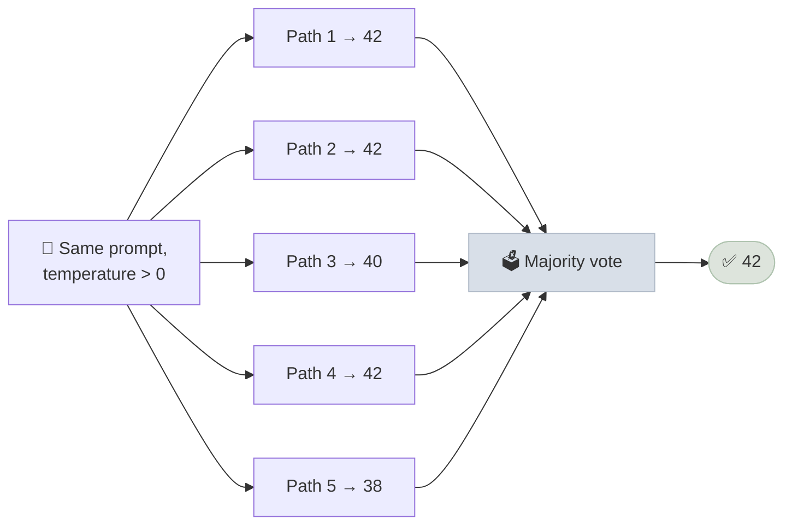
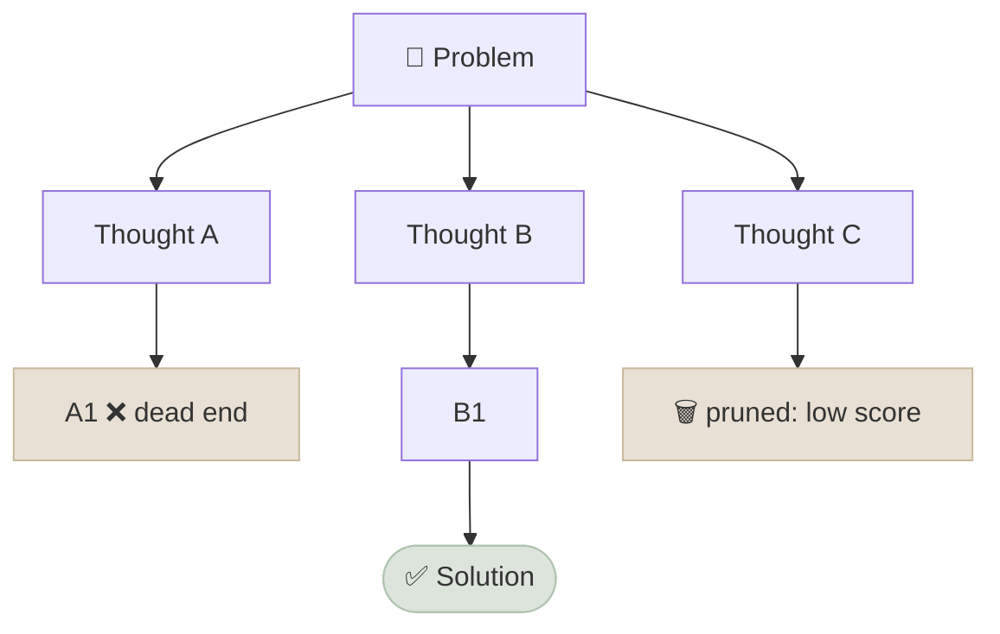
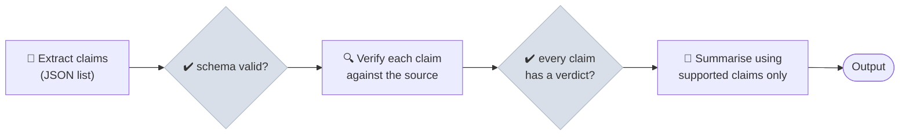

# Advanced Prompting Techniques

Advanced techniques spend more model calls to get better answers: by sampling several reasoning paths, searching over partial solutions, decomposing the problem, or critiquing and revising - and each only pays off under specific conditions.

```objectives
time: 50 min
outcomes:
  - Implement self-consistency and explain when majority voting is meaningful
  - Compare Tree of Thoughts, least-to-most decomposition and prompt chaining by cost and by the kind of problem they fix
  - Explain why self-correction without external feedback is unreliable, and what kinds of feedback make refine loops work
  - Estimate the cost multiplier of a technique and decide whether a reasoning model makes it unnecessary
prerequisites:
  - "[Core Techniques](02-Core-Techniques.mdx) - chain-of-thought"
```

All of the techniques below were designed for models that do not reason on their own. Reasoning models now perform much of this search internally (see [Reasoning Models & Test-Time Compute](../../05-Post-Training/Notes/04-Reasoning-Models-and-Test-Time-Compute.mdx)). The patterns still matter: they remain the building blocks of agent workflows, they are how you add *external* checks (tests, verifiers, tools) that a model cannot provide for itself, and they are common interview material.

| Technique | Problem it addresses | Extra cost | Needs |
|---|---|---|---|
| Self-consistency | One reasoning path can go wrong | N× samples | An answer you can vote on |
| Tree of Thoughts | Problems needing lookahead and backtracking | Tens of calls | A usable evaluator of partial states |
| Least-to-most | Problems harder than the examples you can show | One call per sub-problem | A good decomposition |
| Prompt chaining | One prompt doing too many things | One call per step | Checks between steps |
| Self-refine | First drafts with fixable flaws | 2-3× per round | Feedback the model can act on |

---

## Self-Consistency

Sample several chain-of-thought answers at non-zero temperature and take the majority final answer (Wang et al., 2022). Different paths make different mistakes; correct paths tend to agree.



```python
from collections import Counter

def self_consistent_answer(prompt: str, n: int = 5, temperature: float = 0.8) -> str:
    answers = [extract_final_answer(llm(prompt, temperature=temperature)) for _ in range(n)]
    return Counter(answers).most_common(1)[0][0]  # use an odd n to reduce ties
```

In the original paper, self-consistency added 17.9 points on GSM8K for PaLM-540B over single-path chain-of-thought, with smaller gains on commonsense tasks. It needs **convergent answers** - a number, a label, a multiple-choice letter. For free-form outputs, *universal self-consistency* (Chen et al., 2023) asks the model to pick the most consistent response among the samples instead of counting exact matches. The agreement rate is also a cheap confidence signal: 5/5 agreement is more trustworthy than 2/5.

Cost is linear in N, so reserve it for high-value queries or use it to generate labelled data offline. On providers where reasoning models don't expose temperature, sampling diversity comes from the model's own stochasticity.

---

## Tree of Thoughts (ToT)

ToT (Yao et al., 2023) turns reasoning into search. At each step the model proposes several candidate "thoughts", an evaluator scores the partial states, and a search algorithm (breadth-first with a beam, or depth-first with backtracking) expands the promising ones.



```python
def tree_of_thoughts(problem: str, breadth: int = 3, depth: int = 3) -> str:
    frontier = [problem]
    for _ in range(depth):
        candidates = [t for state in frontier for t in propose(state, n=breadth)]  # LLM call per state
        scored = sorted(candidates, key=evaluate, reverse=True)                     # LLM or verifier per candidate
        frontier = scored[:breadth]                                                  # keep the beam
    return frontier[0]
```

On puzzles like Game of 24 the paper raised GPT-4's success rate from 4% (chain-of-thought) to 74%. The catch is the **evaluator**: if it is another LLM guess, search can amplify its mistakes. ToT works best when partial states can be checked objectively - code that compiles or passes tests, arithmetic that can be verified, a game state with known rules. Cost is dozens of calls per problem.

---

## Least-to-Most Prompting

Zhou et al. (2022) split solving into two stages: first ask the model to **decompose** the problem into simpler sub-problems, then solve them in order, feeding each answer into the next. It generalises to problems harder than any example in the prompt, which plain chain-of-thought struggles with.

```python
def least_to_most(problem: str) -> str:
    subproblems = parse_list(llm(f"List the sub-questions needed to solve this, simplest first:\n{problem}"))
    context = f"Problem: {problem}\n"
    for sub in subproblems:
        answer = llm(f"{context}\nSub-question: {sub}\nAnswer:")
        context += f"\nQ: {sub}\nA: {answer}"
    return llm(f"{context}\n\nNow answer the original problem.")
```

---

## Prompt Chaining

Split a complex job into a pipeline of focused prompts, each with its own contract, and put **checks between steps**.



Benefits: each step can be tested and improved on its own, independent steps can run in parallel, and small focused prompts are followed more reliably than one prompt with ten jobs. The main risk is **error propagation** - a mistake in step 1 flows downstream - so validate intermediate outputs (schemas, counts, cross-references back to the source). Chaining is the simplest form of the "workflow" patterns in [Agent Patterns](../../15-Agent-Patterns/INDEX.mdx).

---

## Critique and Revise (Self-Refine)

Self-Refine (Madaan et al., 2023) loops *generate → critique → revise*. It helps where problems are easy to spot once written down: style, tone, missing requirements, readability.

Its limit is well documented: Huang et al. (2024) showed that when models are asked to find and fix their own **reasoning** errors without any external signal, accuracy often stays flat or gets worse - the model changes correct answers as readily as wrong ones. Refinement works when the critique has something to go on:

| Feedback source | Example |
|---|---|
| Execution | Unit test failures, compiler errors, a SQL query's result |
| Tools | A search result that contradicts a claim; a calculator |
| Explicit criteria | A rubric or checklist the draft is scored against |
| A different, stronger model or a human | Reviewer comments |

This is why coding agents run the tests rather than re-reading their own code - see [Agent Patterns](../../15-Agent-Patterns/Notes/02-Single-Agent-Patterns.mdx).

---

## Generated Knowledge and Directional Stimulus

**Generated knowledge prompting** (Liu et al., 2022) asks the model to write relevant facts first and then answer using them. It can surface knowledge the model has but didn't use - and it can also produce confident false "facts" that the answer then relies on. Retrieval from real sources (RAG) replaced it for knowledge-intensive tasks.

**Directional stimulus prompting** (Li et al., 2023) trains a *small* policy model to generate a per-input hint - such as keywords a summary should cover - that is added to the large model's prompt. The broader lesson carries over without the training: short, input-specific guidance ("focus on the policy recommendations and their costs") is a cheap way to steer a large model.

---

## Meta-Prompting

Using a model to write or improve prompts - "here is my prompt and three failures; propose a better prompt" - is a fast way to get a first draft, and vendor consoles offer prompt generators and improvers. Treat the output as a candidate, not an improvement: the only evidence that a new prompt is better is a higher score on a held-out eval set. Doing that systematically is **automated prompt optimization**, covered in [Automated Prompt Optimization](09-Automated-Prompt-Optimization.mdx).

---

## Check Yourself

```quiz
- q: "Which task is self-consistency with majority voting best suited to?"
  options:
    - "Multi-step math word problems with a single numeric answer"
    - "Writing a product description"
    - "Summarising a meeting"
    - "Brainstorming slogans"
  answer: 1
  explain: "Majority voting needs answers that can match exactly. For free-form outputs, use a selection method such as universal self-consistency or a judge."
- q: "A self-refine loop on math problems (no tools, no tests) lowers accuracy. What is the most likely explanation?"
  options:
    - "Without external feedback, models change correct answers as often as wrong ones"
    - "The temperature was too low"
    - "The context window overflowed"
    - "Self-refine only works for reasoning models"
  answer: 1
- q: "What does Tree of Thoughts need in order to beat chain-of-thought reliably?"
  options:
    - "A trustworthy way to evaluate partial solutions"
    - "A larger context window"
    - "Few-shot examples of trees"
    - "A lower temperature"
  answer: 1
- q: "A 3-step prompt chain produces bad summaries. How do you find which step is at fault?"
  answer: "Log and evaluate each step's output separately against its own contract (e.g. are the extracted claims complete? are the verdicts correct?), starting from the first step - errors propagate downstream, so fix the earliest failing step first."
```

## Exercises

```exercise
- title: Cost-benefit of self-consistency
  task: |
    A single chain-of-thought call costs $0.002 and is correct 80% of the time on your task. Self-consistency with N=5 raises accuracy to 88%. Each wrong answer costs your business $0.50 in manual review. Is N=5 worth it per query? At what cost of a wrong answer do the two options break even?
  solution: |
    Single: 0.002 + 0.20 × 0.50 = $0.102 per query. N=5: 0.010 + 0.12 × 0.50 = $0.070. N=5 is cheaper overall. Break-even when 0.002 + 0.20c = 0.010 + 0.12c, so c = $0.10 - above $0.10 per error, self-consistency pays for itself.
- title: Add real feedback to a refine loop
  task: |
    Write a generate-test-revise loop for a Python function: the model writes the function, you run provided unit tests, and on failure you feed the failing test names and error messages back. Cap it at 3 rounds. Compare the pass rate to a critique-only loop (no test output) on 20 small problems.
  solution: |
    The test-feedback loop should clearly beat the critique-only loop, because failures give the model concrete, verifiable signal - the core lesson of Huang et al. (2024) and the design principle behind coding agents.
```

## Study Notes

**Must-know:**
- Self-consistency: sample N paths, majority vote; needs convergent answers; agreement rate doubles as confidence
- ToT: search over partial solutions; only as good as its evaluator; best with verifiable states
- Least-to-most: decompose, then solve in order; generalises beyond the examples
- Prompt chaining: focused steps with validation between them; watch error propagation
- Self-refine helps style and requirements; reasoning self-correction needs external feedback
- Reasoning models internalise much of this search; the patterns live on in agent workflows

## References

- Wang et al., [Self-Consistency Improves Chain of Thought Reasoning in Language Models](https://arxiv.org/abs/2203.11171) (ICLR 2023)
- Chen et al., [Universal Self-Consistency for Large Language Model Generation](https://arxiv.org/abs/2311.17311) (2023)
- Yao et al., [Tree of Thoughts: Deliberate Problem Solving with Large Language Models](https://arxiv.org/abs/2305.10601) (NeurIPS 2023)
- Zhou et al., [Least-to-Most Prompting Enables Complex Reasoning in Large Language Models](https://arxiv.org/abs/2205.10625) (ICLR 2023)
- Madaan et al., [Self-Refine: Iterative Refinement with Self-Feedback](https://arxiv.org/abs/2303.17651) (NeurIPS 2023)
- Huang et al., [Large Language Models Cannot Self-Correct Reasoning Yet](https://arxiv.org/abs/2310.01798) (ICLR 2024)
- Liu et al., [Generated Knowledge Prompting for Commonsense Reasoning](https://arxiv.org/abs/2110.08387) (ACL 2022)
- Li et al., [Guiding Large Language Models via Directional Stimulus Prompting](https://arxiv.org/abs/2302.11520) (NeurIPS 2023)

*Last reviewed: 2026-09*
