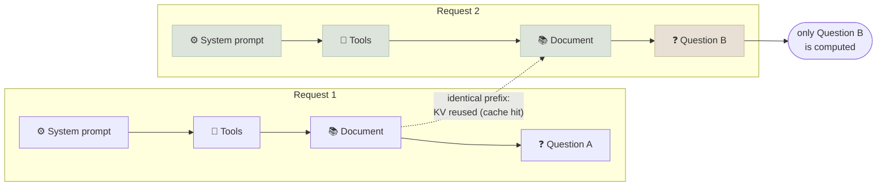

# Prompt Caching & Cost

Prompt caching reuses the model's already-computed state for a repeated prompt prefix, cutting the price of those input tokens by up to about 90% and time-to-first-token substantially - if the prompt is structured so the prefix actually repeats.

```objectives
time: 40 min
outcomes:
  - Explain what a prompt cache stores and why only an identical prefix can hit it
  - Compare the caching models of the major APIs and self-hosted engines (automatic vs explicit, TTLs, minimums, prices)
  - Structure prompts and agent loops for high cache hit rates, and compute the break-even for an explicit cache write
  - Combine caching with the other cost levers - batch APIs, model routing, effort and output length
prerequisites:
  - "[KV Cache & Inference Optimization](../../08-Serving-and-Inference/Notes/01-KV-Cache-and-Inference-Optimization.mdx) - what the KV cache is"
  - "[Context Engineering](06-Context-Engineering.mdx)"
```

## What Gets Cached

Processing the input (prefill) computes key and value tensors for every token at every layer - the KV cache. Because attention is causal, the KV entries for a token depend only on the tokens *before* it. So if a new request starts with exactly the same tokens as an earlier one, the server can reuse the stored KV entries for that prefix and only compute the new suffix.



Consequences:

- **Only prefixes match.** One changed token invalidates everything after it. A timestamp at the top of the system prompt defeats the cache for the whole request.
- **Order matters.** Put stable content first (instructions, tool definitions, long documents, examples), then conversation history, then the new request.
- **Serialisation must be byte-stable.** Tool definitions in a different order, JSON with unsorted keys, or whitespace differences all change the tokens.
- **Outputs are not cached** - this is not a response cache. The model still generates fresh output every time.

Self-hosted engines do the same thing automatically: vLLM's automatic prefix caching hashes KV-cache blocks, and SGLang's RadixAttention keeps prefixes in a radix tree (see [vLLM & PagedAttention](../../08-Serving-and-Inference/Notes/02-vLLM-and-Paged-Attention.mdx)).

---

## How the Major APIs Do It

| | Anthropic | OpenAI | Google Gemini |
|---|---|---|---|
| **Activation** | Explicit `cache_control` breakpoints on content blocks (up to 4), plus an automatic mode that moves a breakpoint along the growing conversation | Automatic for supported models; optional `prompt_cache_key` to group requests | Implicit caching automatic on Gemini 2.5 and later; explicit context caches you create with a TTL |
| **Minimum prefix** | Model-dependent (512 to 4,096 tokens) | 1,024 tokens | 2,048 (2.5 models) or 4,096 (3.x models) for implicit caching |
| **Lifetime** | 5 minutes (default) or 1 hour, refreshed on each hit | In-memory, typically minutes; newer models guarantee at least 30 minutes after last use; some models offer 24-hour retention | Implicit: short, best effort; explicit: the TTL you set |
| **Price of a hit** | ~0.1× the input price (lower on some models) | Up to 90% off (0.1× on newest models) | Discounted - see the pricing page per model |
| **Price of a write** | 1.25× input (5-minute) or 2× (1-hour) | No surcharge | Implicit: none; explicit: storage charged per hour |
| **Where to see it** | `usage.cache_read_input_tokens`, `cache_creation_input_tokens` | `usage.prompt_tokens_details.cached_tokens` (Responses: `input_tokens_details`) | Cached-token count in the usage metadata |

Details change often - check each provider's caching page before relying on a number. The design rules below don't change.

### Break-even for explicit writes

With Anthropic's 5-minute cache, a write costs 1.25× and each read 0.1× the base input price. For a prefix reused *n* times within the TTL:

```text
uncached cost = n × 1.0
cached cost   = 1.25 + (n − 1) × 0.1
break-even: n = 2  →  2.0 vs 1.35   (caching already wins at the second request)
1-hour TTL (2× write): n = 3 → 3.0 vs 2.2
```

A read refreshes the TTL, so steady traffic keeps a 5-minute cache warm indefinitely; the 1-hour TTL is for gaps between 5 and 60 minutes.

---

## Designing for Cache Hits

```python
import anthropic

client = anthropic.Anthropic()
SYSTEM = [
    {"type": "text", "text": LONG_STABLE_INSTRUCTIONS},
    {"type": "text", "text": PRODUCT_HANDBOOK,          # large, shared by every request
     "cache_control": {"type": "ephemeral"}},           # breakpoint: cache everything up to here
]

def answer(question: str, history: list[dict]):
    return client.messages.create(
        model=MODEL, max_tokens=2048,
        system=SYSTEM,                                   # identical bytes on every call
        messages=history + [{"role": "user", "content": question}],
    )
# resp.usage.cache_read_input_tokens shows the tokens served from cache
```

Checklist:

1. **Stable first, variable last**: instructions → tools → documents → examples → history → current input.
2. **No per-request values in the prefix**: move dates, user names and request IDs into the final user message.
3. **Freeze tool definitions and their order**; loading tools dynamically at the top of the prompt breaks the cache on every change.
4. **Append, don't rewrite, history** in agent loops - editing or summarising early turns invalidates everything after the edit. Compact rarely and deliberately (see [Context Engineering](06-Context-Engineering.mdx)).
5. **Measure the hit rate** from the usage fields; a sudden drop usually means something changed in the prefix.

---

## The Other Cost Levers

| Lever | Typical effect | Trade-off |
|---|---|---|
| **Prompt caching** | Up to ~90% off repeated input; lower TTFT | Prompt structure constraints |
| **Batch APIs** (OpenAI, Anthropic and Google all offer one) | About 50% off, results within 24 hours | Not for interactive traffic |
| **Model routing / cascades** | Send easy requests to a small model, escalate hard ones | Needs a router and an eval per route |
| **Reasoning effort** | Lower effort cuts output tokens sharply on easy tasks | Accuracy on hard tasks - measure per task |
| **Output length** | Output tokens cost several times more than input tokens | Ask for concise formats; enforce with schemas and `max_tokens` |
| **Context size** | Fewer retrieved chunks, trimmed tool results | Recall - see [RAG evaluation](../../12-RAG/Notes/06-RAG-Evaluation.mdx) |

A simple cost model per request:

```text
cost = uncached_input × p_in  +  cached_input × p_cache  +  output (incl. reasoning) × p_out
```

Log the three token counts for every call. Most cost surprises come from output (reasoning) tokens and from cache hit rates that quietly dropped after a prompt change.

---

## Check Yourself

```quiz
- q: "You add the current date and time to the first line of your system prompt. What happens to prompt caching?"
  options:
    - "Every request misses the cache, because the prefix changes on each call"
    - "Nothing - caching ignores the system prompt"
    - "Only the date line is recomputed"
    - "The cache hit rate doubles"
  answer: 1
  explain: "Caches match exact token prefixes. Put per-request values at the end of the prompt."
- q: "With a 1.25× write price and 0.1× read price, how many requests sharing a prefix within the TTL are needed for caching to be cheaper than no caching?"
  options: ["1", "2", "5", "10"]
  answer: 2
- q: "What does a prompt cache store?"
  options:
    - "The KV tensors computed for a prompt prefix, so prefill for that prefix can be skipped"
    - "The model's previous responses"
    - "Embeddings of the prompt"
    - "A compressed copy of the model weights"
  answer: 1
- q: "An agent's cache hit rate fell from 85% to 10% after a release. Name two likely causes to check first."
  answer: "Something before the variable part of the prompt now changes per request - e.g. a timestamp or user-specific text added to the system prompt, tool definitions loaded in a different order or re-serialised differently - or the loop now rewrites or summarises earlier turns instead of appending."
```

## Exercises

```exercise
- title: Price a RAG assistant
  task: |
    An assistant sends a 6,000-token system prompt + handbook, 1,500 tokens of retrieved chunks, 500 tokens of history and a 100-token question, and returns 400 output tokens. Prices: input $3/M, cached read $0.30/M, cache write 1.25×, output $15/M. Traffic is continuous. Compute the cost per request with and without caching the 6,000-token prefix.
  solution: |
    Without caching: 8,100 × $3/M + 400 × $15/M = $0.0243 + $0.0060 = $0.0303.
    With caching (steady state, all hits): 6,000 × $0.30/M + 2,100 × $3/M + $0.0060 = $0.0018 + $0.0063 + $0.0060 = $0.0141 - about 53% cheaper. Output is now over 40% of the bill, so output length is the next lever.
- title: Fix a cache-hostile prompt
  task: |
    This prompt order is used for every call: `[current date] [user profile] [system rules] [tool definitions] [handbook] [history] [question]`. Reorder it for caching and say where the date and profile should go.
  solution: |
    `[system rules] [tool definitions] [handbook] (cache breakpoint) [history] [user profile + current date + question]`. The profile and date vary per user or per call, so they belong after the cached prefix - typically in the final user message.
```

## Study Notes

**Must-know:**
- Caching reuses prefix KV state; only exact token prefixes hit; outputs are never cached
- Anthropic: explicit breakpoints, 5 min / 1 h TTL, write 1.25× / 2×, read ~0.1×; OpenAI: automatic, ≥1,024 tokens, up to 90% off; Gemini: implicit on 2.5+, plus explicit caches
- Stable content first; no timestamps or IDs in the prefix; frozen tool order; append-only history
- Break-even for a 5-minute write is two requests
- Other levers: batch (~50%), routing, effort, output length, smaller contexts - track uncached, cached and output tokens separately

## References

- Anthropic, [Prompt caching](https://platform.claude.com/docs/en/build-with-claude/prompt-caching)
- OpenAI, [Prompt caching guide](https://developers.openai.com/api/docs/guides/prompt-caching)
- Google, [Gemini context caching](https://ai.google.dev/gemini-api/docs/caching)
- Gim et al., [Prompt Cache: Modular Attention Reuse for Low-Latency Inference](https://arxiv.org/abs/2311.04934) (MLSys 2024)
- Zheng et al., [SGLang: Efficient Execution of Structured Language Model Programs](https://arxiv.org/abs/2312.07104) (NeurIPS 2024) - RadixAttention
- vLLM, [Automatic Prefix Caching](https://docs.vllm.ai/en/latest/features/automatic_prefix_caching.html)

*Last reviewed: 2026-09*
