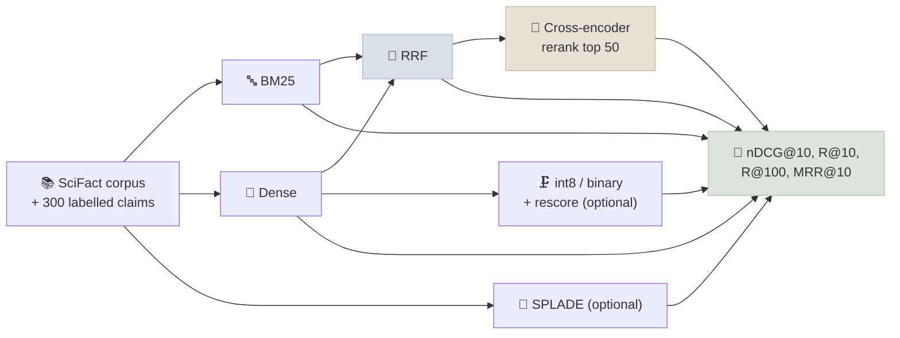

# Code Lab 01 - Retrieval Evaluation

Measure retrieval instead of guessing: build BM25, dense, hybrid, reranked, learned-sparse and quantized retrievers over the same public benchmark, compute nDCG@10, Recall@k and MRR yourself, and see which "best practices" actually help on this data.

← **Back to Overview:** [RAG](../INDEX.mdx) · **Concepts:** [Embeddings & Vector Search](../Notes/02-Embeddings-and-Vector-Search.mdx) · [Retrieval & Reranking](../Notes/04-Retrieval-and-Reranking.mdx) · [RAG Evaluation](../Notes/06-RAG-Evaluation.mdx)

```objectives
time: 2 hours
outcomes:
  - Implement nDCG@k, Recall@k and MRR from their definitions and run them on labelled queries
  - Build BM25, dense, hybrid (RRF) and reranked retrieval over one corpus and compare them fairly
  - Measure the quality cost of int8 and binary embedding quantization with rescoring
  - Explain from your own results why hybrid retrieval helps and why an out-of-domain reranker may not
prerequisites:
  - "[RAG Evaluation](../Notes/06-RAG-Evaluation.mdx) - retrieval metrics"
  - "Python 3.10+; about 2 GB free RAM (4 GB with --splade)"
```

---

## What's In This Lab

| Property | Detail |
|---|---|
| Dataset | BEIR **SciFact**: 5,183 scientific abstracts, 300 test claims with relevance labels (downloaded from Hugging Face) |
| Systems | BM25 (`bm25s`), dense (`all-MiniLM-L6-v2`), hybrid RRF, hybrid + cross-encoder rerank, optional SPLADE, optional int8 / binary quantization |
| Metrics | nDCG@10, Recall@10, Recall@100, MRR@10 - implemented in the script |
| Verified | Full run on an Apple-silicon laptop (CPU/MPS): ~2.5 min for the default systems, ~8 min with `--splade`, using sentence-transformers 6.1 and bm25s 0.3 |
| Files | `01-Retrieval-Evaluation/{retrieval_lab.py, requirements.txt}` |



## Run It

```bash
cd 11-RAG/CodeLabs/01-Retrieval-Evaluation
pip install -r requirements.txt

python retrieval_lab.py --limit 50              # quick run on 50 queries
python retrieval_lab.py                         # BM25, dense, hybrid, rerank
python retrieval_lab.py --quantization --splade # everything
python retrieval_lab.py --embed-model BAAI/bge-small-en-v1.5
```

A reference run (300 queries):

```text
system                                  nDCG@10    R@10   R@100  MRR@10
BM25                                      0.662   0.774   0.876   0.631
Dense                                     0.648   0.788   0.925   0.607
Hybrid (RRF)                              0.690   0.819   0.955   0.655
Hybrid + rerank top-50                    0.686   0.809   0.955   0.655
SPLADE (learned sparse)                   0.710   0.820   0.942   0.679
dense int8 (4x smaller)                   0.622   0.782   0.922   0.576
dense binary + rescore (32x smaller)      0.612   0.754   0.900   0.572
```

The BM25 and SPLADE numbers are close to published BEIR results for SciFact (about 0.665 and 0.70), which is a useful sanity check that the metrics are implemented correctly.

## Walkthrough - What to Look At

1. **BM25 beats the small dense model at the top of the ranking** (nDCG@10 0.662 vs 0.648). Scientific claims are full of precise terms; a general-purpose 22M-parameter embedding model trained on web data doesn't know them. Dense wins on Recall@100 (0.925 vs 0.876) - it finds more of the relevant documents, just not always at the top.
2. **Hybrid beats both** on every metric. The two retrievers make different mistakes, and RRF rewards documents both agree on. Recall@100 of 0.955 means a reranker has almost everything it needs in the candidate set.
3. **The reranker doesn't help here.** `ms-marco-MiniLM-L6-v2` was trained on web search queries; scientific claim verification is a different task and domain. A reranker is a model with a training distribution - evaluate it rather than assuming it helps.
4. **SPLADE is the best single retriever** - learned term weights plus expansion - but encoding the corpus took ~4 minutes on a laptop versus ~25 s for the small dense model, and needs more memory (the vocabulary-sized output per token).
5. **Quantization costs a few points with this model**: int8 keeps 96% and binary-plus-rescore 94% of dense nDCG@10, for 4× and 32× less memory. Models trained for quantization lose less.
6. **Read `ndcg_at_k`, `recall_at_k` and `mrr_at_k`** - each is a few lines, and writing them yourself removes the mystery from leaderboard numbers.

## Check Yourself

```quiz
- q: "Hybrid has Recall@100 = 0.955 but nDCG@10 = 0.690. What does that tell you about where to invest next?"
  options:
    - "The right documents are almost always in the top 100; improving the ordering (a better, in-domain reranker) is the lever"
    - "First-stage recall is the bottleneck"
    - "The metrics are inconsistent"
    - "Chunking must be changed"
  answer: 1
- q: "Why does the reranker in this lab slightly lower nDCG@10?"
  options:
    - "It was trained on web search (MS MARCO), which differs from scientific claim verification"
    - "Rerankers always lower nDCG"
    - "RRF output can't be reranked"
    - "50 candidates is too many"
  answer: 1
- q: "Why is matching published BEIR numbers for BM25 a useful check?"
  answer: "It validates the whole harness - data loading, qrels, tokenisation and metric code - against an independent reference. If BM25 were far from ~0.665 on SciFact, the bug would be in the harness, and every other comparison would be suspect."
```

## Exercises

```exercise
- title: A better embedding model
  task: |
    Re-run with `--embed-model BAAI/bge-small-en-v1.5` and with a larger model of your choice (check its model card for query prefixes - some expect "Represent this sentence for searching relevant passages: " or "query: "). Add the prefix handling to the script where needed. Does dense now beat BM25? Does hybrid still help?
  hints: ["SentenceTransformer.encode accepts prompt= for a query prefix; some models define named prompts in their config."]
  solution: |
    In our run, `bge-small-en-v1.5` (without a prefix) reached nDCG@10 0.721 - well above BM25's 0.662 - but equal-weight RRF hybrid scored 0.715, slightly *below* dense alone, while Recall@100 still rose (0.955 → 0.965). When one retriever is much stronger, equal-weight fusion can dilute its top ranks; weight the fusion toward the stronger retriever, or use hybrid as the candidate generator for a good reranker. Check the model card for query prefixes - they typically add a little more.
- title: Swap the reranker
  task: |
    Replace the reranker with a larger, more general one (e.g. `BAAI/bge-reranker-v2-m3`; a GPU helps) and vary `--rerank-top-n` between 20, 50 and 100. Plot nDCG@10 against rerank time.
  solution: |
    A stronger general reranker should now improve on hybrid, with diminishing returns as top-n grows (Recall@100 caps what reranking can reach). The plot is the latency-quality curve you'd use to choose top-n in production.
- title: Your own corpus
  task: |
    Replace `load_scifact()` with your own documents and 50 labelled queries (query id → relevant doc ids). Run all systems and write a one-paragraph recommendation for your domain.
  solution: |
    The recommendation should cite your numbers: which retriever wins at nDCG@10, whether hybrid helps, whether a reranker helps in your domain, and whether quantization is acceptable - rather than defaulting to the configuration that won on SciFact.
```

## References

- Thakur et al., [BEIR: A Heterogeneous Benchmark for Zero-shot Evaluation of Information Retrieval Models](https://arxiv.org/abs/2104.08663) (NeurIPS 2021)
- Wadden et al., [Fact or Fiction: Verifying Scientific Claims (SciFact)](https://arxiv.org/abs/2004.14974) (EMNLP 2020)
- Lù, [BM25S: Orders of magnitude faster lexical search via eager sparse scoring](https://arxiv.org/abs/2407.03618) (2024)
- [Sentence Transformers documentation](https://sbert.net/)

*Last reviewed: 2026-09*
