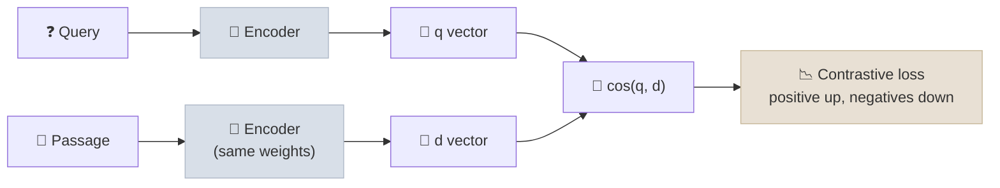

# Embeddings & Vector Search

An embedding model maps text (or images) to a dense vector so that similar meanings land close together, and a vector index finds the nearest vectors to a query among millions in milliseconds by searching approximately.

```objectives
time: 55 min
outcomes:
  - Explain how bi-encoder embedding models are trained and why queries and documents may be embedded differently
  - Choose an embedding model with a domain evaluation rather than a leaderboard alone
  - Compare HNSW, IVF, product quantization, ScaNN and DiskANN, and compute an index's memory footprint
  - Reduce storage 4-32× with Matryoshka truncation and int8/binary quantization, and recover quality with rescoring
  - Select a vector store based on filtering, hybrid search, multi-tenancy and operations needs
prerequisites:
  - "[RAG Fundamentals](01-RAG-Fundamentals.mdx)"
```

## Embedding Models

A **bi-encoder** encodes a query and a document independently into fixed-length vectors; relevance is their similarity. Modern embedding models start from a pretrained transformer (increasingly a decoder LLM) and are trained with **contrastive learning**: pull a query toward its relevant passage and push it away from other passages in the batch and from mined *hard negatives* (passages that look relevant but aren't). The quality of hard negatives and training data mixes is what separates strong models from weak ones.



Practical properties that matter more than the architecture:

| Property | Why it matters |
|---|---|
| **Asymmetric inputs** | Queries are short questions; documents are long passages. Many models expect a prefix or task type for each (`query:` / `passage:` for E5, an instruction for Qwen3-Embedding, `input_type` or `task_type` parameters in hosted APIs). Omitting it can cost several points of recall. |
| **Dimension** | 384-4,096. More dimensions store more but cost memory and search time; see Matryoshka below. |
| **Max input length** | 512 tokens for older models, 8K-32K for newer ones. Text beyond the limit is silently truncated. |
| **Languages and domains** | Multilingual models map all languages into one space; code, legal and biomedical text often benefit from specialised models. |
| **Licence and hosting** | Open weights can be self-hosted (no per-token fees, data stays in your network); APIs are simpler to operate. |

### Choosing a model

The **MTEB** leaderboard (now the multilingual **MMTEB**, with hundreds of tasks) is the standard starting point. As of 2026 strong options include hosted models from Google (Gemini embeddings), OpenAI (`text-embedding-3`), Cohere and Voyage, and open-weight families such as Qwen3-Embedding, BGE-M3, Jina and E5 - check the leaderboard's *retrieval* column for current rankings rather than trusting any list, including this one.

Leaderboards are a shortlist, not a decision. Several top models are trained on data overlapping the benchmark tasks, and your queries and documents rarely look like the benchmark's. Build a **domain eval** - 100-300 real questions with labelled relevant chunks - and measure recall@k and nDCG@10 for each candidate (the [code lab](../CodeLabs/01-Retrieval-Evaluation.mdx) is a template). Differences of a point on MTEB routinely reverse on domain data.

---

## Similarity Measures

| Measure | Formula | Notes |
|---|---|---|
| **Cosine** | q·d / (‖q‖‖d‖) | Direction only; the default for text |
| **Dot product** | q·d | Equals cosine for unit-length vectors; use it when the model was trained with dot product (some are) |
| **Euclidean (L2)** | ‖q − d‖ | For unit vectors, ranks identically to cosine: ‖q − d‖² = 2 − 2 cos(q, d) |

Use the measure the model was trained with - its model card says - and normalise vectors at index and query time if the model expects cosine. Most vector databases let you declare the metric per collection.

---

## Approximate Nearest-Neighbour Search

Exact search compares the query with every vector: 10 million 768-dimensional vectors is 7.7 billion multiply-adds per query. Approximate nearest-neighbour (ANN) indexes trade a little recall for orders-of-magnitude speed.

| Index | Idea | Strengths | Weaknesses |
|---|---|---|---|
| **HNSW** | A layered proximity graph; greedy search from sparse upper layers down to dense lower ones | High recall at low latency; incremental inserts; the default in most vector DBs | Memory-hungry (vectors plus graph links in RAM); deletes and heavy filtering degrade it |
| **IVF** | Cluster vectors with k-means; search only the `nprobe` nearest clusters | Smaller and faster to build than HNSW; scales well with PQ | Needs training; recall depends on `nprobe`; clusters drift as data changes |
| **PQ** (product quantization) | Split each vector into m sub-vectors and store each as the ID of its nearest centroid | Huge compression (bytes per vector) | Lossy - usually paired with rescoring on full vectors |
| **ScaNN** | Anisotropic vector quantization tuned for inner-product search, plus partitioning and rescoring | Very high throughput; powers Google's managed Vector Search | Less common outside Google's stack |
| **DiskANN / Vamana** | A graph index designed to live on SSD with compressed vectors in RAM | Billion-scale on one machine | Higher latency than all-in-RAM |

**Key parameters:** HNSW `M` (links per node) and `efConstruction` set build quality and memory; `efSearch` sets the recall/latency trade-off per query. IVF `nlist` (clusters, roughly √N to 4√N) and `nprobe` (clusters searched) play the same roles. Always measure recall@k of the ANN index against exact search on a sample - an index that quietly returns 85% of the true neighbours caps everything downstream.

```python
import faiss

d = 768
hnsw = faiss.IndexHNSWFlat(d, 32, faiss.METRIC_INNER_PRODUCT)   # M = 32
hnsw.hnsw.efConstruction = 200
hnsw.add(doc_vectors)                                            # float32, L2-normalised
hnsw.hnsw.efSearch = 64                                          # tune for recall vs latency
scores, ids = hnsw.search(query_vectors, 10)

# IVF + PQ: 256 clusters; 96 sub-quantizers x 8 bits = 96 bytes per vector (vs 3,072 for float32)
ivfpq = faiss.IndexIVFPQ(faiss.IndexFlatIP(d), d, 256, 96, 8, faiss.METRIC_INNER_PRODUCT)
ivfpq.train(sample_vectors)        # k-means for clusters and PQ codebooks
ivfpq.add(doc_vectors)
ivfpq.nprobe = 16
```

### Memory math

```text
float32:  N × d × 4 bytes           10M × 768 × 4   = 30.7 GB  (+ HNSW links: ~M × 2 × 4 bytes/vector ≈ 2.6 GB at M=32)
int8:     N × d × 1                 10M × 768       =  7.7 GB   (4×)
binary:   N × d / 8                 10M × 768 / 8   =  0.96 GB  (32×)
PQ (m=96, 8 bits): N × 96           10M × 96        =  0.96 GB  (32×)
```

---

## Shrinking Embeddings

### Matryoshka truncation

Matryoshka Representation Learning (MRL; Kusupati et al., 2022) trains a model so that the first *k* dimensions are themselves a good embedding. You can store 256 of 3,072 dimensions and lose little quality. Many current models (OpenAI's `text-embedding-3` via a `dimensions` parameter, Gemini embeddings, Qwen3-Embedding, Nomic, Jina) support it. Re-normalise after truncating.

### Quantization

| Precision | Storage | Retrieval quality retained (Hugging Face benchmark) |
|---|---|---|
| float32 | 1× | 100% |
| int8 (scalar, calibrated ranges) | 4× smaller | ~99.3% with rescoring |
| binary (sign of each dimension) | 32× smaller | ~92.5% without, ~96% with rescoring |

**Rescoring**: search the compressed index for, say, 4× more candidates than you need, then re-rank them using the float query against the stored (or on-disk) full vectors. Binary search uses Hamming distance - XOR and popcount - which is extremely fast.

In the [code lab](../CodeLabs/01-Retrieval-Evaluation.mdx) on SciFact with a small model not trained for quantization, int8 kept 96% and binary-plus-rescore 94% of float32 nDCG@10 - smaller models and quantization-unaware training lose more, which is why you measure on your own data. MRL and quantization combine: truncate a 3,072-dimensional float32 embedding to 512 dimensions *and* binarise it (12,288 bytes → 64 bytes, a 192× reduction), then rescore.

---

## Vector Stores

| Option | Type | Notable for |
|---|---|---|
| **pgvector** (+ pgvectorscale) on Postgres / AlloyDB / Aurora | Extension to your existing database | SQL filters and joins, transactions, one system to operate |
| **Qdrant** | Dedicated, open source + cloud | Rich payload filtering, quantization, multi-tenancy |
| **Weaviate** | Dedicated, open source + cloud | Built-in hybrid search, modules for embedding |
| **Milvus / Zilliz** | Dedicated, open source + cloud | Very large scale, many index types incl. GPU and DiskANN |
| **Pinecone** | Fully managed | Serverless operation, namespaces |
| **Elasticsearch / OpenSearch** | Search engine with vectors | Mature BM25 + vectors + filters in one query |
| **LanceDB, Chroma** | Embedded / local-first | Prototyping, notebooks, edge |
| **Cloud-managed** | Google Vector Search, Amazon S3 Vectors, Azure AI Search | Integration with each cloud's managed RAG (see [Managed RAG on Cloud Platforms](12-Managed-RAG-on-Cloud-Platforms.mdx)) |

Questions that decide the choice:

1. **Filtering.** Can it apply metadata filters (tenant, access level, date) *during* ANN search? Post-filtering the top-k can return too few results; naive pre-filtering can break HNSW's graph connectivity. Mature engines use filter-aware traversal (e.g. ACORN-style HNSW) or switch to exact search for very selective filters.
2. **Hybrid search.** Does it combine BM25 or learned-sparse with dense in one query (see [Retrieval & Reranking](04-Retrieval-and-Reranking.mdx))?
3. **Multi-tenancy.** Namespaces, per-tenant indexes, or filter-only isolation - and how that interacts with access control ([RAG in Production](11-RAG-in-Production.mdx)).
4. **Updates.** Real-time upserts and deletes, and how deletes affect index quality.
5. **Operations.** Who runs it, how it backs up, and whether the team already operates Postgres or Elasticsearch - "the database you already have" often wins below a few tens of millions of vectors.

---

## Check Yourself

```quiz
- q: "How many bytes per vector does IVF-PQ with 96 sub-quantizers of 8 bits use for 768-dimensional embeddings, and what compression is that versus float32?"
  options:
    - "96 bytes, 32× smaller than 3,072 bytes"
    - "768 bytes, 4× smaller"
    - "8 bytes, 384× smaller"
    - "12 bytes, 256× smaller"
  answer: 1
- q: "Your model card says to prefix queries with 'query: ' and passages with 'passage: '. You forget the prefixes. What happens?"
  options:
    - "Retrieval still works but is measurably worse, because the model was trained to encode the two roles differently"
    - "The API returns an error"
    - "Nothing - prefixes are cosmetic"
    - "Embedding dimension changes"
  answer: 1
- q: "Why is L2 distance equivalent to cosine similarity for ranking unit-length vectors?"
  options:
    - "Because ‖q − d‖² = 2 − 2·cos(q, d) when ‖q‖ = ‖d‖ = 1"
    - "Because both ignore direction"
    - "Because L2 is always larger"
    - "They are not equivalent"
  answer: 1
- q: "A model ranks first on the MTEB retrieval leaderboard. Why might it still lose to a lower-ranked model on your data?"
  answer: "Leaderboard tasks differ from your queries and documents (domain, length, language, style), and some models are trained on data overlapping benchmark tasks. Only an evaluation on your own labelled queries - recall@k and nDCG@10 - tells you which model is best for your corpus."
```

## Exercises

```exercise
- title: Size an index
  task: |
    You must index 50 million chunks with a 1,024-dimensional model. Estimate RAM for (a) float32 HNSW with M=32, (b) int8 HNSW, (c) binary vectors in RAM with float32 vectors on SSD for rescoring. Which would you choose for a 64 GB server?
  solution: |
    (a) 50M × 1,024 × 4 = 205 GB for vectors + ~13 GB of links (50M × 64 links × 4 bytes) - does not fit. (b) 51 GB + 13 GB ≈ 64 GB - too tight. (c) 50M × 128 bytes = 6.4 GB in RAM plus links, with 205 GB of float vectors on SSD read only for rescoring the shortlist - fits comfortably. Option (c), or a DiskANN-style index, subject to measuring recall with rescoring.
- title: Quantization on your data
  task: |
    Run the code lab with `--quantization` using two embedding models, e.g. `all-MiniLM-L6-v2` and `BAAI/bge-small-en-v1.5`. Compare how much nDCG@10 each loses under int8 and binary+rescore. Then vary `rescore_multiplier` (1, 4, 10) for binary.
  solution: |
    Loss varies by model - models trained with quantization-aware or MRL objectives lose less - and binary recovers much of its loss as the rescore multiplier grows, at the cost of reading more full vectors. Record both quality and the number of vectors rescored per query.
```

## Study Notes

**Must-know:**
- Bi-encoders trained contrastively with hard negatives; follow the model's query/document prefixes or task types
- Pick models with a domain eval (recall@k, nDCG@10); MTEB/MMTEB is only a shortlist
- Cosine for text; dot = cosine on unit vectors; L2 ranks the same on unit vectors
- HNSW (graph, RAM, default), IVF (clusters), PQ (compression), ScaNN (Google), DiskANN (SSD); measure ANN recall vs exact search
- Memory: N × d × 4 bytes for float32; int8 4×, binary or PQ 32× smaller; rescoring recovers most quality
- Matryoshka embeddings can be truncated; re-normalise
- Choose a store by filtering, hybrid, multi-tenancy, updates and operations

## References

- Karpukhin et al., [Dense Passage Retrieval for Open-Domain Question Answering](https://arxiv.org/abs/2004.04906) (EMNLP 2020)
- Muennighoff et al., [MTEB: Massive Text Embedding Benchmark](https://arxiv.org/abs/2210.07316) (EACL 2023); Enevoldsen et al., [MMTEB: Massive Multilingual Text Embedding Benchmark](https://arxiv.org/abs/2502.13595) (ICLR 2025)
- Zhang et al., [Qwen3 Embedding: Advancing Text Embedding and Reranking Through Foundation Models](https://arxiv.org/abs/2506.05176) (2025)
- Malkov & Yashunin, [Efficient and robust approximate nearest neighbor search using HNSW graphs](https://arxiv.org/abs/1603.09320) (TPAMI 2018)
- Jégou et al., [Product Quantization for Nearest Neighbor Search](https://ieeexplore.ieee.org/document/5432202) (TPAMI 2011)
- Guo et al., [Accelerating Large-Scale Inference with Anisotropic Vector Quantization (ScaNN)](https://arxiv.org/abs/1908.10396) (ICML 2020)
- Subramanya et al., [DiskANN: Fast Accurate Billion-point Nearest Neighbor Search on a Single Node](https://papers.nips.cc/paper/2019/hash/09853c7fb1d3f8ee67a61b6bf4a7f8e6-Abstract.html) (NeurIPS 2019)
- Patel et al., [ACORN: Performant and Predicate-Agnostic Search Over Vector Embeddings and Structured Data](https://arxiv.org/abs/2403.04871) (SIGMOD 2024)
- Kusupati et al., [Matryoshka Representation Learning](https://arxiv.org/abs/2205.13147) (NeurIPS 2022)
- Shakir, Aarsen & Lee, [Binary and Scalar Embedding Quantization](https://huggingface.co/blog/embedding-quantization) (Hugging Face, 2024)

*Last reviewed: 2026-09*
